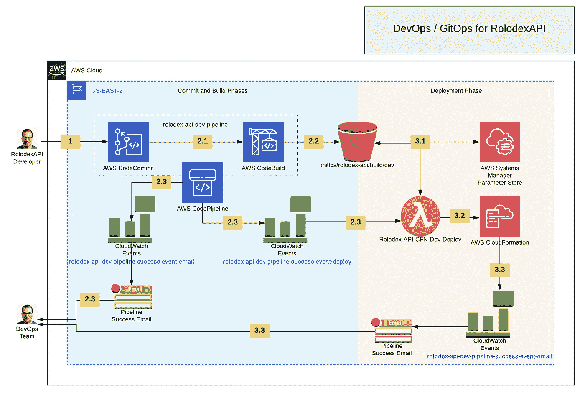
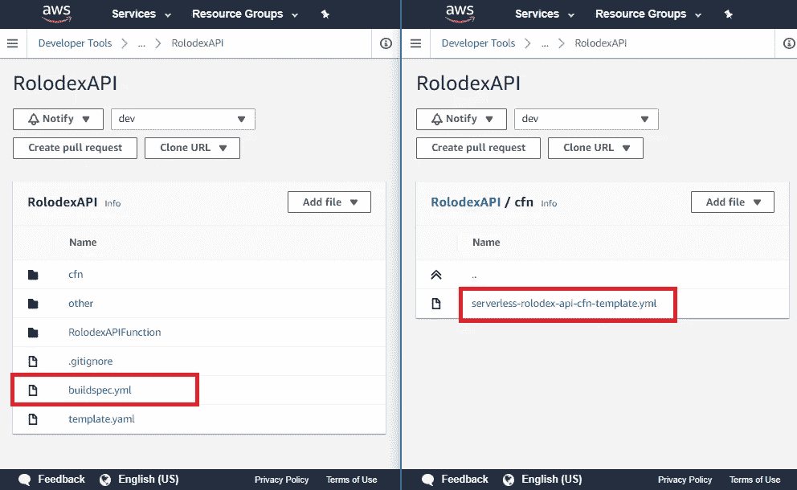
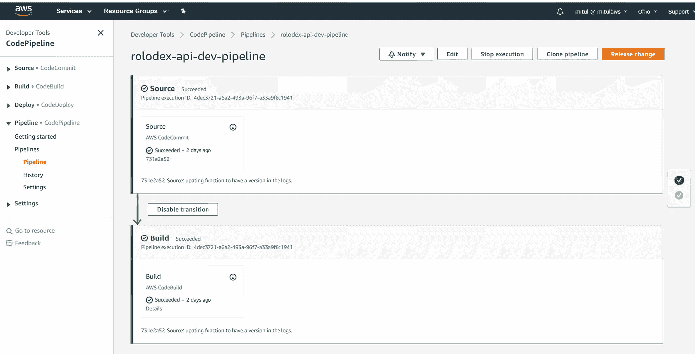
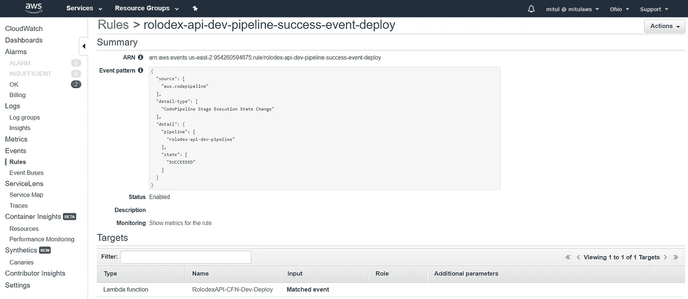
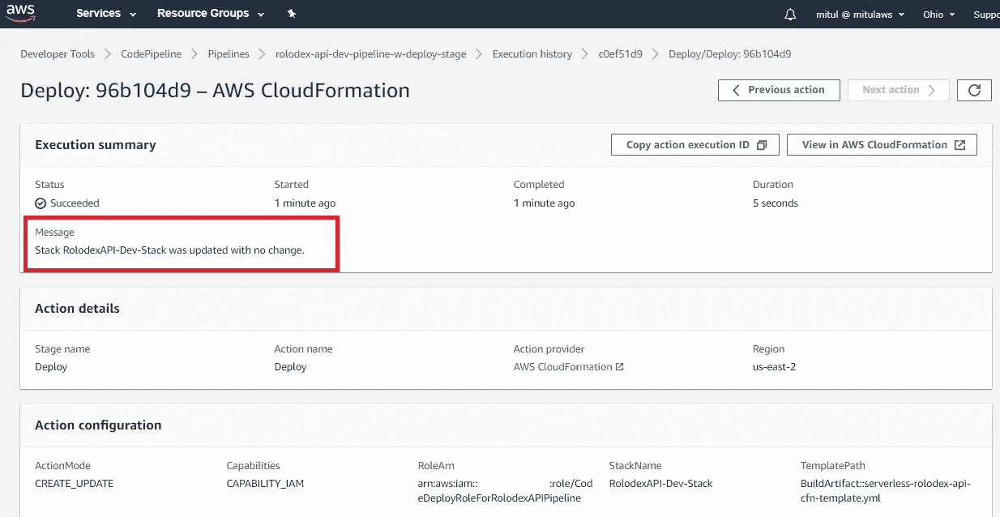
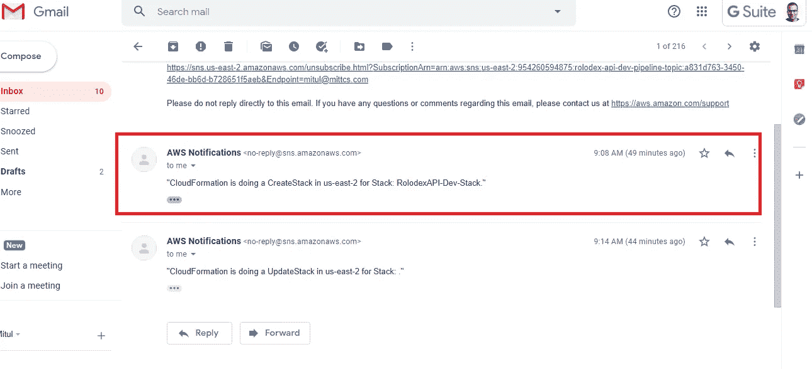

# AWS Lambda 无服务器之旅-第 3 部分-使用 GitOps 将您的开发运维转变为开发运维

> 原文：<https://itnext.io/an-aws-lambda-serverless-journey-part-3-turn-your-devoops-into-devops-with-gitops-ee81ac7c76f2?source=collection_archive---------4----------------------->

自动气象站λ

正如你所看到的，我喜欢我的博客文章的俗气的标题。玩笑归玩笑，你来这里是因为要么你已经知道 DevOps 是什么，想看看我按照这些思路做了什么，要么你不知道，想知道这些奇怪的词是什么意思。让我们把它从顶部水平设置。

软件开发者是一个利用技术和工具来支持软件构建的人。

一个 **IT 运营(Ops)** 人员在组织中的活动通常包括采购和提供硬件和服务器、系统的运营管理、管理 IT 流程以及创建和监管 IT 最佳实践。

# 我们曾经的样子

过去，在 IT 组织中，这两个重要的角色在沟通方面通常是[孤立的](https://medium.com/@mitulipatel/in-business-and-in-general-silos-are-bad-very-very-bad-fd06e4f67db3)。以下事件顺序清楚地概括了许多组织中发生的事情。

1.  软件开发人员会编写他们的代码，当他们认为可以开始时，他们会编写一个部署操作手册文档，其中包含一堆只有他们自己和他们在工作中与之相关的其他不合群的人才能真正理解的神秘步骤。
2.  他们把这个闪亮的新软件“快乐包”送给了运营团队，然后很快就忘记了它，直到运营人员开始部署它。很多时候，操作人员是唯一一个需要访问部署代码的服务器的人。
3.  几天后，运营人员会对软件开发人员说，“嘿，伙计，我做了你在那篇名为 software_deployment_guide.txt 的文章中概述的所有事情，但它仍然不工作。你能去看看发生了什么事吗？漂亮吗？我的老板们真的很想看看你创造的新功能，他们正紧盯着我，让我部署它。”
4.  第二天早上，在喝了第三杯咖啡后，这位软件开发人员会带着尖刻但礼貌的回答回来，“嗯……它在我的机器上工作。我不知道你做错了什么。”
5.  在这一阶段(3 个工作日)之后，他们将安排一次会议，坐下来讨论是什么导致运营人员在部署过程中碰壁。当他们解决了这个问题，他们为开发环境更新了 software_deployment_guide.txt，并希望它能为测试、试运行和生产等环境的后续部署工作。

> 旧的方法是一种缓慢的、非协作的、孤立的软件生产和交付方法，并且很快被大多数组织淘汰。

# 我们要去哪里

德沃普斯德沃普斯德沃普斯。我提到 DevOps 了吗？在 DevOps 模型中，开发人员和运营人员经常被合并，开发人员和 IT 运营人员之间曾经存在的界限正在变得模糊。这不再是“我们对他们”的情况，当某些事情不可避免地出错时，在责备游戏中获胜不再被容忍。自动化和工具的使用越来越多，这使得组织能够在从开发到生产的各种环境中创建稳定可靠的代码部署。这种向高度协作的工作方式的文化转变的好处包括软件产品发布的速度和灵活性的提高。工具和自动化的使用和引入使组织能够根据需求随时扩展其应用程序和基础架构。

DevOps 文化带来的工具和自动化支持:

1.  频繁地对代码进行小规模更新，从而增加创新并降低与每次部署相关的风险
2.  在软件开发和部署的每个阶段进行自动化测试，这样就不会出现意外
3.  开发和部署更小、更集中的微服务。开发人员范围的缩小允许他/她更加关注所产生的代码的质量。
4.  作为代码或 I-a-C 的基础架构，能够利用声明式代码(在云中)调配和配置硬件和软件功能。这项技术改变了游戏规则(那是我的唐纳德·特朗普时刻)。
5.  Configuration-as-Code 或 C-a-C，它能够以版本化的声明方式指定应用程序或硬件构件的配置。

> GitOps 是 DevOps 趋势的极端体现，在这种趋势下，所有东西都存储在一个存储库中并被编码。这包含了你的应用程序的代码，I-a-C 和 C-a-C 都在一个地方，可以作为你的唯一的真实来源。这实现了版本控制和部署的自动化，以及在出现问题时(而不是在出现问题时)即时回滚到以前的版本。

现在我们知道了什么是 DevOps 和 GitOps，我想重温一下我在本系列第 2 部分中创作的[无服务器 Rolodex API，并讨论我用来在 AWS 平台上自动化其部署的设计和工具。](https://medium.com/@mitulipatel/an-aws-lambda-serverless-journey-part-2-a-serverless-api-in-java-f713d8b80fc6)

# 设计

RolodexAPI 开发平台的架构图

从上面的设计中可以看出，这体现了极端的 DevOps 场景，其中开发人员是运营人员，反之亦然(即我、我自己和我)。在 DevOps 模型中，团队之间的协作和沟通是至关重要的，所以我现在可能需要去看心理医生，了解自己是不是新的 Sybil(冷静，我只是在开玩笑！真的。)

> 你能解释一下上面架构图中的数字标签是什么意思吗？

我当然可以(看，这是我在和自己合作…是的，这里没有人格分裂的可能)。

上面架构图中的编号标签描述如下:

**1 -代码提交**

API 开发人员将代码提交到 CodeCommit，最终将代码合并到“dev”分支。CodeCommit 基本上是一个托管的 Git 存储库，具有一系列云原生特性，允许像我这样的人围绕代码管理活动(如“触发构建”)快速实现自动化。在 GitOps 模型中，一切都与应用程序代码一起存储在存储库中。这包括 *buildspec.yml* (构建过程中需要)和*server less-Rolodex-API-cfn-template . yml*(AWS 上 I-a-C 的 CloudFormation 模板)*。*

AWS 代码提交中的 RolodexAPI 存储库

**2.1 -代码构建(已触发)**

代码被提交到 RolodexAPI 存储库中，合并到“dev”分支会触发一个服务器上的构建(CodeBuild spins up)(您可以基于您的构建的特征来配置您需要的能力)。顺便说一句，AWS 是根据这个产品的功能来命名的。这一定是世界第一！好样的。太简单了，简直是天才。继续前进。代码构建的计费是基于构建执行时间的，在免费层，你每月可以获得 100 分钟的免费构建时间(相信我，我在撰写本文时收到了一个计费提醒！).您应该通过实现一个合适的缓存策略来加速构建，从而确保这一时间最小化。

**2.2 -代码构建(运行)**

AWS CodeBuild 需要一个名为 *buildspec.yml* 的文件。该文件告诉 CodeBuild 如何在构建之前准备构建服务器，如何使用来自 CodeCommit 存储库的代码构建项目，以及需要的任何构建后操作。在 *buildspec.yaml* 中，我确保构建对构建后的构建工件(包括一个 Java jar 文件和一个 CloudFormation 模板)执行一个“s3 cp”到一个 s3 到*桶:* mittcs 和*键:* rolodex-api/dev/build。

2.3 -代码管道

我决定使用 CodePipeline 来编排设计的代码提交和构建阶段。这是一个简单的设置。

提交和构建阶段的代码管道

有许多选择，但是正如我在本系列的第 2 部分中所描述的，我创作了一个 CloudFormation 模板，并决定在部署阶段使用它。上面描述的管道的成功运行意味着构建已经完成，并且构建工件的副本已经准备好进行部署。**步骤 2.3** 中的一个 CloudWatch 事件通过电子邮件通知 DevOps 团队(me)管道已经成功。另一个事件触发 Lambda 函数开始部署。

通过 Lambda 和 CloudFormation 触发部署的 CloudWatch 事件

**3.1 / 3.2 - Lambda，系统管理器参数存储，云形成**

部署可以通过 CodePipeline 直接配置，但是在这种情况下我决定不这么做。我想到的解决方案确保了最新的代码被上传到 Rolodex API 中的 Lambda 函数。在为 Rolodex API 项目开发和创建 CloudFormation 模板的过程中，我发现自己必须更改模板中 jar 工件的名称，以使 CloudFormation 能够识别它。谢天谢地，我在准备 [DevOps 专业认证](https://www.youracclaim.com/badges/b7f4ab90-5460-4e41-8558-1100208a6dfa/linked_in_profile)的过程中学到了这个“有趣的事实”,所以我没有浪费太多时间。这直接来自 AWS CloudFormation 文档。

> 在栈更新期间，不会自动检测到对亚马逊 S3 中的部署包的更改。要更新功能代码，请更改模板中的对象关键字或版本。

在这里概述的活动中，我确实尝试在管道中配置了名为“部署”的第三阶段(rolodex-api-dev-pipeline 的克隆)。我可以确认，在最初创建 CFN 堆栈后，当代码存储在 S3 时，CloudFormation 不会识别代码的更新(见下图)。如果 CloudFormation 模板有函数代码‘Inline ’,情况就不会是这样了(我想)。然而，这种方法会限制函数的行数，对于像 Java 这样的编译语言根本不起作用。

一个添加了部署阶段的克隆管道，使用 CloudFormation 作为提供者

上面架构图中的 Lambda 函数包含使用 Systems Manager 参数存储来切换 CloudFormation 模板中 Rolodex API 函数的 jar 名称的逻辑(*server less-Rolodex-API-cfn-template . yml*)来进行跟踪。这个解决方案避开了使用 CloudFormation 作为部署提供者的限制。自定义 Lambda 函数还可以处理要部署的堆栈，即它接受一个名为“Stage”的参数。目前，我已经为每个环境的每个函数编写了这些硬编码。可以想象，每个功能的部署逻辑对于该环境可能是唯一的，并且该设计假定了这一点。例如，生产环境可能会做一些额外的工作，比如在完成时更新 DNS 记录，将 API Gateway 中的最新代码部署到一个阶段，或者对 CloudFront 发行版进行一些额外的配置。

RolodexAPI-CFN-开发-部署的 Lambda 函数代码

**3.3 - CloudWatch 事件，CloudTrail，SNS**

为了结束反馈循环，我通知了 DevOps 团队(还记得我吗？)通过自动电子邮件通知堆栈操作正在运行。这是通过启用 CloudTrail 来实现的，这样我就可以配置一个 CloudWatch 事件规则来基于特定的 CFN API 调用触发 SNS 主题。当执行“StackCreate”或“stack update”cloud formation API 调用时，结果是一个简单但有效的通知。

通过 SNS 主题订阅和 CW 事件的堆栈操作通知

这就是所有的人。

一如既往，我希望你发现这超级有用，并学到了新的东西。在本系列的第 4 部分中，我希望回到重新分解 Rolodex API 来利用 Spring Boot 框架，并针对我最初的开发执行一些基准测试，我最初的开发根本没有使用任何框架。

我希望你保持关注！

直到下次朋友们，

米图尔

RolodexAPI DevOps 自动化的现场演示