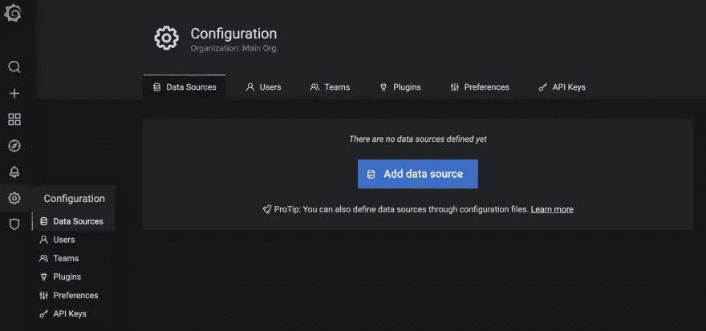
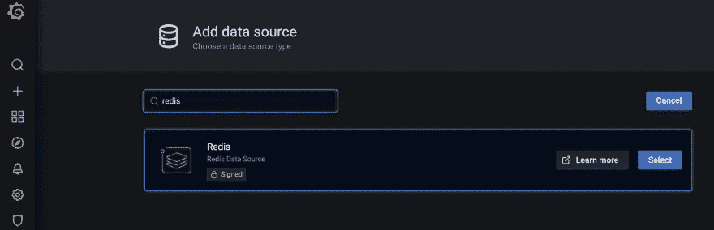
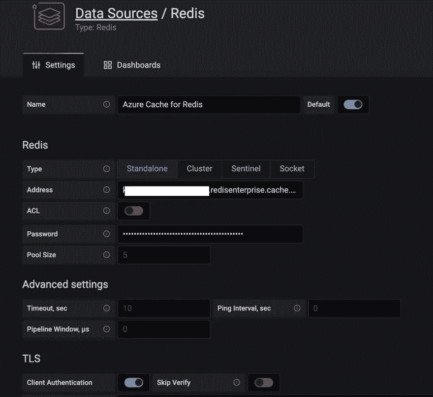
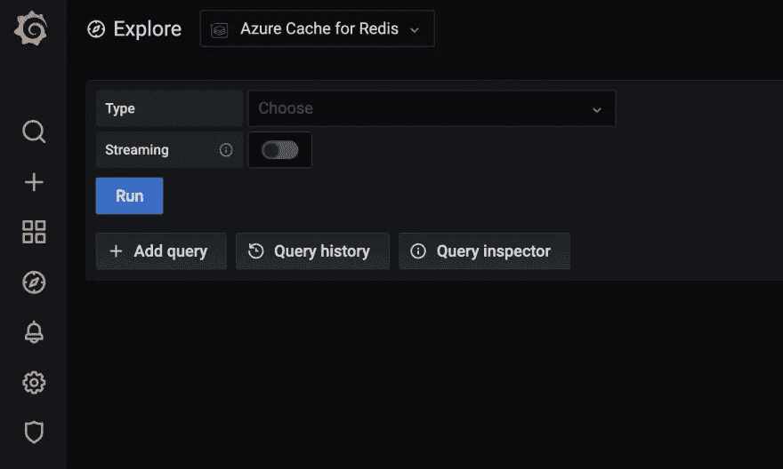
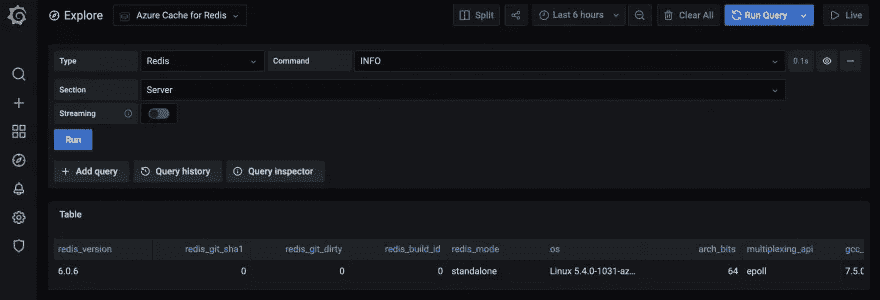
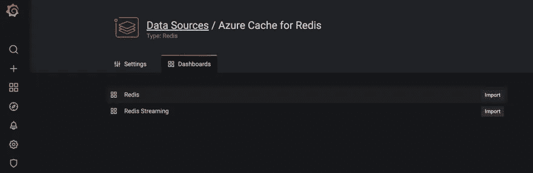
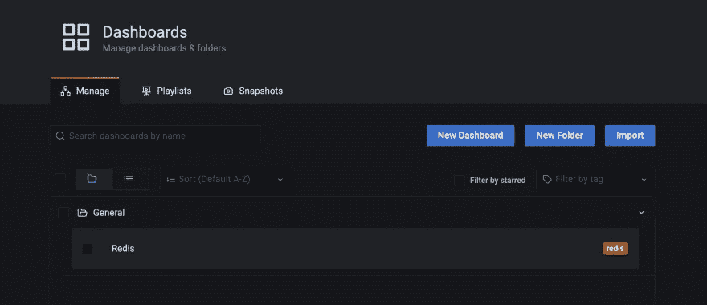
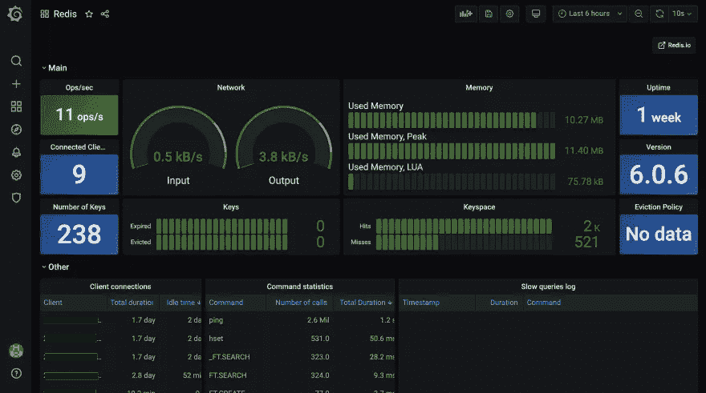

# 一个易于使用的 Redis 监控解决方案

> 原文：<https://itnext.io/an-easy-to-use-monitoring-solution-for-redis-5a8a73d56129?source=collection_archive---------3----------------------->

## 为 Grafana 使用 Redis 数据源

最近，我发现了一种使用 [Grafana](https://grafana.com/) 来监控 Redis 的好方法，这要感谢这个伟大的[数据源插件](https://github.com/RedisGrafana/grafana-redis-datasource)，它可以与任何 Redis 数据库一起工作，包括 [Azure Cache for Redis](https://docs.microsoft.com/azure/azure-cache-for-redis/cache-overview?WT.mc_id=data-16116-abhishgu) ！

# 这真的很容易设置和尝试

为 Redis 实例设置一个 [Azure 缓存](https://docs.microsoft.com/azure/azure-cache-for-redis/quickstart-create-redis?WT.mc_id=data-16116-abhishgu)

在 Docker 中启动 Grafana:

```
docker run -d -p 3000:3000 --name=grafana -e "GF_INSTALL_PLUGINS=redis-datasource" grafana/grafana
```

访问 Grafana 仪表板—浏览至`[http://localhost:3000/](http://localhost:3000/)`

> *输入* `*admin*` *作为用户名和密码*

添加数据源



选择 **Redis**



输入 Redis 实例的 Azure 缓存的主机和访问密钥。

> *确保您启用了* ***TLS***



一切就绪！您现在可以从**浏览**部分运行查询。



这只是 [INFO 命令](https://redis.io/commands/info)检索基本服务器信息的一个例子。



# 这还不是全部

有一个很好的仪表板，附带了数据源—[https://grafana.com/grafana/dashboards/12776](https://grafana.com/grafana/dashboards/12776)。

要导入它，只需转到数据源的**仪表板**部分。



要查看它的运行情况，首先导航到**仪表盘**并选择 Redis



..这就是了。



# 这只是开始…

我不是 Grafana 专家，但我很确定还有更多值得探索的地方。我将尝试使用自定义仪表板和其他支持的 Redis 数据结构，如 Streams 等。