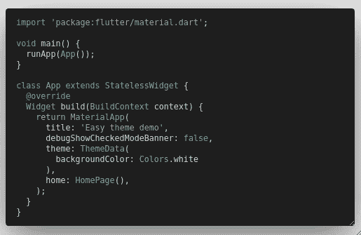
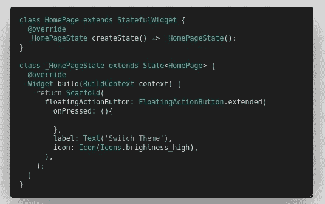
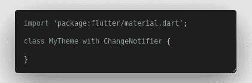
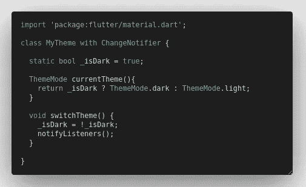
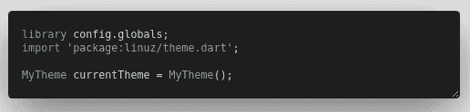
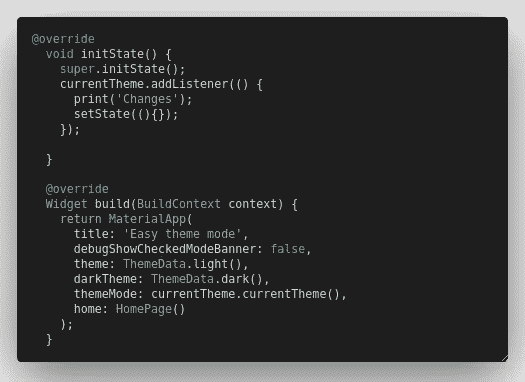
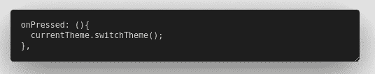
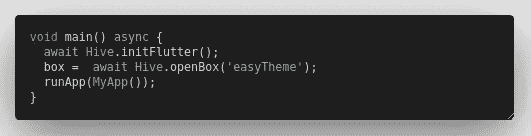
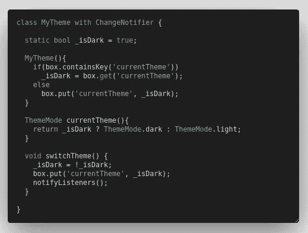

# 在 Flutter 中切换明暗主题的简单方法。

> 原文：<https://itnext.io/an-easy-way-to-switch-between-dark-and-light-theme-in-flutter-fb971155eefe?source=collection_archive---------0----------------------->

> C 在运行时挂起主题并持久化它总是令人头疼…
> 但现在不需要了，不需要 Bloc 也不需要 Provider 逻辑，这是最简单的方法...

## 我们开始吧

我们通常以此为切入点来运行我们的应用程序，一个主要的无状态小部件 app 返回 MaterialApp，当然还有一个 home 小部件(在我们的例子中是 HomePage())返回一个带有 floatingActionButton 的脚手架…

主.镖

主页. dart

PS:我在 Linux 上运行的是 flutter。

在运行时改变主题需要更新主题数据，使用 Bloc 可能会简化它，但是你需要先学习 Bloc 是如何工作的，你应该把这个逻辑安装到你的大脑中，然后……然后...

> 没有人:
> 我:

呃！我没说过我懒得做这种事吗？我只是一个直爽的人，我看到简单，我就喊“是”。所以我们的当务之急是找到我们小小的大脑可以支持的东西，我们应该找到一种不需要任何外部库就能打开后门的方法…

所以 boiz，让我们认真一点，dart 有一个叫做 [NotifyListeners](https://api.flutter.dev/flutter/foundation/ChangeNotifier/notifyListeners.html) 的东西，这个巫毒的东西会在对象上注册监听器，并在对象改变时通知每个人，这实际上是很有趣的东西……我们必须在我们的情况下使用它。

让我们创建一个名为“MyTheme”的新类，并添加这个巫毒

让我们添加一个名为 isDark 的变量并将其设置为 false，然后添加两个函数，一个用于检索 ThemeMode，另一个用于切换 isDark 并通知侦听器。

主题.镖

我们现在只需要创建一个实例，并让它在我们的应用程序中随处可见。因此，让我们创建一个新的 dart 文件，将其命名为 config.dart，然后添加以下几行。

config.dart

好了，我们可以通过导入 config.dart 在任何地方访问该变量，让我们返回 main.dart 并做一些更改…
我将把应用程序小部件从无状态更改为有状态，添加一个带有侦听器的 initState、一个浅色主题、一个深色主题和主题模式，如下所示。

主.镖

这就是我们的技巧，我们将注册一个侦听器，它将在当前主题更改时发出通知，我们将添加一个 setState 来更新应用程序的状态，以使更改生效，我们将使用方法 currentTheme()从我们的对象中获取我们的 themeMode。设置完成后，我们应该从 home_page.dart 编辑我们的 floatingActionButton，并在那里添加“currentTheme.switchTheme()”。

在从 home_page.dart 压缩的上浮动 ActionButton

现在一切都很好，我们应该能够取得这样的结果

结果呢

关于持久化选中的主题，我们可以使用 [shared_preferences](https://pub.dev/packages/shared_preferences) 或 [hive](https://pub.dev/packages/hive) 或任何其他可以持久化内容的工具……我将坚持使用 hive。
我们将在 config.dart 中添加一个新的全局变量，将该变量导入 main，在第一次启动时初始化并编辑 theme.dart…

config.dart

主.镖

主题.镖

就这样，我们现在都设置好了，你应该有一个持久的主题和一个黑暗和光明模式的切换器:)