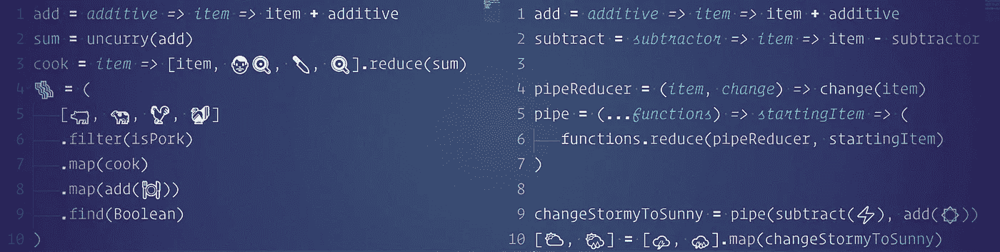

# 为食肉动物过滤肉类

> 原文：<https://itnext.io/an-emoji-lovers-guide-to-functional-programming-part-5-a6bc3324a839?source=collection_archive---------2----------------------->



## 表情符号爱好者的函数式编程指南

## 使用数组筛选器、一些和每一个。

*用表情符号和 JavaScript 学习函数式编程。代码示例应该足够简单，不需要任何先验知识就可以理解，但是我可以想象它看起来有点奇怪。还有，JavaScript 实际上不允许表情符号作为 JavaScript 变量名。出于这个原因，这些代码示例不会在没有修改的情况下运行。*

*   [*用食物表情符号制作便便。*](https://medium.com/@Sawtaytoes/an-emoji-lovers-guide-to-functional-programming-part-1-241d8d4c9223)
*   [*把暴风云变成晴朗的云。*](https://medium.com/@Sawtaytoes/an-emoji-lovers-guide-to-functional-programming-part-2-800b438c7ce3)
*   [*用减速器建造独角兽！*](https://medium.com/@Sawtaytoes/an-emoji-lovers-guide-to-functional-programming-part-3-ef78e3156e)
*   [*现在是管道操作员！*](https://medium.com/@Sawtaytoes/an-emoji-lovers-guide-to-functional-programming-part-4-735c17ca4113)
*   [*为食肉动物过滤肉类。*](https://medium.com/@Sawtaytoes/an-emoji-lovers-guide-to-functional-programming-part-5-a6bc3324a839)
*   [*用归约器递归。*](https://medium.com/@Sawtaytoes/an-emoji-lovers-guide-to-functional-programming-part-6-5c1d441d36af)

有时你只想从数组中取出某些值。正如我们以前所做的那样，让我们先从程序上探讨这个想法，然后从功能上探讨。

程序性:

```
animals = [🐖, 🐄, 🐓, 🦃]
pork = []isPork = animal => animal === 🐖addPork = animal => {
    if (isPork(animal)) {
        pork.push(animal)
    }
}for (let i = 0, l = animals.length; i < l; i++) {
    addPork(animals[i])
}[🐖] = pork
```

功能性:

```
isPork = animal => animal === 🐖[🐖] = [🐖, 🐄, 🐓, 🦃].filter(isPork)
```

简单吧？`filter`与`map`相似，它接受一个数组，遍历每个值，然后返回另一个数组。不同之处在于，每当`filter`运行时，只要我们给它的函数返回`true`，该项就会出现在我们过滤后的数组中。

这里有一种情况，我们可以使用`filter`来查看数组中是否有特定的项目:

```
isTurkey = animal => animal === 🦃😇 = (
    [🐖, 🐄, 🐓, 🦃]
    .filter(isTurkey)
    .length > 0
)
```

这种方法的问题是，它必须循环每一项，而它本可以在第一项之后立即停止。此外，我们需要的只是来自`filter`的`true`或`false`，我们不需要获取长度并检查它。更好的选择是`some`和`every`，它们会一直循环，直到找到自己的价值。

```
animals = [🐖, 🐄, 🐓, 🦃]😇 = animals.some(isTurkey)👿 = animals.every(isTurkey) 😱 = [🤡, 🤡, 🤡, 🤡].every(isClown)
```

我们正在检查是否至少有一个动物是带`some`的火鸡，或者是否每个动物都是带`every`的火鸡，如果每个项目都是小丑，我们就有严重的问题了！虽然，谁真的在乎其中一个动物是火鸡？假设我们被困在一个岛上？那么我们真的只关心什么是可食用的:

```
isEdible = Boolean animals = [🐖, 🐄, 🐓, 🦃]😇 = animals.every(isEdible)😇 = animals.every(isEdible)[🐖, 🐄, 🐓, 🦃] = animals.filter(isEdible) graveyard = [🌙, ☠️, 👻]😇 = graveyard.some(isEdible)👿 = graveyard.every(isEdible)[🌙] = graveyard.filter(isEdible)
```

让我们先解决这个问题。月亮是奶酪做的，那肯定是可以吃的。事实是，月亮曾经是由牛奶制成的，但是在过去的几亿年里它发霉了。很明显，我们不能吃死人，也不能吃不死生物，所以这些是不可能的。这就是为什么`some`墓地物品是可食用的而`every`墓地物品是不可食用的。

我们还通过将`Boolean`构造函数直接用作函数做了一些有趣的事情。我们可以做`Boolean(🐖)`来检查`🐖`是不是`true`。由于在我们的表情符号示例中，任何可食用的东西都是`true`，那么我们可以使用`isEdible`，一个命名的函数，而不是`Boolean`。

您将经常需要检查您的数组是否有某些类型的值，并过滤掉虚假的值，如`undefined`、`null`和`false`。这就是`.filter(Boolean)`派上用场的地方。当你的数组包含数字时，我建议使用`Number.isFinite`而不是`Boolean`，因为你很可能不希望`0`算作`false`。

可能需要从数组中取出一个特定的值。用`filter`当然可以，但用`find`更干净:

```
[🐄] = [🐖, 🐄, 🐓, 🦃].filter(isBeef)🐄 = [🐖, 🐄, 🐓, 🦃].find(isBeef)
```

`find`采用与`filter`完全相同的函数，但是当它得到一个真值时，它立即返回那个值。使用我们之前的`Boolean`技巧，这可能是一个避免`array[0]`的聪明方法:

```
🐖 = [🐖, 🐄, 🐓, 🦃].filter(Boolean)[0]🐖 = [🐖, 🐄, 🐓, 🦃].find(Boolean) 🐖 = [☠️, 🐖, 🐄, 🐓, 🦃].filter(Boolean)[0]🐖 = [☠️, 🐖, 🐄, 🐓, 🦃].find(Boolean)
```

虽然`find`非常有用，但是它不允许与其他数组函数链接。在这种情况下，您会想要使用`filter`:

```
add = additive => item => item + additivesum = uncurry(add)cook = item => [item, 👨‍🍳, 🔪, 🍳].reduce(sum)🥓 = (
    [🐖, 🐄, 🐓, 🦃]
    .filter(isPork)
    .map(cook)
    .map(add(🍽️))
    .find(Boolean)
)
```

我们使用了 ol' `sum`和一个新函数`cook`。然后我们`map` `cook`围着我们的猪肉和`add`每只煮熟的猪一盘食物。完成后，我们从数组中取出第一盘猪肉，这就是熏肉！我打赌你不知道你可以用 JavaScript 做猪肉培根。我做到了。

**摸摸肉！**

## [点击此处进入第 6 部分！](https://medium.com/@Sawtaytoes/an-emoji-lovers-guide-to-functional-programming-part-6-5c1d441d36af)

# 更多阅读

如果您对与函数式编程相关的更多主题感兴趣，您应该看看我的其他文章:

*   [安全重构旧代码:第 1 部分](/how-to-safely-refactor-old-code-part-1-a1a853263fec)
*   [使用 Redux 的秘密:createNamespaceReducer](https://medium.com/@Sawtaytoes/the-secret-to-using-redux-createnamespacereducer-d3fed2ccca4a)
*   [在 React 组件中使用 Redux 还原剂](https://medium.com/@Sawtaytoes/using-redux-reducers-in-react-components-4e92985dd9cb)
*   [Redux-Observable 可以解决你的状态问题](https://medium.com/@Sawtaytoes/redux-observable-can-solve-your-state-problems-15b23a9649d7)
*   [RxJS 和可观察的 Flic 按钮](https://medium.com/flicblog/flic-buttons-and-the-observable-customization-using-rxjs-2214bc53d407)