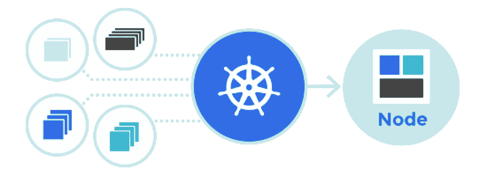
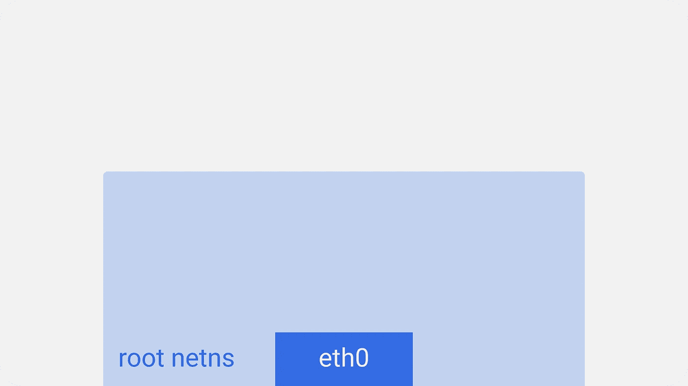
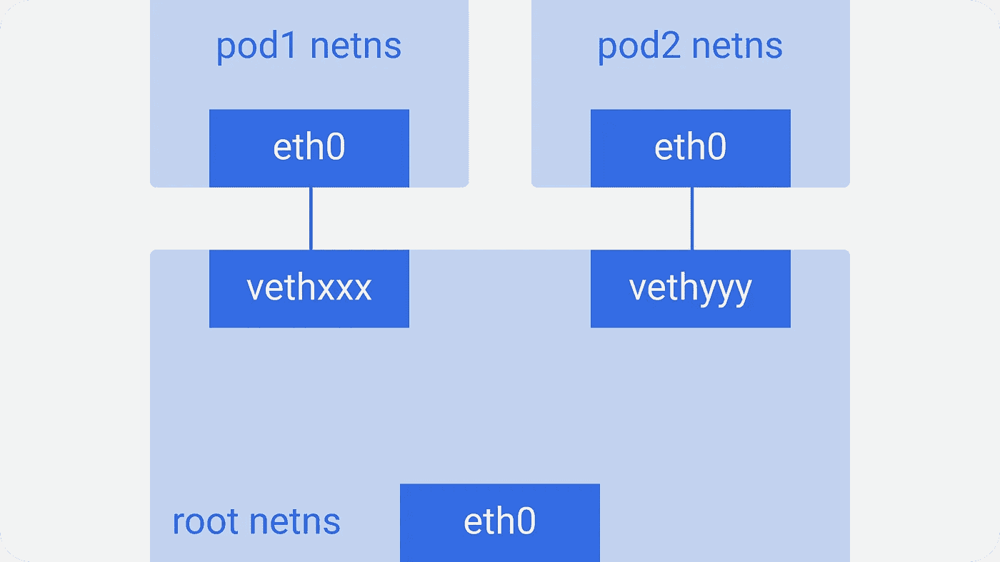
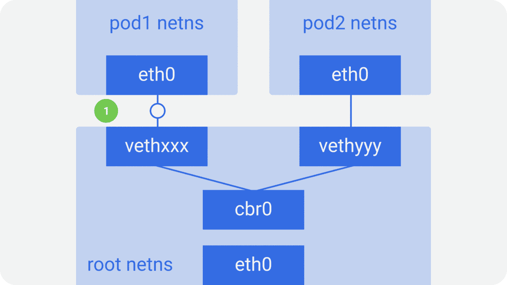
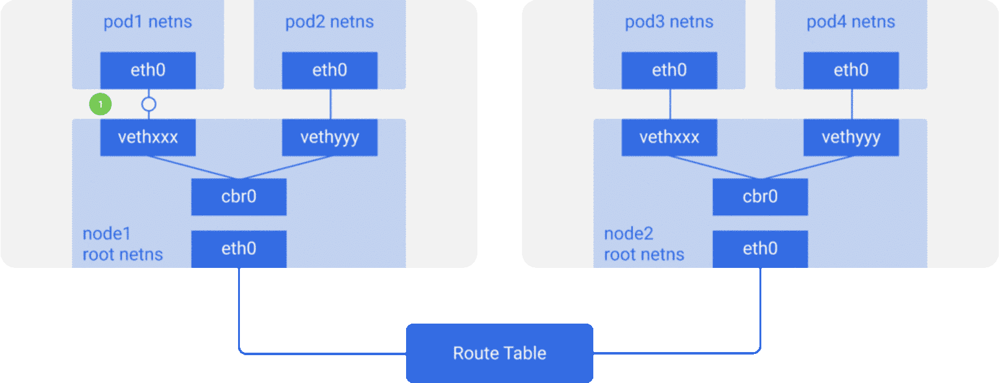
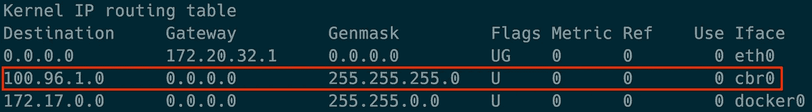

# Kubernetes 网络图解指南[第 1 部分]

> 原文：<https://itnext.io/an-illustrated-guide-to-kubernetes-networking-part-1-d1ede3322727?source=collection_archive---------0----------------------->

## 我所知道的关于 Kubernetes 网络的一切

你已经在 Kubernetes 集群上运行了许多服务，并从中获益。或者至少，你打算这么做。尽管有很多工具可以用来设置和管理集群，但是您仍然想知道它是如何工作的。如果它坏了，你去哪里找？我知道我做到了。

当然 Kubernetes 是足够简单的开始使用它。但是让我们面对现实吧——这是一只隐藏在引擎盖下的复杂野兽。有许多活动的部分，如果你想为失败做好准备，了解它们如何相互配合和协同工作是必须的。最复杂，也可能是最关键的部分之一是网络。

所以我开始了解 Kubernetes 的网络是如何运作的。我阅读了文档，观看了一些演讲，甚至浏览了代码库。这是我发现的。

# Kubernetes 网络模型

Kubernetes 网络的核心有一个重要的基本设计理念:

> 每个 Pod 都有一个唯一的 IP。

此 Pod IP 由该 Pod 中的所有容器共享，并且可从所有其他 Pod 路由。有没有注意到一些“暂停”容器在 Kubernetes 节点上运行？它们被称为“沙盒容器”，其唯一的工作是保留和保存一个网络名称空间(netns)，该名称空间由 pod 中的所有容器共享。这样，即使一个容器死亡，一个新的容器在它的位置上被创建，一个 pod IP 也不会改变。这种 IP-per-pod 模型的一个巨大优势是不会与底层主机发生 IP 或端口冲突。我们不必担心应用程序使用什么端口。

有了这一点，Kubernetes 的唯一要求是这些 Pod IPs 可从所有其他 Pod 路由/访问，而不管它们在哪个节点上。

## 节点内通信

第一步是确保同一节点上的 pod 能够相互通信。这个想法然后被扩展到跨节点的通信，到互联网等等。

Kubernetes 节点
(根网络名称空间)

在每个 Kubernetes 节点上，在本例中是一台 linux 机器，有一个根网络名称空间(root as in base，而不是超级用户)—根 netns。

主网络接口`eth0`在这个根网络中。

Kubernetes 节点
(pod 网络名称空间)

类似地，每个 pod 都有自己的网络，通过虚拟以太网对将其连接到根网络。这基本上是一个管道对，一端在根网，另一端在荚网。

我们将 pod-end 命名为`eth0`，因此 pod 不知道底层主机，并认为它有自己的根网络设置。另一端被命名为类似`vethxxx`的东西。您可以使用`ifconfig`或`ip a`命令在您的节点上列出所有这些接口。

Kubernetes 节点
(linux 网桥)

这是为节点上的所有单元完成的。为了让这些单元互相交流，使用了一个 linux 以太网桥`cbr0`。Docker 使用了一个类似的名为`docker0`的桥。

你可以使用`brctl show`命令列出这些桥。

Kubernetes 节点
(同一个节点点对点通信)

假设一个数据包从`pod1`发送到`pod2`。
**1。**它在`eth0`离开`pod1`的网，在`vethxxx`进入根网。
2。它被传递到`cbr0`，T8 使用 ARP 请求发现目的地，说“谁拥有这个 IP？”
**3。** `vethyyy`表示它有那个 IP，所以网桥知道把包转发到哪里。
**4。**数据包到达`vethyyy`，穿过管道对到达`pod2`的网络。

节点上的容器就是这样相互通信的。显然还有其他方法，但这可能是最简单的，docker 也是这样使用的。

## 节点间通信

正如我前面提到的，pod 也需要跨节点可达。Kubernetes 不在乎怎么做。我们可以使用 L2(跨节点的 ARP)、L3(跨节点的 IP 路由——像云提供商路由表)、覆盖网络，甚至信鸽。只要流量能够到达另一个节点上的所需 pod，这都没有关系。每个节点都为 pod IPs 分配了一个唯一的 CIDR 块(一个 IP 地址范围),因此每个 pod 都有一个唯一的 IP，不会与另一个节点上的 pod 冲突。

在大多数情况下，尤其是在云环境中，云提供商路由表确保数据包到达正确的目的地。同样的事情可以通过在每个节点上设置正确的路由来完成。还有一堆其他的网络插件在做自己的事情。

这里我们有两个节点，类似于我们之前看到的。每个节点都有不同的网络名称空间、网络接口和网桥。

Kubernetes 带路由表的节点
(跨节点点对点通信)

假设数据包从`pod1`发送到`pod4`(在不同的节点上)。

1.  它在`eth0`离开`pod1`的网络，在`vethxxx`进入根网络。
2.  它被传递给`cbr0`，后者使 ARP 请求找到目的地。
3.  它从`cbr0`出来到达主网络接口`eth0`，因为这个节点上没有人拥有`pod4`的 IP 地址。
4.  它离开机器`node1`到带有`src=pod1`和`dst=pod4`的线上。
5.  路由表为每个节点 CIDR 块设置了路由，并将数据包路由到其 CIDR 块包含`pod4` IP 的节点。
6.  因此数据包到达主网络接口`eth0`的`node2`。
    现在，即使`pod4`不是`eth0`的 IP，由于节点被配置为启用 IP 转发，数据包仍然被转发到`cbr0`。
    在节点的路由表中查找任何匹配`pod4` IP 的路由。它找到`cbr0`作为该节点的 CIDR 块的目的地。
    您可以使用`route -n`命令列出节点路由表，它将显示一条`cbr0`的路径，如下所示:

7.网桥接收数据包，发出 ARP 请求，并发现该 IP 属于`vethyyy`。

8.数据包穿过管道对到达`pod4`🏠

这是 Kubernetes 网络的基础。所以下一次它坏了，一定要检查那些桥和路由表😉

目前就这些。在接下来的部分中，我们将看到[覆盖网络如何工作【第 2 部分】](https://medium.com/@ApsOps/an-illustrated-guide-to-kubernetes-networking-part-2-13fdc6c4e24c)，当 pod 来来去去时会发生什么[网络变化，以及出站和入站流量如何流动【第 3 部分】](https://medium.com/@ApsOps/an-illustrated-guide-to-kubernetes-networking-part-3-f35957784c8e)。

总的来说，我对网络概念还很陌生，所以我希望得到反馈，尤其是当有不清楚或错误的地方🙂

> 你在 Kubernetes 遇到过什么样的网络或其他问题？
> 
> 请在这里留言或在推特上联系我。

-