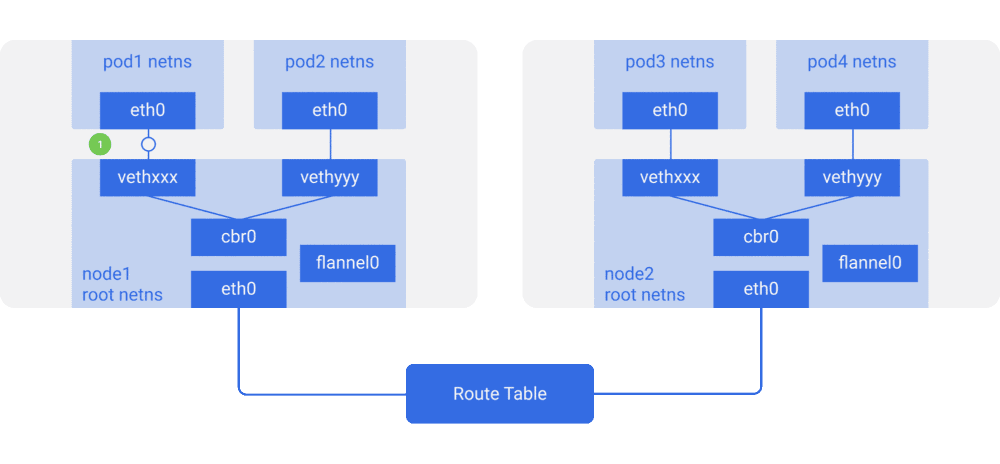
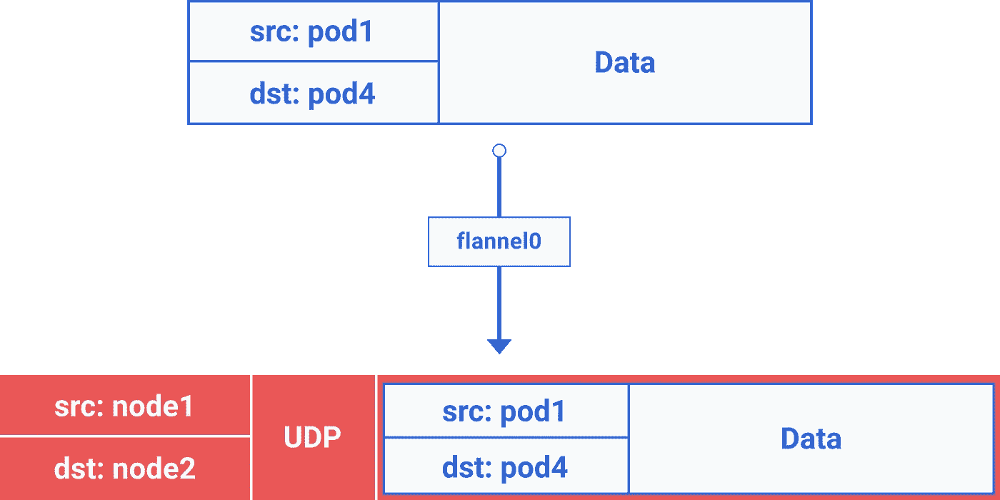

# Kubernetes 网络图解指南[第 2 部分]

> 原文：<https://itnext.io/an-illustrated-guide-to-kubernetes-networking-part-2-13fdc6c4e24c?source=collection_archive---------0----------------------->

## 我所知道的关于 Kubernetes 网络的一切

*这是 Kubernetes 网络系列的第二部分。如果你还没有阅读第一部分***，我建议你先看看。**

*[在本系列的前一集](https://medium.com/@ApsOps/an-illustrated-guide-to-kubernetes-networking-part-1-d1ede3322727)中，我们介绍了 Kubernetes 网络模型。我们观察了数据包如何在同一个节点上的 pod 中流动，以及如何在节点之间流动。我们还注意到 linux 网桥和路由表在这个过程中扮演的角色。*

*今天，我们将扩展这些想法，看看覆盖网络是如何工作的。我们还将了解不断变化的 pod 是如何从 Kubernetes 中运行的应用程序中抽象出来并在幕后处理的。*

# *覆盖网络*

*默认情况下，覆盖网络不是必需的，但是，它们在特定情况下会有所帮助。比如当我们没有足够的 IP 空间，或者网络无法处理额外的路由。或者当我们需要叠加层提供的一些额外的管理功能时。一个常见的情况是云提供商路由表能够处理的路由数量有限。例如，AWS 路由表支持多达 50 条路由，而不会影响网络性能。所以如果我们有超过 50 个 Kubernetes 节点，AWS 路由表就不够用了。在这种情况下，使用覆盖网络会有所帮助。*

*它实质上是封装了一个包中包，该包在节点间遍历本地网络。您可能不希望使用覆盖网络，因为它可能会由于所有数据包的封装-解封装而导致一些延迟和复杂性开销。它经常是不需要的，所以我们应该在知道为什么需要它的时候才使用它。*

*为了理解流量如何在覆盖网络中流动，让我们考虑一个[法兰绒](http://github.com/coreos/flannel)的例子，这是 CoreOS 的一个开源项目。*

**

*带有路由表的 Kubernetes 节点
(带有法兰绒覆盖网络的跨节点 pod-to-pop 流量)
【点击放大可获得更清晰的图像】*

*在这里，我们看到它与之前的设置相同，但是在根网络中添加了一个名为 flannel0 的新虚拟以太网设备。它是虚拟可扩展局域网(VXLAN)的一个实现，但对于 linux 来说，它只是另一个网络接口。*

*数据包从`pod1`到`pod4`(在不同的节点上)的流程如下:*

*1.数据包在`eth0`离开`pod1`的网络，在`vethxxx`进入根网络。*

*2.它被传递给`cbr0`，使 ARP 请求找到目的地。*

*3a。由于该节点上没有人拥有`pod4`的 IP 地址，网桥将其发送到`flannel0`，因为该节点的路由表被配置为将`flannel0`作为 pod 网络范围的目标。*

*3b。当 flanneld 守护进程与 Kubernetes apiserver 或底层 etcd 对话时，它知道所有的 pod IPs，以及它们在什么节点上。所以法兰绒创建了 pods IPs 到 node IPs 的映射(在用户空间中)。*

*`flannel0`获取此数据包，并将其封装在 UDP 数据包中，其中额外的报头将源和目的 IP 更改为相应的节点，然后将其发送到一个特殊的 vxlan 端口(通常为 8472)。*

**

*包中包封装
(注意，在上图中，包是从 3c 封装到 6b 的)*

*即使映射是在用户空间，实际的封装和数据流发生在内核空间。所以它发生得很快。*

*3c。封装后的数据包通过`eth0`发送出去，因为它参与了节点流量的路由。*

*4.数据包离开以节点 IP 为源和目的地的节点。*

*5.云提供商路由表已经知道如何在节点之间路由流量，因此它将数据包发送到目的地`node2`。*

*6a。数据包到达节点 2 的`eth0`。由于端口是特殊的 vxlan 端口，内核将数据包发送到`flannel0`。*

*6b。`flannel0`解封装并将其发送回根网络名称空间。*

*从这里开始，路径与我们在[第 1 部分](https://medium.com/@ApsOps/an-illustrated-guide-to-kubernetes-networking-part-1-d1ede3322727)中看到的非覆盖网络的情况相同。*

*6c。由于启用了 IP 转发，内核根据路由表将其转发给`cbr0`。*

*7.网桥接收数据包，发出 ARP 请求，并发现该 IP 属于`vethyyy`。*

*8.数据包穿过管道对到达`pod4`🏠*

*不同的实现之间可能会有细微的差别，但这就是 Kubernetes 中覆盖网络的工作方式。有一种常见的误解，认为我们在使用 Kubernetes 时需要使用覆盖。事实是，这完全取决于具体的场景。所以确保你只在绝对需要的时候使用它。*

*目前就这些。在[前一部分](https://medium.com/@ApsOps/an-illustrated-guide-to-kubernetes-networking-part-1-d1ede3322727)中，我们学习了 Kubernetes 网络的基础。现在我们知道了覆盖网络是如何工作的。在接下来的部分中，我们将看到[随着 pod 的出现和消失，网络会发生什么变化，以及出站和入站流量是如何流动的](https://medium.com/@ApsOps/an-illustrated-guide-to-kubernetes-networking-part-3-f35957784c8e)。*

*总的来说，我对网络概念还很陌生，所以我希望得到反馈，尤其是当有不清楚或错误的地方🙂*

> *我将在 [KubeCon North America 2017](http://events.linuxfoundation.org/events/kubecon-and-cloudnativecon-north-america) 上发表演讲，讲述我在 Kubernetes 生产中遇到的其他[网络概念和 UDP 故障](http://sched.co/CU8P)，以及我是如何调查和修复它们的。*
> 
> *如果你参加了，来打个招呼或者在推特上打电话给我*

*-*