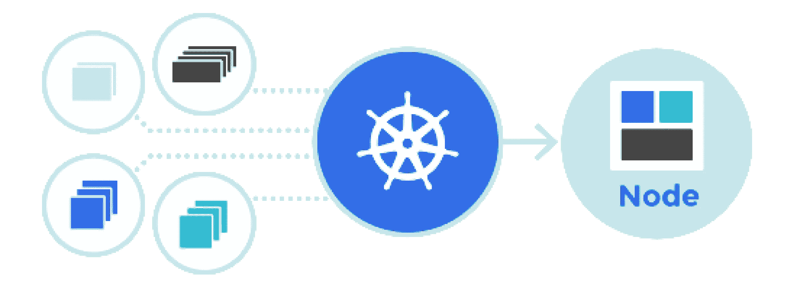
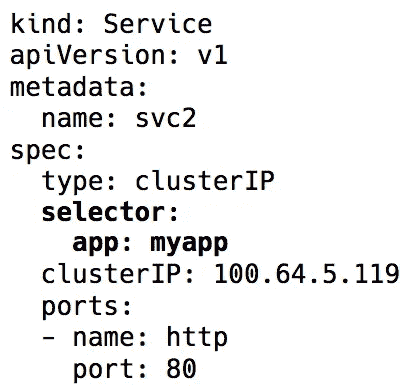
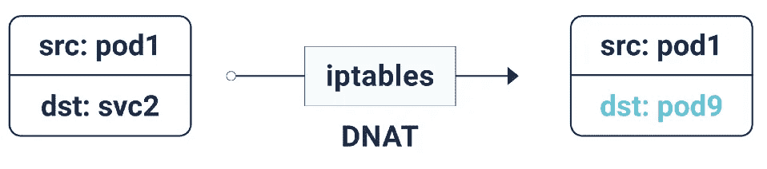
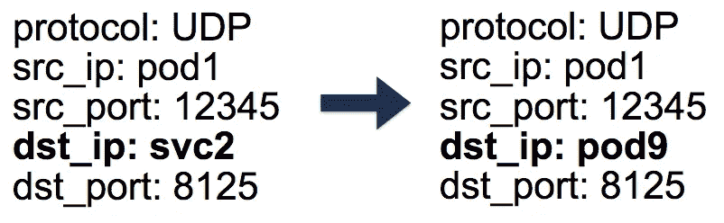

# Kubernetes 网络图解指南[第 3 部分]

> 原文：<https://itnext.io/an-illustrated-guide-to-kubernetes-networking-part-3-f35957784c8e?source=collection_archive---------0----------------------->

## 我所知道的关于 Kubernetes 网络的一切

这是关于 Kubernetes 网络系列的第三部分。如果你还没有看过 [*第一部分*](https://medium.com/@ApsOps/an-illustrated-guide-to-kubernetes-networking-part-1-d1ede3322727) *和* [*第二部分*](https://medium.com/@ApsOps/an-illustrated-guide-to-kubernetes-networking-part-2-13fdc6c4e24c) *，我推荐你先看看那些。*

## 集群动力学

由于 Kubernetes 和一般分布式系统不断变化的动态特性，pod(及其 IP)一直在变化。原因可能从期望的滚动更新和扩展事件到不可预测的 pod 或节点崩溃。这使得 Pod IPs 无法直接用于通信。

Kubernetes 服务对象中的标签选择器

进入 Kubernetes 服务—一个虚拟 IP，以一组 Pod IPs 作为端点(通过标签选择器识别)。它们充当虚拟负载平衡器，其 IP 保持不变，而后端 Pod IPs 可能会不断变化。

整个虚拟 IP 实现实际上是 iptables(最近的版本可以选择使用 IPVS，但这是另一个讨论)规则，由 Kubernetes 组件 kube-proxy 管理。现在这个名字其实是误导。在 1.0 版之前，它曾经是一个代理，由于在内核空间和用户空间之间的不断复制，它被证明是非常资源密集型的，并且速度较慢。现在，它只是一个控制器，像 Kubernetes 中的许多其他控制器一样，监视端点的 api 服务器的变化，并相应地更新 iptables 规则。

Iptables DNAT

由于这些 iptables 规则，每当数据包以服务 IP 为目的地时，它都会被 DNATed(DNAT =目的地网络地址转换)，这意味着目的地 IP 会从服务 IP 更改为 iptables 随机选择的一个端点(pod IP)。这可以确保负载在后端单元之间均匀分布。

conntrack 表中的 5 元组条目

当这个 DNAT 发生时，这个信息被存储在 conntrack 中 Linux 连接跟踪表(存储 iptables 已经完成的 5 元组转换:protocol、srcIP、srcPort、dstIP、dstPort)。这是为了当回复返回时，它可以 un-DNAT，这意味着将源 IP 从 Pod IP 更改为服务 IP。这样，客户端就不知道数据包流是如何在幕后处理的。

因此，通过使用 Kubernetes 服务，我们可以使用相同的端口而没有任何冲突(因为我们可以将端口重新映射到端点)。这使得服务发现变得非常容易。我们可以只使用内部 DNS 和硬编码服务主机名。我们甚至可以使用 Kubernetes 预设的服务主机和端口环境变量。
**Protip** :采取这第二种方法，省去了很多不必要的 DNS 调用！

## 出站流量

到目前为止，我们讨论的 Kubernetes 服务都是在集群中工作的。然而，在大多数实际情况下，应用程序需要访问一些外部 API/网站。

通常，节点可以同时拥有私有和公共 IP。对于互联网访问，这些公共和私有 IP 存在某种 1:1 的 NAT，尤其是在云环境中。

对于从节点到某个外部 IP 的正常通信，对于出站数据包，源 IP 从节点的专用 IP 更改为其公共 IP，对于回复入站数据包，则相反。但是，当一个 Pod 发起到外部 IP 的连接时，源 IP 就是该 Pod IP，云提供商的 NAT 机制并不知道这一点。它只会丢弃带有源 IP 而不是节点 IP 的数据包。

所以我们使用，你猜对了，更多的 iptables！这些规则也是由 kube-proxy 添加的，进行 SNAT(源网络地址转换)也称为 IP 伪装。这告诉内核使用该数据包发出的接口的 IP，而不是源 Pod IP。还保存了一个 conntrack 条目，以取消 SNAT 回复。

## 入境交通

目前一切都很好。豆荚可以互相交谈，也可以上网。但是我们仍然缺少一个关键部分——为用户请求流量服务。到目前为止，有两种主要方法可以做到这一点:

**节点端口/云负载平衡器(L4 — IP 和端口)** 将服务类型设置为`NodePort`在`30000-33000`范围内为服务分配一个`nodePort`。这个`nodePort`在每个节点上都是开放的，即使某个节点上没有运行 pod。该节点端口上的入站流量将被发送到其中一个 pod(它甚至可能在其他某个节点上！)再次使用 iptables。

云环境中的负载均衡器服务类型会在所有节点前面创建一个云负载均衡器(例如，ELB)，到达同一个节点端口。

**入口(L7 — HTTP/TCP)**

一堆不同的工具，像 nginx，traefik，haproxy 等等。，保持 http 主机名/路径和各自后端的映射。像往常一样，这是负载平衡器和节点端口上流量的入口点，但优点是我们可以用一个入口来处理所有服务的入站流量，而不需要多个节点端口和负载平衡器。

## 网络策略

可以把这想象成 pod 的安全组/ACL。网络策略规则允许/拒绝跨 pod 的流量。确切的实现取决于网络层/CNI，但大多数只是使用 iptables。

目前就这些。在[之前的](https://medium.com/@ApsOps/an-illustrated-guide-to-kubernetes-networking-part-1-d1ede3322727) [部分](https://medium.com/@ApsOps/an-illustrated-guide-to-kubernetes-networking-part-2-13fdc6c4e24c)中，我们学习了 Kubernetes 网络的基础以及叠加是如何工作的。现在我们知道了服务抽象如何在动态集群中提供帮助，并使发现变得非常容易。我们还讲述了出站和入站流量如何工作，以及网络策略如何有助于集群内的安全性。

我意识到我花了太长时间来发表这篇文章(一年多！)，但过去的一年就像坐过山车一样🎢

> 我*终于*在库比肯给了[那次谈话](https://youtu.be/auBNs9qpCJI)[加入了 Indeed.com，搬到了都伯林](https://twitter.com/ApsOps/status/1020757402101088259)！
> 
> 所以下周我会去 kube con 18。我会在迪伊的摊位待一会儿。来打个招呼或者在推特上给我打电话。

-