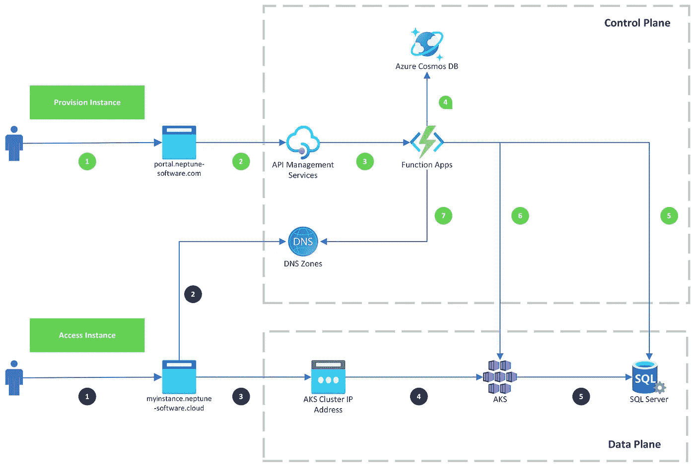

# 基础设施即代码之旅

> 原文：<https://itnext.io/an-infrastructure-as-code-journey-8127132f5a70?source=collection_archive---------0----------------------->

# 前言

2020 年 6 月，我们开始启动 DXP 云。团队规模不超过 2 名工程师，我们出去为后来的 DXP 云打下了第一块砖。

我们很快意识到，使用 Azure 的门户作为构建我们平台的主要接口是不可扩展的，在整个旅程中，我们反复讨论如何使用 IaC 以及如何改进。我们都没有使用 IaC 的经验，但是作为软件工程师，IaC 是我们 DevOps 思维模式的自然适应和延伸。

[*本文原创于 blog.segersian.com*T3](https://blog.segersian.com/2022/01/07/an-iac-journey/)

# 高层次设计

我写了一篇简短的博文解释[什么是 DXP 云以及它是如何工作的](https://blog.segersian.com/2021-12-05-dxp-cloud)。但是，我将占用图表一点时间来讨论一些事情。

在我们的架构中，我们有静态和动态云资源。我们控制平面中的大多数云资源都是静态的，也就是说，它们不会自行创建、删除或更改。云资源的创建、更改或修改是对我们架构的实际更改。动态云资源不断地被创建、删除、修改，而不改变我们的架构。我们的大部分数据平面云资源都是动态的，这些资源与我们客户的独特实例相关。

我们可以将静态基础设施定义为“平台本身”，而动态基础设施是运行在我们平台之上的资源。

**静态云资源示例**

> *我们的 Azure API 管理服务。只有当我们的一名工程师想要公开一个新的 REST API 端点时，才会对其进行修改。*

**动态云资源示例**

> *Azure SQL 数据库，为新的客户实例提供。该数据库是为给定实例单独提供的，可以由客户主动删除或修改。该资源的创建不会改变 DXP 云的实际架构。*

# 为什么要区分静态和动态？

这很重要，因为我们需要采取不同的方法来调配和管理云资源。这意味着我们的 IaC 之旅有两条平行的故事线。所以，静态故事和动态故事。

# 静态故事

# 归零地

起初，我们开始摆弄 Azure 的门户网站。这提供了很好的“探索”体验，但是导致了手动工作。我们作为工程师讨厌手工工作，我们希望一切自动化！由于手动工作不可扩展，您无法对其进行版本化，您必须对其进行文档化(唉),并且我们必须复制所有的文档(开发和生产环境)！

让我们继续前进，迭代这些恶作剧！

# 迭代 1: ARM 模板和 Powershell

我们的原则之一是“从可用的本地工具开始，一旦现有工具变得有限，并且您理解了需求，再选择另一个”，因为我们只有 2 名工程师，所以我们无法承担培训数十个第三方工具的费用，也无法提高工作效率！

我们从一个用于版本控制和协作的 GitHub 库开始。ARM 模板为我们提供了一种定义基础设施的声明式方法。然而，我们最终仍然严重依赖 Powershell cmdlets 和 Azure CLI，因为 ARM 模板不支持这些操作，或者这些操作与 ARM 本身无关(例如生成证书)。

Powershell 和 Azure CLI 的使用引入了命令式方法，并结合了来自 ARM 模板的声明式方法。这些因素结合在一起，使得我们很难理解运行任何脚本的“预期”结果是什么，以及资源之间的任何依赖关系(例如，应该首先提供哪个资源)。

Powershell 证明了自己不是非常平台独立友好(在 Windows、macOS 和 Linux 之间)。Powershell core 本应是解决这一问题的方案，但我们在任何机器上运行我们的脚本都面临着许多挑战。这些命令式脚本语言的使用使得以幂等方式运行我们的脚本变得更加困难，如果您想要保持多个环境同步，这是一个首要要求。

采用 git、脚本和 ARM 模板，作为软件工程师，我们已经感到更加自在了，然而随着每个资源添加到我们的平台，复杂性增长得太快了。是时候改进我们的方法了。

# 迭代 2:初学者的地形

声明式和命令式的混合让我们不太舒服。经过一些研究后，我们决定采用 Terraform，因为它将消除我们对组合“命令式”和“声明式”方法的需要，并且只使用声明式方法。

主要的问题是，由于 Terraform 是第三方工具，与 Azure 自己的工具相比，它无法跟上最新最好的工具。然而，作为回报，我们将得到一个更干净的、声明性的方法来定义我们的基础设施，以一种不太冗长的文件格式(HCL，Hashicorp 配置语言)。这需要一些教育，但投资回报似乎是值得的。

我们花了几天时间阅读“Terraform:由 Yevgeniy Brikman 撰写的启动和运行”,这确实帮助我们启动了 Terraform 的推出。在这一点上，我们对选择 Terraform 作为 IaC 的主要工具感到非常满意。如果我没记错的话，这次迁移花了大约一个月的时间，但是多亏了导入功能，我们不必从头开始。

然而，没有完美的解决方案。现在确实面临一些其他问题:

*   设置 Terraform 附带的“中央状态文件”管理。
*   为部署建立“规划、批准和应用”渠道。
*   将所有内容导入 Terraform 后，我们有了一个整体反模式，因为我们将所有资源都放在了一个模块中。这使得 Terraform 很慢，并且违反了任何可测试性、解耦和可重用性的原则

## 令人痛苦的错误

如果不提及一些失败，任何学习之旅都是不恰当的。这也不例外，在这个阶段，我们正在适应 Terraform 并致力于并发分支。在一些沟通失误和人为错误之后(像往常一样)，我们清除了 AKS 集群，并在其上运行了实例。好的方面是，当时只有内部客户(员工)在使用它，坏的方面是，它痛苦地提醒我们缺乏灾难恢复。恢复是一个痛苦、缓慢的手动过程。谢天谢地，此时只有少数员工使用它。

哪里出了问题？如果我没记错的话，我们两个在不同的部门工作。一个在主分支上，另一个在单独的分支上。这个单独的分支由于某种原因(时间太长，无法回忆起确切的原因)没有指定 AKS terraform 资源，而在主分支中却指定了。众所周知，除了主分支机构，我们不允许在任何其他分支机构进行“Terraform 应用”。然而，由于人为错误，没有验证当前的分支，也没有仔细检查计划，我们继续应用，放弃了我们的 AKS 集群。

在这个错误发生之前，我们实际上理解了问题风险，风险，以及不要做什么。我们知道不应该做什么，然而，我们仍然犯了那些确切的错误，按照确切的顺序，会导致这样的问题发生。关键的一点是，建立你的工作流程来避免人为错误，不要相信自己总是思维敏捷。但是，尽量避免降低开发人员的生产力。

当我试图回忆这个故事并把它写下来时，我痛苦地想起了尸检的重要性。但是，后来确实采用了这种做法

# 迭代 3:青少年的土地改造

大约在这个时候，Terraform Cloud 发布了，并为我们提供了最后两个绘画点的答案。用于部署和集中式状态文件管理的“规划、批准和应用”管道。除此之外，我们还了解到它解决了我们当时的一个未知挑战，提供了一个私有的 Terraform 模块注册表。

现在，这种方法已经开始满足我们的 DevOps 需求了！但我们仍然面临着一个新的巨大挑战，我们的整个基础设施只有一个单一的整体式平台模块。在这一点上，我们开始审视我们的基础架构中更大的依赖性和范围。我们按照“什么样的基础设施以相同的速度移动、发展和部署”的思维模式来分割我们的整体模块。

最终结果是我们的平台“计划”行动变得更短，因为模块更小，可以独立移动。这是一个很好的开始，然而，我们的模块仍然不小，不分离，不可重用，不可测试。单个模块仍然会与其他模块有很强的耦合，因此我们不能独立安装一个模块，因为它需要提供模块本身之外的许多其他资源。一股浓浓的代码味！

由于 Terraform cloud 提供的 Terraform module registry，我们可以在将基础架构分解为更小的模块时轻松创建和托管私有 Terraform 模块。

# 迭代 4:开发和测试

在这个时间点上，我们非常高兴，我们有一个很好的部署管道，我们有更小的模块，我们正在逐步分离。我们的整个工作流程真的开始感觉像一个软件开发管道！尽管如此，在分离我们的 Terraform 模块方面还有一些工作要做，但是架构和模块的变化是持续的，所以我们不能声称已经“完成”。

那时我们的工作流程中还缺少什么？安全和测试！

安全性:我们希望让安全性成为我们管道中更重要的一部分，这在业内通常被称为“左移”。我们在管道中采用了 Checkov(https://www . Checkov . io/)。

测试:由于我们已经发现我们的模块与其他模块紧密耦合，单元测试我们的 Terraform 模块在这一点上不是一个选项，将我们的模块重构为更小的独立模块将需要更长的时间。所以我们关注于[测试金字塔的顶端(打开新窗口)](https://www.browserstack.com/guide/testing-pyramid-for-test-automation)并创建了 e2e 测试，它通过 GitHub 动作运行。这些测试是对我们的 DXP 云 REST api 的 API 调用，然后验证资源是否被正确操作。

# [#](https://blog.segersian.com/2022/01/07/an-iac-journey/#iteration-5-best-practices-and-compliance) 迭代 5:最佳实践和法规遵从性

随着我们对 Terraform 和 IaC 的经验不断积累，我们开始提出“技术愿景”。定义我们“最佳实践”的文档。这可能是关于如何在我们的环境中设置一个带有 CI/CD 的 Azure 函数，或者关于如何创建一个新的 Terraform 模块，带有正确的 GitHub 动作、分支等等…

这些最佳实践为我们的 DXP 云环境创造了一种更加统一的方法。为了跟踪我们在一些最佳实践中的表现，我们使用 Azure 策略来检查合规性。这为我们提供了一些衡量标准。然而，100%的合规性并不是我们的目标，因为我们谈论“最佳实践”，如[“黄金路径”(打开新窗口)](https://engineering.atspotify.com/2020/08/17/how-we-use-golden-paths-to-solve-fragmentation-in-our-software-ecosystem/)，这不应该是强制性的！

在这里，我们开始体验到流程和方法的更加成熟。

# [#](https://blog.segersian.com/2022/01/07/an-iac-journey/#iteration-x-the-future) 迭代 X:未来

没有完成的最后阶段，我们的旅程将继续，永远不会结束，因为我们会不断改进我们工作、思考和应用 IaC 的方式。但是，我们可以分享我们关注的一些想法:

重构模块:进一步重新设计，重构更易测试、可重用和封装的模块。质量保证:更强的林挺，以及通过采用像 tfsec (tfsec.dev)这样的工具对我们的模块进行静态分析以获得更好的安全性。安全性:A 必须对如何更好地实施安全性和策略进行更多的研究。(例如，自动扫描 Azure 上的所有资源等)

# 动态故事

# 迭代 1:圣盔谷

在我们最初的方法中，我们使用 Helm 以声明的方式提供我们的 Kubernetes 资源。Helm 是 Kubernetes 的一种包管理器和模板工具。对于所有的 Azure 资源，我们使用 REST API，使用 Azure 的官方 NPM 包，在可能的地方包装这些 API。

供应和修改动态基础设施的流程编排是通过用 JavaScript 编写的 Azure 函数实现的。然后，这些函数将使用 Azure 的 NPM 模块，这些模块方便地包装了 REST API，以提供 Azure 资源。对于 Kubernetes 资源，我们会使用头盔。Helm 是一个模板工具，帮助提供和管理 Kubernetes 资源。

# 迭代 2:头盔太深

随着我们在 DXP 云平台上增加了更多对修改资源的支持，我们觉得使用官方的 Kubernetes NPM 模块来管理和修改资源会更方便。为了使我们的方法和工作流程更加一致，我们决定在我们的动态基础设施中取消 Helm 的使用。

我们所有的动态基础设施现在都是通过 Azure 函数以及 Azure 和 Kubernetes 的官方 NPM 包运行的，它们最终只是包装了各自的 REST APIs。

我们也研究了一些工具，比如 Pulumi，但是在撰写本文的时候，我们还没有理由或者理由放弃使用 Azure 和 Kubernetes 的原生 API 作为我们的动态基础设施。

# 迭代 X:未来

我们所有的逻辑现在都是绝对必要的。这在调试和更改我们的数据平面时仍然非常具有挑战性。比方说，当我们提供 Azure SQL 数据库时，我们希望在其上设置标签。这是容易的部分，在我们的源代码中找到“供应数据库”逻辑并修改代码。但是所有这些现有的数据库呢？他们没有那些标签？我们现在需要构建一个特定的一次性迁移脚本来更新所有现有的数据库。这通常是一个比实际的特性改变更大的任务！

这样的用例一直都在出现。因此，我们需要找到一种更好的方法来管理我们的动态云资源。我们需要的是某种“声明性”的模型(就像 Terraform 的 HCL)。所以我们可以为给定的实例定义一个声明性的模型。这样，我们可以为所有实例重新运行相同的逻辑，从而为每个实例重新生成声明性模型。

一旦我们为所有实例重新生成了这些声明性模型，我们就可以运行一个作业来协调(打开新窗口)声明性模型和真实世界。与 Kubernetes、[、Terraform(打开新窗口)](https://www.learnsteps.com/what-is-reconciler-pattern-and-how-terraform-uses-it/)以及其他声明性 IaC 工具完全一样。然而，我们必须能够以自动化的方式使用它。考虑到它的状态文件的性质，Terraform 不是一个好的匹配。Kubernetes 工具太有限，我们的实例资源覆盖 Azure 和 Kubernetes 资源。

除了自制一些解决方案之外，还有一些潜在的候选方案。然而，这是一个项目和帖子本身。

# 资源

在我们的旅程中，我们使用以下书籍作为定义和改进 IaC 方法的灵感来源:

*   基础设施作为代码(由基夫莫里斯，第一和第二版)
*   地形:启动和运行(叶夫根尼·布里克曼)
*   数据库可靠性工程(Laine Campbell & Charity Majors)
*   现场可靠性工程(贝琪·拜尔、克里斯·琼斯、詹妮弗·佩托夫、尼尔·理查德·墨菲)
*   构建进化的建筑(尼尔·福特、丽贝卡·帕森斯、帕特里克·库阿)
*   软件架构基础(马克·理查兹和尼尔·福特)

# 谢谢

我提到我们是两个工程师，但我的意思是我们在任何给定的时间都和两个工程师在一起。我想对 Skyetec 的 kolbjrn 和 John Inge 以及现在是 DXP 云团队全职成员的 Sebastian Augado 表示感谢。