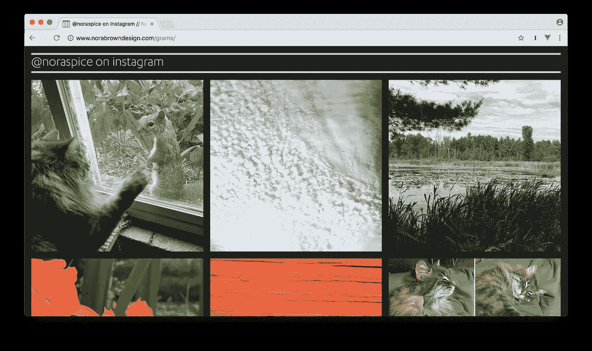
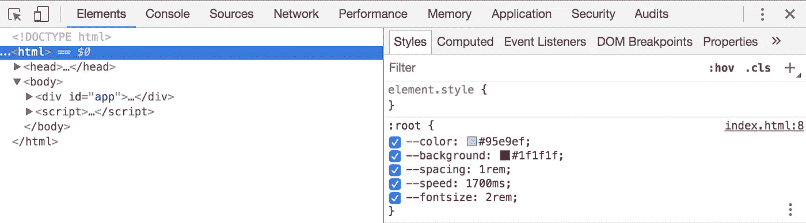

# 包含 Vue.js 和 CSS 网格的 Instagram 图库

> 原文：<https://itnext.io/an-instagram-gallery-with-vue-js-and-css-grid-c0a2d7cc3e0f?source=collection_archive---------2----------------------->



我的一个客户最近为她的网站申请了一个简单的图片库，可以显示她的 Instagram feed。我想:“没问题，Instagram 肯定有一个简单的 API，这个用例可能是他们最基本的 Hello World！例。”然而，细读几乎没有提供实际代码示例的 [Instagram API 文档](https://www.instagram.com/developer/)，只会把水搅浑。客户 id、客户机密、访问令牌？展示一个人的*自己的公共 Instagram feed 看起来有点过分。*谷歌搜索也帮不上什么忙——我找到的大多是关于 Instagram [关闭公共 API 访问](https://later.com/blog/instagram-api/)的[可怕帖子](http://www.zeldman.com/2016/06/04/instagram-third-party-developers-drop-dead/)(这是真的，但我们需要的访问应该是到 2020 年可用的[，所以:继续！).](https://developers.facebook.com/blog/post/2018/01/30/instagram-graph-api-updates/)

然而，我偶然发现了一个示例应用[并发现调用 Instagram 再简单不过了:](https://github.com/sameesiddiqui/instagram-example/blob/master/App.js)

```
let response = await fetch(   ‘https://api.instagram.com/v1/users/self/media/recent/?access_token=' + this.access_token )
```

在获得我自己的访问令牌并成功获取我的 feed 之后，多亏了 Vue.js 和 CSS Grid，构建一个简单的图库的速度出奇的快。

我希望这篇文章能够:

*   帮助任何想为自己的 Instagram feed 创建一个简单展示的人
*   为 Vue 初学者提供一个真实的 Vue 例子
*   体验 CSS Grid 在建筑布局中的易用性和强大功能

这是我们正在构建的另一个例子:[我的 Instagrams，在我的网站上](http://www.norabrowndesign.com/grams/)。

# 获取您的访问令牌

你可以按照[这篇文章](https://hackernoon.com/build-an-instagram-feed-app-with-just-javascript-using-expo-react-native-97c0e799b5cf)开头的指示，或者你可以使用[这个站点](http://instagram.pixelunion.net/)来生成你自己的访问令牌。(注意:对于第二个选项，您相信制作生成器工具的公司没有存储或使用生成的访问令牌。我做了，还没发生什么可怕的事。总之，使用访问令牌所能做的就是浏览媒体。)

# 设置页面外壳

在我的例子中，画廊将位于一个普通的网页中，而不是 web 应用程序的一部分。这是我非常喜欢 Vue 的一点:和 jQuery 一样，你可以把它放到你的页面中，然后按需使用。它不需要改变你建立网站或网页的方式。除了两个外部 Javascript 资源，当然还有对 Instagram API 的调用，我们的 Instagram gallery 将是非常独立的。这是页面的外壳:

我们将引入 Vue.js 的开发版本，以及 Axios.js，这是在 Vue 中从浏览器发出 HTTP 请求的首选库。你可以使用原生的 [fetch() API](https://developers.google.com/web/updates/2015/03/introduction-to-fetch) ，或者 [vue-resource](https://github.com/pagekit/vue-resource) 或者任何适合你的东西。如果您因为其他原因已经在页面上加载了 jQuery，您甚至可以使用它的 [$。ajax()](http://api.jquery.com/jquery.ajax/) 函数。

然后，我们为我们的风格，一点点的 html，和 Javascript 的味道。

# Vue 代码

让我们大胆地首先编写我们的 Javascript:

我们创建一个新的 Vue 实例，首先用`el: '#app'`告诉 Vue 要控制什么元素。然后，我们为 Vue 设置一些数据来跟踪:

```
data: {
  access_token: "your access token here",
  url: "[https://api.instagram.com/v1/users/self/media/recent/](https://api.instagram.com/v1/users/self/media/recent/)",
  username: "",
  grams: [],
  next_url: "",
  error: false
},
```

`url`和`access_token`的值不会改变(插入上面检索的访问令牌)。其他的将在我们的代码中更新。我们还有一个[计算属性](https://vuejs.org/v2/guide/computed.html#Computed-Properties):

```
computed: {
  instapage() {
    return '[https://www.instagram.com/'](https://www.instagram.com/') + this.username
  }
},
```

`instapage`的值只是 Instagram 上用户页面的 url。是的，你已经知道你自己的图库的`username`是什么，所以把它和`instapage`作为动态属性有点傻，但是它演示了如何使用计算属性。而且，拥有更少的硬编码值使代码更通用，更容易在未来的项目中重用。

接下来我们有了这个小应用的核心，方法`getGrams()`:

```
methods: {
  getGrams() {
    axios.get(this.url + "?access_token=" + this.access_token)
      .then(({data}) => {
        this.grams = data.data
        this.username = data.data[0].user.username
        this.next_url = data.pagination.next_url
      })
      .catch(function (error) {
        console.log(error)
        this.error = true
      });
  },
...
}
```

我们使用 Axios 调用附加了我们的`access_token`的 Instagram url。如果成功，我们更新我们的`data`属性。这是您必须在 jQuery 和 Vue 之间进行的思维的本质转变:使用 Vue，您所担心的只是数据。不再需要查找元素、创建元素、追加元素——您编写的 Javascript 代码操纵并更新您的应用程序所基于的*数据*,您让 Vue 检查 DOM。

(旁注:有些令人困惑的是，Axios 返回了一个带有`data`属性的`response`对象，Instagram 的 API *也有一个`data`属性，其中包含了我们 Instagram 帖子的数组。因此有了嵌套的`data`属性。)*

现在，我们需要一些事件来触发对`getGrams()`方法的调用。那些熟悉 jQuery 的人习惯于用`$(document).ready()`或它的等价物包装代码。在我们的例子中，当文档准备好了，我们想调用我们的方法*而不是*，但是当 Vue 实例准备好了，为此我们可以使用一个 [Vue 生命周期钩子](https://vuejs.org/v2/guide/instance.html#Instance-Lifecycle-Hooks):

```
created() {
  this.getGrams();
}
```

因此，一旦 Vue“创建”了实例(数据观察、计算属性、方法、观察/事件回调都已建立)，调用我们的`getGrams()`方法，该方法获取我们的 Instagram 数据。

在我们的 Vue 实例上还有第二个方法，`getMoreGrams()`。除了我们的一系列帖子，Instagram API 还返回了一个`next_url`，我们可以用它来获取下一批帖子，因此:

```
getMoreGrams(){
  axios.get(this.next_url)
    .then(({data}) => {
      this.grams = this.grams.concat(data.data)
      this.next_url = data.pagination.next_url
    })
    .catch(function (error) {
      console.log(error)
      this.error = true
    });         
}
```

一旦新的一批帖子返回，我们只需将它添加到我们的`grams`数组中，Vue 会处理剩下的事情！我们将提供一个按钮，用户可以点击来触发这个方法(或者你可以设置一个‘无限滚动’的情况，但我讨厌这些)。

对于这些 API 调用中的每一个，我们都做了一些非常基本的错误处理，如果调用完全失败，将显示一条消息，方法是将 reactive `error`属性设置为`true`。

# Vue 应用程序主体

接下来，我们将编写 HTML/Vue 模板代码:

这里我们有一个 id 为`#app`的容器 div(它可以很好地放在其他 HTML 元素旁边——主导航、页脚等)。

在一个简单的用户名标题之后，我们希望包含每个链接和图像的`divs`成为 CSS 网格的直接子节点。为了实现这一点，我们使用一个`template`元素[作为一个不可见的包装器](https://vuejs.org/v2/guide/conditional.html#Conditional-Groups-with-v-if-on-lt-template-gt)。我们可以在这里放置我们的`v-if`条件，这样只有当我们有 Instagrams 显示时，里面的标记才会被输出:

```
<template v-if="grams.length > 0">
```

如果我们这样做了，我们循环遍历每一个，并使用从 Instagram 返回的数据输出一个包装在链接中的图像:

```
<div v-for="(gram, index) in grams">
  <a :href="gram.link">
    
  </a>
</div>
```

虽然我们没有什么可展示的，但我们可以展示一个简单的加载器图形:

```
<div v-else class="loading"></div>
```

如果调用 Instagram 失败，我们可以说我们很抱歉:

```
<div v-if="error" class="error">Sorry, the Instagrams couldn't be fetched.</div>
```

最后，如果观众只是喜欢我们的作品，不能满足，我们提供了一个按钮来加载我们的下一个“页面”:

```
<button @:click="getMoreGrams">Load More</button>
```

(`@`是`v-on`的[简写](https://vuejs.org/v2/api/#v-on)。)

# 带有 CSS 网格的布局

最后但同样重要的是，我们可以为我们的画廊快速创建一个网格布局:

首先，我们在`[:root](https://developer.mozilla.org/en-US/docs/Web/CSS/:root)` [元素](https://developer.mozilla.org/en-US/docs/Web/CSS/:root)(在我们的例子中是`html`元素)的 [CSS 自定义属性](https://developer.mozilla.org/en-US/docs/Web/CSS/Using_CSS_variables)中放置了许多数值。这在三个方面很方便:

*   您可以轻松地为其他网站“重新设置”画廊的主题。
*   无需预处理程序或多次查找/替换，就可以轻松保持值的一致性。
*   在开发工具中，所有有趣的属性都在一个地方(`html`元素),无需跳转到单个元素的声明:



在根元素上使用 CSS 自定义属性，改变页面外观的值都在一个地方。干净利落。

然后我们在`#app`上设置网格:

```
#app{
  display: grid;
  grid-gap: var(--spacing);
  grid-template-columns: repeat(auto-fill, minmax(320px, 1fr));
  min-height: calc(100vh - var(--spacing)*2);
}
```

我们给网格一些空间，并设置列的最小宽度为`320px`，最大宽度为`1fr`，这意味着可用空间的 1 *部分*。你可以把`fr`想象成鸡尾酒配方中的“部分”,例如:

```
grid-template-columns: 3fr 2fr 1fr;
```

类似于一份需要 3 份白兰地、2 份三秒钟和 1 份新鲜柠檬汁的食谱。它并没有告诉你任何关于你要调制的鸡尾酒的*体积*的信息，只是告诉你各种成分之间以及整体之间的比例。

使用`repeat`和`auto-fill`，我们告诉浏览器尽可能多次地重复我们灵活调整大小的列，以适应`#app` div(在我们的例子中是 100%的浏览器窗口)。您会注意到，这使得我们的网格完全响应，没有单一的媒体查询！

CSS 的其余部分相当简单。在一些地方使用的一个很好的简写是:

```
grid-column: 1 / -1;
```

这是一种简单的方法，可以确保一个元素跨越整个网格，而不需要知道有多少列，这是

```
grid-column-start: 1;
grid-column-end: -1;
```

当使用负整数时，网格线将从网格的末端开始计数，所以这意味着“从第一个网格线开始，到最后一个网格线结束”，而不管有多少个网格线。

# 总结

参见 Gist 上的完整代码。

这是一个简单的 Instagram 图库的超级快速的开始，展示了 Vue.js 和 CSS Grid 的易用性和强大功能。

有很多改进和额外的功能，你可以在这里合并:更花哨的造型(宝丽来看，有人吗？);显示附加数据，如喜欢、标题和标签；更健壮的错误处理，以及对旧浏览器的回退。

**你会做出什么改进？下面留言评论！如果这篇文章对你有所帮助，那么鼓掌怎么样？**

# 了解更多信息的资源:

*   [CSS 网格上来自 Wes Bos 的免费视频系列](https://cssgrid.io/)。强烈推荐，让您快速启动和运行，许多有用的技巧。
*   [使用 Firefox DevTools 调试网格](https://developer.mozilla.org/en-US/docs/Tools/Page_Inspector/How_to/Examine_grid_layouts)
*   [Vue JS 2.0 —完整指南](https://www.udemy.com/vuejs-2-the-complete-guide/learn/v4/overview)。对 Vue.js 开发的大多数方面的扎实介绍。(当然周围也有很多免费教程。)
*   [Vue JS 官方介绍和指南](https://vuejs.org/v2/guide/index.html)