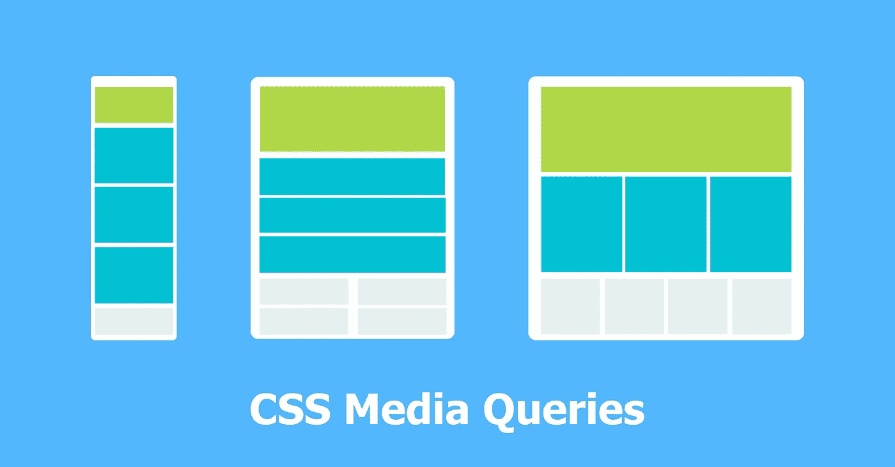
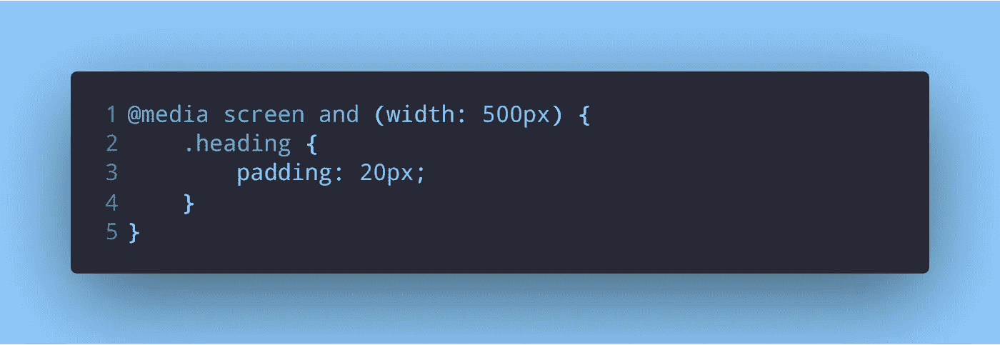
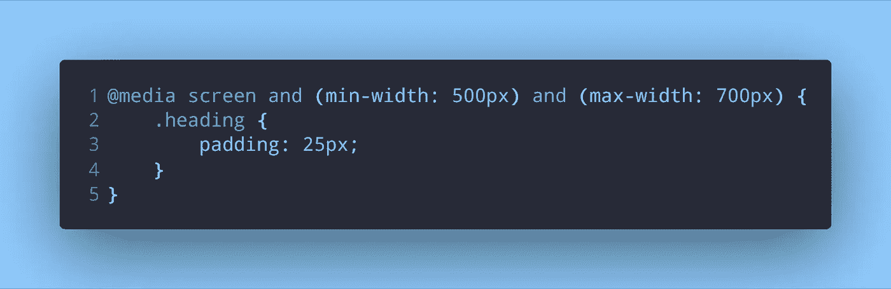
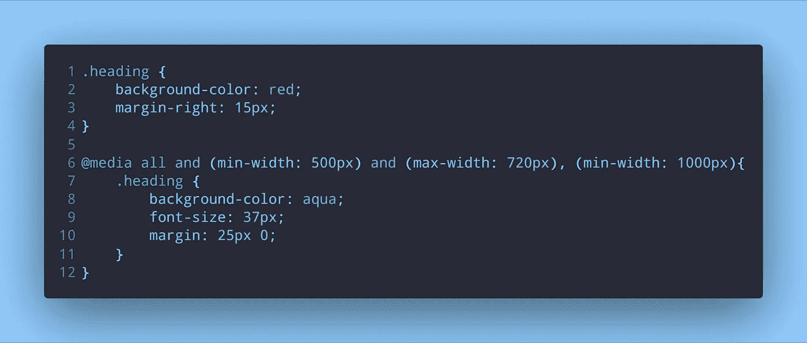

# 一个指导性的如何写 CSS 媒体查询

> 原文：<https://itnext.io/an-instructive-how-to-on-writing-css-media-queries-ab7c3c44b02e?source=collection_archive---------3----------------------->

当我第一次遇到媒体询问时，我不知道该写什么，也不知道一切意味着什么。我能理解的只有`width`、`max-width`和`min-width`部分。剩下的都是猜测。我避免使用媒体查询，因为我不知道它们是什么，也不知道它们如何影响我的代码。但是在研究了它们之后，我知道它们对于制作一个响应式的应用程序是多么有用。

媒体查询可以简单到您想要的程度，也可以复杂到非常具体。这篇文章的目的只是向你展示一些简单的方法，这样当你必须使用它们的时候，你就知道你在做什么了。

# 它们是什么？

CSS 媒体查询就像样式表的`if`语句。在像 JavaScript、Python 或 Java 这样的语言中，`if`语句表示只有在满足`if`语句的条件时才会执行的代码分支。

CSS 中的媒体查询也是如此。如果媒体查询中的条件得到满足，或者变为真，那么我们在里面写的内容就会被执行。

# 编写媒体查询

媒体查询以关键字`@media`开始，后跟条件。条件可以是设备的类型-具有屏幕的设备(如膝上型电脑或计算机)、打印介质(以打印预览模式在屏幕上查看的打印的分页材料或文档)等。这不是唯一的条件。例如，我们也可以指定宽度和高度。

> *典型的媒体查询将查询*浏览器窗口*的宽度和高度以及设备的类型*

让我们来看一些例子:

使用媒体查询的第一个示例

在这个例子中，如果我们的设备类型是`screen`并且我们的*浏览器窗口的宽度*是 500px，那么具有类`heading`的元素将具有 20px 的填充。我们也可以使用`height`，它对应于浏览器窗口的高度。

通常，您会希望检查宽度或高度是否在某个范围内，而不是像 500 像素这样的固定值。为此，我们有`min-width`、`min-height`、`max-width`和`max-height`。

在上面的查询中，`and`是一个逻辑运算符。`screen`和`(width: 500px)`是两个独立的查询。我们用逻辑运算符`and`将它们结合起来。使用逻辑操作符，比如在`if`语句中，我们可以将多个查询组合在一起。

接下来是一个示例，我们检查宽度是否在某个范围内:

第二个媒体查询示例，查询浏览器窗口宽度范围

这里我们有 3 个不同的查询，都结合了一个逻辑操作符- `screen`、`(min-width: 500px)`和`(max-width: 700px)`。如果设备属于类型*屏幕*并且浏览器窗口的宽度介于 500px 和 700px 之间，则上述媒体查询仅适用于元素`.heading`。

最后一个例子将查询所有设备类型，并使用逻辑`or`操作符。

使用新逻辑运算符的最终媒体查询示例

这个查询类似于上一个查询。我们用`all`代替`screen`。这意味着我们希望对所有设备执行该查询，而不是对特定设备。接下来是我们之前看到的两个查询- `(min-width: 500px)`和`(max-width: 720px)`。他们检查宽度是否在 500 像素到 720 像素的范围内。

我们在这个查询中有一些新的条件- `, (min-width: 1000px)`。从目前的例子中我们知道`(min-width: 1000px)`是一个查询。那么逗号是什么意思呢？它是逻辑`or`运算符。

我们媒体查询的意思是——如果有任何设备(既然我们用了`all`，是哪种类型的设备就无所谓了)并且浏览器窗口的宽度在 500px 到 720px 之间 ***或者*** 如果浏览器窗口的最小宽度为 1000px，

这个例子也为我们的`.heading`元素提供了另一组样式。这里，应用了红色的背景色。因此，如果我们希望应用媒体查询中的样式，我们的浏览器窗口必须具有 500-720px 之间的宽度*或*它必须具有 1000px 的最小宽度。如果这两个条件都不能满足，那么媒体查询之外的样式将被应用到具有类`heading`的元素。

# 包扎

简单的介质查询检查宽度和设备类型，如上例所示。虽然很简单，但在制作反应灵敏的网站和应用程序时非常有用，这些网站和应用程序可以在各种设备类型上很好地工作——从手机到平板电脑到宽屏桌面。了解它们的工作原理并能够使用它们是非常有益的。

# 更多资源

*   阅读[这篇关于 CSS-Tricks 的文章](https://css-tricks.com/css-media-queries/),了解更多关于媒体查询的信息。
*   [这里的](https://developer.mozilla.org/en-US/docs/Web/CSS/Media_Queries/Using_media_queries)是 MDN 的又一个好。

*最初发表于* [*dev.to*](https://dev.to/napoleon039/an-instructive-how-to-on-writing-css-media-queries-4d1i) *。*