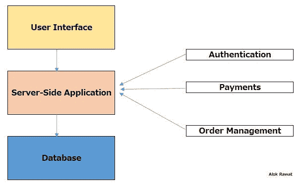
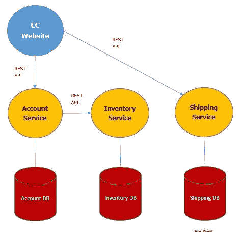
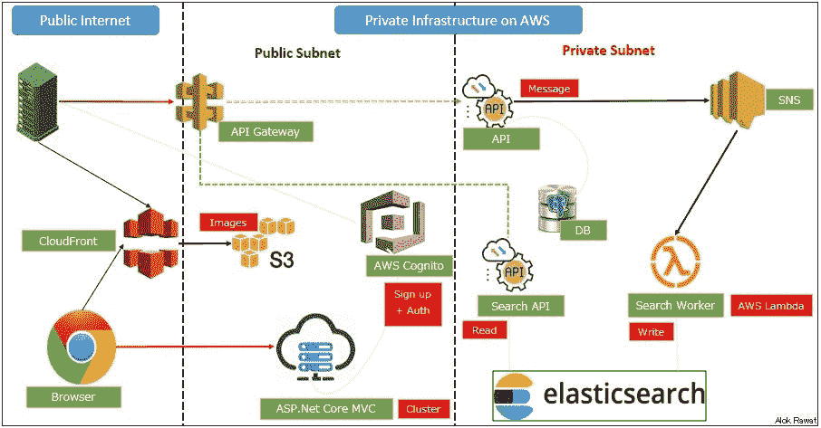
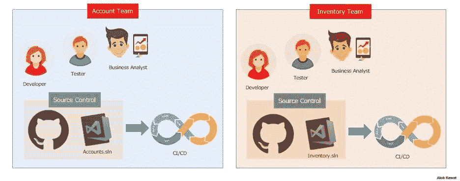
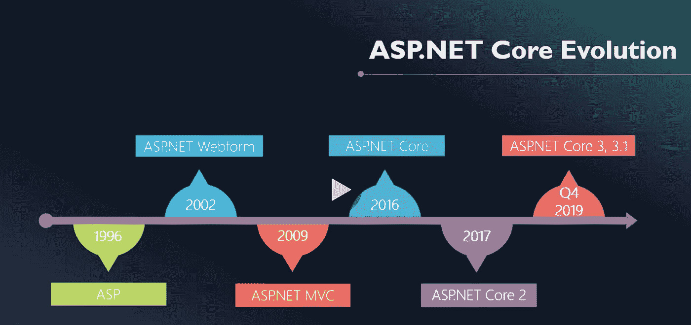

# ASP.net core 3x 微服务架构介绍(第一部分)

> 原文：<https://itnext.io/an-introduction-of-a-microservices-architecture-with-asp-net-core-3x-part-1-7db167f4ffaa?source=collection_archive---------6----------------------->

这是关于微服务架构的介绍，我们将讨论单片应用/架构和问题。

目标非常简单明了，就是了解微服务架构以及如何将它与 ASP.net 和 AWS 组件结合使用。

理解什么时候使用微服务架构好，什么时候不好，这一点非常重要。有时，当它放在错误的地方时，可能会适得其反。微服务并不总是一个解决方案。因此，您必须考虑并确定哪种架构最适合您的解决方案/应用。

我在这篇文章中谈到了以下几点。希望对你开发微服务应用有所帮助。

1 什么是单片应用？
2 单片应用的问题？
3 什么是微服务？
4 微服务优于整体应用的优势？
5 带 AWS 的微服务架构(基于应用)。
6 开发微服务的团队结构？
7 ASP.NET 的进化？如何用 ASP.NET core 3x 实现它？

我们开始吧。
**1 什么是单片机应用？**
在软件工程中，单片应用的设计没有模块化。
没有模块化的手段，软件/应用程序是由组件或模块组成的，它们可以很容易地被替换或重用，但在一个单片应用程序中，没有模块化。
一个应用程序执行许多任务并包含多种服务。
控制台应用程序就是一个很好的例子。应用程序中的所有逻辑/数据库和用户界面。

**2 单片应用的问题？**
1。可以很快变成一个大泥球。没有一个开发人员知道全部代码。
2。有限重复使用。
3。扩展可能是一项挑战和/或成本高昂。
4。持续集成和开发可能会变得复杂和耗时。
5。它们是用一种框架或编程语言构建的。
6。多个团队很难在一个代码库上工作(例如代码冲突)。7。应用程序某一部分的更改需要完整的构建、部署和测试。

**3 什么是微服务？**
微服务是一种架构风格，将单个应用开发为一组小服务。每个服务都在自己的进程中运行。这些服务使用轻量级协议与客户端进行通信，通常是相互通信，通常是通过消息传递或 HTTP。

让我们举一个电子商店的例子。

**4 微服务优于整体应用的优势？**
使用微服务有很多好处。其中一些与它们如何允许开发人员编写代码有关。

微服务是开发团队独立创建的小型应用程序。因为它们通过消息传递进行通信，所以它们不依赖于相同的编码语言。开发人员可以使用他们最熟悉的编程语言。这有助于他们更快地工作，成本更低，错误更少。

由于团队正在开发更小的应用程序和更集中的问题领域，他们的项目也更敏捷。他们可以更快地迭代，在更短的时间内解决新的特性，并且几乎可以立即修复错误。他们也经常找到更多重用代码的机会。

微服务也提高了您架构的可扩展性。对于整体式系统，你通常会“投入更多硬件”来解决问题，或者购买昂贵且难以维护的企业软件。借助微服务，您可以利用负载平衡器和消息传递等标准解决方案进行水平扩展。

**5aws 微服务架构。**
基于附加的架构，我们将在下一部分开发一个应用程序。
这座建筑分为两部分。
1。公共互联网
2。AWS 上的私有基础设施(VPC)
这一部分也分为两部分。
1。公共子网
2。私有子网

**6 开发微服务的团队结构？**
对于微服务开发，最好创建一个垂直团队。
假设账户团队开发人员完成了他的任务，那么库存团队也可以将一些任务分配给账户团队开发人员。我们可以在团队之间共享资源。

对于源代码控制系统，
应该有自己的特定服务的 repo。不要将所有服务添加到一个存储库中。
如果客户团队开发人员想要帮助库存团队，那么他需要从 git 获得一个自己的分支(源代码的副本),并需要将请求提交给库存团队，然后库存团队的某个人将管理该请求。
这就是另一个团队的人如何帮助另一个团队的人，反之亦然。

从 ASP.NET 到 ASP.NET 核的演化？

如何用 ASP.NET core 3x 实现它？
在下一部分，我们将深入探讨(编码部分)。在那之前敬请期待。

如果你发现任何错误，请让我纠正。

享受编码…

参赛:https://stackify.com/what-are-microservices/

谢谢，阿洛拉瓦特

*原载于 2020 年 2 月 8 日 https://qiita.com**[*。*](https://qiita.com/alokrawat050/items/66a512dc840827107260)*