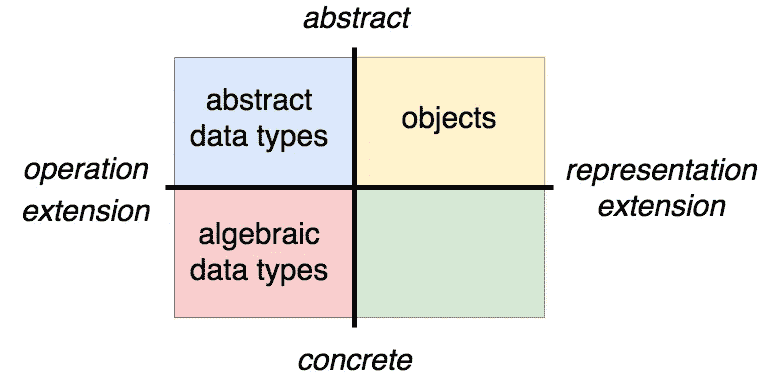

# 代数数据类型简介

> 原文：<https://itnext.io/an-introduction-to-algebraic-data-types-9429e49eac27?source=collection_archive---------1----------------------->

## 结构化的具体数据



[*点击这里在 LinkedIn 上分享这篇文章*](https://www.linkedin.com/cws/share?url=https%3A%2F%2Fitnext.io%2Fan-introduction-to-algebraic-data-types-9429e49eac27)

我已经转移了我的博客。你可以在我的个人网站 [*这里*](https://jnkr.tech/blog/introduction-to-algebraic-data-types) *查看这篇文章的新家。*

在我的[上一篇文章](https://medium.com/@JosephJnk/abstract-data-types-and-objects-17828bd4abdc)中，我说过有三种表示数据的基本方法:抽象数据类型、对象和代数数据类型。我介绍了抽象数据类型和对象(使用基于自动诊断的“对象”的严格定义),并展示了在这两种风格中实现数据结构的权衡。在这篇文章中，我将介绍表示数据的第三种方法，即“代数数据类型”，并展示它的特征与抽象数据类型和对象的特征相比如何。

## 建立数据

代数数据类型是 ML 系列语言(如 StandardML、OCaml 和 Haskell)中表示数据的主要方法。这些语言有处理代数数据类型的特殊语法，但这种语法并不是它们有用的必要条件。使用代数数据类型所需要的只是一种为不同的数据块构造构造函数的方法。在 JavaScript 中，我们使用`class`和`instanceof`来实现这一点。下面是两个普通代数数据类型的实现，代表不同种类的水果:

```
class Apple {}
class Blackberry {}
```

我们可以使用`new` : `new Apple()`或`new Blackberry()`来创建这些数据类型的实例。

这些类型被称为“代数”的原因是，我们可以通过对现有类型进行“求和”或“乘积”来创建新类型，就像我们可以通过将标准高中代数中的现有项相加或相乘来创建方程的新项一样。为了创建 sum 类型，我们将使用`|`，意为“或”:

```
type Fruit = Apple | Blackberry;
```

这表示我们已经将`Apple`类型添加到了`Blackberry`类型中，从而创建了`Fruit`类型。我们可以通过将现有类型与带多个参数的类型构造函数相结合来创建产品类型:

```
class Pie {}
class Tart {}
class Dumpling {}type Recipe = Pie | Tart | Dumpling;class Dessert {
  fruit: Fruit;
  recipe: Recipe;
  constructor(fruit: Fruit, recipe: Recipe) {
    this.fruit = fruit;
    this.recipe = recipe;
  }
}
```

这里的`Recipe`是另一种求和类型，`Dessert`是由`Fruit`和`Recipe`形成的乘积类型。为了创建一个`Dessert`，我们需要创建它包含的类型的实例，然后将它们提供给`Dessert`构造函数:

```
const appleTart = new Dessert(new Apple(), new Tart());
```

如果考虑到每种类型中存在的不同值的数量，名称“sum”和“product”可能更直观。`Apple`构造函数没有参数，所以(忽略对象引用比较)每个`Apple`实例都是一样的。这意味着`Apple`类型有一个不同的值，对于`Blackberry`、`Pie`、`Tart`和`Dumpling`类型也是如此。`Fruit`类型将`Apple`和`Blackberry`相加，因此包含两个不同的值，而`Recipe`将`Pie`、`Tart`和`Dumpling`相加，因此包含三个不同的值。另一方面，`Dessert`是`Fruit`和`Recipe`的乘积，因此包含六个不同的值。`Apple/Pie`、`Apple/Tart`、`Apple/Dumpling`、`Blackberry/Pie`、`Blackberry/Tart`、`Blackberry/Dumpling` ) Sum 类型将可能值的个数相加，product 类型将它们相乘。

这种通过组合以前的类型来创建新类型的能力对于代数数据类型是必不可少的。代数数据类型的构成没有限制。正如我们创建了一个`Dessert`类型一样，我们可以创建`Appetizer`和`Entree`类型，并将这三个组合成一个`Dinner`类型。我们可以创建`Breakfast`和`Lunch`类型，并将它们与`Dinner`组合成`MealPlan`类型，等等。

## 代数数据类型上的函数

建立代数类型只是故事的一半；要做任何有用的事情，我们需要把它们拆下来看看里面。大多数类型化函数式语言都提供了一个特殊的特性来完成这项工作(模式匹配)，但是在 JavaScript 中，我们可以使用条件逻辑和`instanceof`操作符来完成这项工作。

为了在我们的 sum 类型上编写函数，我们将把它们分解成事例，并为 sum 类型的每个成员提供一个值:

```
function fruitToString(fruit: Fruit) : string {
  return fruit instanceof Apple ? "apple" : "blackberry";
}function recipeToString(recipe: Recipe) : string {
  return recipe instanceof Pie  ? "pie"
  :      recipe instanceof Tart ? "tart"
  :      /* it's a Dumpling    */ "dumpling";
}
```

第二个函数的语法可能看起来很奇怪，但它只是一个嵌套在另一个中的三元表达式。当我们像这样嵌套 ternaries 时，从上到下检查条件，与第一个真值条件配对的值将是整个表达式的值。您可以阅读以这种方式编写的函数，例如为 sum 类型的每个成员提供函数实现的表格。(条件操作符上的 [MDN 文档](https://developer.mozilla.org/en-US/docs/Web/JavaScript/Reference/Operators/Conditional_Operator)的底部也提供了对这种风格的介绍。)

产品类型上的功能更简单。他们可以访问所创建类型的所有字段，而无需执行任何特殊操作:

```
function dessertToString(d: Dessert) : string {
  return `a ${fruitToString(d.fruit)} ${recipeToString(d.recipe)}`;
}
```

当然，正如我们可以根据自己的需要组合任意多的代数数据类型一样，我们也可以根据自己的需要对它们进行分解。这是一个深入挖掘其输入的两个层次的函数:

```
function price(d: Dessert) : number {
  return (
    d.fruit instanceof Apple && d.recipe instanceof Pie       ? 10
  : d.fruit instanceof Apple && d.recipe instanceof Tart      ? 4
  : d.fruit instanceof Apple && d.recipe instanceof Dumpling  ? 2
  : d.fruit instanceof Blackberry && d.recipe instanceof Pie  ? 12
  : d.fruit instanceof Blackberry && d.recipe instanceof Tart ? 5
  : /* we have a blackberry dumpling                         */ 3);
}
```

这与抽象数据类型和对象有很大不同，抽象数据类型和对象都提供了一小组操作数据的函数，同时隐藏了数据的内部结构。代数类型具有相反的意图:它们为数据提供了一种结构，使得可以编写任意数量的函数来处理这些数据。

代数数据类型的一个主要好处是，处理它们的算法结构倾向于反映类型本身的结构。从上面我们可以看到，对于有一些成员的 sum 类型，使用这种类型的函数往往会有`n`案例。虽然这里没有显示，但是当一个代数数据类型是递归的时，使用它的函数往往也是递归的。(而函数消耗[相互递归](https://en.wikipedia.org/wiki/Mutual_recursion)代数数据类型往往是相互递归的。)因此，当与类型检查器结合时，代数数据类型可以为开发人员提供防护栏，指导算法的实现，并确保在每一步都考虑到所有的可能性。

代数数据类型的一个重要特征是它们应该总是不可变的。我在上一篇文章中给出的抽象数据类型和对象的例子也是不可变的，但是根据“抽象数据类型”和“对象”的定义，可变实现仍然是有效的。相比之下，大多数具有代数数据类型的语言不支持这些类型的变异，或者至少需要特殊的步骤来使它们可变。当代数数据类型用在不是特别传统的语言中时(比如 JavaScript)，改变它们仍然是不寻常的，也是不明智的。代数数据类型的部分本质是，它们与数学和纯函数式的代码思维方式配合得很好。因此，对它们进行变异会违背开发人员在使用它们时通常所依赖的期望。

## 将代数数据类型与对象进行比较

为了便于比较，上面使用对象的数据结构的实现应该是这样的:

```
interface HasName {
  getName() : string
}interface Fruit extends HasName {}interface Recipe extends HasName {}interface MenuItem extends HasName {
  getPrice() : number | null
}class Apple implements Fruit {
  getName() { return "apple"; }
}class Blackberry implements Fruit {
  getName() { return "blackberry"; }
}class Pie implements Recipe {
  getName() { return "pie"; }
}class Tart implements Recipe {
  getName() { return "tart"; }
}class Dumpling implements Recipe {
  getName() { return "dumpling"; }
}class Dessert implements HasName {
  fruit: Fruit;
  recipe: Recipe;
  constructor(fruit: Fruit, recipe: Recipe) {
    this.fruit = fruit;
    this.recipe = recipe;
  }
  getName() {
    return `a ${this.fruit.getName()} ${this.recipe.getName()}`
  }
  getPrice() {
    const fruit = this.fruit.getName(),
          recipe = this.recipe.getName(); return (
      fruit === "apple" && recipe === "pie"           ? 10
    : fruit === "apple" && recipe === "tart"          ? 4
    : fruit === "apple" && recipe === "dumpling"      ? 2
    : fruit === "blackberry" && recipe === "pie"      ? 12
    : fruit === "blackberry" && recipe === "tart"     ? 5
    : fruit === "blackberry" && recipe === "dumpling" ? 3
    : /* we don't know the price of this item        */ null);
  }
}
```

关于该实现的一些评论和比较注释:

*   以前是 sum 类型的`Fruit`和`Recipe`，现在是接口。在一个现实的例子中，这些接口上应该有方法:可能是查询水果来源或季节性的方法，或者是烹饪食谱的步骤。为了简单起见，所有与这个例子无关的方法都被省略了，接口也是空的。
*   `Dessert`之前是一个产品类型，现在内部结构和构造器签名依然一样。我们已经把它从一个保存数据的普通容器变成了一个有方法的对象。为了实现在讨论代数数据类型的组合时提到的类似于`Appetizer`和`Entree`的假设结构的可组合性，我们添加了一个`MenuItem`接口并让`Dessert`实现它。
*   `getPrice`的实现很有意思。它本质上是一个条件列表，将任意水果/食谱对与价格相关联。自诊断的原则禁止我们在对象实现中使用`instanceof`，所以我们使用`getName`来区分各种水果和食谱。这似乎违背了自我认知的精神，因为我们试图确定我们正在处理的是什么样的物体。这里的区别在于，`getName`是对象接口上的一个方法，它可以由任何实现`Fruit`接口的对象提供。用户可以创建不同种类的`Apple`，例如`GalaApple`或`HoneyCrispApple`，它们仍然从`getName`返回`"apple"`，但在其他方面有所不同。这些不同的对象可以传递给`Dessert`，而`Dessert`的`getPrice`方法仍然可以工作。这种模仿另一个对象的技术通常被称为“模仿”。任意的附加实现可以模拟我们的对象，这是基于对象方法可扩展性的一个重要方面。
*   `getPrice`的签名已经改变。在代数数据类型实现中，它返回一个`number`，但现在它返回`number | null`。这是因为在代数数据类型实现中，所有的可能性都列在我们的 sum 类型的类型签名中，我们可以确信我们的实现覆盖了每一种可能的组合。对象的开放可扩展性是有代价的:我们无法防止有人添加一个新的从其`getName`方法返回`"orange"`的`Fruit`类型，然后向我们询问一个橘子馅饼的价格。(这是我们做不到的。)我们需要在返回值中添加一个错误案例，以处理类似这样的意外情况。

最后这一点显示了代数数据类型提供的“防护”。因为我们的 sum 类型是一个可能性的详尽列表，所以在函数中使用 sum 类型只需要为 sum 的每个成员编写一个 case，并保证我们不会遗漏任何可能性。这让我们避免了边缘情况，比如在对象实现中可能丢失价格。

如果我们将 sum 类型的成员视为该类型的“表示”，就像类提供接口的不同表示一样，我们可以看到代数数据类型的表示扩展性非常有限。考虑给上面的每个实现添加一个新的`Fruit`。向 sum 类型添加新选项需要更新使用该类型的每个函数，并为新成员添加条件和 case。这就是拥有一份详尽的可能性清单给我们带来的保证和指导的代价:我们的功能与运行它们的数据紧密相连。

相比之下，向代数数据类型添加新的运算相当容易。操作被定义为函数，完全独立于数据类型的类型签名和构造函数。任何人、任何地方都可以添加使用或返回代数数据类型的新函数。

因此，代数数据类型放弃了简单的表示可扩展性，以换取强大的操作可扩展性。当我引入对象时，我将这种权衡称为“表达式问题”。正如更高级的技术可以使对象克服这种权衡，在两方面都提供模块化扩展，代数数据类型的更复杂用法也可以。与对象一样，提供这两种可扩展性的解决方案要比我们这里的简单方法复杂得多。

与对象相比，代数数据类型在性能方面有更复杂的权衡。对象可扩展性的代价之一是极大地降低了优化的潜力。自动诊断解决方案没有可访问的结构，因此将大结构缩减为较小结构的优化技术不能用于对象。代数数据类型在这方面表现出色；因为它们的结构不是抽象的，任何对它们进行操作的函数都可以选择进行任何想要的简化。另一方面，因为对象可以是可变的，而代数数据类型不应该是可变的，所以依赖于变异的优化对对象是可用的，但对代数数据类型是不可用的。

## 比较代数数据类型和抽象数据类型

代数数据类型提供的权衡与抽象数据类型提供的权衡非常相似；两者在操作上都是可扩展的，但在表示上都是不可扩展的。事实上，每种代数数据类型都可以作为抽象数据类型来使用。所有需要做的就是导出处理代数类型的函数和创建它们的函数，但是隐藏构造函数和类型定义本身。这种转换不是双向的；抽象数据类型不能用作代数数据类型，因为代数数据类型有严格的规则，即它们纯粹作为嵌套构造函数实现，并且应该是不可变的，而抽象数据类型通常利用不同的语言特性。

尽管这两者在很大程度上有相似之处，但它们之间还是有重要的区别:

代数类型具有更好的公共操作扩展性。只有在抽象数据类型的模块中定义的操作才能访问该类型的内部结构，这限制了使用该类型的开发人员可以在其上实现的功能。相比之下，代数数据类型的具体性意味着消费者拥有与导出它们的模块的作者相同的使用它们的能力。

随着时间的推移，抽象数据类型有很大的自由来发展它们的实现，而代数数据类型的发展要复杂得多。这是对消费者隐藏其内部结构的好处；抽象数据类型可以完全重写其内部结构，而不会破坏消费者。相比之下，一旦代数数据类型发布，对该类型结构的任何更改都是重大更改。这可能是一件好事；在修改了代数数据类型之后，类型检查器可以帮助定位将会受到该改变影响的代码。然而，这些变化通过代码库的波动是使用非抽象解决方案的明显代价。

最后，如前一节所述，优化不可变数据结构比优化可变数据结构面临更多挑战。这意味着抽象数据类型可以很容易地访问大量的优化技术，而代数数据类型则不能。这并不意味着代数数据类型很慢；许多有效的数据结构以代数数据类型的形式存在，并且有[资源](https://www.goodreads.com/book/show/594288.Purely_Functional_Data_Structures)用于学习如何设计和思考它们。不过，这确实意味着，与可变的抽象数据类型相比，在不可变的代数数据类型上优化复杂的算法可能更具挑战性。

这就结束了我们对表示数据的基本方法的探索。在第一篇文章中，我们看到了抽象数据类型和对象，这两种数据抽象方法在操作可扩展性/表示可扩展性的权衡上采取了相反的立场。代数类型从根本上是不同的，因为它们根本不提供任何抽象，而是提供一种结构来指导使用它们的任何函数的实现。代数数据类型在操作上非常具有可扩展性，甚至比抽象数据类型更具可扩展性，因为所有消费者都可以访问它们的结构，并可以实现任意逻辑来操作它们。但是，它们的表示扩展性很差，对它们结构的任何改变对消费者来说都是一个重大的改变。代数数据类型是大多数类型化函数式语言的首选方法，它们的不变性、可组合性和已知的结构使它们成为函数式解决问题的最佳选择。

*感谢* [*利兹·卡茨尼尔森*](https://medium.com/u/daeb561df8a5?source=post_page-----9429e49eac27--------------------------------) *编辑此贴。*

*如果你喜欢这篇文章，你也可以欣赏我关于代数结构* *的* [*系列或者我关于递归方案*](https://medium.com/@JosephJnk/algebraic-structures-for-absolute-beginners-cab7b3e764ba) *的* [*系列。我定期撰写关于 JavaScript 类型化函数式编程的文章；如果你想在我发布新消息时得到通知，你可以在媒体上关注我。*](https://medium.com/@JosephJnk/recursion-schemes-in-javascript-and-flow-with-static-land-recursision-schemes-97cf10599fb7)