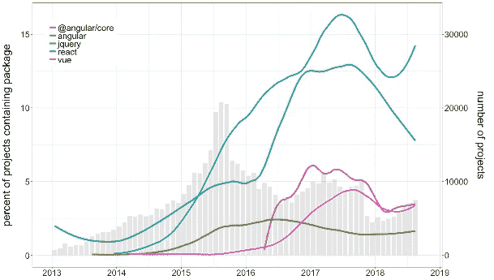

# jQuery 简介

> 原文：<https://itnext.io/an-introduction-to-jquery-53d821e13153?source=collection_archive---------2----------------------->


## 什么是 jQuery？

jQuery 是一个 DOM 操作库，它本质上帮助我们更快更简单地完成许多 JavaScript 任务。

它提供了许多有用的方法，用于:

*   选择/操作/创建元素
*   添加事件侦听器
*   动画元素
*   添加效果
*   发出 HTTP 请求(AJAX)

## 为什么要使用 jQuery？

*   它很容易学习和使用
*   让 DOM 操作变得轻而易举
*   支持跨浏览器
*   使用 AJAX 很容易
*   如果你需要帮助，那里有很多知识

## 为什么我不应该使用 jQuery？

*   它不会做任何你自己不能做的事情(见[你可能不需要 jQuery](http://youmightnotneedjquery.com/) )
*   这是一种不必要的依赖
*   降低性能
*   它是旧的，每个人都有反应/角/Vue



[框架的状态！](https://medium.com/warsawjs/state-of-package-json-dependencies-de99828b6c3f)

🤓想要了解最新的 web 开发吗？🚀*想要将最新消息直接发送到您的收件箱吗？
🎉加入一个不断壮大的设计师&开发者社区！*

**在这里订阅我的简讯→**[**https://ease out . EO . page**](https://easeout.eo.page/)

# 如果你还不知道 jQuery，那么今天它是否值得学习？

在我看来，jQuery 不应该真正用于新项目，因为我们应该关注 React、Angular 或 Vue 等现代框架。然而，这并不意味着 jQuery 应该被完全遗忘。

一些项目可能会使用 Bootstrap 之类的库，这些库暂时依赖于 jQuery。一些现成的模板也是如此。一些开发团队很习惯使用 jQuery，这也很好。

在这些情况下，jQuery 仍然适用。此外，如果你想保住你的第一份开发工作，许多公司仍然使用 jQuery。所以了解一点是个好主意！

# 使用 jQuery

所以假设你想学习一些 jQuery，那就开始吧！

## **创建一个演示项目**

我们将从创建一个演示项目开始。在`css/`目录中添加一个`style.css`，在`js/`目录中添加一个`scripts.js`，在项目的根目录中添加一个主`index.html`。

```
jquery-demo/
├── css/
|   └── style.css
├── js/
|   └── scripts.js
└── index.html
```

## 设置 jQuery

jQuery 只是一个 JavaScript 文件，您可以在 HTML 中链接到它。有两种方法可以将它包含在您的项目中:

*   [下载](https://jquery.com/download/)本地副本
*   通过内容交付网络(CDN)链接到文件

如果您选择下载本地副本，请通过以下内容链接到它:

```
<script type="text/javascript" src="js/jquery-3.3.1.js"</script>
```

注意:版本号可能会改变，但没关系！

如果您选择 CDN 选项，请改用以下代码:

```
<script src="https://code.jquery.com/jquery-3.3.1.js"</script>
```

让我们打开我们的`index.html`，并复制以下代码:

*注意:我们将在本文的后面使用这些元素*`*<h1>, <ul>, , <div>*`*——所以现在就把它们全部复制进来以节省时间！*

```
<!doctype html>
<html lang="en">

<head>
  <title>jQuery Demo</title>
  <link rel="stylesheet" href="css/style.css">
</head>

<body>
  <h1 id="demo"></h1> <ul>
    <li>First</li>
    <li>Second</li>
    <li>Third</li> 
  </ul> <div>
    <button id="submit">Click me</button>
    <input type="text">
</div> <script src="https://code.jquery.com/jquery-3.3.1.js"></script>
  <script src="js/scripts.js" />
</body>
</html>
```

并且确保将脚本标签放在`</body>`标签之前，确保将`scripts.js`放在 jQuery 脚本之后*——否则它将不起作用！*

现在打开`scripts.js`并添加以下内容:

```
$(document).ready(function() {
    // All your jQuery will go here!
});
```

我们这样做是因为为了用 jQuery 操作页面，我们需要首先确保文档“就绪”。我们编写的所有代码都需要包装在这段代码中(这是最佳实践)。

让我们通过一个快速演示来看看它的实际效果吧！将下面一行添加到您的`scripts.js`

```
$(document).ready(function() {
    **$("#demo").html("This text is brought to you by jQuery!");**
});
```

如果你打开`index.html`，你会看到文本已经通过 jQuery 添加到了`h1`元素中！

## 使用 jQuery 选择

首先，我们用美元符号`$`调用 jQuery。我们主要使用 CSS 语法来访问 [DOM](https://developer.mozilla.org/en-US/docs/Web/API/Document_Object_Model/Introduction#What_is_the_DOM) ，并使用一个方法来应用一个动作。基本语法是这样的:

```
$("selector").method();
```

选择器本质上是我们告诉 jQuery 我们想要处理哪些元素的方式。让我们看看选择元素的几种方法(见[完整列表](https://api.jquery.com/category/selectors/))。

```
// Select all image tags
$("img")// Select all elements with the 'social' class
$(".social")// Select all elements with the 'social' id
$("#social")// Select all <a> tags inside of <li>'s
$("li a")// Selects the current element being used within a function
$(this)
```

现在去浏览器里玩一玩吧！打开您的`index.html`，练习在浏览器控制台中选择元素。例如，运行`$(“h1”)`会显示你的`<h1>.`你甚至可以用`$(“h1”).css("color", "yellow");`改变它的颜色，看 CSS 操作的完整列表[这里](http://api.jquery.com/css/)。

# jQuery 方法

现在让我们来看看一些更常见的 jQuery 方法的实际应用。

**正文()**

> 获取匹配元素集中每个元素的组合文本内容，包括它们的后代，或者设置匹配元素的文本内容。

在你的控制台上运行`$(“h1”).text()`会输出`“This text is brought to you by jQuery!”`，这是我们`<h1>`的文本内容。我们可以通过传入新的文本来改变这个文本，比如`$(“h1”).text("Time for a new heading!")`

**html()**

> 获取匹配元素集合中第一个元素的 HTML 内容或每个匹配元素的 HTML 内容集合。

让我们用`$(“ul”).html()`请求我们的`<ul>`元素的 HTML，这将检索我们的内部 HTML: `<li>First</li> <li>Second</li> <li>Third</li>.` ，我们可以通过传入新的 HTML 来改变它，例如`$(“ul”).html("<li>Your</li> <li>New</li> <li>List items</li>")`

**attr()**

> 获取匹配元素集中第一个元素的属性值，或者为每个匹配元素设置一个或多个属性。

让我们在 HTML 中使用``。我们可以用`$(‘img’).attr(“src”);`检索它的源，并用`$(‘img’).attr(“src”,“[https://upload.wikimedia.org/wikipedia/commons/1/1c/Logo_Rad.jpg](https://upload.wikimedia.org/wikipedia/commons/1/1c/Logo_Rad.jpg)");`替换它

## 类操作

接下来的 3 个方法将着眼于我们如何操作页面上的类。打开我们之前创建的`style.css` 并添加以下内容:

```
.green {
  color: green;
}.red {
  color: red;
}
```

**addClass()**

> 将指定的类添加到匹配元素集中的每个元素。

我们可以使用`$(“li:first-of-type”).addClass(“green”);`将我们的绿色类添加到列表的第一项中。如果我们现在检查我们的元素，我们可以看到该类已经被添加到我们的 HTML 中。如果我们想把这个类添加到李的所有类中，我们可以简单地说`$(“li”).addClass(“green”);`

**removeClass()**

> 从匹配元素集中的每个元素中移除单个类、多个类或所有类。

我们可以很容易地用`$(“li:first-of-type”).removeClass(“green”);`删除我们刚刚添加到第一个 li 中的类

**toggleClass()**

> 根据类的存在或 state 参数的值，在匹配元素集中的每个元素中添加或删除一个或多个类。

我们可以像这样切换一个类，每次我们运行这段代码时，这个类都会打开和关闭，添加和删除我们包含的样式。

# jQuery 事件方法

接下来我们将看几个事件的例子——或者说，我们如何让事情互动起来！点击查看事件方法[的完整列表。](https://api.jquery.com/category/events/)

**点击()**

> 将事件处理程序绑定到“click”JavaScript 事件，或者在元素上触发该事件。

我们可以向我们的`<button id="submit">`添加一个点击事件，如下所示:

```
$("#submit").click(function() {
  alert("You clicked me!");
});
```

当我们点击这个按钮时，我们会得到一个提示“你点击了我！”。

**按键()**

> 将事件处理程序绑定到“keypress”JavaScript 事件，或者在元素上触发该事件。

我们可以用这种方法记录按键。这对于检测何时在输入字段中按下 enter 非常方便，例如:

```
$("input").keypress(function(event){
  console.log(event);
});
```

我们在这里做的是使用`event`监听按键，并将其记录到控制台。在输入框&中输入任意键，查看它记录的事件。你会看到`charCode`、`keyCode`和`which`都有一个唯一的数字，与你按下的键相对应。你可以在这里看到完整的字符代码列表[。让我们用`which`来检测*输入*(其代码为 13)何时被按下:](https://www.cambiaresearch.com/articles/15/javascript-char-codes-key-codes)

```
$("input").keypress(function(event){
  if(event.which == 13){
    alert("You pressed enter!");
  }
});
```

现在，当我们在输入框中按下*输入*时，警报事件将被触发！

**上()**

> 将一个或多个事件的事件处理函数附加到所选元素。

方法上的*与纯 js `addEventListener`的工作方式类似，它允许您指定要监听的事件类型。这绝对是最常用的 jQuery 事件方法！*

让我们看另一个例子，这次使用`mouseenter` & `mouseleave`，记住你可以将`on()`与任何[事件](https://api.jquery.com/category/events/)一起使用。

```
$("h1").on("mouseenter", function(){
  $(this).css("text-decoration", "underline");
});$("h1").on("mouseleave", function(){
  $(this).css("text-decoration", "none");
});
```

现在当你的鼠标输入`<h1>`时，它会加下划线。当它离开的时候会去掉下划线。

`**on(‘click’)**` **还是** `**click()**` **？**

他们都将完成工作，但是有一个关键的区别。

*   `click()`仅向现有元素添加监听器
*   `on(‘click’)`更加动态，它将为所有潜在的未来元素添加监听器

# jQuery 效果

效果通过允许您添加动画和操纵页面上的元素来处理事件。点击查看完整的效果列表[。](https://api.jquery.com/category/effects/)

**fadeOut()**

> 通过将匹配的元素渐变为透明来隐藏它们。

让我们使用下面的代码淡出我们的图像:

```
$('img').on("click", function(){
  $(this).fadeOut(1000, function(){
    $(this).remove;
  });
});
```

这里发生了什么事？我们在`img`上有一个回调函数，它将使用延迟 1000 (1 秒)的`fadeOut`效果。淡出完成后，我们嵌套另一个回调函数来`remove`元素。

**slideUp()**

> 通过滑动隐藏匹配的元素。

```
$("button").click(function() {
  $("img").slideUp("slow");
});
```

现在，当我们点击页面上的按钮时，图像将“滑”出视图。相反的过程是`slideDown()`，而`slideToggle()`将在状态之间切换。

# jQuery 演示

下面是我创建的几个展示 jQuery 运行的演示..

## 手风琴

*查看我的 CodePen* [*这里。*](https://codepen.io/trobes/pen/PXyOMz)

## 下拉式

*查看我的代号* [这里*。*](https://codepen.io/trobes/pen/yGQLvM)

## 图像滑块

*查看我的 CodePen* [*这里。*](https://codepen.io/trobes/pen/WLYbMd)

## 情态的

在这里查看我的代码[。](https://codepen.io/trobes/pen/Kbrpjw)

## 平滑滚动

在这里查看我的代码。

## 制表符

*查看我的代号* [*这里。*](https://codepen.io/trobes/pen/XoyNrv)

***你准备好让你的 JavaScript 技能更上一层楼了吗？*** *今天开始用我的新电子书吧！无论你是想学习你的第一行代码，还是想扩展你的知识面并真正学习基础知识..*[*《JavaScript 精通完全指南》*](https://gum.co/mastering-javascript) *带你从零到英雄！*


*现已上市！👉https://gum.co/mastering-javascript*T2

# 结论

这就对了。我们已经了解了如何使用 jQuery 选择和操作元素，以及如何使用事件和效果来增强用户体验。我们还看了一些 jQuery 的实际例子——展示了编写自己的代码来启动和运行 jQuery 是多么简单！

我希望这篇文章对你有用！你可以[在 Medium 上关注我](https://medium.com/@timothyrobards)。我也在[推特](https://twitter.com/easeoutco)上。欢迎在下面的评论中留下任何问题。我很乐意帮忙！

# 关于我的一点点..

嘿，我是提姆！👋我是一名开发人员、技术作家和作家。如果你想看我所有的教程，可以在我的个人博客上找到。

我目前正在构建我的[自由职业者完整指南](http://www.easeout.co/freelance)。坏消息是它还不可用！但是如果这是你可能感兴趣的东西，你可以[注册，当它可用时会通知你](https://easeout.eo.page/news)👍

感谢阅读🎉