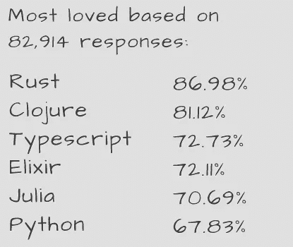
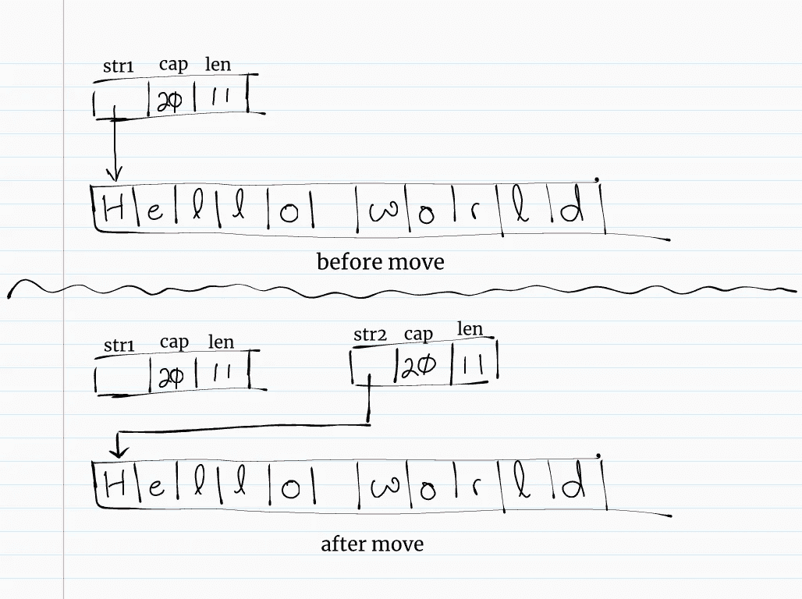

# Go 开发人员 Rust 所有权介绍—移动(第 1 部分)

> 原文：<https://itnext.io/an-introduction-to-rust-ownership-for-go-developers-moves-part-1-413450497d4d?source=collection_archive---------0----------------------->

ust 使用所有权系统来管理其内存使用。这种独特的内存管理特性允许 Rust 在没有内置运行时垃圾收集机制的情况下保证内存安全。在这个系列中，我想帮助有围棋经验的开发者更好地理解 Rust 所有权系统背后的核心概念。

# 关于铁锈

在 [StackOverflow 开发者调查](https://insights.stackoverflow.com/survey/2021#section-most-loved-dreaded-and-wanted-programming-scripting-and-markup-languages)中，Rust 连续第六年被评为最受欢迎的语言，这表明目前正在使用 Rust 的开发者会喜欢继续使用它。

【https://insights.stackoverflow.com/survey/2021 

开发者爱 Rust 的原因有[多种。关于 Rust，它不仅仅是关于我们*能*写的那种代码，也是关于我们*不能*写的那种代码。编译器在确保我们不会搬起石头砸自己的脚方面做了出色的工作，它实施了一套内存管理规则来消除](https://stackoverflow.blog/2020/06/05/why-the-developers-who-use-rust-love-it-so-much/)[内存错误](https://thenewstack.io/microsoft-rust-is-the-industrys-best-chance-at-safe-systems-programming/)，例如悬空指针、空指针取消引用、双重释放、未初始化的内存访问等。这些规则集合起来形成了 Rust 所有权系统。由于这些规则是在编译时由 Rust 的借用检查器评估的，因此它们不会对运行时性能造成任何影响。

这篇文章的其余部分将在变量赋值、函数参数、返回值、流控制、结构和集合的上下文中探索*移动*的概念。其他概念如*复制*、*借用*、*寿命*和*不安全*将是本系列未来的主题。

# 数据谱系关系

Rust 将已知的固定大小的数据存储在[堆栈](https://en.wikipedia.org/wiki/Stack-based_memory_allocation)中。当这些数据超出范围时，它们被弹出堆栈以释放底层内存。其大小在编译时未知并且在运行时可能改变的数据存储在[堆](https://en.wikipedia.org/wiki/Memory_management#Dynamic_memory_allocation)中。管理它们需要更多的工作，这就是所有权规则变得重要的地方。

引用[*Rust 编程语言*](https://doc.rust-lang.org/book/title-page.html) 的话，这些是构成 Rust 所有权模型本质的基础性规则:

> Rust 中的每个值都有一个称为其所有者的变量。一次只能有一个所有者。当所有者超出范围时，该值将被丢弃。

## 一个例子

让我们用一个例子来演示 Rust 所有权规则可以防止的一组问题。

下面的 Go 程序声明了一个由两个字符串字段、一个字符串片段和一个字符串到字符串的映射组成的`Service`结构。它通过将一个名为`svc`的变量赋给另一个名为`nginx`的变量来复制这个变量:

演示通过赋值进行复制的 Go 程序

在第 22 行的变量赋值之后，`nginx`的字段被更新。一些读者可能会感到惊讶，对`nginx`的`mappings`映射所做的修改会传播到`svc`的`mappings`，尽管对`namespace`字符串和`endpoints`片的修改不会:

对新变量的映射字段所做的修改会传播到原始变量

不管程序员对变量赋值的意图是什么，这都是因为`nginx`和`svc`共享底层的`mappings`映射。

在 Rust 中，这种副作用是不可能的，因为编译器确保`mappings`只有一个所有者。以下是用 Rust 编写的相同程序:

用 Rust 写的同样的程序

借项检查器在第 29 行失败，因为`svc`不再可用。在`svc`失效之前`svc`的所有数据所有权都转移到了`nginx`。对`nginx`的修改对`svc`没有影响。

由于使用了无效变量，借用检查器未能通过代码

# 只有一个所有者

让我们使用一个简单的变量赋值示例来探索“一个所有者”规则:

一种执行字符串变量赋值的 Go 程序

在 Go 中，字符串由`[reflect.StringHeader](https://pkg.go.dev/reflect#StringHeader)`结构表示，该结构有一个指向数据和数据长度的指针。当`str1`被赋值给`str2`时，Go 将`str1`的底层结构复制到`str2`。这导致`str1`和`str2`指向同一个`Data`(直到其中一个被赋予另一个字符串值):

Go 字符串表示为 reflect。字符串头结构

Rust 中的[字符串](https://doc.rust-lang.org/stable/std/string/struct.String.html#representation)也由一个结构表示，该结构由一个指向内部缓冲区的指针组成，该缓冲区存储实际的字符串数据、字符串内容的长度及其容量。内部缓冲区总是位于堆上。

执行字符串变量赋值的 Rust 程序

程序编译失败💀💀💀！

由于使用了无效变量，编译失败

编译失败是因为程序试图在*将*移动到`str2`后*借用*的值。本质上，Rust 通过将其指针、长度和容量复制到`str2`来对`str1`执行浅层复制，然后使`str1`无效，使其不可用。数据的所有权被转移到`str2`。

在数据的整个生命周期中，它只有一个所有者:先是`str1`，然后是`str2`。当`str2` 超出范围时，Rust 通过调用`[drop](https://doc.rust-lang.org/std/ops/trait.Drop.html)`函数释放数据一次(且只有一次)。在 Rust 中，这种所有权转移被称为*移动*。

一个所有者的规则

👷🏿*为了修复错误，从* `*println!*` *语句中删除* `*str1*` *。*

# 函数参数和返回值

所有权规则也适用于函数参数和返回值。下一个示例有一个带字符串参数的函数:

Go 编译器决定是将值存储在堆栈中还是堆中

Go 程序按预期打印出`hello`和`hello world`。Go 使用[转义分析](https://en.wikipedia.org/wiki/Escape_analysis)来检查`s`、`str`和`s + " world"`的值是否跨堆栈帧共享，以便确定这些值是否应该存储在堆上。

与此同时，Rust borrow 检查器使代码失败，因为它试图在将无效的`str`变量作为`s`移入`append_suffix()`函数后使用该变量:

向 Rust 函数传递参数会导致所有权转移

一旦一个值被移入一个函数，它就不能被再次使用

👷*要修复错误，从* `*println!*` *语句中删除* `*str*` *。*

人们可能会注意到，在`append_suffix()`函数的返回值中发现了另一个所有权转移。当函数退出时，`s + " world"`的所有权从函数中移出给调用者。

# 评估事项的顺序

下一个 Go 示例有一个返回字符串及其长度的`read()`函数:

具有多个返回值的 Go 函数

运行时，Go 程序输出预期的`some data`和`9`。

然而，Rust 程序无法编译，出现了同样的`borrow of moved value`错误:

Rust 函数返回一个字符串及其长度

所有权规则的评估顺序与语句相同

在这种情况下，在将`s`的所有权移出函数后，对`s.len()`进行评估。因此，编译失败。

👷‍♀️ *修复错误，将返回语句改为* `*(s.len(), s)*` *。*

# 条件句和循环

比较具有使用相同变量的`if/else`条件的下一个 Go 和 Rust 程序:

svc 变量用在“if”和“else”条件句中

svc 变量用在“if”和“else”条件句中

有人可能会认为 Rust 借用检查器会使 Rust 代码失败，因为在`if`和`else`条件中都使用了`svc`。有趣的是，这被证明是可以接受的，因为当程序运行时，`svc`只被移动了一次，在其中一个条件中:

程序运行时，变量只移动一次

然而，在`if/else` 条件之后使用`svc`是不允许的:

在 if/else 条件之后，svc 变量不可用

编译器捕捉到使用移动变量的尝试

同样，不允许在循环的后续迭代中重用移动的变量:

“信号”变量在循环中使用了多次

编译器捕捉到在循环中重用被移动的`signal`变量的尝试:

不允许在循环中重复使用移动的变量

👷🏿*为了修正错误，在下一次迭代之前给* `*signal*` *分配一个新值:*

每次移动后，信号变量都需要重新实例化

每次移动变量后重新给变量赋值不是很有效，而且会产生冗长、容易出错的代码。在下一篇文章中讨论的*借用*技术将使接收者能够使用价值而不要求对它们的所有权。

让我们看一些结构和集合中所有权转移的例子。

# 结构和集合

结构拥有它的字段。在下一个例子中，`svc2`结构被赋予与`svc1`相同的名称空间值:

用一个结构的字段实例化另一个结构

在不使用引用的情况下，Go 制作了`svc1`的精确副本，并将其分配给`svc2`。

用 Rust 编写的相同程序如下所示:

用一个结构的字段实例化另一个结构

Rust 在`svc1`上执行[部分移动](https://doc.rust-lang.org/rust-by-example/scope/move/partial_move.html)，使其在移动后不可用。借用检查器未能使代码确保结构始终对其字段拥有完全所有权。

不允许使用部分移动的结构

👷*要修复这个错误，调用* `*svc1.namespace*` *上的* `[*clone()*](https://doc.rust-lang.org/stable/std/string/struct.String.html#impl-Clone)` *方法。*

同样，像向量这样的集合拥有它们的元素。不允许将元素的所有权移出 vector。

下一个示例显示了如何通过 Go 中的索引来访问切片中的元素:

通过索引访问切片中的元素

Go 制作了一个`svcs[0]`的副本，并将其分配给`nginx`。

用 Rust 编写的相同程序如下所示:

通过索引访问向量中的元素

Rust 的程序编译失败，并显示一条错误消息`cannot move out of index`:

不允许通过索引将元素移出向量

通过索引禁止这些移动，借用检查器确保向量始终对其所有元素拥有完全所有权。

👷*要修复错误，使用* `[*remove()*](https://doc.rust-lang.org/std/vec/struct.Vec.html#method.remove)` *方法将元素移出矢量。*

让我们在上面的例子中添加一个`for`循环来探索消费迭代器。

当使用`for`循环迭代一个向量时，[默认行为](https://doc.rust-lang.org/std/iter/index.html#for-loops-and-intoiterator)使用`into_iter()`函数将向量转换为`[IntoIterator](https://doc.rust-lang.org/std/iter/trait.IntoIterator.html)`迭代器。这个迭代器通过将元素移出向量来消耗元素:

“for”循环隐式调用“into_iter()”函数

在`for`循环结束后，`svcs`向量不再可用。因此，程序在第 22 行编译失败:

当向量的所有元素都被 IntoIterator 迭代器消耗后，向量就不可用了

👷‍♀️ *为了修复错误，在 vector 上调用* `*iter()*` *函数来获得一个不可变的切片迭代器。*

咻，仅仅执行简单的变量赋值就感觉工作量很大😅。权衡的结果是，通过满足所有这些检查，程序员可以确保他们的程序不会出现前面描述的许多内存错误。

在下一篇文章中，我们将回顾一下*借用*的概念，它允许接收者使用值，而无需接管它们的所有权，也不会使原始所有者无效。

# 结论

这篇文章是关于 Rust 所有权系统系列文章的第一篇。它将一些围棋实例与 Rust 进行比较，以展示 Rust 所有权体系中的*棋步*的概念。

代码示例检查数据所有权转移如何影响变量赋值、函数参数、返回值、条件、循环、结构和集合的评估。

通过使用借用检查器在编译期间强制执行一组严格的所有权规则，Rust 保证所有编译的程序都不会出现在其他编程语言中无法检测到的内存错误。

下一篇文章将研究*借用*的概念，它可以用来编写代码，在变量之间安全地共享值，而不会使最初的所有者失效。

# 脚注

[1]代码示例故意保持简单，以便具有其他编程语言经验的读者也能从内容中受益。

[2]作用域的概念类似于其他编程语言中定义的概念。当数据进入范围时，它被认为是有效的。当超出范围时，它将变得无效和不可用。