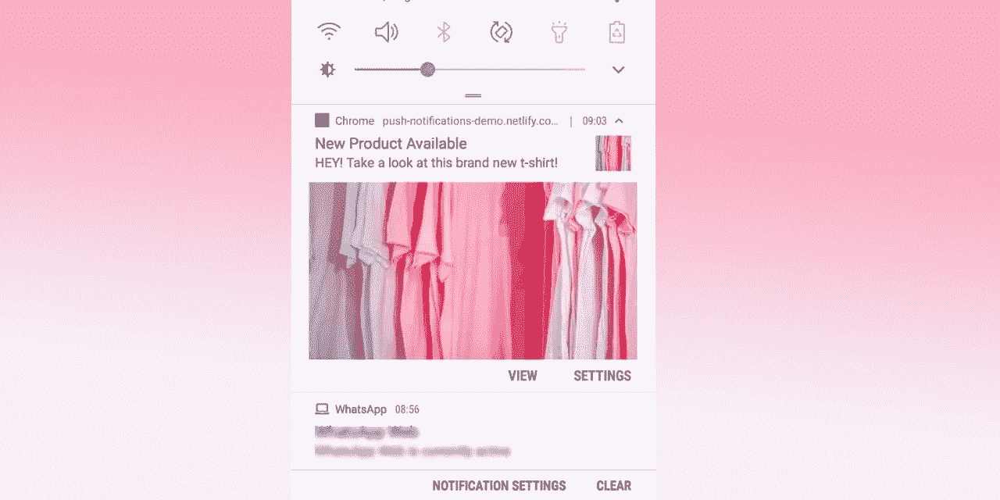
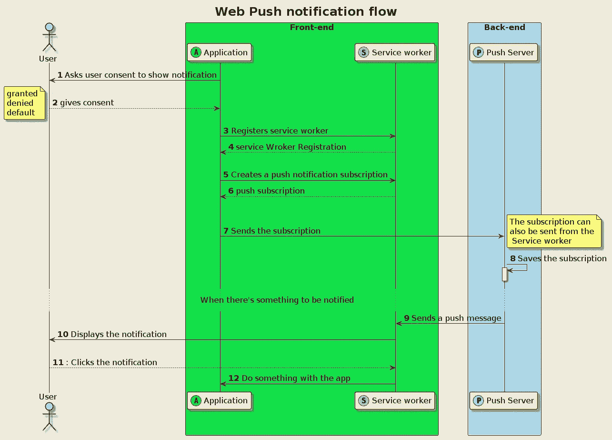
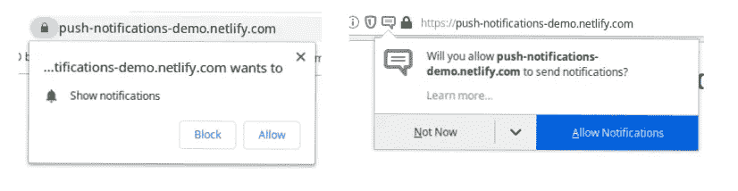
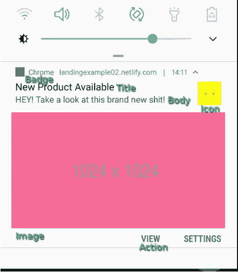

# JavaScript 中的推送通知？是的，你可以！

> 原文：<https://itnext.io/an-introduction-to-web-push-notifications-a701783917ce?source=collection_archive---------0----------------------->

## 开始使用 Web 推送通知。如何用 JavaScript 实现推送通知

## 有工作代码样本和简单的解释。



最后的结果

TLDR:你真差劲，你只是想要代码。

您可以在这里看到我们将要制作的现场演示:

[](https://push-notifications-demo.netlify.app/) [## 网络推送通知

### 询问用户许可这将创建一个必须发送到推送服务器创建通知的端点…

推送-通知-demo.netlify.app](https://push-notifications-demo.netlify.app/) 

您可以下载并在本地运行该演示，完整说明的源代码在这里:

[](https://github.com/Spyna/push-notification-demo) [## spyna/推送通知-演示

### 此时您不能执行该操作。您已使用另一个标签页或窗口登录。您已在另一个选项卡中注销，或者…

github.com](https://github.com/Spyna/push-notification-demo) 

你将揭开推送通知的秘密，准备好了吗？我们开始吧。

第一个事实:推送通知由两部分组成:

*   推送:从服务器向应用程序发送通知的行为。是的，你需要一台服务器😅。
*   通知:显示在智能手机状态栏或浏览器上的实际通知。

## 网络推送通知流程

网络推送通知是一个包含 4 个参与者的协议:

*   **用户**:希望接收通知的用户。
*   运行在用户代理(通常是浏览器)上的**应用**
*   **服务人员**:运行在浏览器上
*   **推送服务器**:向服务人员发送推送消息



推送通知实现流程

1.  当应用程序**要求用户同意**显示通知时，流程开始。



浏览器要求用户同意显示推送通知

2.一旦用户同意接收通知，应用程序就注册一个**服务工作者**(稍后我将解释什么是服务工作者)。

4.当应用接收到服务工作者注册时，它可以使用它来创建**推送通知订阅。**注册创建了一个端点，向其发送推送消息。

7.此时，应用向**推送服务器发送推送通知注册。**推送服务器需要订阅的端点来发送消息。

8.当推送服务器接收到推送订阅时，它保存它。

9.推送服务器向订阅的端点发送推送消息，接着，服务工作者接收到该消息，该服务工作者具有对**推送事件**的监听器。

10.服务人员向用户显示通知

11.当用户单击通知或通知操作(稍后您将看到是什么操作)时，服务工作器接收到该点击，因为它有一个对**通知点击事件的监听器。**

12.当服务人员接收到点击时，它可以对通知和通知数据做任何它想做的事情，比如显示网页、调用 API，或者任何你能想到的事情。

现在您已经知道了流程，是时候继续进行真正的实现了。

# 通知

## 询问用户许可

要发送通知，您需要请求用户的许可。未经用户同意，不能发送通知。用户可以:

*   什么都不做:`default`不会显示通知
*   Grant: `granted`将显示通知
*   拒绝:`denied`通知不会显示

## 什么是通知

通知是一个 JavaScript 对象，具有一些属性和方法:标题、数据、图标、图像等等。我们稍后将查看这些属性。

键入`new Notification()`是一个很好的起点。重击🤟！你完了。

让我们添加一个标题和一些选项，使它看起来更好。在这个链接，你可以看到选项的完整列表。

显示 web 通知的示例代码

上面的代码片段显示了一个*推送通知*，带有标题、文本、图像、动作和其他一些好东西。结果在您的智能手机上会是这样的:



这是生成的通知

正如您在代码示例(`navigator.serviceWorker.ready...`)中看到的，要显示这种通知，您需要使用一个**服务工作器** r

## 服务人员

根据 [Mdn](https://developer.mozilla.org/en-US/docs/Web/API/Service_Worker_API) :

> 服务工作者本质上充当代理服务器，位于 web 应用程序、浏览器和网络(如果可用的话)之间。

为了简单起见，我们可以说*服务工作者*是一个 JavaScript 文件，它在应用程序的后台以一个单独的线程运行。它可以与应用程序“对话”,必须注册，不能访问 dom，只能在 HTTPS 或本地主机下运行。

一旦你了解了服务人员的工作方式，他们就很容易了。

## 把东西放在一起

为了让推送通知发挥作用，我们将创建:

*   请求用户许可的 JavaScript 文件
*   管理通知的服务人员

让我们创建一个名为`push-notifications.js`的文件:

*   了解浏览器是否支持推送通知。
*   要求用户同意
*   注册一个*服务人员*，
*   使用服务人员显示通知

该脚本导出上述所有函数。要使用这些函数，我们可以使用这样的脚本:(这只是一个示例，我将在文章结尾分享完整的代码)

```
import {
 isPushNotificationSupported,
 sendNotification,
 initializePushNotifications,
 registerServiceWorker
} from "./push-notifications.js";const pushNotificationSuported = isPushNotificationSupported();if (pushNotificationSuported) {registerServiceWorker();
  initializePushNotifications().then(function(consent){
    if(consent === 'granted') {
     sendNotification();
    }
  });}
```

接下来，创建服务人员文件:`sw.js`。现在，它将是一个空文件。

# 推

如开头所述，您需要一个服务器来向用户发送通知。我们称它为**推送服务器**。

设想这样一个场景:一个电子商务网站想要在新产品发布时向用户发送通知。这些是必需的步骤:

*   服务人员创建推送通知**订阅**。
*   这个**订阅**为应用程序/服务工作者/用户创建了一个唯一的**端点**。这个端点是推送服务器将用来向其发送推送消息的端点。
*   应用程序将**端点**发送到**推送服务器**。
*   **推送服务器**保存用户的订阅。
*   当发布新产品时，**推送服务器**向保存的订阅端点发送推送消息/通知。
*   由应用程序注册的服务人员接收通知，并将其显示给用户。

## 创建推送通知订阅。

要创建推送通知订阅，您可以使用方法`serviceWorker.pushManager.subscribe()`(这里描述的[)来获取表示选项的参数。这些选项的属性是:](https://developer.mozilla.org/en-US/docs/Web/API/PushManager/subscribe)

*   userVisibleOnly:一个布尔值，指示返回的推送订阅将仅用于其效果对用户可见的消息。
*   applicationServerKey:一个 [ECDSA](https://en.wikipedia.org/wiki/Elliptic_Curve_Digital_Signature_Algorithm) (椭圆曲线数字签名算法)P-256 公钥，推送服务器将使用它来认证您的应用程序。不要担心，稍后我将向您展示如何创建它。

访问服务人员最安全的方法`navigator.serviceWorker.ready`返回一个解决*服务人员注册的承诺。当服务人员准备好的时候，这个承诺就兑现了。如果我们以其他方式访问服务人员，它可能没有准备好(可能*正在安装*，或者*正在等待*)。*

## 将订阅发送到服务器。

将订阅发送到服务器没有标准的方法，需要记住的重要事情是:

*   应用程序和推送服务器之间的通信必须是 ***安全的*** ，因为订阅信息是发送通知所需的信息。如果被盗可以用来代表应用程序发送不想要的通知。
*   如果可能，订阅应该与特定用户相关联，以便仅发送相关通知。

这可以通过简单的获取或应用程序的 HTTP 客户端(如果存在)来实现。要发送的对象是一个`[PushSubscription](https://developer.mozilla.org/en-US/docs/Web/API/PushSubscription)`。类似这样的东西

```
fetch(’push-server/user/{id}/push-subscription’, {
headers: { "content-type": "application/json;charset=UTF-8", "sec-fetch-mode": "cors" , <AUTH HEADERS>},
body: JSON.stringify(subscription),
method: "POST",
mode: "cors"
})
```

接收这个调用的推送服务器应该验证并保存请求，这个例子是用`express`和 NodeJS 在内存中的地图上保存订阅。在生产中，您希望更持久地保存订阅，如数据库。

```
function handlePushNotificationSubscription(req, res) {
  const subscriptionRequest = req.body;
  const susbscriptionId = createHash(JSON.stringify(subscriptionRequest));
  subscriptions[susbscriptionId] = subscriptionRequest;
  res.status(201).json({ id: susbscriptionId });
}app.post("/subscription", handlePushNotificationSubscription);
```

完整代码在这里:[https://github . com/Spyna/push-notification-demo/blob/master/back-end/src/subscription handler . js # L18](https://github.com/Spyna/push-notification-demo/blob/master/back-end/src/subscriptionHandler.js#L18)

## 发送推送通知

这是推送服务器的工作。有一些实现推送服务器的库和框架，我将向您展示一个用 JavaScript 和 NodeJS 制作的例子。下面的代码使用了一个名为 web-push 的库

```
const webpush = require("web-push");// **VAPID** keys should only be generated only once.
// const vapidKeys = webpush.generateVAPIDKeys();const vapidKeys = {
  privateKey: "bdSiNzUhUP6piAxLH-tW88zfBlWWveIx0dAsDO66aVU",
  publicKey: "BIN2Jc5Vmkmy-S3AUrcMlpKxJpLeVRAfu9WBqUbJ70SJOCWGCGXKY-Xzyh7HDr6KbRDGYHjqZ06OcS3BjD7uAm8"
};webpush.setVapidDetails("[example@yourdomain.org](mailto:example@yourdomain.org)", vapidKeys.publicKey, vapidKeys.privateKey);webpush.sendNotification(**pushSubscription**, "The text of the notification")
```

Vapid 的意思是*自愿的应用服务器标识*并且是这里记录的[web 标准。](https://tools.ietf.org/html/rfc8292)

VAPID 公钥是与 web 应用程序(发送通知订阅的那个)共享的公钥。

方法`sendNotification`接受两个参数:

*   *pushSubscription* :一个`PushSubscription` 对象，就是通过前面说的`serviceWorker.pushManager.subscribe()`方法从服务工作者那里得到的那个。
*   payload:推送通知的内容，必须是字符串或缓冲区。这个例子是一个简单的文本，但是它可以是更有趣的东西，比如关于要显示的通知的信息或者要调用的 API 的引用，简而言之，就是您希望在通知中包含的任何内容。

```
const payload = JSON.stringify({
        title: "New Product Available ",
        text: "HEY! Take a look at this brand new t-shirt!",
        image: "/images/jason-leung-HM6TMmevbZQ-unsplash.jpg",
        tag: "new-product",
        url: "/new-product-jason-leung-HM6TMmevbZQ-unsplash.html"
      });const payload = `/product/<product-id>`;
```

## 接收推送的通知

我之前说过，您需要服务人员来发送通知。算了吧！此时，推送消息由推送服务器发送。

您仍然需要一个服务人员来接收推送消息。您已经注册了一个服务人员，但是它没有任何作用。所以我们将添加一个监听器来接收`push`事件:

在这个脚本中，我们向服务工作器中的事件`push`添加了一个监听器。`event`是一个类型为 [PushMessageData](https://developer.mozilla.org/en-US/docs/Web/API/PushMessageData) 的对象，包含从推送服务器发送的数据，可以使用方法`event.data.text()`、`event.data.json()`或 blob()以字符串、对象和其他格式访问。

从通知事件中读取数据后，您可以显示通知。你前面称之为`serviceWorkerRegistration.showNotification`外役工的方法。在服务人员内部，您使用`self.registration.showNotification()`。

## 点击通知

通知可以是不言自明的，不需要任何动作，但是通常，我们希望当用户点击通知时发生一些事情。您需要为事件`notificationclick`在服务工作器中添加一个监听器

该代码片段是演示项目的一部分，完整代码可从[https://github . com/Spyna/push-notification-demo/blob/master/front-end/public/SW . js # L19](https://github.com/Spyna/push-notification-demo/blob/master/front-end/public/sw.js#L19)获得

在这段代码中，您添加了一个事件监听器，它读取`event.notification.data`属性，并对其进行处理。在这个例子中，数据是一个 URL(因为我们在前面的例子中将其创建为一个 URL)。接下来，我们在浏览器窗口中打开该 URL。当然，您可以做任何您想做的事情，处理通知的内容和服务人员。

例如，如果用户已经有一个通知，您可以避免添加另一个通知，而是使用类似`you have N messages to read`的东西修改现有的通知。

或者，如果您考虑通知中的这些操作:

```
self.registration.showNotification("Your friend has posted a video", {
  actions: [
   {action: 'like', title: 'Like'},
   {action: 'reply', title: ' Reply'}]
});
```

您可以基于动作类型做出不同的决定，这可以在事件的属性`action`中访问。

```
function handleNotification(event) {
  event.notification.close();
  if (event.action === 'like') {
   // silently like the video;
  }
  else if (event.action === 'reply') {
   // open the reply page  }
  else {
    // do something else
  }
}}self.addEventListener('notificationclick', handleNotificaiton);
```

## React.js 推送通知

如果您对 React.js 的推送通知感兴趣，请查看这篇文章。

[](/react-push-notifications-with-hooks-d293d36f4836) [## 反应推送通知(带挂钩)

### 推送通知如何工作以及如何做出反应

itnext.io](/react-push-notifications-with-hooks-d293d36f4836) 

## 要记住的高级主题

这是对网络推送通知的介绍。如果你读到这里，你应该是一个*推送通知冠军。*在开发管理通知的生产应用程序时，需要记住一些主题，其中包括:

*   处理*权限被拒绝*以显示来自用户的通知
*   更新或[取消](https://developer.mozilla.org/en-US/docs/Web/API/PushSubscription/unsubscribe)通知订阅。
*   当服务器推送通知时，客户端可能会离线…
*   通知负载加密

您可以在这里看到我们将要制作的现场演示:

[](https://push-notifications-demo.netlify.app/) [## 网络推送通知

### 询问用户许可这将创建一个必须发送到推送服务器创建通知的端点…

推送-通知-demo.netlify.app](https://push-notifications-demo.netlify.app/) 

您可以下载并在本地运行该演示，完整说明的源代码在这里:

[](https://github.com/Spyna/push-notification-demo) [## spyna/推送通知-演示

### 此时您不能执行该操作。您已使用另一个标签页或窗口登录。您已在另一个选项卡中注销，或者…

github.com](https://github.com/Spyna/push-notification-demo) 

## 参考

*   PushManager:[https://developer . Mozilla . org/en-US/docs/Web/API/PushManager](https://developer.mozilla.org/en-US/docs/Web/API/PushManager)
*   push subscription:[https://developer . Mozilla . org/en-US/docs/Web/API/push subscription](https://developer.mozilla.org/en-US/docs/Web/API/PushSubscription)
*   服务工作者:[https://developer . Mozilla . org/en-US/docs/Web/API/Service _ Worker _ API](https://developer.mozilla.org/en-US/docs/Web/API/Service_Worker_API)
*   索然无味:https://tools.ietf.org/html/rfc8292
*   网络推送协议:[https://tools.ietf.org/html/rfc8030](https://tools.ietf.org/html/rfc8030)
*   网页推送的消息加密:[https://tools.ietf.org/html/rfc8291](https://tools.ietf.org/html/rfc8291)

恭喜你！！😎你坚持到了最后。如果你喜欢👌这篇文章，点击下面按钮👏。这对我意义重大，也有助于其他人了解这个故事。

更多故事由[洛伦佐·斯皮纳](https://medium.com/u/dee217da30b7?source=post_page-----a701783917ce--------------------------------)

[](/an-oauth-2-0-introduction-for-beginners-6e386b19f7a9) [## 面向初学者的 OAuth 2.0 简介

### OAuth 2.0 如何工作以及如何选择正确的流程

itnext.io](/an-oauth-2-0-introduction-for-beginners-6e386b19f7a9) [](https://medium.com/@spyna/the-truth-about-amazon-job-interview-b940a2190585) [## 如何在亚马逊找到工作

### 我们听说了很多关于亚马逊招聘流程的故事，有些是真的，有些不是。我想分享我的…

medium.com](https://medium.com/@spyna/the-truth-about-amazon-job-interview-b940a2190585)