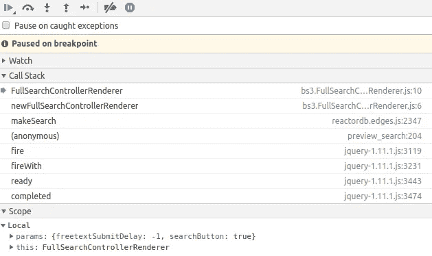

# JavaScript 的面向对象模式

> 原文：<https://itnext.io/an-object-oriented-pattern-for-javascript-54e80b9e8cc8?source=collection_archive---------1----------------------->


在图案中定向的对象

JavaScript 绝对不是传统的面向对象语言，不管它看起来有多像。它属于一种叫做“[原型](https://en.wikipedia.org/wiki/Prototype-based_programming)语言的类，在这种语言中只有对象，没有类，一个叫做“委托”的过程代替了 OO 程序员所理解的继承。

*(作为题外话，这类语言包括漂亮极简的*[*【Lua】*](https://www.lua.org/)*，如果你通过奇妙的*[*love 2d*](https://love2d.org/)*框架做过游戏编程，你可能会遇到过)。*

因此，来自传统面向对象背景的我们这些老家伙有时很难正确地思考这种语言。当我第一次开始为真正的浏览器编写 JavaScript 时(即不仅仅是为 HTML 添加一些装饰，而是适当的客户端软件开发)，我发现很难得到好的建议和例子来以一种我可以理解的方式组织我的代码，并让我在一个新的环境中获得我多年的 OO 经验。

我阅读了“ [JavaScript:好的部分](https://www.amazon.co.uk/JavaScript-Good-Parts-Douglas-Crockford/dp/0596517742)”，并获得了一些关于对象构造的提示，但有几种方法可以做到这一点，似乎没有一种方法是**的**方法，所有的方法都感觉很尴尬。经过大量的反复试验，我已经确定了一种编程模式，这种模式允许我以面向对象程序员非常熟悉的风格编写我的 JavaScript，同时仍然利用 JavaScript 在客户端为我们提供的所有好处。这篇文章概述了这种风格。

我意识到有很多方法可以达到类似的目标。当然，这是编程的本质。你可以使用[*Coffee Script*](https://coffeescript.org/)*或者其他* [*JavaScript 元语言*](https://github.com/jashkenas/coffeescript/wiki/list-of-languages-that-compile-to-js) *中的任何一种，或者你可以从其他角度用纯 JavaScript 来解决同样的问题。我在这里提出的绝不是唯一的方法，但如果它符合你的思维方式，可能对你有价值)。*

# 命名空间

如果您来自 Java 或 Python 之类的语言，您将习惯于可以从中导入特性的包或模块。JavaScript 并没有这个特性，但是我们可以模仿它，使用类似字典的结构来组织我们的代码。例如，假设我们想要定义一个名为`ooj`(面向对象的 JavaScript)的模块，并用对象和函数填充它，那么我们可以这样做:

```
var ooj = {
  MyObject : function() {}
  myFunction : function() {}
}
```

然后，您可以通过引用完整的名称空间或包路径:`ooj.MyObject`或`ooj.myFunction`来访问这个模块的元素。

# “类”和对象构造

JavaScript 有一个`new`关键字，它从一个函数构造一个新的对象。不过，提供一个函数作为构造函数来包装构造机制是很常见的。下面是一个简单的函数构造另一个对象的例子:

```
var ooj = {
  newMagicObject : function(params) {
    return new ooj.MagicObject(params)
  } MagicObject : function(params) {
    // object implementation
  }
}
```

要获得`MagicObject`的实例，我们只需要调用`ooj.newMagicObject()`。这使用`new`关键字和提供的`params`实例化了`MagicObject`。现在这看起来微不足道，但是不久我们将使构造函数更加复杂，这种分离将变得值得。

# **方法和属性**

一旦我们以这种方式定义了我们的对象和它们的构造，我们就可以用一种对开发人员非常友好的方式编写内部结构。

```
MagicObject : function(params) {
  this.passedParameter = params.passedParameter;
  this._internalAttribute = "internal attribute"; this.init = function() {
    // initialise this object
  } this.method = function() {
    // instance method
  } this.init();
}
```

我们简单地用`this`作为所有内部属性的前缀，在对象实例上设置它们。因为 JavaScript 不关心你给对象附加什么样的属性，所以我们可以把它用于属性和方法。在构造对象后，调用者可以使用所有这些属性:

```
var mo = ooj.newMagicObject({passedParameter: "hello"});
console.log(mo.passedParameter);
mo.method();
```

没有像 Java 中那样的 **public** 和 **private** 属性的概念，我采用了 Pythonic 式的方法，在内部的、本质上是私有的属性前面加上一个下划线，像`_internalAttribute`。

最后要注意的是，对象定义以调用`this.init()`结束。我决定在对象本身中包含特定于对象的初始化，而不是在构造函数中。这意味着构造函数可以非常纯粹和简单，并且不太了解对象的实际内部结构。代价是你要负责在对象定义的末尾调用任何初始化函数*。*

# 继承和对超级的调用

接下来，我们想添加一些继承的概念，在构造之前，我们通过将类的`prototype`指定给父类的*实例*来实现。当我们这样做的时候，父类上任何没有被子类覆盖的函数都会在调用子类时被执行。`this`的上下文和代码的整体行为将完全等同于传统的 OO 对象:

```
var ooj = {
  newBaiscObject : function(params) {
    return new ooj.BasicObject();
  },
  BasicObject : function(params) {
    // parent object
    this.basicFunction = function() {}
  } newMagicObject : function(params) {
    ooj.MagicObject.prototype = ooj.newBasicObject();
    return new ooj.MagicObject(params)
  }
  MagicObject : function(params) {
    // child object
    this.magicFunction = function() {}
  }
}
```

现在，当我们构造一个`newMagicObject`时，我们得到一个`MagicObject`，它的原型是`BasicObject`。这意味着我们可以做到:

```
var mo = ooj.newMagicObject()
mo.basicFunction()
```

注意`BasicObject`可以反过来定义它自己的原型，等等，只要你需要。这提供了一个任意深度的单一继承模型。

最后，我们需要引入在父对象上调用函数的概念。到目前为止，当子对象覆盖函数时，子对象完全屏蔽了父对象的行为。如果我们的`MagicObject`覆盖了上面的`basicFunction`，那么就不再可能访问`BasicObject`上的`basicFunction`的实现。

为了调用父对象的实现，我们需要能够向父对象的不同实例发送函数调用，但是使用正确的`this`值。我们将重构上面所做的，并引入一个处理对象构造的`instantiate`函数。在这个函数中，我们还将存储一个对父对象的构造函数的引用，这样我们以后可以再次使用它。

```
instantiate : function(clazz, params, protoConstructor) {
    if (params === undefined) { params = {} }
    if (protoConstructor) {
        clazz.prototype = protoConstructor(params);
    }
    var inst = new clazz(params);
    if (protoConstructor) {
        inst.__proto_constructor__ = protoConstructor;
    }
    return inst;
}
```

这将执行以下操作:

*   设置`params`(如果尚未设置)
*   构造原型并将其附加到未实例化的对象(我们现在认为它是一个“类”)
*   用关键字`new`构造新的对象
*   在新对象实例`__proto_constructor__`的自定义变量中附加对原型构造函数的引用。

现在我们可以稍微简化和改进我们的`ooj`库:

```
var ooj = {
  instantiate : function(...) { ... } newBaiscObject : function(params) {
    return ooj.instantiate(ooj.BasicObject, params)
  },
  BasicObject : function(params) {
    // parent object
  } newMagicObject : function(params) {
    return ooj.instantiate(ooj.MagicObject, 
                           params, 
                           ooj.newBasicObject)
  }
  MagicObject : function(params) {
    // child object
  }
}
```

当我们调用`newMagicObject`时，它将在属性`__proto_constructor__`中引用`ooj.newBasicObject`。

现在我们准备实现对父类的调用:

```
up : function(inst, fn, args) {
    var parent = inst.__proto_constructor__();
    parent[fn].apply(inst, args);
},
```

当我们想要调用原型上的任何函数时，我们必须实例化原型的一个新实例，通过`__proto_constructor__`中的函数，然后是`apply`中的参数。这确保了`this`仍然是对当前实例的引用，而不是对新实例的引用，所以应用到对象的任何更改都是对正确的对象进行的。

```
var ooj = {
  instantiate: function(...) { ... },
  up : function(...) { ... }, newBaiscObject : function(params) {
    return ooj.instantiate(ooj.BasicObject, params)
  },
  BasicObject : function(params) {
    this.basicFunction = function(args) {
      console.log("upped!")
    }
  } newMagicObject : function(params) {
    return ooj.instantiate(ooj.MagicObject, 
                           params, 
                           ooj.newBasicObject)
  }
  MagicObject : function(params) {
    this.basicFunction = function(args) {
      ooj.up(this, "basicFunction", args)
    }
  }
}
```

当我们在`MagicObject`上执行`basicFunction`时，它也会在`BasicObject`上执行`basicFunction`，并打印到控制台:

```
var mo = ooj.newMagicObject()
mo.basicFunction()>>> "upped!"
```

# 在上下文中调用对象方法

当你在处理程序性的代码时，所有这些面向对象的东西都很棒，但是 JavaScript 不是这样的。函数在异步上下文中被调用，如事件、AJAX 请求、定时执行(例如使用`setTimeout`)，或者作为任意进程中的回调。在这些情况下，我们如何在正确的上下文中调用特定对象实例上的特定方法呢？如果我们能够做到这一点，我们将发现自己拥有一种非常强大的方法，可以使用对象将应用程序状态保存在内存中，这些对象可以直接响应外部调用，从而使我们能够将页面元素与控制它们的对象直接关联起来。

实现这一点的方法是使用一个闭包，来保存对对象的引用以及事件被触发时要调用的方法。

我们应该讨论两种方法:

1.  实际处理事件的方法
2.  由任意外部进程使用指定参数调用的方法

第一个很简单:

```
eventClosure : function(obj, fn) {
    return function(event) {
        event.preventDefault();
        obj[fn](this);
    }
}
```

这在对象和函数名周围创建了一个闭包，然后当事件处理程序收集事件时，它可以将事件直接传递给对象。例如(使用 jQuery 进行事件绑定):

```
var ooj = {
  eventClosure : function(...) { ... } newMagicObject : function(params) { ... }
  MagicObject : function(params) {
    this.clickHandler = function(event) {
      // do stuff with the event itself
    }
  }
}var mo = ooj.newMagicObject();
$(".mylink").on("click", ooj.eventClosure(mo, "clickHandler"))
```

更普遍使用的第二个闭包要求我们更多地考虑如何处理参数。通常我们更喜欢在类似于`params`字典的对象中使用参数，但是异步过程(比如 AJAX 请求，或者第三方库中的回调)可能有自己的做事方式。这是一个创建闭包的函数，它为我们提供了几种智能处理参数的方法:

```
methodClosure : function(obj, fn, args) {
    return function() {
        if (args) {
            var params = {};
            for (var i = 0; i < args.length; i++) {
                if (arguments.length > i) {
                    params[args[i]] = arguments[i];
                }
            }
            obj[fn](params);
        } else {
            var theArgs = Array.prototype.slice.apply(arguments);
            obj[fn].apply(obj, theArgs);
        }
    }
}
```

首先看这个函数的后半部分，如果闭包没有给出一个`args`参数，这意味着我们将按原样传递来自调用者的参数。在这种情况下，我们只需利用函数中的`arguments`属性，将它们转换成数组，并在正确的上下文中将它们应用于对象上的函数。因此

```
methodClosure(this, "function")(arg1, arg2, arg3)
```

导致调用:

```
this.function(arg1, arg2, arg3)
```

但是，如果我们为闭包提供了`args`参数，那么调用者提供的参数将与参数值一一匹配，并转换成一个字典(忽略任何额外的参数)。所以:

```
methodClosure(this, "function", ["one", "two"])(arg1, arg2, arg3)
```

导致调用:

```
this.function({one: arg1, two: arg2})
```

现在我们可以创建闭包并将其传递给我们喜欢的任何流程:

```
var ooj = {
  methodClosure : function(...) { ... } newMagicObject : function(params) { ... }
  MagicObject : function(params) {
    this.doMagic = function(params) {
      console.log(params.abera);
      console.log(params.cadabera);
    }
  }
}var mo = ooj.newMagicObject();
var callback = ooj.methodClosure(mo, "doMagic", 
                                 ["abera", "cadabera"]);
someAsyncFunction(callback);
```

使用这种整体模式和少量支持代码，我们实现了以下目标:

*   一个干净的对象构造模式
*   支持调用父类的单一继承机制
*   以清晰一致的方式声明对象属性和方法的能力
*   一种将事件直接传递给对象的方式
*   一种通过适当的参数处理将任意异步/解耦请求传递给对象中特定方法的方式

此外，在后台有一个隐藏的要求，即这些对象应该在您的普通浏览器 JavaScript 控制台和调试器中表现良好。这种方法正是这样做的，当我们在断点上暂停时，您可以从调用堆栈中看到，您可以清楚地看到代码中的位置和对象类型:



暂停在断点上查看对象时调用堆栈

将来我会写一篇博文，提供一些真实世界的工作示例，让您感受到这种方法与良好的代码组织相结合的强大力量。

*理查德是* [*山寨实验室*](https://cottagelabs.com) *的创始人和高级合伙人，这是一家专注于数据生命周期所有方面的软件开发咨询公司。他偶尔会在推特上发*[*@ Richard _ d _ Jones*](https://twitter.com/richard_d_jones)