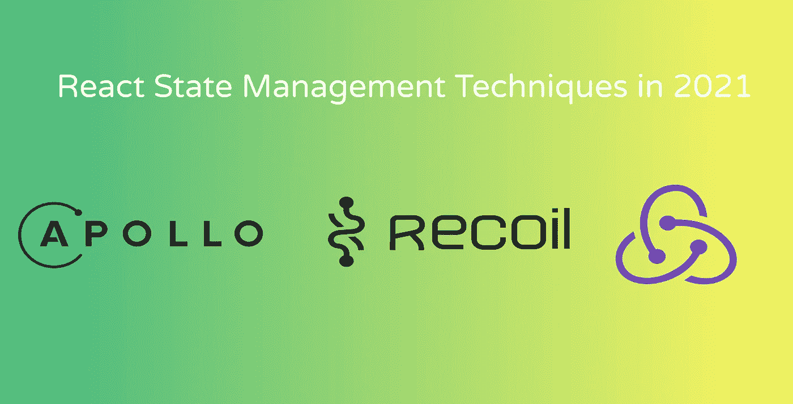
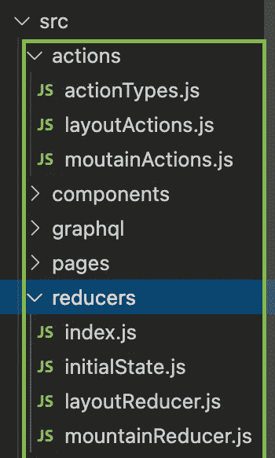

# 2021 ⚜️反应状态管理技术综述🌐

> 原文：<https://itnext.io/an-overview-of-react-state-management-techniques-in-2021-%EF%B8%8F-1590242b1cbc?source=collection_archive---------0----------------------->

当您有机会构建大型前端时，就需要在您的应用程序中存储全局状态。这可能是为了存储有关登录用户的数据，维护用户界面特定部分的元数据或来自服务的数据。随之而来的问题是，你如何实现这一点？

这篇文章旨在只涵盖其中的三个，[阿波罗的本地缓存](https://www.apollographql.com/docs/react/local-state/local-state-management/)，[反冲](https://recoiljs.org/)和 [Redux](https://redux.js.org/) 。我将以下面的方式介绍这三个工具:概述、代码遍历、思考。

如果我在 React 中构建一个大的前端 Web 应用程序，每个人都会得到一个评级来衡量我是否会将它添加到我的前端堆栈中。

所有这些实验都是从 [React Bleeding Edge kit](https://github.com/AmoDinho/react-bleeding-edge-kit) 生成的，这是一个包含电池的工具包，带有 [Apollo Client](https://www.apollographql.com/docs/react/) 、 [TailwindCSS](https://tailwindcss.com/) 和 [Reach Router](https://reach.tech/router) 置于 [Create React App (CRA)](https://github.com/facebookincubator/create-react-app) 之上，用于精英级别的生产力。

# **阿波罗本地缓存**

[链接到回购](https://github.com/Fullstack-Serverless-GraphQL/lunar-tour-react) || [链接到演示](http://lunar-tour-react.netlify.app/)

**概述**📡

如果您在 React 或 [Vue](http://Vue Apolloapollo.vuejs.org) 中使用 Apollo 客户端，您可以使用它的本地缓存进行状态管理。好处是您可以使用 GraphQL 来查询和改变您的数据。在下面的演练中，我使用了 Apollo 2，它要求使用本地解析器，但是，请记住它们已被否决。

你可能想知道为什么这个小丑般的作者要带你经历一些将被否决的东西？🤡简而言之，我不喜欢阿波罗的国家管理理论，但更多的是我对后来的🥲.的偏见然而，一定要看看阿波罗 3 号的最新实现，你也可以在上面观看劳拉·比阿特丽斯的演讲🍦。

**代码演练** 🖥️

要在 React 应用程序中设置 Apollo 的缓存，在`index.js`文件中，您首先要做的就是初始化您想要记录的状态:

全局状态通过使用`cache.writeData`函数存储在应用程序的缓存中。添加`__typename`字段是绝对必要的，以便 Apollo 知道您将查询和变更对象的哪一部分。如果我需要在额外的状态对象上存储更多的数据，我将需要创建它们并为每个字段指定那个`__typename`字段，这已经是一个很大的缺点。

接下来，我必须创建一个本地解析器文件，其变化如下:

我正在读取表单数据最新版本的缓存。如果`queryResult`不是未定义的，我可以通过从变异中读取参数并将其写入缓存来创建一个新的`formData`对象。

为了从缓存中读取数据，我们首先需要编写一个查询:

这个模式文档基本上是在客户端的`formData`对象中查询`email,customer and date`。您将需要在整个应用程序的其他组件中再次使用这一点。

接下来，我们需要创建一个突变来更新`formData`:

这接受一个`email,date and CustomerInput`。让我们来看看它的实际应用，我们有一个表单，允许用户添加一组客户作为对象:

该组件允许我们将多个客户添加到一个数组中，为了将数据存储到本地状态，我们首先运行查询来获取`customers,email and date`，同时运行变异来更新将在旅行中出现的客户。这样，当我们把用户带到下一个组件时，我们就有了商店的最新版本。

**想法**🤔

除了本地解析器之外，整个设置是不可预测的，当您可能最终在本地状态中存储一个超过 15 个字段的对象时，添加 GraphQL 的模式验证不会产生很好的效果。Apollo 3 旨在解决这一问题，然而实现似乎并不直接，如果你有一个大的应用程序，你需要将你的状态管理逻辑保存在不同的文件中，以便它是模块化的。所以作为一个 GraphQL 的粉丝，我很伤心的说我看不到使用它的价值。

> **评分:** ⭐

# **反冲**

[链接至回购](https://github.com/AmoDinho/recoil-state-management-demo) || [链接至演示](https://recoil-state-man-demo.netlify.app/)

**概述**📡

大约在 2020 年中期发布，目标是缓解一些与使用 React 内置状态管理工具相关的问题(至少在我看来是这样，🦧).

它的核心概念是围绕形成状态片段的原子和允许你改变状态的选择器。选择器利用了对象中的嵌套函数，这使得您能够使用钩子将状态读入组件，以及改变状态。它的目的是使状态管理过程简单，不像样板文件。

**代码演练** 🖥️

这个演示非常具有[一级方程式(F1)](https://www.formula1.com/) 主题。我甚至为我们使用了公共的 F1 API 来检查一些异步调用。我有一个名为`atoms.js`的文件，其中包含了我试图跟踪的所有状态:

你需要初始化状态的方式是非常简单的，以对象的形式，关键是要注意，因为这是你如何在你的应用程序的不同部分引用这个状态。还有一个默认键，用于通过指定其类型(对象、字符串、数组等)来添加默认状态。在我的例子中，我跟踪的`driverState`是一个数组，`circuitState`也是一个电路数组，还有一个对象中的`singleDriverState`来存储关于一个驱动程序的所有信息。

我觉得在从州政府那里阅读的时候，在`index`页面上显示所有的车手是一个快速的胜利:

使用`useRecoilValue()`钩子，你可以通过将状态作为参数传递给钩子来轻松地引用你已经初始化为原子的状态，就像我用`driverState`所做的那样。

接下来，我们有一个异步的例子，这是许多应用程序的常见需求。想象一下，你想获得一个用户当月的银行交易，并允许应用程序的不同部分访问它。您可以像这样在您的选择器中使用`selectorFamily()` util:

在我的例子中，我想获得关于一个司机的信息，但要做到这一点，我需要他们的名字。属性让这个选择器意识到我们正在处理的是`driver`原子。而`get()`键允许我们实际调用一个异步函数来获取驱动程序的细节。`set`键是一个现在允许我们将关于驱动程序的数据存储到`driver`原子中的函数。

**想法**🤔

总的来说，后座力很好，很灵活。当然，这是一个现代的 React 库，它是基于钩子的，有一个很好的干净的 API 和文档，使得实现起来非常简单。它不能得到 5 的唯一原因是因为我不得不过度加热我的大脑来彻底仔细地考虑选择器。🎭

> **评分** : ⭐⭐⭐⭐

# **Redux**

[链接到回购](https://github.com/AmoDinho/redux-toolkit-state-management-demo) || [链接到演示](https://redux-toolkit-state-management-demo.netlify.app/)

**概述**

最后但同样重要的是，我们有 react 社区的宠儿， [Redux](https://redux.js.org/) ！最初是为了防止钻柱问题。Redux 基于一种流动模式工作，通过这种模式，您可以设置一个初始状态，该状态与一组帮助应用程序减少其状态的操作相关联。有不同的方法来编写 Redux 应用程序，可以是*样板文件*，幸运的是，在掌握了如何以模块方式使用 Redux 文件和函数后，我发现了 [Redux 工具包](https://redux-toolkit.js.org/)。

**代码演练**

我通常这样构建我的 Redux 应用程序:

相当臃肿，在看到任何结果之前，您需要在几个文件中进行更改。这是适得其反，也是不必要的[脑舞](https://www.gamebyte.com/wp-content/uploads/2021/01/cyberpunk-apology-meme.jpg)。

幸运的是，有一个叫做 Redux Toolkit 的东西，它采用了与反冲相同的架构原则。您只需要制作一个切片，它可以被称为状态的一部分。在本例中，我制作了一个布局切片，以便能够更改每条路线的页眉:

`layout`是我用来跟踪`pageHeader`字符串的州名。它被赋予一个缺省值**页面。** 我有一个名为`setPageHeader`的 reducer 来设置`pageHeader`的值，刚才详细介绍了如何将 reducer 导出到它们的文件中。

现在是减压器！在一份名为`layoutReducer`的文件中:

我简单地导出了一个名为`setNewTitle`的函数，该函数在全局状态下将`payload`赋回给`pageHeader`。

我们现在可以用一个`useSelector`钩子来使用全局`App`组件中的状态:

改变`pageHeader`标题的一种方法是使用`useEffect`钩子:

通过使用`useDispatch`钩子，我们能够使用我们在`dispatch`函数中导出的`setPageHeader`动作。这比创建`mapDispatchToProps`和`mapStateToProps`函数要简洁得多。

同样，我在状态中初始化了一个`mountains`数组，并能够通过应用程序中的一个表单像这样调度它们:

减速器看起来像这样:

**想法**🤔

与我在知道 Redux Toolkit 之前编写 Redux 的方式相比，这是非常棒和干净的。随着应用程序的增长，它可以很容易地被很好地抽象出来。

> **评分:** ⭐⭐⭐⭐

总的来说，我非常喜欢知道如何正确地设计前端，因为如果状态管理设置得不好，这可能会很痛苦。反冲和 Redux 工具包将肯定使人们能够确保状态管理层是清晰和模块化的。

概括一下，这里有各种回购的链接🔌：

**阿波罗**

[链接到回购](https://github.com/Fullstack-Serverless-GraphQL/lunar-tour-react) || [链接到演示](https://lunar-tour-react.netlify.app/)

**反冲**

[链接到回购](https://github.com/AmoDinho/recoil-state-management-demo) || [链接到演示](https://recoil-state-man-demo.netlify.app/)

**Redux**

RTK : [链接到回购](https://github.com/AmoDinho/redux-toolkit-state-management-demo) || [链接到演示](https://redux-toolkit-state-management-demo.netlify.app/)

简单重复:[链接到回购](https://github.com/AmoDinho/redux-state-management-demo)

**演职员表** 🦠

[阿波罗的国家管理范例](https://github.com/apollographql/ac3-state-management-examples)

*感谢* [*本*](https://za.linkedin.com/in/benjanecke) *阅读此稿。* 🧙‍♂️