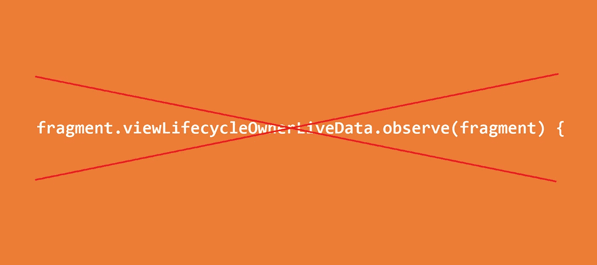

# FragmentViewBindingDelegate 的更新:我们从 AutoClearedValue 继承的错误

> 原文：<https://itnext.io/an-update-to-the-fragmentviewbindingdelegate-the-bug-weve-inherited-from-autoclearedvalue-7fc0a89fcae1?source=collection_archive---------2----------------------->

Jetpack 生命周期非常强大。我们可以提取逻辑，并使其具有生命周期意识。事实上，这让我们在之前的文章中简化了视图绑定，使之成为一行。

然而，我需要提供一个快速的提示:事情并不像看上去的那样。

提供的要点和代码片段假设[自动清除值](https://github.com/android/architecture-components-samples/blob/7466ae2015bb9bd9cf2c435a350070b29d71fd2b/GithubBrowserSample/app/src/main/java/com/android/example/github/util/AutoClearedValue.kt)中的代码总是正确的。在这篇文章中，我将告诉你如何打破它。

# 原始来源

AutoClearedValue 背后的一般思想是，这个委托隐藏的值只有在设置时才会被创建(在我们的例子中，当它被访问时)，当`viewLifecycleOwner`变成`DESTROYED`时，它会将该值置空。有道理，对吧？

为了访问视图生命周期，代码一直等到`Fragment.onCreate()`，并在那里注册生命周期观察者。

然后，使用片段作为生命周期所有者(！)，它试图在视图生命周期所有者上注册一个生命周期观察者。

# 隐藏在众目睽睽之下的臭虫

问题是视图生命周期有可能以这样一种方式初始化，即`fragment.onStart()`和`viewLifecycleOwner.lifecycle.addObserver` 实际上从未发生。片段直接从`onViewCreated`到`onDestroyView`。

意思，`fragment.onStart()`和`fragment.onStop()`永远不会发生。

这意味着`fragment.viewLifecycleOwner.observe(fragment)`永远不会是`ACTIVE`，因此`observe`块永远不会被调用。viewLifecycle 到达`DESTROYED`而没有被观察到。

# 这是什么时候发生的？

如果一个片段被添加了`commitNow()`，但随后被`detach()`编辑。这意味着这可能发生在`FragmentPagerAdapter`上，因为它也使用了引擎盖下的`attach/detach`。

在我的例子中，bug 是在使用绑定和下面的构造时出现的:

使用附加/分离创建添加了片段的底部导航视图

在底部导航视图的情况下，添加了片段，但是附加/分离了,`binding`变量中的视图可能被卡住:因为它从未被清除。

上面的代码应该已经开箱即用了，但显然它达到了一个相当不寻常的场景:一个片段立即破坏了它的视图，甚至没有到达`onStart()`和`onStop()`。

# 怎么修？

由于问题是由使用`fragment`作为生命周期所有者以观察`viewLifecycleOwnerLiveData`引起的(由于视图生命周期所有者可以到达`DESTROYED`而`fragment`不会到达`STARTED`)，解决方案是不使用片段作为生命周期所有者。

相反，使用`observeForever`跳过了由生命周期所有者激活 LiveData 的需要。

如果您正在使用绑定，您可能需要相应地更新您的绑定。

# 结论

虽然 Jetpack 生命周期本身看起来可靠而强大，但它的一些移动元素之间的交互——在本例中是片段生命周期和片段视图生命周期——可能会导致令人惊讶的结果。

当视图生命周期变得与片段生命周期相同时，这方面的错误空间很有可能会减少，并且只需要担心一个生命周期——尽管这是一个关于何时会发生的好问题(片段 1.4.0？)，以及它还会有什么其他的影响(导航的时候会需要`addToBackStack()`让一个`viewModelStore`活着吗？会如何改变`setMaxLifecycle(CREATED)`的行为？)

不管怎样，这是一个任何依赖 AutoClearedValue 行为的人都会继承的错误。

在某种程度上，这是一个有趣的洞察，就像一个活动可以直接从`onCreate`到`onDestroy`一样，片段也可以直接从`onViewCreated`到`onDestroyView`。

*你可以在*[*/r/Android dev*](https://www.reddit.com/r/androiddev/comments/l3oon4/an_update_to_the_fragmentviewbindingdelegate_the/)*查看讨论线程。*