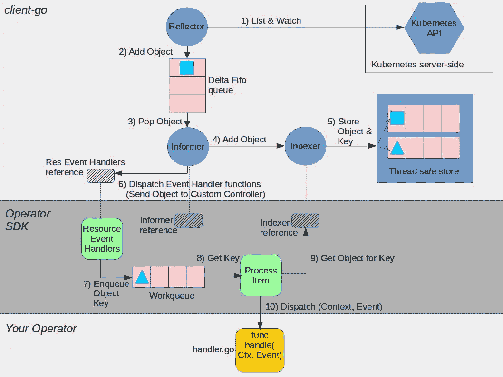
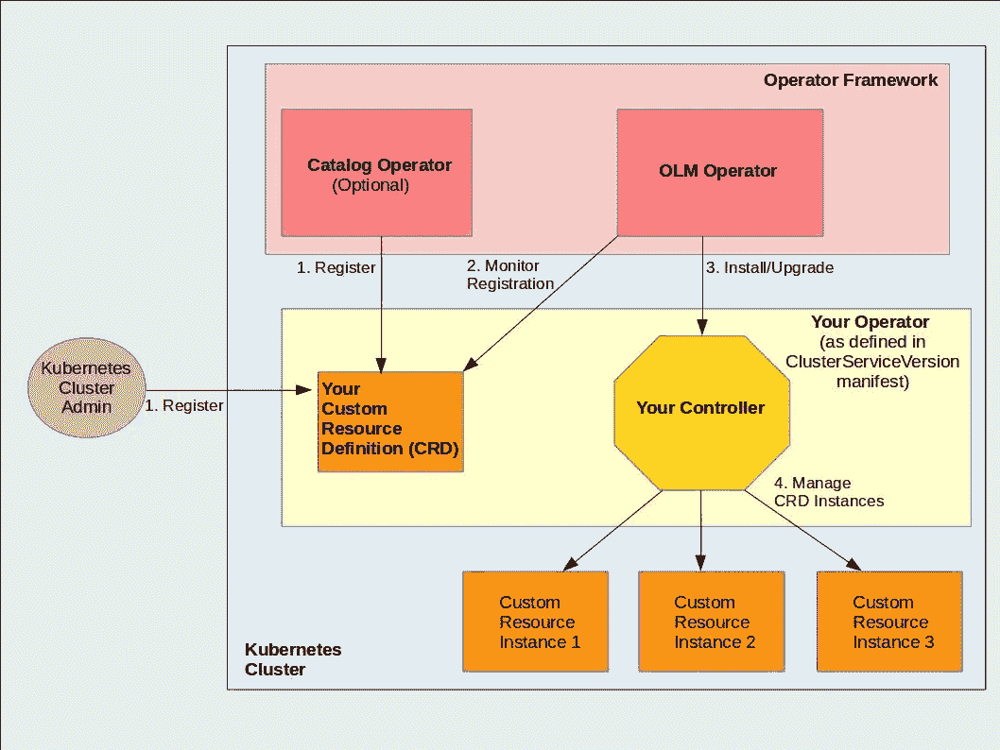

# Kubernetes 社区运营商框架的价值分析

> 原文：<https://itnext.io/analyzing-value-of-operator-framework-for-kubernetes-community-5a65abc259ec?source=collection_archive---------3----------------------->

这篇文章分析了运营商框架对 Kubernetes 社区的潜在价值。Operator Framework 是一个开源项目[，上周在 KubeCon](https://coreos.com/blog/introducing-operator-framework) 发布。

CoreOS 在 2016 年 11 月引入了术语 [Kubernetes 运营商](https://coreos.com/blog/introducing-operators.html)。操作者是特定于应用程序的控制器，它扩展 Kubernetes 来创建、配置和管理复杂应用程序的实例。“Kubernetes 操作员”不是 Kubernetes 本地术语；它主要代表两个本地 Kubernetes 术语的组合:1) Kubernetes CRD(自定义资源定义)和 2)管理 CRD/s 的 Kubernetes 控制器。Operator 术语已被社区广泛接受，在“Kubernetes Operator”上进行简单的 Github 搜索会得到 186 个存储库结果。针对 etcd、Prometheus、Postgres、Elasticsearch、Kafka、Redis、Spark 等各种平台元素编写了运算符。

[运营商框架](https://github.com/operator-framework)旨在简化运营商的建设和管理。它目前包括两个组件:

*   **Operator SDK** :允许开发者构建操作符
*   **操作员生命周期管理**:监督操作员的生命周期，例如安装、更新等。

公告提到，很快将添加一个用于运营商计量的附加组件，以支持使用情况报告。

# 运营商 SDK 分析

我们看到运营商 SDK 的以下两个好处。

1)在开发操作符时，需要较少的代码来开始。我们对使用[手动方法创建 code 操作符代码](https://github.com/cloud-ark/kubeplus/issues/14)和使用操作符 SDK 时所需的步骤数进行了快速比较。这两种方法的共同步骤是创建 CRD 类型定义和编写操作符的协调逻辑(控制循环)。然而，手动方法的其他步骤，例如创建所需的目录结构、定义注册和 doc 文件，都是由 SDK 自动完成的。

2)抽象 client-go 库的细节——您的操作员代码、操作员 SDK 和 client-go 库之间的关系如下图所示。

Operator SDK 和您的操作员交互

Operator SDK 及其抽象接口(一个回调函数，以上下文和事件作为提供的参数)隐藏了您必须知道的细节，例如[工作队列、索引器、通知器、对象键](https://medium.com/@cloudark/kubernetes-custom-controllers-b6c7d0668fdf)。

我们认为 SDK 主要关心的是运营商开发人员只使用抽象接口是否足够；或者在开发和调试他们的操作符代码时，对 client-go 库及其语义有一个基本的了解将是有益的。

# 运营商生命周期管理器(OLM)分析

如今，运营商的生命周期管理可以使用 kubectl 或 Helm 来完成。应用本身的生命周期管理是运营商控制器逻辑的一部分。

操作符框架引入了两个元操作符(OLM 操作符和目录操作符)和一个定制资源(ClusterServiceVersion ),用于定制操作符的生命周期管理。ClusterServiceVersion 本质上是一个清单定义，Kubernetes 管理员应该使用它来定义操作符的组成。它包括诸如操作者应该如何部署、操作者正在管理什么定制资源类型、操作者将使用什么本地 Kubernetes 资源等等。对于给定的操作员，OLM 要求该操作员管理的自定义资源类型已经在集群中注册。可以使用 Catalog 操作符或由 Kubernetes 管理员手动注册这些类型。只有在满足此要求后，OLM 才会实例化您的操作员。这些步骤如下图所示。

运营商生命周期经理

似乎使用操作符框架的主要优点是 OLM 可以将您的操作符无缝升级到新版本。运营商升级面临的挑战之一是，如何处理由以前版本的运营商管理的定制资源实例。有可能，您可以编写新的操作符，使它知道以前的版本并获得那些实例的所有权。但是这不是一个可扩展的方法，因为每次升级都需要编写定制的逻辑(v→v+1)。[根据文档](https://github.com/operator-framework/operator-lifecycle-manager/blob/master/Documentation/design/philosopy.md)，OLM 解决了这个问题。它知道这两个版本，并且可以更新每个定制资源实例的所有权信息，以指向操作符的新版本。

总的来说，Operator 框架是一个受欢迎的贡献，因为它似乎解决了 Operator 开发者和 Kubernetes 集群管理员的紧迫问题。

# 运营商的终端用户呢？

操作员框架似乎针对两种类型的角色。SDK 面向运营商开发人员，OLM 面向 Kubernetes 集群管理员。但是最终用户呢？

我们认为，这一领域真正缺少的是如何提高运营商对最终用户的可消费性。他们是应用程序开发人员，使用 Operators/CRD 作为平台元素，在 Kubernetes 上构建他们的应用程序平台。如今，一个典型的应用平台可以由多个运营商组成，如 Prometheus、Postgres、Nginx、Fluentd 等。在这种情况下，确实需要通过回答以下问题来提高运营商最终用户体验的一致性:最终用户如何了解新 CRD 提供的功能，为他们提供了哪些旋钮来定制运营商管理的应用，他们如何诊断运营商管理的应用中的任何问题。

[www.cloudark.io](https://cloudark.io/)