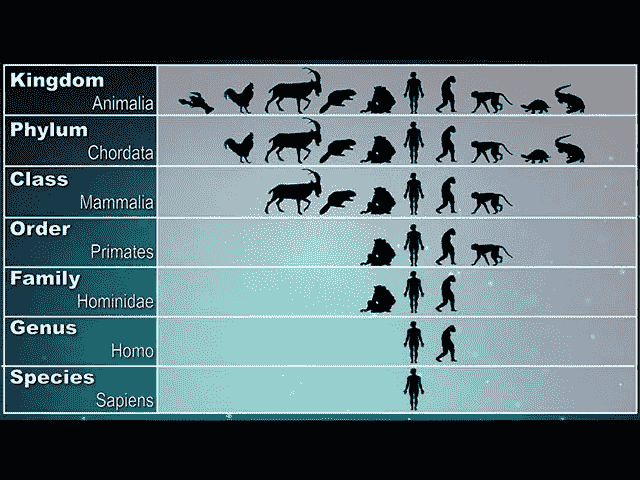
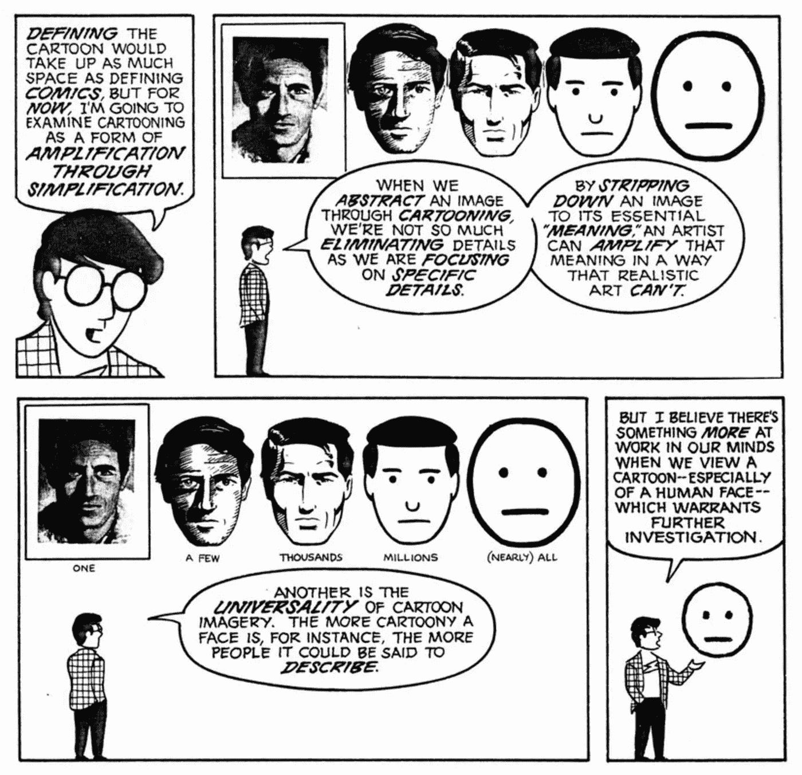

# …以及命名事物；顺风 CSS，打字稿和哺乳动物

> 原文：<https://itnext.io/and-naming-things-tailwind-css-typescript-and-mammals-9eab459633d2?source=collection_archive---------1----------------------->

顺风社现在很火。有点争议，但我想这只会让它更热。我自己也是一个粉丝，我认为预定义的大小提供了必要的粒度，但仅此而已。这有点像从在白纸上绘制图表到网格纸。此外，我真的很喜欢不必在 js 和 css 文件之间来回切换。

虽然这些都很棒，但我认为我真正的效率提升来自于不用想名字。如果你不知道的话，Tailwind CSS 使用了*实用类:*定义了一个样式方面的小类。所以代替这个的是:

`
...`

你写了这样的东西:

`
...`

这更类似于显式编写`style`属性。

如果这是你第一次看到这种情况，你可能会有一些意料之中的反对意见。我不会在这里讨论这些，我建议你从亚当的精彩博文[开始。](https://adamwathan.me/css-utility-classes-and-separation-of-concerns/)

语义类在某种程度上是令人愉快的，尤其是当你想出一个非常棒的名字时。然而反过来，当一个名字太宽或太窄或在其他方面不合适时，我的强迫症会很困扰。问题是，你经常需要为没有任何语义的事物创建类。我做了多少奇怪的*包装器*和*容器*只是为了在某处添加一个左边距？

当我使用 typescripts awesome 联合类型创建一个采用`table | view`参数的函数时，我意识到我在 Typescript 中有类似的经历。(数据库中的)表和视图非常相似，但不完全相似，虽然我确信有一个完美的词来描述这种结合，但我不必去搜索它。我认为这大大提高了我编写非类型化代码的速度，我猜结构类型化比名义类型化更好。*人名略少*！

设计软件系统在很大程度上就是建立分类法。你知道，就像生物学一样。灵长类动物是一种更特殊的哺乳动物。

[https://monkeysee.com/what-is-taxonomy/](https://monkeysee.com/what-is-taxonomy/)

这是智力上的挑战，通常也是很有益的。但是这是很费时间的工作！这也是那种会让我的大脑陷入僵局的事情，因为我知道这个词就在某个地方，我只需要找到它。除此之外，像我这样的非英语母语者还需要额外的往返，他们可能需要反复检查我们是否正确掌握了单词。

当然，所有优秀的开发人员都是懒惰的，但是这种架构性的东西有一个有害的组合，那就是善良、重要，同时压力小但不无聊。这使得它成为一个完美的拖延活动。

有时候，最好不要去那里。是的，在 Tailwind 中使用所有这些实用程序类是丑陋且重复的。没干！确实如此。但是在代码中引入的每一层间接性，都是一种权衡。一次改变所有实例变得更容易，但另一方面，做出改变变得更难。你有多少次不得不一次改变所有按钮的颜色？我的意思是，你没有做一个完整的用户界面重新设计，使所有这些类过时吗？就我个人而言，我还没有经历过。

当您引入新的抽象时，类似的模式也会发生。它不仅可以帮助你摆脱重复，在最好的情况下，它可以描述你正在解决的问题，就像一个启示。但它很可能引发人们对未来的思考。

来自斯科特·麦克劳德:理解漫画

引入一个你需要提出的、你的团队需要理解和记住的新术语是一种认知开销，必须在成本/收益分析中加以考虑。往往是值得的，但不是免费的。这甚至还没有触及到你最终得到错误抽象的情况，这可能*非常*昂贵——比一点复制要贵得多！