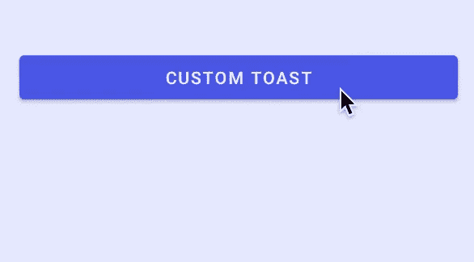
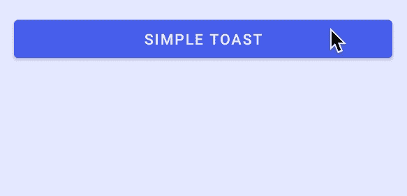
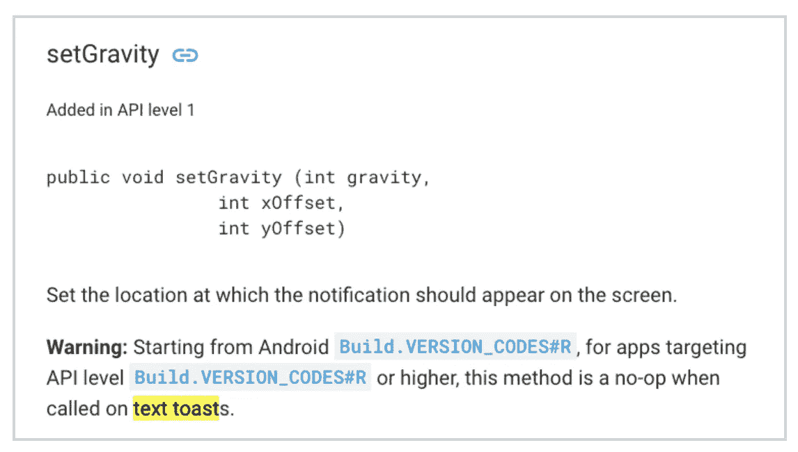
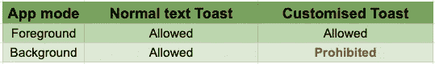
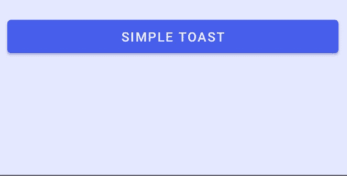
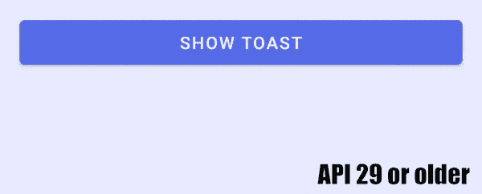
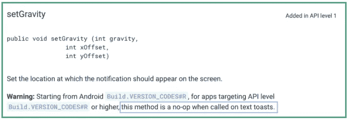
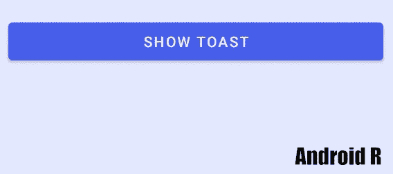
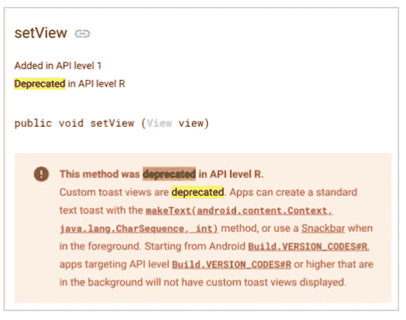

# Android 11 吐司更新

> 原文：<https://itnext.io/android-11-toast-updates-7f1cd2245bc4?source=collection_archive---------1----------------------->

## 这个帖子会在新的 Android 11 预览版发布时持续更新！

ndroid 11 (R)是 2020 年的下一代 Android，谷歌在 4 月初发布了 Android 11 预览版 2.1，供开发者审查。有很多变化，其中一个变化引起了我的注意——新的`Toast`行为和对定制的限制。

在 Android 11 (R)中，Google 在`Toast`上实现了以下变化，本文将详细讨论这些变化:

1.  禁止背景定制吐司(见封面照片)
2.  “文本吐司”不允许定制
3.  已弃用的函数— `setView()`
4.  新增回拨— `Toast.Callback`

你可以从我的另一篇文章中了解更多关于在以前的 API 等级中定制`Toast`的信息:

 [## 安卓定制吐司

### 除了简单地显示信息，Toast 还有更多功能。自定义布局、重力、偏移量、双向边距…

itnext.io](/android-custom-toast-37f97aa373c3) 

# 烤面包介绍

带有简单信息的简单吐司插图

`Toast`是一个浮动在所有应用之上的简单小工具。它通常用于向用户显示简单的消息，例如网络错误消息。有一个优雅的淡入淡出动画来显示和隐藏一个`Toast`。

有两种不同的`Toast`可以被构造。其中一个是由`Toast(context: Context)`构造的“简单的祝酒词”,另一个是由静态方法`Toast(context: Context, text: CharSequence, duration: Int)`构造的“文本祝酒词”。[官方文档](https://developer.android.com/reference/android/widget/Toast#setGravity(int,%20int,%20int))中陈述的 Android R 的警告仅影响由后一种方法构建的`Toast`，而不是由第一种方法构建的。在阅读以下部分之前，我们必须明确区分它们。

Android R 的警告只对文本吐司有影响。

# Android 11 (API 30)的变化

## 1.禁止后台自定义吐司

更新了不同应用模式下不同吐司类型的状态

app 在后台时`Toast`自定义**无法显示**。取而代之的是显示消息“T19 背景自定义吐司被阻止用于包[包名]见 g.co/dev/toast.”的`Toast`。

应用程序在后台时定制吐司的图示

另一方面，普通文本 toast 仍然可以照常工作:

应用程序在后台时的文本吐司插图

## 2.文本吐司不允许定制

API 29 或更早版本中自定义文本吐司的图示

在 Android R 之前，simple `Toast`和 text `Toast`都可以定制边距，gravity 可以定制偏移量。然而，从 Android R 开始，文本`Toast`不能再用这些参数进行设置，因为 setter 函数已经变成了无操作函数，也就是说，一个函数可以被调用但不做任何事情。`setGravity` [官方文档](https://developer.android.com/reference/android/widget/Toast#setGravity(int,%20int,%20int))截图见下图。

来自此[链接](https://developer.android.com/reference/android/widget/Toast#setGravity(int,%20int,%20int))的 setGravity 文档截图

然而，这个新的实现只适用于文本`Toast`。换句话说，由`Toast(context: Context)`构造的简单`Toast`仍然可以定制边距和带偏移的重力。请参见下面的插图:

Android R 上自定义简单吐司的插图

## 3.已弃用的函数— setView()

[setView()](https://developer.android.com/reference/android/widget/Toast#setView(android.view.View)) 官方文档显示该功能在 Android R 中已被弃用

虽然它仍然允许通过`setView(view: View)`自定义`Toast`视图，但它实际上是 Android R 中不赞成使用的功能。

“**弃用**”表示该功能目前仍可使用，但可能会在未来的 Android 版本中被移除。建议开发人员避免在长期开发中使用该函数。

## 4.新增回拨— `Toast.Callback`

添加了一个新的回调函数(`Toast.Callback`)来通知`Toast`何时显示和隐藏。它可以通过以下方式轻松添加到`Toast`:

# 摘要

1.  谷歌已经弃用了`setView(view: View)`功能，并暗示以后不再设置定制视图(布局)。
2.  `Toast`可分为两种——“简单吐司”和“文字吐司”。
3.  在 Android R 中，当 app 在后台时，自定义`Toast` **无法显示**，而是显示警告`Toast`。文本 toast 在这种情况下不受限制。
4.  用于设置文本 toast 的偏移量和边距的函数现在是无操作函数，它什么也不做，但可以调用。
5.  当`Toast`显示和隐藏时，新的回调(`Toast.Callback`)用于通知应用程序。

# 参考和进一步阅读

1.  [安卓官方吐司概述](https://developer.android.com/guide/topics/ui/notifiers/toasts)
2.  [安卓官方吐司文档](https://developer.android.com/reference/android/widget/Toast)
3.  安卓定制吐司(我的另一个中帖)

 [## 安卓定制吐司

### 除了简单地显示信息，Toast 还有更多功能。自定义布局、重力、偏移量、双向边距…

itnext.io](/android-custom-toast-37f97aa373c3) 

欢迎关注我的[Twitter @ myrik _ chow](https://twitter.com/myrick_chow)了解更多信息。感谢您阅读这篇文章。祝您愉快！😄