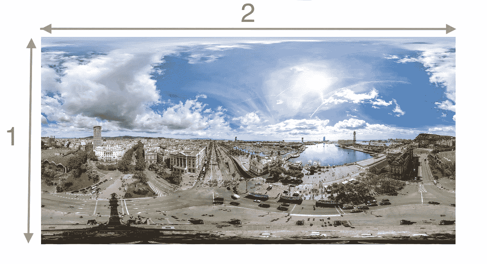
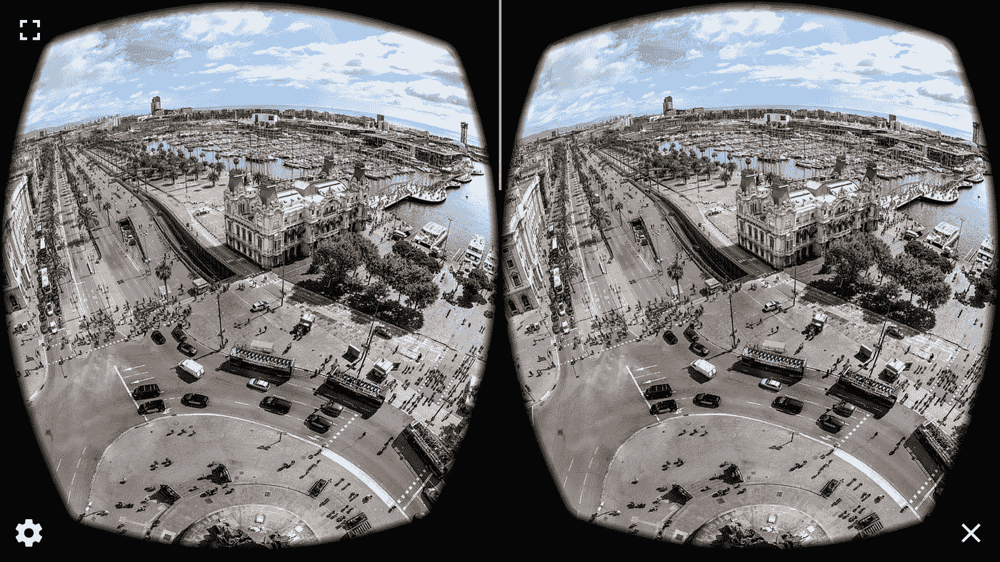
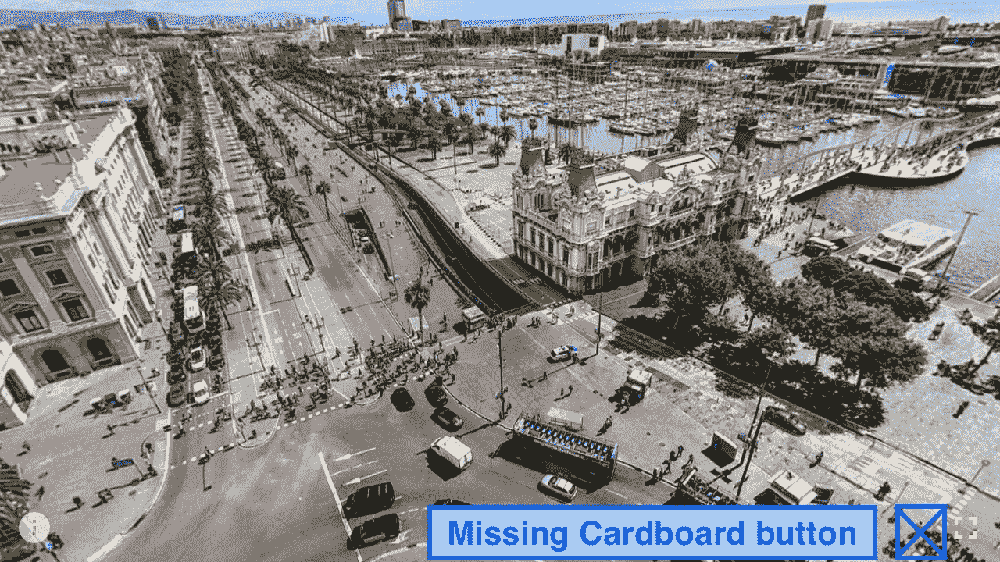
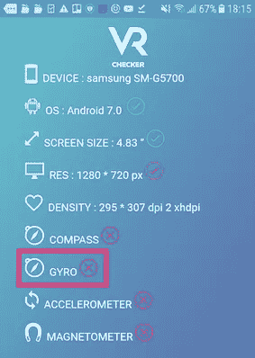
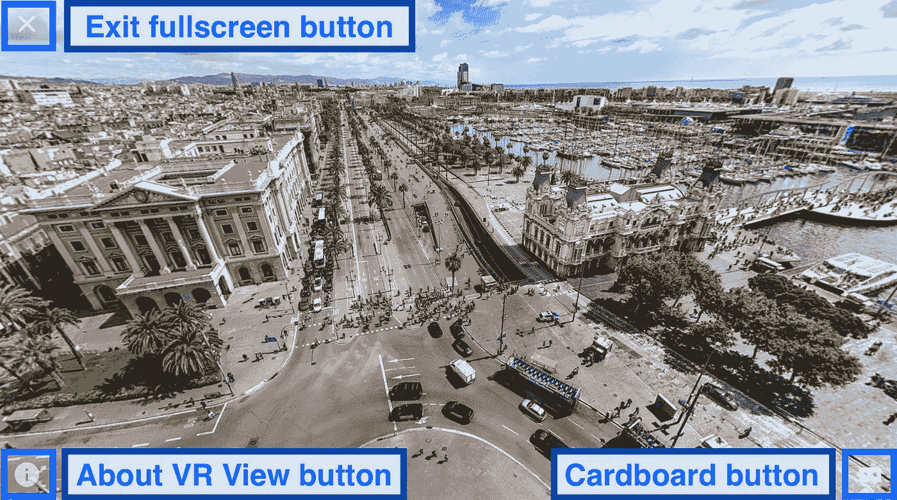
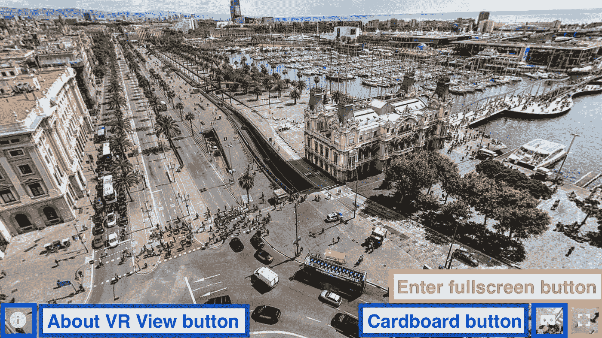
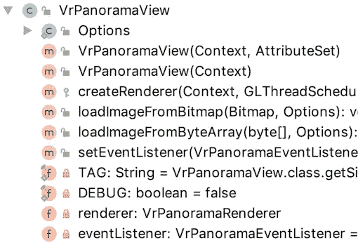

# 安卓 360 全景

> 原文：<https://itnext.io/android-360-panorama-cedbfb47a9e?source=collection_archive---------2----------------------->


全景技术是近年来兴起的一项新技术。这是一种特殊的照片，可以捕捉到摄影师周围 360 度的所有视角，从左到右，从上到下。图像是疯狂的，封面照片就是例子之一。

那么，作为一个 Android 开发者，我们如何在一个 Android 应用中展示一个 360°全景图像呢？你的第一个想法可能是使用`ImageView`。然而，`ImageView`仅仅将 360°全景显示为平面图像，并不能完全展示 360°全景可以有多棒。

幸运的是，谷歌提供了一个很棒的库 **Google VR SDK，**它可以完美地布局 360°全景，并根据用户姿势旋转图像。这个最低 SDK 版本是 19，也就是 Android 4.4。请参见下面的插图:


在本文中，它涵盖了:

1.  360 全景规格
2.  用`<VrPanaromaView>`展示 360°全景的程序
3.  Google VR SDK 的局限性
4.  隐藏不必要的`ImageButton` s

# 360 全景规格



360°全景图像的存储格式与普通图像相同，即`jpeg`或`gif`。但是，它的尺寸有一个特殊的标准。单幅图像的宽高比推荐为 **2:1** ，立体图像的宽高比推荐为**1:1**

在 Google VR SDK 中，有两个提高整体性能的建议:

1.  jpeg 是改进压缩的推荐格式
2.  图像尺寸应该是 2 的幂；例如 2048 或 4096

# 展示 360°全景的程序

## 步骤 1:添加依赖关系

## 步骤 2:添加`<VrPanoramaView>`到布局

## 第三步:*声明全景视图的*选项

必须设置输入类型，以便告诉 SDK 以单声道模式或立体声模式渲染图像。


单声道模式



立体声模式

## 第四步(最后) :加载 360°全景图像

**方法 1:从磁盘加载**

**方法 2:来自网络的负载**

# Google VR SDK 的局限性



360°全景的旋转是根据陀螺仪感应到的方位信号来完成的。然而，陀螺仪在 Android 手机中不是必需的传感器，例如三星 Galaxy J5 Prime (SM-G5700)。



三星 Galaxy J5 Prime (SM-G5700)的设备信息

因此，如果没有陀螺仪，则`VrPanoramaView`被冻结，纸板`ImageButton`被自动隐藏。为了提供良好的用户体验，开发人员应在用户的设备不支持查看 360°全景时通知用户:

# 隐藏不必要的图像按钮



全屏模式下的屏幕截图



<vrpanoramaview>未处于全屏模式但尺寸与屏幕尺寸相同时的截图</vrpanoramaview>

在`VrPanoramaView`处总共显示了四个`ImageButton`。

1.  关于虚拟现实视图按钮——引导用户进入系统浏览器并浏览[关于虚拟现实视图](https://support.google.com/cardboard/answer/6383058?visit_id=637092127725341848-3313664669&p=vrview&rd=1)网站
2.  纸板按钮—切换到纸板浏览器模式
3.  进入全屏按钮
4.  退出全屏按钮

## **为什么我们要隐藏 ImageButtons？**

如果用户实际上根本不需要`ImageButton` s，UX 会受到很大影响。例如，“关于虚拟现实视图”按钮实际上是一个广告，将用户导向谷歌虚拟现实页面。换句话说，它让用户远离了我们的应用！此外，当`VrPanoramaView`已经显示为屏幕大小或者甚至应用程序设计者不想包括此功能时，“进入全屏”按钮应该隐藏。

## 破解<vrpanoramaview></vrpanoramaview>



然而，`VrPanoramaView`中没有公共函数可以用来隐藏或禁用`ImageButton`。唯一的方法是使用`ViewGroup.getChildAt(index: Int)`函数来访问它们，并逐个设置它们的`visibility`属性。

下面是`VrPanoramaView`的 UI 结构:

```
<VrPanoramaView>
    <FrameLayout>
        <GLSurfaceView/>
        <RelativeLayout>
            <AppCompatImageButton/> // Exit fullscreen button
            <AppCompatImageButton/> // "About VR View" button
            <LinearLayout>
                <AppCompatImageButton/> // Cardboard button
                <AppCompatImageButton/> // Enter fullscreen button
            </LinearLayout>
        <RelativeLayout>
        <View/>
        <UiLayer/>
    </FrameLayout>
</VrPanoramaView>
```

# 摘要

1.  Google VR SDK 提供了一个易于使用的 widget `<VrPanoramaView>`来显示 360°全景，并根据用户姿势完美地旋转图像。
2.  360°全景图建议以`jpeg`格式存储，尺寸为 2 的幂。宽高比应该是 2:1。
3.  陀螺仪是`<VrPanoramaView>`正常工作的必要传感器。开发人员应该在运行时检查陀螺仪的存在，以确保良好的用户体验。
4.  使用`ViewGroup.getChildAt(index: Int)`功能访问不必要的`ImageButton`并切换其可见性，以便将其从屏幕上移除。

## 更多地了解我和我的学习模式

[](https://blog.usejournal.com/how-do-i-become-a-programmer-from-a-biomedical-engineer-student-6696ff5f1c1f) [## 我如何从一个生物医学工程专业的学生成为一名程序员？

### 离开我的舒适区很有挑战性。从生物医学领域转向 app 编程，我经历了什么…

blog.usejournal.com](https://blog.usejournal.com/how-do-i-become-a-programmer-from-a-biomedical-engineer-student-6696ff5f1c1f) 

# 参考:

## 1.谷歌 VR SDK 官方文档

 [## 面向 Android 的 Google VR SDK 快速入门| Google 开发者

### 使用 Google VR SDK 为 Daydream 和 Cardboard 构建应用程序。本指南向您展示如何为…设置 Android Studio

developers.google.com](https://developers.google.com/vr/develop/android/get-started) 

## 2.推荐的全景规格

[](https://developers.google.com/vr/discover/360-degree-media) [## 360 媒体|谷歌 VR |谷歌开发者

### 单击并拖动鼠标在图像中移动。360 媒体，由 360 视频和图像组成，是一个伟大的方式…

developers.google.com](https://developers.google.com/vr/discover/360-degree-media) 

如需了解更多信息，请在[Twitter @ myrik _ chow](https://twitter.com/myrick_chow)关注我。感谢您阅读这篇文章。祝您愉快！😄