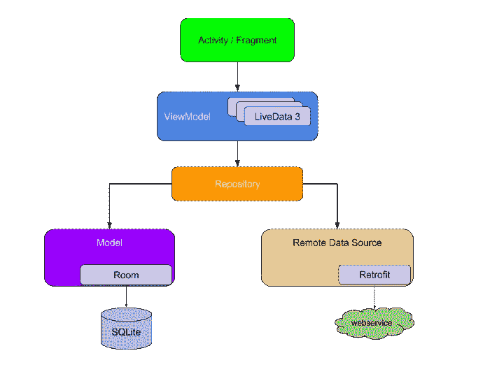
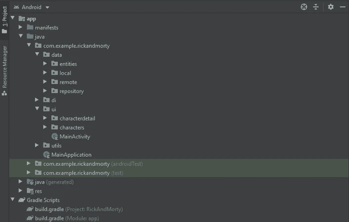

# Android 架构:希尔特，MVVM，科特林协程，实时数据，房间和改造(英尺。里克和莫蒂)

> 原文：<https://itnext.io/android-architecture-hilt-mvvm-kotlin-coroutines-live-data-room-and-retrofit-ft-8b746cab4a06?source=collection_archive---------0----------------------->

开发 Android 应用程序时，规划项目的架构非常重要。这将允许我们创建复杂、健壮、高质量、易于维护的应用程序。

今天我想向你展示我在 Android 开发中使用推荐实践的方法。

如你所知，在一个活动或片段中编写我们所有的应用程序代码是一个常见的错误。我们应该分离应用程序组件的不同关注点。下一张图将向您展示我们将使用的模块及其交互:

Android 架构组件

# 该项目

我们将使用[Rick 和 Morty API，](https://rickandmortyapi.com/)从中提取角色信息，并在 RecyclerView 中显示它们，通过单击其中一个项目，应用程序将显示一个角色的详细信息。简单。

该应用程序

这是项目的文件夹结构:

文件夹结构

这可能看起来很多。以下是一些解释:

**资料:**我们的 M(模特)在 MVVM。在那里我们执行数据操作。

**迪:**借助剑柄进行依存注射。

ui :我们的片段和视图模型帮助向用户显示数据。

**utils** :助手类和函数。

我建议您在阅读本教程的同时，看看 GitHub 资源库。

 [## sbe Roch/RickAndMorty-Android architecture 样本

### 一个 Rick 和 Morty 的简单应用程序，展示了在 Android 开发中使用一些最佳实践的一种方法。…

github.com](https://github.com/sberoch/RickAndMorty-AndroidArchitectureSample) 

继续之前还有最后一件事。当请求字符列表时，API 返回这个响应

我们得到了分页的响应。实际字符在“结果”下返回。这就是为什么你会在文件夹*实体下找到三个类。*但最重要的还是人品。

说到这里，我们继续讨论剑柄和迪。

# 柄

这不是阿迪教程，所以我强烈建议在继续之前先熟悉一下这个概念。反正我简单解释一下。

对于关注点分离的应用程序来说，一些组件之间存在依赖关系是很常见的。**视图模型**依赖于**存储库**来获取数据。但是存储库也依赖于一个**character remote data source**和一个 **CharacterDao** 。这是一个简单的应用程序。它会很快变成一个依赖地狱。

希尔特前来救援。我们只需要告知我们需要在哪里注入这些依赖，以及应该从哪里获取它们。

我们首先在根文件夹中创建一个从 Application 继承的类，对它进行注释，通知我们将在应用程序中使用 Hilt。

主应用程序. kt

然后，我们需要将每个活动和片段标注为 AndroidEntryPoints:

主活动. kt

CharacterDetailFragment.kt

我们的下一步是在 di 文件夹中创建我们的模块。如果你不太熟悉 di 的概念，可以把模块想象成一个“袋子”,我们可以从这个袋子里得到我们的依赖关系。(我将在本教程接下来的章节中展示许多依赖项，所以如果您现在还不完全理解它们，请不要害怕)。

AppModule.kt

`**@Module**` 注释对象，表示我们将从这里获取依赖关系。我们将只在这个简单的应用程序中使用一个，但较大规模的项目通常有许多模块。

`**@Singleton**` 将强制只创建一个依赖项实例，并在整个应用程序中使用。

`**@Provides**` 表明即将到来的函数将提供一个依赖项。

那我该怎么注射呢？

@注入

# ViewModel、LiveData 和数据显示。

多亏了 LiveData 和 Kotlin 协同程序的使用，我们可以避免回调，并有一个非常简单的方法将我们的数据呈现给我们的视图。这个视图模型是这样做的:

CharactersViewModel.kt

你可能想知道**资源。**就是这个助手类

资源. kt

它帮助我们根据状态封装我们的存储库响应，从而使我们的视图很容易相应地显示信息。这就是 CharactersFragment 观察 LiveData 值并相应更新自身的方式。

CharactersFragment.kt(字符观察者)

我们有我们的表示层。我如何获得我的数据？

# 改造和远程数据。

翻新帮助我们从我们的应用程序访问远程数据。你可以在 **AppModule.kt** 中看到如何构建一个改造对象。我们还需要用 HTTP 操作编写接口，我们将执行这些操作来与 API 通信。

CharacterService.kt

Kotlin 协同程序为我们带来了 **suspend** 修饰符，它表示下面的函数将在一个协同程序(类似于一个线程)中执行，允许我们在执行长时间的操作(例如从互联网上获取数据)时保持 UI 线程的畅通。

此 CharacterService 由 CharacterRemoteDataSource 使用

CharacterRemoteDataSource.kt

我们为什么要这样做？公平的问题。 **getResult** 将改进响应封装在一个**资源**中，这样我们就可以很好地捕捉错误。

基础数据源. kt

# 房间和本地数据存储

另一方面，我们也对从本地数据库中存储和获取数据感兴趣。我们需要它，以便当用户失去连接时，至少向他们显示一些东西。如果你熟悉这个概念，我们将把它作为我们系统的*缓存*。

Room 为我们提供了一个很好的界面来处理本地数据库。我们在这里建造一个:

AppDatabase.kt

不要忘记在 **@Database** 注释中包含所有想要持久化的实体。为了有空间看到我们的实体，我们还需要注释它们。

Character.kt

最后，我们需要指定将在数据库上执行的操作。这就是我们的 Dao 发挥作用的地方(数据访问对象)

字符道. kt

注意，Room 有 LiveData 支持，所以可以从数据库中获得可观察的值。而 Kotlin Coroutines 让我们暂停房间功能，让这变得更加容易。

# 存储库和我们的缓存策略

让我们连接两个数据源。这是我们需要计划数据访问策略的时候了。比如说，在得到一个角色的过程中。

*   首先，我们需要让我们的 LiveData 知道我们正在寻找角色，这样它就应该有一个加载状态。
*   然后，我们希望从本地数据源获取该字符，因为这比从互联网获取要快。如果它找到了，我们就成功地改变了状态
*   不管本地数据库操作的结果如何，我们都希望保持我们的应用程序同步，所以我们也从互联网上获取那个字符(但是请记住，ui 线程不会被阻塞，用户可能已经看到了正确的字符信息，因为它在数据库中！).
*   最后，我们需要将远程调用的结果保存在数据库中，以便保持更新。

我们将在我们的存储库中完成所有这些工作:

CharacterRepository.kt

`**performGetOperation**` 按照我们讨论的策略定义:

DataAccessStrategy.kt

我想突出显示我们做`**liveData(Dispatchers.IO)**`的第一行

感谢 Kotlin 协同例程和 LiveData，当我们这样做时，我们启动了一个新的 IO 协同例程，因此允许我们使用我们的 suspend 函数，并且我们还将我们的结果存储在 LiveData 容器中，这是由 ViewModel 观察的。

就是这样！

# 进一步的步骤

我们坚持到了最后。我希望我在整个教程中都很清楚。

为了使事情简短，我省略了一些待办事项:

*   我们一直在与我提出的策略同步，而您的应用程序可能不需要它。牢记自己的需求，制定明智的策略。
*   此外，我们只执行 get 操作。如果我们需要上传一些东西到服务器上呢？在这种情况下，策略也将不同。
*   API 对其字符进行分页。为什么不呢？看看 Jetpack 的分页库。
*   测试尚未进行。

仅此而已。请记住，您可以在 GitHub 资源库中找到我使用的所有代码

 [## sbe Roch/RickAndMorty-Android architecture 样本

### 一个 Rick 和 Morty 的简单应用程序，展示了在 Android 开发中使用一些最佳实践的一种方法。…

github.com](https://github.com/sberoch/RickAndMorty-AndroidArchitectureSample) 

如果这些对你有用，请留下**掌声**！我将非常感激下一个教程。