# Android 日历意图

> 原文：<https://itnext.io/android-calendar-intent-8536232ecb38?source=collection_archive---------1----------------------->

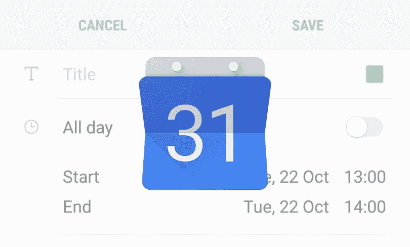

alendar 是用户日常使用最常见的应用程序。用户可以添加他/她的日常计划。日历可以自动通知用户即将发生的事件。如果应用程序可以在日历应用程序中添加一个事件，并提醒用户未来的事件，这将非常有用。

Android 主要提供了两种处理日历事件的方法。一个是使用`Calendar Provider`，另一个是把它交给系统日历应用。

`Calendar Provider`提供我们所有的功能，包括插入、查询、更新和删除现有的日历事件。然而，这些步骤很繁琐，并且必须要求用户的运行时权限(`android.permission.READ_CALENDAR`和`android.permission.WRITE_CALENDAR`)来读写敏感的日历信息。这种方法很容易出错。

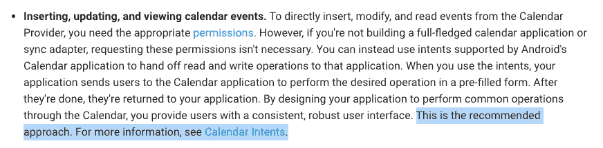

引自[日历提供商](https://developer.android.com/guide/topics/providers/calendar-provider)的谷歌官方文档

因此，Google 官方推荐开发者使用第二种方法，即使用`Intent`将所有日历操作交给系统日历 app。日历应用程序在我们的应用程序请求后立即打开，用户在完成他/她的日历操作后会自动重定向回我们的应用程序。在系统日历 app 中，已经有一个精心设计的 UI 供用户填写必要的日历信息。好的用户界面和 UX 可以得到保证。

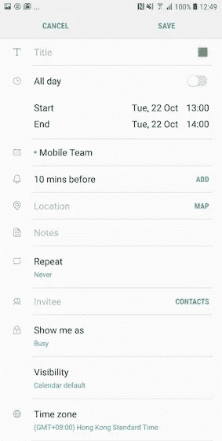

我的三星设备中的系统日历应用示例

本文将简要介绍:

1.  意图限制方法
2.  Android 日历数据库的结构
3.  `Content Provider`的理念
4.  编码 1):插入新的日历事件
5.  编码 2):查看特定日期的事件
6.  编码 3):通过事件 id 查看事件详细信息
7.  编码 4):通过事件 id 更新事件
8.  重复规则定义
9.  日历字段:被邀请人

# 意图限制方法

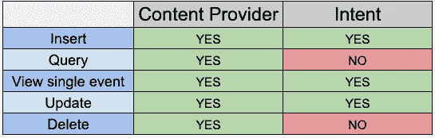

并非所有日历操作都可用于意向方法。见上表。如[日历意向官方文档](https://developer.android.com/guide/topics/providers/calendar-provider#intents)所述，日历意向只能查看、编辑和创建日历事件。删除不是一个选项。为了删除一个已存在的，必须使用`Calendar Provider`，并且必须添加大量繁琐的代码。[看这里](https://developer.android.com/guide/topics/providers/calendar-provider#delete-event)。

# 日历结构

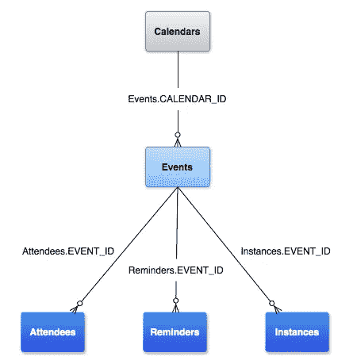

Android 日历结构

在 Android 系统中，日历结构下主要有 5 个表，在 Android 日历结构中可以分为 3 级。它们是:

1.  日历
2.  事件
3.  与会者、提醒和实例

还有一个`Time`表，将在后面的课程中介绍。

在每个设备中，可以添加一个或多个日历帐户，例如 Google、Apple 和 Microsoft。在每个日历下，可以有一个事件列表。同时，每个事件下可以有参与者、提醒和实例的列表。

`event`和`instance`的概念可能会让人混淆。让我们用一个日历例子来解释一下:

**活动**:2019 年 1 月 1 日至 2019 年 12 月 31 日每周二。

**实例**:

1.  2019 年 1 月 1 日(星期二)
2.  2019 年 1 月 8 日(星期二)
3.  …

53.2019 年 12 月 31 日(星期二)

单周`event`下共有 53 个`instances`。

# 日历提供商

Calendar provider 是一种内容提供者，它将数据存储在关系数据库模型中，并通过唯一的公共 URIs (Uniform Resource Identifier，统一资源标识符)将数据公开给其他应用程序。如上所述，主要有 5 个由日历提供商控制的表，因此有 5 个公共 URIs。

1.  日历表 URI: `content://com.android.calendar/calendars`
2.  事件表 URI: `content://com.android.calendar/events`
3.  与会者表 URI: `content://com.android.calendar/attendees`
4.  提醒表 URI: `content://com.android.calendar/reminders`
5.  实例表 URI: `content://com.android.calendar/instances`

每个内容提供商为 URI 提供一种特殊的格式。URI 必须以`content://`开头，然后是提供者的类。最后一个参数是表的名称。

# 编码部分

编码部分将被拆分成四个部分:

1.  插入新的日历事件
2.  查看给定时间的日历事件列表
3.  按事件 id 查看现有日历事件
4.  更新现有日历事件

每个类别之间共享部分代码。

# 编码 1):插入新的日历事件

## 步骤 1:定义意图

如前所述，app 把日历动作交给系统日历 app。因此，在系统日历 app 上预填信息的唯一方法是通过`Intent`传递。

要设置的第一个参数是意图动作。有三种可能的选择:

1.  意图。ACTION_INSERT
    *(用于创建新的日历事件)*
2.  意图。ACTION_VIEW
    *(用于通过事件 id 或事件时间查看现有日历事件)*
3.  意图。
    动作 _ 编辑*(用于编辑已有的日历事件)*

第二个要设置的是我们正在编辑的表格的`CONTENT_URI`。如上所述，日历结构下主要有 5 个不同的表。要查看、编辑和创建日历事件，它应该指向存储所有日历事件信息的`Events`表。

## 步骤 2:向意向添加额外数据

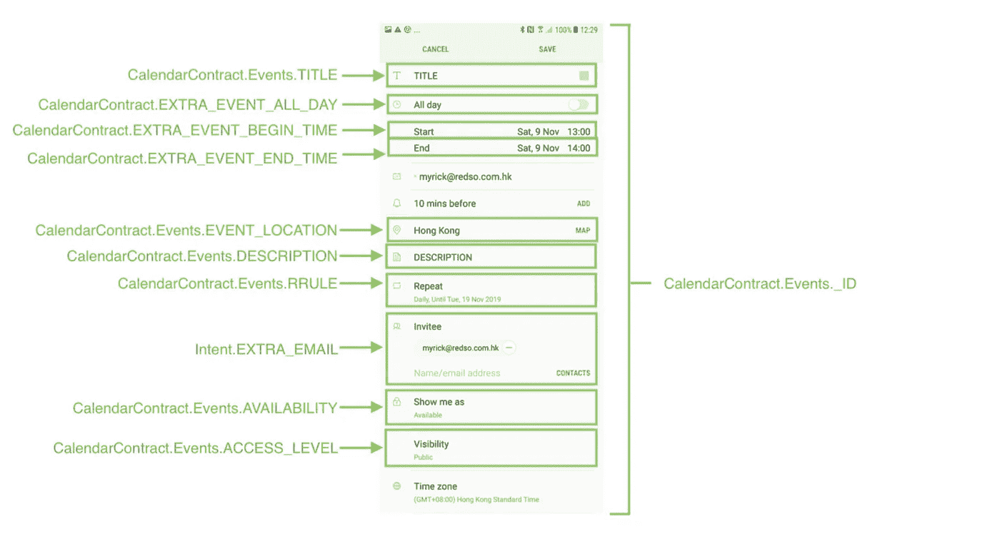

`Intent`可以通过`extra`将日历信息传递给日历 app。所有可用的键见上图。

除了代表“[递归规则](https://www.kanzaki.com/docs/ical/rrule.html)”的`RRULE`之外，大多数参数都是自明的。它就像 SQL 语句一样，为系统定义查询规则来过滤特定的日期。这将在下一节课中详细解释。

## 第三步:打开系统日历应用程序

使用最简单的功能`startActivity(intent: Intent)`就可以触发日历 app。

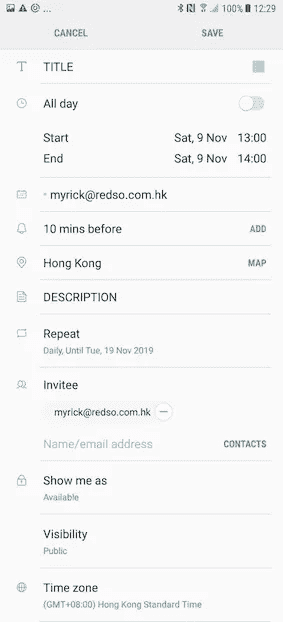

# 编码 2):查看特定日期的事件

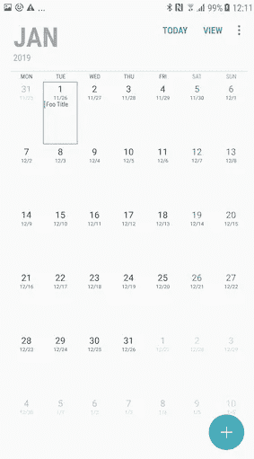

按日期查看事件的结果截图

第二个日历功能是查看特定日期的事件。由提供的时间戳指定的日期单元格在日历应用程序上突出显示。上面的示例代码使用的是时间戳`1546300800000`，即 2019 年 1 月 1 日。

重要的一点是，这次用的 URI 是`content://com.android.calendar/time/1546300800000`。它指向的是`Time`表，而不是`Calendar`、`Events`、`Attendees`、`Reminders`和`Instances`表。由于`Time`不提供公共 URI，URI 必须用`Uri.Builder`构建。

第二个重要的是，意图动作不再是`Intent.ACTION_INSERT`，应该改为`Intent.ACTION_VIEW`。根据定义，`Intent.ACTION_VIEW`用于向用户显示数据，而`Intent.ACTION_INSERT`用于向给定容器中插入一个空项目。

# 编码 3):通过事件 id 查看事件详细信息

Android 提供了一种通过`event id`查看事件详情的方法，这种方法只能通过`Calendar Provider`进行查询。由于敏感的用户信息，必须在运行时授予读取日历权限(`android.permission.READ_CALENDAR`)。

## 第一步:请求`android.permission.READ_CALENDAR permission`

[RxPermission](https://github.com/tbruyelle/RxPermissions) 因其请求权限和检查状态的简单性，推荐用于运行时请求权限。

## 步骤 2:从日历内容提供商处获取事件 id

在上面的函数中，`event_id`和`title`列都被查询进行演示。实际上一个事件中的所有[字段](https://developer.android.com/reference/android/provider/CalendarContract.Events.html#writing-to-events)都可以查询。

## 步骤 3:用事件 ID 构造一个 URI

这次我们可以使用`withAppendedId()`函数来构造 URI，因为`Events`表提供了公共的`CONTENT_URI`。最终的 URI 格式是`content://com.android.calendar/events/{event_id}`。

## 步骤 4:将意向动作设置为意向。动作 _ 视图

与之前的会话相同，必须使用`Intent.ACTION_VIEW`，因为它现在正在查看记录，而不是创建新记录。最终显示事件的如下页面，该页面只有**分享**和**删除**功能:

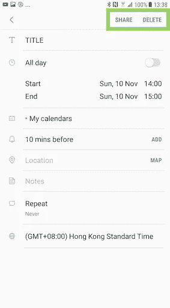

# 编码 4):通过事件 id 更新事件

Android 提供的最后一个可用日历操作是更新一个现有事件。与通过`event id`查看事件一样，URI 的格式为`content://com.android.calendar/events/{event_id}`。然而，必须将意图动作更改为`Intent.ACTION_EDIT`，它提供了对给定数据的显式可编辑访问。在“编码 1”中添加的所有事件字段都可以在这里用相同的额外键进行更新。

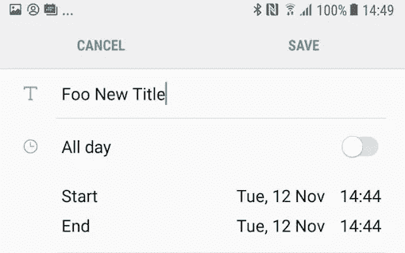

# 获得用户的响应

用户可以执行或取消日历功能(插入和更新)。App 可以在`onActivityResult()`回调时检测到这个结果。

`Result code`可以是用户成功执行动作时的`Activity.RESULT_OK`(值:-1)，也可以是用户取消动作时的`Activity.RESULT_CANCELED`(值:0)。

此外，当插入或更新事件时，只返回数据。在`returned` Intent 中只存储了三个字段:

```
*Key: timezone; Value: Asia/Hong_Kong
Key: allday; Value: false
Key: go_to_millis; Value: 1573365600000*
```

# 递归规则

重复规则定义重复事件的重复模式。它是以字符串的形式。例如，`FREQ=WEEKLY;BYDAY=MO;COUNT=3`表示每周一重复 3 次的模式，即 2019-11-05&12&19 周一。

该规则以`{rule_name}={rule_value}`的格式编写，并用分号`;`与其他规则连接。

有许多全球标准的重现规则。这里有四条通用规则，可以处理大多数情况——`FREQ`、`UNTIL`、`COUNT`和`BYDAY`。

## 1.FREQ(频率)

频率定义了模式重复的频率。它接受以下参数:

1.  `DAILY`
2.  `WEEKLY`
3.  `MONTHLY`
4.  `YEARLY`

示例:`FREQ=DAILY`

## 2.直到

`UNTIL`定义频率的结束日期。接受日期格式为`yyyyMMdd'T'HHmmss'Z'`的值，如*2019 11 05t 000000 z】*

示例:`FREQ=DAILY;UNTIL=20191105T000000Z`表示每天重复该事件，直到 2019 年 11 月 5 日。

## 3.数数

`COUNT`定义出现的次数的频率。它接受整数值。

例:`FREQ=DAILY;COUNT=10`表示每天重复该事件 10 轮，即 10 天。

## 4.白天

`BYDAY`定义应应用重复模式的工作日列表。它接受以下参数:

1.  `MO`(周一)
2.  (星期二)
3.  `WE`(星期三)
4.  `TH`(星期四)
5.  (星期五)
6.  (星期六)
7.  (星期日)

示例:`FREQ=WEEKLY;BYDAY=MO,FR`表示该模式在每周的周一和周五重复。

## 实际例子:

1.  在即将到来的 3 年中每年重复一次
    `FREQ=YEARLY;COUNT=3`
2.  每月重复一次，直到 2020 年 1 月 1 日
    `FREQ=MONTHLY;UNTIL=20200101T000000Z`
3.  在接下来的 3 周里，每周一和周四重复。计数为 6，因为总出现次数为 2x3 = 6。
    `FREQ=WEEKLY;BYDAY=MO,TH;COUNT=6`
4.  每周一重复，直到 2020 年 1 月 1 日`FREQ=WEEKLY;BYDAY=MO,TU;UNTIL=20200101T000000Z`

## 递归规则的技巧

`UNTIL`和`COUNT`互相矛盾。`UNTIL`定义频率的结束日期。`COUNT`定义了出现的次数的频率。

如果`UNTIL`存在，Android 将忽略`COUNT`的存在，即`FREQ=DAILY;COUNT=10;UNTIL=20191105T000000Z`等于`FREQ=DAILY;UNTIL=20191105T000000Z`

# 日历字段:被邀请人

`Invitee`是日历信息中的一个特殊字段。它接受电子邮件地址或用逗号分隔的电子邮件地址列表。请参见下面的示例:

## 自动邀请电子邮件

创建、更新和删除日历后，将自动向所有被邀请人发送电子邮件。请参见下面的电子邮件模板:

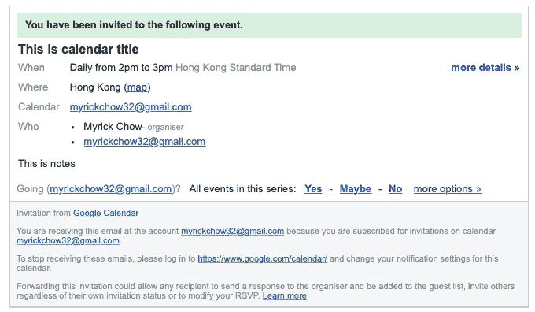

新邀请活动的屏幕截图

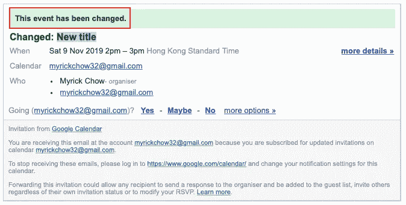

更新事件的屏幕截图


已删除事件的屏幕截图

## 自动确认电子邮件

如果被邀请人接受或拒绝用户的邀请，系统会自动向用户发送一封确认电子邮件。请参见下面的模板:

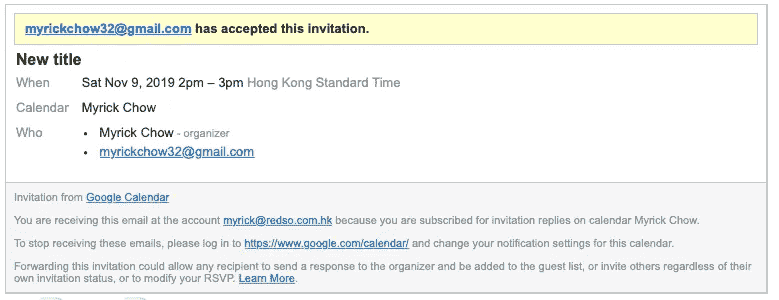

被邀请者接受邀请

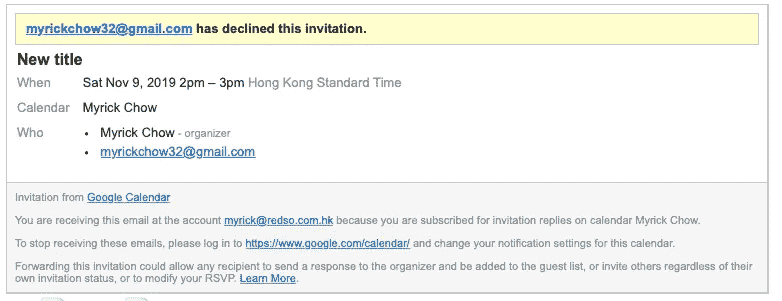

被邀请人拒绝邀请

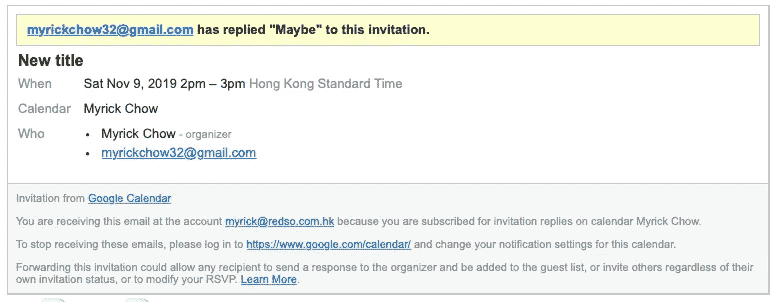

被邀请人不确定他/她是否能参加活动

## 添加到被邀请人的日历(Android 和 iOS)

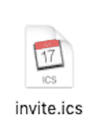

和邮件一起的还有一个`invite.ics`附件，在安卓和 iOS 都可读。被邀请者可以点击该附件，系统将自动弹出日历应用程序来插入日历事件。

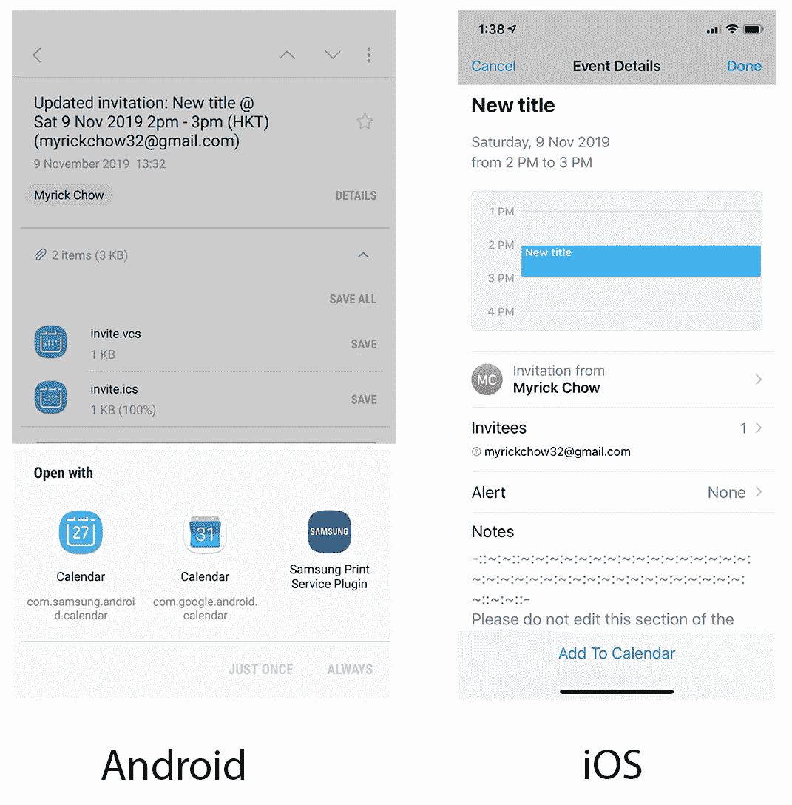

# 摘要

1.  Android 提供了两种方法来处理日历操作，推荐的方法是将操作交给系统日历应用。使用意图方法可以降低处理日历操作的风险，因为系统提供了可信的 UI 和 UX
2.  日历结构下主要控制 6 个表。分别是`Calendars`、`Events`、`Attendees`、`Reminders`、`Instances`和`Time`。但是`Time`没有提供公共 URI。
3.  不同的操作必须使用不同的意图动作。`Intent.ACTION_INSERT`应在将要创建事件时使用。`Intent.ACTION_EDIT`应在事件将要更新时使用。`Intent.ACTION_VIEW`应该在要查看事件时使用。
4.  在编辑或查看现有记录之前，必须请求`android.permission.READ_CALENDAR`并检索`event id`。
5.  重复规则是一个类似 SQL 的语句。最有用的代码是`FREQ`(频率)、`UNTIL`(重复模式的结束时间)、`COUNT`(发生次数)和`BYDAY`(特定天数)。
6.  当被邀请人对被邀请事件做出选择时，系统会向所有被邀请人发送自动邀请电子邮件，并向用户发回确认电子邮件。被邀请者可以通过电子邮件附件将事件添加到日历中(`Invite.ics`)。

希望这篇文章能让你对 Android 日历有更多的了解。祝你有美好的一天~加油！😉

# 参考:

## 1.日历提供商官方文档

[](https://developer.android.com/guide/topics/providers/calendar-provider) [## 日历提供商概述| Android 开发者

### 日历提供程序是用户日历事件的存储库。日历提供者 API 允许您执行…

developer.android.com](https://developer.android.com/guide/topics/providers/calendar-provider) 

## 2.意向行动列表正式文件

[](https://developer.android.com/reference/android/content/Intent.html) [## 意图| Android 开发者

### AccessibilityServiceMagnificationController . OnMagnificationChangedListener

developer.android.com](https://developer.android.com/reference/android/content/Intent.html) 

## 3.重复规则演示

 [## rrule.js 演示

### 这是 rrule.js 的演示和测试应用程序，rrule . js 是一个 JavaScript 库，用于处理日历日期的重复规则。

jakubroztocil.github.io](https://jakubroztocil.github.io/rrule/) 

## 要更多地了解我和我的学习模式:

[](https://blog.usejournal.com/how-do-i-become-a-programmer-from-a-biomedical-engineer-student-6696ff5f1c1f) [## 我如何从一个生物医学工程专业的学生成为一名程序员？

### 离开我的舒适区很有挑战性。从生物医学领域转向 app 编程，我经历了什么…

blog.usejournal.com](https://blog.usejournal.com/how-do-i-become-a-programmer-from-a-biomedical-engineer-student-6696ff5f1c1f) 

如需了解更多信息，请在[Twitter @ my rik _ chow](https://twitter.com/myrick_chow)关注我。感谢您阅读这篇文章。祝您愉快！😄