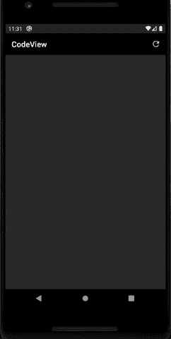

# Android CodeView:创建代码编辑器应用程序的简单方法

> 原文：<https://itnext.io/android-codeview-an-easy-way-to-create-code-editor-app-5d67c3534f84?source=collection_archive---------5----------------------->

CodeView 演示

嗨，我是 Amr Hesham 软件工程师，我对 Android 开发和编译器设计感兴趣😎

上个月，当我在创建一个编程语言编译器和解释器来实践和实现创造性的想法时，我想到了创建一个基于脚本语言的 Android 计算器应用程序( [MathScript](https://play.google.com/store/apps/details?id=com.amrdeveloper.mathscript) )来表示数学运算和函数🤔。

首先，我致力于语言设计，使其易于使用，并提供有用的错误消息，在实现它之后，是时候使用 Android 应用程序了，所以我需要为这种语言创建一个代码编辑器，并提供一些易于使用的功能。

我已经决定代码编辑器应该有一些对每个人来说都很酷和容易的特性，

◾自定义语法荧光笔为我的新脚本语言。
◾自动完成对语言关键字的搜索。
◾错误荧光笔突出显示错误和警告。
◾支持多主题荧光笔，可以在运行时改变主题。
◾轻松更新配置为我的语言添加任何更新。

那么我应该如何创建这个代码编辑器呢？我已经开始搜索任何能够让我创建这个编辑器的库。

但问题是，我想要一个自定义需求，因为这是我的语言，而不是人们在其库中支持的任何流行的编程语言，
我搜索的结果是，没有一个库能满足我的所有需求。

所以我想我应该创建我的库来解决这个问题，并使它通用化，任何人都可以根据自己的需要定制它。

我已经创建了 **CodeView** 库，它的目标是让任何人都可以轻松地创建自定义代码编辑器，并且很小，不包括每个编程或每个主题的配置，所以这个想法是给你一个内核，你可以根据需要自定义它。

Java 代码视图演示 GIF

它可以支持任何编程语言语法，甚至你可以用它来突出链接，电子邮件和标签，如社交媒体编辑器，你可以轻松地支持自动完成，但添加你的关键字和库有默认的标记器，你也可以改变它😋，你可以支持任何数量的主题，并可以在运行时快速轻松地在它们之间移动，你可以支持任何类型的错误荧光笔，如错误，警告，提示等，你可以实现一些你喜欢的酷功能，例如荧光笔 TODO，修复评论，如 JetBrains 编辑器。

它非常容易使用，有据可查，在 Github 上有很多例子你可以从 Github 链接中知道如何下载和使用:
[**https://github.com/amrdeveloper/codeview**](https://github.com/amrdeveloper/codeview)

我希望你会喜欢用 **CodeView** 创建你的编辑器😋。