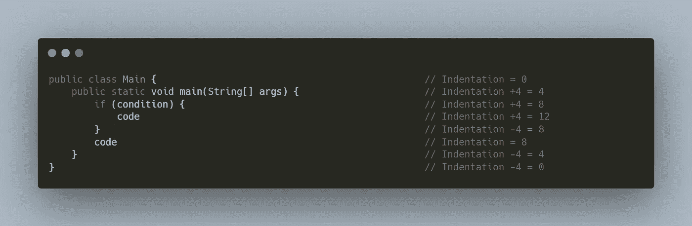
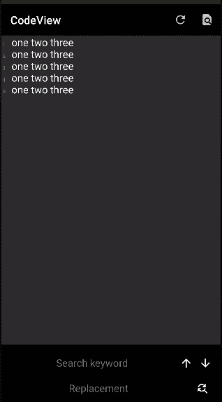

# Android 代码视图:自动缩进，查找和替换

> 原文：<https://itnext.io/android-codeview-auto-indentation-find-and-replace-3bc91994e214?source=collection_archive---------1----------------------->


大家好，在这篇文章中，我将谈谈最新版本的 CodeView 库的两个特性，它们支持自动缩进，并增加了对查找匹配和替换关键字的支持。

注意，你可以在[**AMR developer/CodeView**](https://github.com/AmrDeveloper/codeview)官方资源库中找到关于如何安装和使用 code view 的完整文档。

首先什么是自动缩进？

自动缩进帮助您设置缩进级别。当您键入新文本时，缩进级别将自动增加或减少制表符长度，例如当您在文本的末尾或中间插入新行时增加或减少 4。

例如，在现代 IDE 中，当您编写 java 时，当您开始用{对于示例 4，缩进级别将按制表符长度增加，一旦您用}结束该块，缩进将减少。



要在 CodeView 中支持此功能，只需 3 个步骤。

步骤 1:设置缩进的起始字符，这样当用户输入这些字符时，缩进级别应该增加，例如`{`。

```
Set<Character> indentationStart = new HashSet<>(); indentationStart.add('{'); codeView.setIndentationStarts(indentationStart);
```

步骤 2:设置缩进结束字符，这样当用户键入这些字符时，缩进级别应该降低，例如“}”。

```
Set<Character> indentationEnds = new HashSet<>(); indentationEnds.add('}'); codeView.setIndentationEnds(indentationEnds);
```

步骤 3:设置制表符长度并启用自动缩进。

```
codeView.setTabLength(4);
codeView.setEnableAutoIndentation(true);
```

你可以很容易地改变高光颜色

```
codeView.setMatchingHighlightColor(color);
```


现在我们已经完成了:D，享受自动缩进。

第二个特性的灵感来自于 CodeView 用户的一个特性建议，即能够突出显示并获得匹配的子字符串，还可以轻松地用另一个文本替换它，这个特性也可以在现代代码编辑器和 IDE 中看到，如 Vs Code、Android Studio 等。

所以现在 CodeView 提供了一些方法来帮助你实现查找和替换对话框。

要从文本中获取所有匹配的子字符串，可以使用 findMatches。

```
List<Token> tokens = codeView.findMatches(regex);
```

若要查找并突出显示下一个匹配的标记，如果未找到，则返回 null。

```
Token token = codeView.findNextMatch();
```

若要查找并突出显示前一个匹配的标记，如果未找到，则返回 null。

```
Token token = codeView.findPrevMatch();
```

清除所有匹配的高亮标记。

```
codeView.clearMatches();
```

用其他字符串替换与 regex 匹配的第一个字符串。

```
codeView.replaceFirstMatch(regex, replacement);
```

用其他字符串替换所有与 regex 匹配的字符串。

```
codeView.replaceAllMatches(regex, replacement);
```

在 Github 上的示例应用程序中，您会发现使用该功能来支持查找和替换的对话框



你可以在: [**GitHub**](https://github.com/amrdeveloper) ， [**LinkedIn**](https://www.linkedin.com/in/amrdeveloper/) ， [**Twitter**](https://twitter.com/amrdeveloper) 上找到我。

享受编程😋。