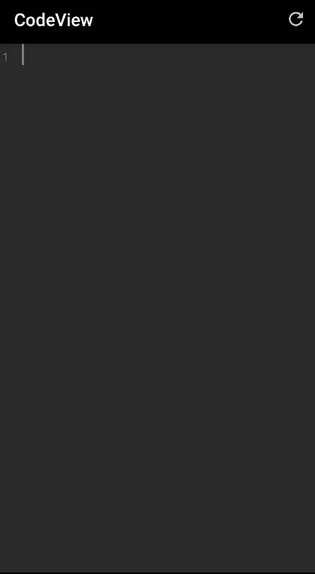

# Android CodeView:用代码片段创建代码编辑器

> 原文：<https://itnext.io/android-codeview-create-a-code-editor-with-snippets-6733094161e4?source=collection_archive---------2----------------------->


大家好，我是 Amr Hesham 软件工程师，我对 Android 开发和编译器设计感兴趣，在过去的几篇文章中，我向大家展示了一些很酷的功能，如何使用 CodeView 库为您的自定义语言或数据格式创建自己的代码编辑器，包括语法高亮、自动完成、错误和警告高亮、高亮搜索结果等。在本文中，我将向您展示如何使用 CodeView 1.1.0 在编辑器中轻松实现代码片段。

片段或实时模板是非常有用的功能，您可以在大多数现代代码编辑器和 IDE 中找到它们，如 Visual Studio Code 和所有 JetBrains IDE，如 Android Studio、IntelliJ IDEA，因为它可以帮助我们用很少的字符轻松地编写重复的代码模式，并帮助您更快地编写代码，在您的代码编辑器应用程序中非常需要此功能，以使用户在移动设备上快速编写，当您键入 for 和 IDE 为您编写 for 循环时，这就是所谓的片段。

从版本 1.1.0 开始，CodeView 帮助您用几行代码轻松地支持代码片段，让我们从实现我们的示例开始，
在这个示例中，我们希望帮助我们的 Java 开发人员用户快速开始编写代码，因此我们的目标是当用户单击带有前缀“main”的代码片段时，我们将为他们插入 Hello World 代码。

要了解如何在项目中添加 CodeView 以及如何为 Java 创建荧光笔，请查看这篇文章和官方知识库，这样我们就可以专注于代码片段特性。

*   Github 库:[**AMR developer/code view**](https://github.com/amrdeveloper/codeview)。
*   文章: [**CodeView 如何轻松创建 code editor**](/android-codeview-an-easy-way-to-create-code-editor-app-5d67c3534f84)

在你实现了 Java 荧光笔之后，是时候添加你的关键字和代码片段了。

在 CodeView 库中，关键字和代码片段是实现代码接口的类。

```
public interface Code {
    String getCodeTitle();
    String getCodePrefix();
    String getCodeBody();
}
```

这个类有三个属性 title，prefix 和 body，知道它们之间的区别很重要

*   标题是您在自动完成下拉菜单上看到文本，因此它可以是例如“关键字包”。
*   前缀是我们在自动完成适配器中用来过滤文本，例如“package”
*   主体是我们在代码中插入的内容，当用户键入一个作为前缀子集的字符串，然后他单击标题，例如“package main

当我们写一些例子时，你会清楚地理解不同之处，所以让我们从第一个例子开始。

首先，您需要创建一个包含所有关键字和代码片段的列表。

```
String mainPackageTitle = “Main Code”;
String mainPacakgePrefx = “main”;
String mainPackageBody = “package main;\n\npublic class Main {“ +
 “\n\tpublic static void main(String[] args){“ +
 “\n\t\tSystem.out.println(\”Hello, World!\”);\n\t}\n}”;List<Code> codes = new ArrayList<>();
codes.add(new Snippet(mainPackageTitle, mainPacakgePrefx, mainPackageBody));
```

然后需要创建 CodeViewAdapter 并将其设置为 CodeView 对象。

```
CodeViewAdapter codeAdapter = new CodeViewAdapter(this, codes);
codeview.setAdapter(codeAdapter);
```

在这里，我们创建了带有前缀“main”的代码片段，因此一旦用户输入是“main”的子集，用户将在自动完成下拉菜单中看到“Main Code”选项，一旦他选择了它，hello world 示例将被插入到代码视图编辑器中，最终结果将如下所示。



您可以添加任意多的代码片段，但是如果您希望自动完成下拉菜单一起显示代码片段和关键字，这很容易，因为两个类都是 Code 类型，所以您可以将它们都添加到列表中。

```
List<Code> codes = new ArrayList<>();
codes.add(new Keyword(.., .., ..));
codes.add(new Snippet(.., .., ..));
```

这很简单，你可以扩展这个例子，这样你就可以给用户定义他的关键字和代码片段的权力！而你的工作只是将它们插入到列表中并将其传递给 CodeViewAdapter。

对于 1.1.0 之前版本的用户，您仍然可以使用普通的 ArrayAdapter 创建带有字符串数组的自动完成特性，因此您的旧代码不会中断。

最后，我希望你喜欢这个功能，你可以在 GitHub 库中查看 CodeView 的完整文档和示例，如果你喜欢它，给它打个星，非常欢迎你建议功能、报告 bug、写文章、贡献代码。

你可以在:[**GitHub**](https://github.com/amrdeveloper)[**LinkedIn**](https://www.linkedin.com/in/amrdeveloper/)[**Twitter**](https://twitter.com/amrdeveloper)上找到我。

享受 CodeView 和编程😋