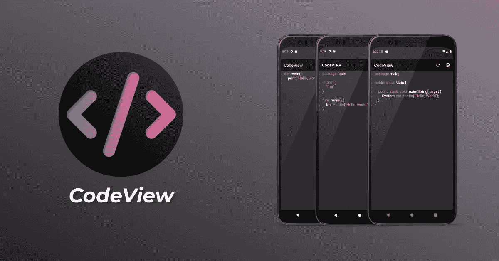
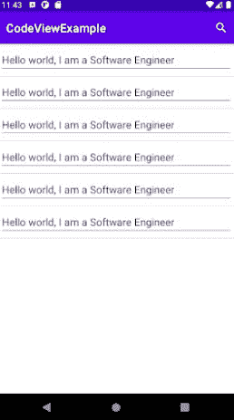

# Android CodeView:在列表项中突出显示搜索结果

> 原文：<https://itnext.io/android-codeview-highlight-search-result-in-list-items-b7e4c9fb57d8?source=collection_archive---------1----------------------->



开发者们好，在我发表的关于如何使用 CodeView 创建自己的代码编辑器的前两篇文章中，你可以从 [**这里**](/android-codeview-an-easy-way-to-create-code-editor-app-5d67c3534f84) 阅读，关于可以使用 CodeView 实现的许多功能，例如突出显示段落中的文本，还可以突出显示标签、电子邮件、URL，你可以从 [**这里**](/android-codeview-the-easiest-way-to-highlight-patterns-53702e0e2164) 阅读。

在这篇文章中，我将向您展示如何使用 CodeView 来突出显示列表项中的搜索结果，例如 RecyclerView、GridView 或 ListView 项，它具有许多功能，我们的最终结果将是这样的，所以让我们开始编码。



突出显示搜索结果

CodeView 使每个人都容易实现突出显示功能，我会留下来设计你的列表项和你的应用程序颜色来选择你喜欢的，我们的工作将在适配器和 SearchView 搜索查询更新时进行。

在您的适配器中，您需要创建包含搜索模式的全局变量，如果它等于 null，这意味着我们不需要突出显示任何内容，以及 Color 对象来存储突出显示的关键字的颜色，我们将使其默认为 *MAGENTA* ，您可以创建 setter 方法来随时更改它，或者取决于您的应用程序主题。

```
private Pattern syntaxPattern;
private Color highlightColor = Color.*MAGENTA*;
```

我们将创建 setter 方法来根据搜索关键字更新当前模式。

```
public void updateSyntaxPattern(Pattern pattern) {
    syntaxPattern = pattern;
    notifyDataSetChanged();
}
```

当你为每个条目设置文本时，依赖于你的适配器，例如在 getView 方法中的 ArrayAdapter 和在你的 holder 中的 RecyclerViewAdapter 等等。

我们将简单地检查我们的模式是否不为空，并将它添加到带有颜色的 CodeView 实例中，但是请记住，我们需要清除上次搜索中的模式，因此代码将如下所示。

```
if(syntaxPattern != null) {
    codeView.resetSyntaxPatternList();
    codeView.addSyntaxPattern(syntaxPattern, highlightColor);
}
```

现在我们在适配器中完成了，让我们转到 SearchView，您必须有两个方法来使用 onQueryTextSubmit 和 onQueryTextChange，这取决于您希望荧光笔何时工作，您将选择其中一个，然后通过使用适配器中的 out helper 方法来设置模式，因此代码将如下所示，

```
Pattern pattern = Pattern.*compile*(query);
adapter.updateSyntaxPattern(pattern);
```

就这样，现在我们的功能完成了，你可以扩展它并添加额外的功能，比如多个荧光笔，或者在运行时改变颜色以支持多个主题…等等。

它非常容易使用，有据可查，在 GitHub 上有很多例子你可以从 GitHub 链接中知道如何下载和使用:
[**https://github.com/amrdeveloper/codeview**](https://github.com/amrdeveloper/codeview)

我希望你会喜欢用 CodeView 创建你的编辑器😋。

你可以在:[**Github**](https://github.com/amrdeveloper)[**Linkedin**](https://www.linkedin.com/in/amrdeveloper/)[**Twitter**](https://twitter.com/amrdeveloper)上找到我。

享受编程😋。