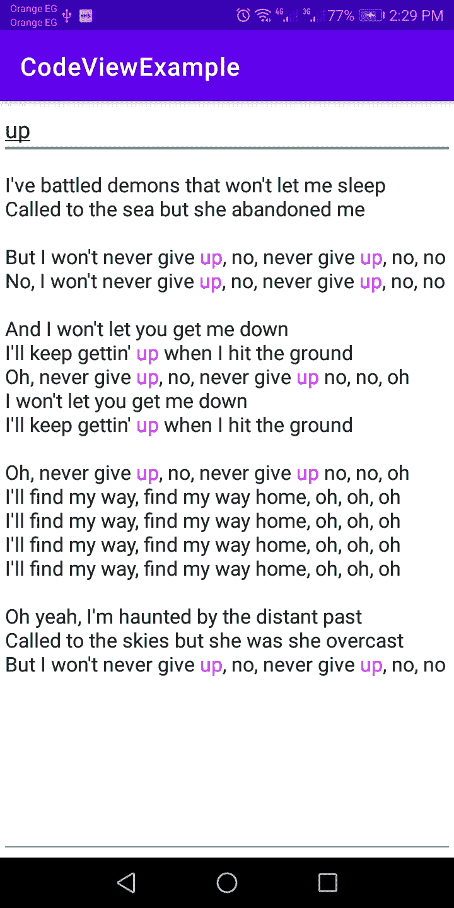

# Android CodeView 突出显示文本的最简单方法

> 原文：<https://itnext.io/android-codeview-the-easiest-way-to-highlight-patterns-53702e0e2164?source=collection_archive---------8----------------------->


嗨，我是 Amr Hesham，一名软件工程师，我对 Android 和编译器开发感兴趣，

在我的第一篇文章中，我写了如何使用 CodeView 库为编程语言创建一个语法高亮器，它具有许多额外的功能，如自动完成、在运行时更改主题和语法等。

第一个想法是在内容共享应用程序中使用它，例如 Twitter，您可以突出显示标签、网站 URL，也可以突出显示电子邮件，使用 CodeView 只需 3 行代码就可以轻松实现这一功能。

```
codeview.addSyntaxPattern(Pattern.*compile*("#[a-zA-z0-9]+"), Color.*BLUE*);
codeview.addSyntaxPattern(Patterns.*WEB_URL*, Color.*BLUE*);
codeview.addSyntaxPattern(Patterns.*EMAIL_ADDRESS*, Color.*BLUE*);
```

您还可以为电子邮件提供商添加自动完成功能，如 [@gmail](http://twitter.com/gmail) 。com 或者[@雅虎](http://twitter.com/yahoo)。最后的结果会是这样的。


带有标签、电子邮件和网站 URL 的代码视图示例

第二个想法是使用带有搜索功能的 CodeView 来突出显示内容中所有匹配的关键字，您可以轻松地突出显示，而无需在所有内容中的位置进行搜索，并添加一些 HTML 标签或范围，以便在用户每次搜索时突出显示一个单词，
，这一功能可以使用几种方法轻松完成。

首先，您需要为您的搜索关键字创建一个模式，它可以是一个普通的字符串，或者您可以让用户使用 regex 进行搜索，而不仅仅是字符串。

```
Pattern keywordPattern = Pattern.*compile*(keyword);
```

在科特林将会是:

```
val keywordPattern : Pattern = Pattern.*compile*(keyword)
```

然后，您需要将该模式添加到 CodeView，并使用您想要突出显示的颜色。

```
codeview.addSyntaxPattern(keywordPattern, Color.*BLUE*);
```

然后，您需要告诉 CodeView 突出显示新的模式。

```
codeview.reHighlightSyntax();
```

一旦用户改变了搜索关键词，你只需要用新的模式替换旧的，有两种方法可以做到这一点。

```
codeview.removeSyntaxPattern(keywordPattern);
```

或者您可以从 CodeView 中移除所有模式

```
codeview.resetSyntaxPatternList();
```

然后你需要添加新的图案并高亮显示

```
codeview.addSyntaxPattern(newkeywordPattern, Color.*BLUE*);
codeview.reHighlightSyntax();
```

而你做了，最后的结果会是这样的。



新航从不放弃歌词

请记住，CodeView 有许多功能，您可以在许多不同的想法中使用它，我只给你两个例子，但这里有越来越多的
你可以在语言应用程序中使用它，例如英语应用程序，使用错误荧光笔，你可以突出拼写错误的单词，或在自动完成中创建一个带有英语单词的笔记应用程序…等等。

你所需要的就是发挥你的想象力和创造力，用 CodeView 创造出伟大的特性。

它非常容易使用，有据可查，在 Github 上有很多例子你可以从 Github 链接中知道如何下载和使用:
[**https://github.com/amrdeveloper/codeview**](https://github.com/amrdeveloper/codeview)

我希望你会喜欢用 CodeView 创建你的编辑器😋。

你可以在:[**Github**](https://github.com/amrdeveloper)[**Linkedin**](https://www.linkedin.com/in/amrdeveloper/)[**Twitter**](https://twitter.com/amrdeveloper)上找到我。

享受编程😋。