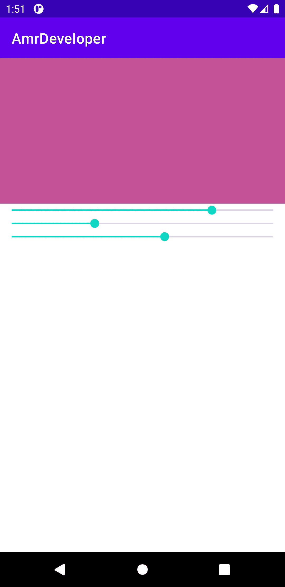

# Android 创建自定义颜色选择器

> 原文：<https://itnext.io/android-create-a-custom-color-picker-d84b32804d1a?source=collection_archive---------3----------------------->


Android 创建自定义颜色选择器

嗨，我是 Amr Hesham，我是一名对 android 开发和编译器设计感兴趣的软件工程师，去年，我创建了一个简单的计时器应用程序，但我想让用户控制所有的 UI 颜色，所以我可以制作一个动态的 UI 颜色支持，例如，用户可以在运行时更改背景，文本，动作栏等颜色，每个用户都应该有自己的主题计时器。

我将在另一篇文章中描述如何在运行时支持动态 UI 颜色，例如 [**Ask.fm**](https://ask.fm/) 让用户在多个主题之间进行选择，或者像我的应用程序一样让用户自定义每个视图。

我所面临的一个问题是，例如，用一个定制的需求来制作一个定制的颜色选择器对话框。

-对话框背景颜色应该是动态的，取决于当前用户的选择。
-对话框按钮或视图应该在运行时根据当前用户的选择而改变。
-对话框应以当前用户值作为默认值开始。
-以后我可以很容易地支持一些功能，如饱和度，阿尔法，亮度…等。
-以后我可以轻松支持多种拾取器类型。

所以我决定创建我的颜色选择器，在这篇文章中，我们将创建一个简单的，你可以根据你的项目需要来改进它。

我们将在活动中创建它，您可以在活动中使用它或将其创建为对话框。

我们将创建 **RGB 颜色选择器**，在我们开始之前，你应该知道，要创建一个颜色，我们需要 3 个值:红色的 R 值、绿色的 G 值和蓝色的 B 值，每个值都在 0 到 255 之间，所以我们可以将每个颜色值表示为一个字节或整数。

在 xml 文件中，我们需要以下视图
- ImageView 来显示当前颜色。
- 3 个搜索条，每个值一个(R，G，B)。

所以我们的活动 XML 会是这样的。

```
<?xml version="1.0" encoding="utf-8"?>
<LinearLayout xmlns:android="[http://schemas.android.com/apk/res/android](http://schemas.android.com/apk/res/android)"
    xmlns:app="[http://schemas.android.com/apk/res-auto](http://schemas.android.com/apk/res-auto)"
    xmlns:tools="[http://schemas.android.com/tools](http://schemas.android.com/tools)"
    android:layout_width="match_parent"
    android:layout_height="match_parent"
    tools:context=".MainActivity"> <ImageView
        android:id="@+id/colorImageView"
        android:layout_width="match_parent"
        android:layout_height="200dp" /> <SeekBar
        android:id="@+id/seekBarR"
        android:layout_width="match_parent"
        android:layout_height="wrap_content"
        android:max="255" /> <SeekBar
        android:id="@+id/seekBarG"
        android:layout_width="match_parent"
        android:layout_height="wrap_content"
        android:max="255" /> <SeekBar
        android:id="@+id/seekBarB"
        android:layout_width="match_parent"
        android:layout_height="wrap_content"
        android:max="255" />
</LinearLayout>
```

在我们的活动中，我们将为 r，g，b 值初始化 4 个视图和 3 个整数或字节，然后我们需要为每个 SeekBar 设置侦听器，这样当用户更改 SeekBar 值时，我们可以获得新值并用新颜色更新我们的 ImageView。

在我们的 SeekBar 更改监听器中，我们的工作很简单，我们只需要知道这个事件是针对哪个 SeekBar 的，就可以知道我们应该更新哪个值。

更新 R、G、B 值后，我们现在可以创建一个颜色值，然后使用该颜色更新 ImageView 背景。

```
public class MainActivity extends AppCompatActivity {

    private ImageView colorImageView; private int redValue = 0;
    private int greenValue = 0;
    private int blueValue = 0; @Override
    protected void onCreate(Bundle savedInstanceState) {
        super.onCreate(savedInstanceState);
        setContentView(R.layout.activity_main); colorImageView = findViewById(R.id.colorImageView);
        SeekBar seekBarR = findViewById(R.id.seekBarR);
        SeekBar seekBarG = findViewById(R.id.seekBarG);
        SeekBar seekBarB = findViewById(R.id.seekBarB); seekBarR.setOnSeekBarChangeListener(mChangeListener);
        seekBarG.setOnSeekBarChangeListener(mChangeListener);
        seekBarB.setOnSeekBarChangeListener(mChangeListener);
    } private final SeekBar.OnSeekBarChangeListener mChangeListener = 
                          new SeekBar.OnSeekBarChangeListener() {
        [@Override](http://twitter.com/Override)
        public void onProgressChanged(SeekBar seekBar,
                                      int progress,
                                      boolean fromUser) {
            int viewId = seekBar.getId();
            switch (viewId) {
                case R.id.seekBarR:
                    redValue = progress;
                    break;
                case R.id.seekBarG:
                    greenValue = progress;
                    break;
                case R.id.seekBarB:
                    blueValue = progress;
                    break;
            }
            int color = Color.rgb(redValue, greenValue, blueValue);
            colorImageView.setBackgroundColor(color);
        }
    };
}
```

恭喜你，现在我们简单的颜色选择器工作正常👌



RGB 颜色选择器演示

现在，您可以使用相同的概念来创建许多不同的颜色选择器，例如，您可以轻松地添加一个 SeekBar 并支持使用 alpha 创建颜色，您所需要的只是一个变量和 SeekBar，然后在侦听器中用 Color.argb 替换 Color.rgb。

现在有了我们的颜色选择器，我们可以自由轻松地改变任何东西，比如颜色、属性数量、字体，你还可以添加动画，创建对话框或活动，甚至是小部件。

通过学习如何创建这个简单的拾色器的概念，你可以使用这个概念产生很多很多的想法，例如用一些 [**颜色理论**](https://en.wikipedia.org/wiki/Color_theory) 的知识，你可以创建一个颜色包推荐，这样用户只需选择一种颜色，你就可以建议什么颜色适合这个颜色， 你也可以用一些图像处理的知识来创建一个图像过滤器，而不是将颜色设置为 ImageView 背景，你将使用它与用户图像来创建一些过滤器，这样你就可以看到它像 [**蝴蝶效应**](https://en.wikipedia.org/wiki/Butterfly_effect) 小新知识会给你许多项目的想法。

现在你可以自由地创建你自己的创造性的颜色选择器。

你可以在: [**Github**](https://github.com/amrdeveloper) ， [**Linkedin**](https://www.linkedin.com/in/amrdeveloper/) ， [**Twitter**](https://twitter.com/amrdeveloper) 上找到我。

享受编程😎。