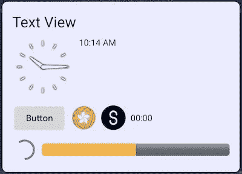
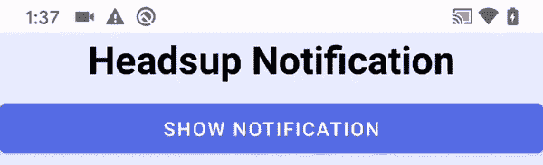
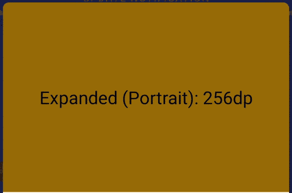
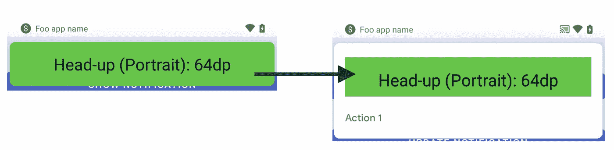
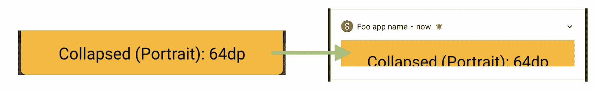
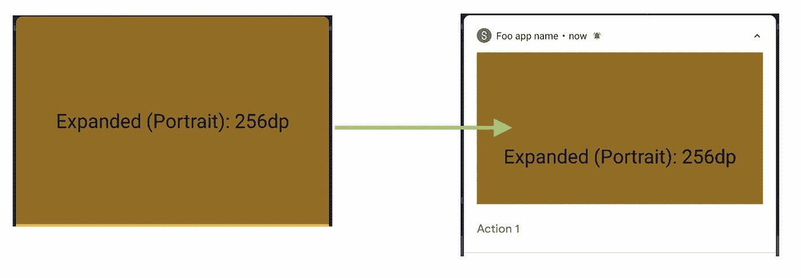
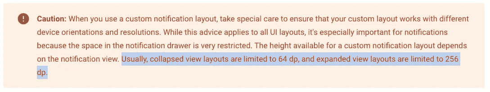
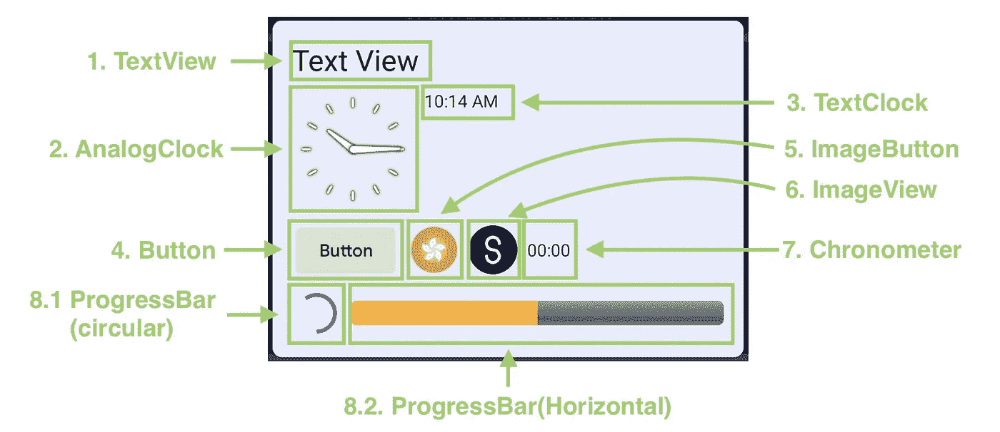

# Android 自定义通知在 6 分钟内完成

> 原文：<https://itnext.io/android-custom-notification-in-6-mins-c2e7e2ddadab?source=collection_archive---------0----------------------->

自定义通知示例

通知是向用户显示信息的著名工具。Android 为开发者提供了几种更好的 UI/UX 通知风格。例如，`[BigTextStyle](/android-notification-bigtextstyle-bd35f7530eae)`用于显示多行的长文本，`MessagingStyle`用于显示对话中的多条消息，`[BigPictureStyle](/android-notification-bigpicturestyle-1f293e6cabaf)`用于显示大图像等。

然而，在不同的通知风格中发现了某些限制。可以定制一个吗？是啊！Android 提供两种类型的定制。一个是在默认内容区域嵌入自定义视图，另一个是完全自定义的视图。

在本文中，我将一步一步地介绍编码部分，讨论其局限性并与您分享技巧。开始吧！

# 可定制视图

一个通知总共有 3 种状态。它们是**平视**、**折叠**和**展开**状态。以下是插图动画:

抬头通知

折叠和展开的通知

# 编码部分

在通知中定制视图不同于从布局资源中膨胀一个`View`。`Notification Builder`只接受通过`RemoteViews`设置视图。

`RemoteViews`是可以在另一个流程中显示的视图层次结构。Android 基于进程间通信(IPC)，每个应用程序都有自己的进程。因此，在实例化一个`RemoteViews`时，不需要我们 app 的`context`。`RemoteViews`仅在我们的应用程序中定义，但在通知抽屉中被系统进程夸大。

## 步骤 1:定义 6 个布局集

如前所述，共有 3 种通知状态，包括抬头、折叠和展开状态。而且 app 可以可选支持人像和风景。因此，必须声明 6 个布局文件。

`RemoteView`仅支持有限的`View`和`ViewGroup`。通知中不能放大任何自定义小部件。这将在下一次会议上详细讨论。

## 步骤 2:声明远程视图

要构建一个`RemoteViews`，包名和布局文件 id 都是必需的。这允许系统正确地指向正确应用包中的正确文件。

## 步骤 3:将自定义`RemoteViews`设置为通知生成器

这一步很简单，只是要求通知生成器使用自定义的`RemoteView`而不是默认的。

## 步骤 4(可选):设置通知生成器样式

通过将`NotificationCompat.Builder`的样式设置为`DecoratedCustomViewStyle()`，所有的自定义`RemoteViews`都被包装到原来放置`contentTitle`和`contentText`的`ViewGroup`中。见下图:

平视通知(左:未设置样式；右:`DecoratedCustomViewStyle is set)`

折叠通知(左:未设置样式；右:`DecoratedCustomViewStyle is set)`

扩展通知(左:未设置样式；右:`DecoratedCustomViewStyle is set)`

**优势**

显示所有默认小工具，包括小图标、应用名称、时间、箭头`ImageButton`和动作按钮列表等。可以减少在定制`RemoteViews`上嵌入这些小部件的工作量。

**缺点**

折叠和展开通知的高度分别限制为 64dp 和 256dp。因此，我们需要注意文本或小部件是否过大，是否被 Android 操作系统裁剪。

展开和折叠通知的高度限制。引自[官方文档网站](https://developer.android.com/training/notify-user/custom-notification)。

# 支持的小部件

`RemoteViews used in` 通知中支持的小部件

`RemoteViews`不支持安卓系统的所有 widgets。支持常见的`ViewGroup`，包括`LinearLayout`、`RelativeLayout`、`FrameLayout`等。仅限于以下`View`:

1.  [文本视图](https://developer.android.com/reference/android/widget/TextView)
2.  [AnalogClock](https://developer.android.com/reference/android/widget/AnalogClock) (该类在 API 级别 23 中已被否决)
3.  [文本时钟](https://developer.android.com/reference/android/widget/TextClock)
4.  [按钮](https://developer.android.com/reference/android/widget/Button)
5.  [ImageButton](https://developer.android.com/reference/android/widget/ImageButton)
6.  [ImageView](https://developer.android.com/reference/android/widget/ImageView)
7.  [天文钟](https://developer.android.com/reference/android/widget/Chronometer)
8.  [进度条](https://developer.android.com/reference/android/widget/ProgressBar)

> 请记住，不支持这些类的后代。例如，`MaterialButton`不被支持，尽管它是`Button`的子类。当使用无效的小部件时，抛出`ActionException`。
> 
> 参考: [RemoteViews 官方文档](https://developer.android.com/reference/android/widget/RemoteViews)

要动态地改变小部件的属性，并不像我们使用`findViewById`那样简单，因为`RemoteViews`限制开发者直接访问小部件。它提供了几个有限的 API 来定制小部件，参见下面的代码示例:

以`Button`为例，`RemoteViews`只提供设置 a `Button`的`onClick`动作的 API。换句话说，**不可能**设置其他动作，如`onLongClick`、`onDrag`和`onHover`监听器！在实现设计者的想法之前，我们必须理解不同部件的局限性😉。

# 式样

不同的设备制造商可以定制通知行的默认背景颜色。如果没有设置自定义`RemoteViews`的背景颜色，文本和背景可能有相似的颜色，即白底白字。

为了保证良好的 UI / UX，建议使用 Android 系统风格来装饰通知中显示的所有`TextView`。以下是建议的风格:

1.  文本外观。材料.通知—用于内容文本
2.  文本外观。材料.通知.标题-标题
3.  文本外观。材料.通知.强调
4.  文本外观。材料.通知.信息
5.  文本外观。材料.通知.行 2
6.  文本外观。材料.通知.时间

# 想了解更多关于 Android 通知的信息:

## 1.BigTextSytle 通知

 [## Android 通知 BigTextStyle 尽可能深

### 通知是普通 app 常见的。当内容太长时，总是使用 BigTextStyle。让我们看看技巧和…

itnext.io](/android-notification-bigtextstyle-bd35f7530eae) 

## 2.BigPictureStyleNotification

 [## Android 通知 BigPictureStyle 尽可能深

### 当您希望在通知行显示图像时，可以使用 BigPictureStyle 通知。这里有一些提示和…

itnext.io](/android-notification-bigpicturestyle-1f293e6cabaf) 

## 3.InboxStyleNotification

 [## 尽可能深入的 Android 收件箱通知

### InboxStyle 通知用于显示收到的电子邮件的片段。我发现一个文档问题。让我们看一看…

itnext.io](/android-inboxstyle-notification-as-deep-as-possible-4d74c0c725f1) 

## 4.Android 通知样式

 [## Android 通知样式

### 通知是通知用户新信息的常用工具。你有没有想过设计它的内容…

itnext.io](/android-notification-styling-cc6b0bb86021) 

# 摘要

1.  在**纵向**和**横向**模式下，通知的所有三种状态，包括平视、折叠和展开状态，都应得到正确处理，以确保良好的 UI/UX。
2.  `RemoteViews`是可以在另一个进程中显示的视图层次。它包含 Android 操作系统的应用包名称和布局资源 id，以便从正确的资源中膨胀正确的`View`。
3.  `RemoteViews`仅限于`View`和`ViewGroup`的某些列表。允许的`View`的所有子类都**不**支持！
4.  在`RemoteViews`中设置属性为`View`的 API 是有限的。在答应设计师和客户之前，最好先搜索一下。
5.  通过将`Notification Builder`的样式设置为`DecoratedCustomViewStyle`，自定义的`RemoteViews`被原本用于内容区域的`ViewGroup`充气包装。
6.  为了提供更好的 UI/UX，如果没有设置通知背景颜色，应该使用 Android 默认的通知文本样式。

# 参考

## **1。安卓通知一体机**

 [## 安卓通知一体机

### 在 21 世纪，通知已经成为每个人日常生活的一部分。作为一个 Android 开发者，最好多了解一些…

itnext.io](/android-notification-all-in-one-8df3e1218e0e) 

## **2。Android 官方文档**

 [## 创建自定义通知布局| Android 开发者

### 为了确保您的通知在不同版本的 Android 上看起来最好，您应该始终使用标准的…

developer.android.com](https://developer.android.com/training/notify-user/custom-notification) 

## 3.RemoteViews 官方文档

 [## RemoteViews | Android 开发者

### AccessibilityServiceMagnificationController . OnMagnificationChangedListener

developer.android.com](https://developer.android.com/reference/android/widget/RemoteViews#RemoteViews%28java.lang.String,%20int%29) 

欢迎您通过[Twitter @ my rik _ chow](https://twitter.com/myrick_chow)关注我，了解更多信息和文章。感谢您阅读这篇文章。祝您愉快！😄