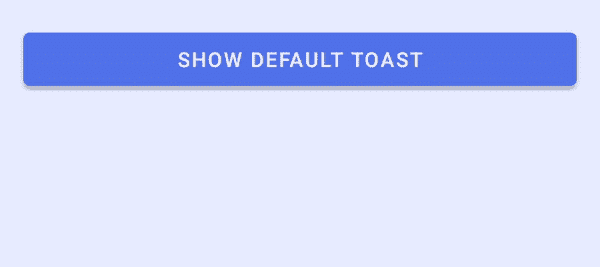
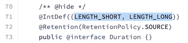
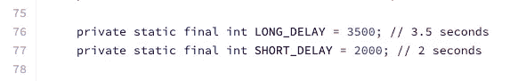
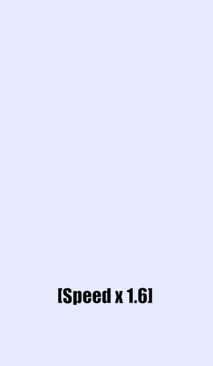
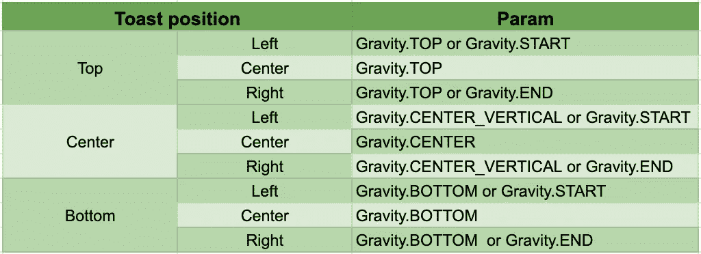
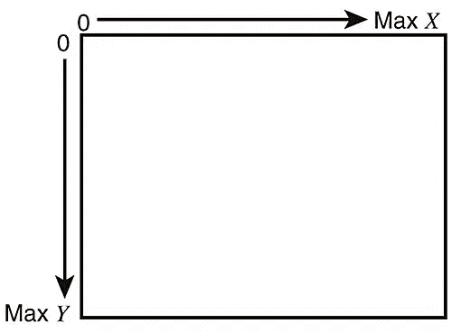
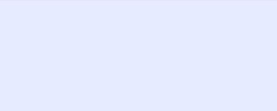
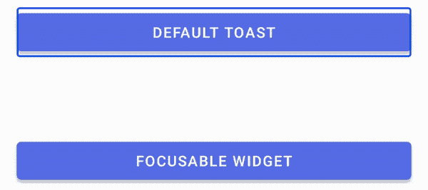
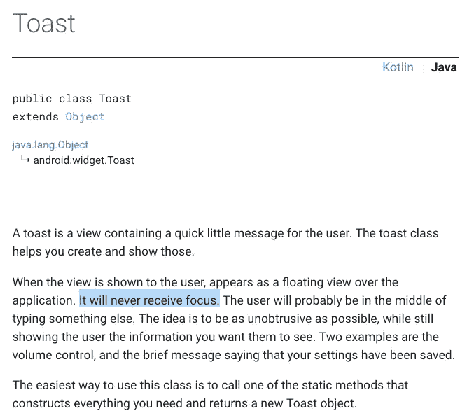
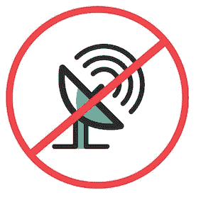

# 安卓定制吐司

> 原文：<https://itnext.io/android-custom-toast-37f97aa373c3?source=collection_archive---------3----------------------->

`Toast`是一种简单方便的向用户显示短消息的方式。它的实现只有一行代码，如下所示:

然而，除了简单地显示一个句子之外，您是否探索过其他功能？开发者可以通过设置自定义布局来定制`Toast`，并在应用程序窗口中定义位置。此外，还有一个关于视觉无障碍处理的技巧( **Talkback** )！

本文将对`Toast`的以下属性共涵盖四个功能:

1.  自定义布局
2.  持续时间
3.  有偏移量的位置
4.  水平和垂直边距

*在 Android 11 预览版 2 中，有关于自定义`Toast`和呈现限制的新更新。你可以在这里了解更多:

 [## Android 11 吐司更新

### 关于吐司，Android 11 有哪些更新？定制吐司受到限制，定制吐司不能…

medium.com](https://medium.com/@myrickchow32/android-11-toast-updates-7f1cd2245bc4) 

## 属性 1:自定义布局

自定义布局 xml 文件

自定义 Toast 类文件

`setView(view: View)`可用于设置`Toast`的自定义视图。自定义布局可以通过以下方式膨胀:

1.  `LayoutInflater`
2.  `DataBindingUtil`(如果使用数据绑定)

## 属性 2:持续时间(2.0 秒对 3.5 秒)

`Toast`的持续时间限于`LENGTH_SHORT`和`LENGTH_LONG`中的一个。

[Toast 源代码](https://android.googlesource.com/platform/frameworks/base/+/f4bed684c939b0f8809ef404b8609fe4ef849263/core/java/android/widget/Toast.java)的第 70–73 行

虽然没有关于以上两种选择定义的文档，但是 [NotificationManagerService 源代码](https://android.googlesource.com/platform/frameworks/base/+/f76a50c/services/java/com/android/server/NotificationManagerService.java)明确指出了长度。(感谢您提供的[堆栈溢出信息](https://stackoverflow.com/a/5079536/11219784))

[NotificationManagerService 源代码](https://android.googlesource.com/platform/frameworks/base/+/f76a50c/services/java/com/android/server/NotificationManagerService.java)的第 75–78 行

## 属性 3:重力+偏移

`Gravity`可以想象为一种把一个观点推向那个方向的力量。它属于`Integer`类型，可以设置为以下 7 个常量的任意**位组合**:

1.  *重力。启动/重力。左侧*
2.  *重力。结束/重力。右*
3.  *重力。顶部*
4.  *重力。底部*
5.  *重力。居中*
6.  *重力。居中 _ 垂直*
7.  *重力。居中 _ 水平*

左上角显示的示例代码:

以下是`Toast`位置和相应的`gravity`位组合之间的映射的完整列表:

那么，`setGravity`函数中使用的`horizontalOffset`和`verticalOffset`是什么意思呢？

Android 中坐标系统的图示

在 Android 中，坐标系的原点永远是左上角。横轴用从左到右递增的`x`值表示。纵轴用从上到下递增的`y`值表示。

因此，可以设置这些值，将`Toast`从其原始位置移开。请参见下面的示例:

吐司中水平和垂直偏移的图示

## 属性 4:边距

乍一看，很容易忽略`setMargin`功能中使用的参数单位。不像[视图组。MarginLayoutParams](https://developer.android.com/reference/android/view/ViewGroup.MarginLayoutParams.html#setMargins(int,%20int,%20int,%20int)) ，不使用**像素**作为单位。它实际上代表集装箱宽度或高度的百分比**。**

**`setMargin`显示了与上述`setGravity`功能中使用的水平和垂直偏移类似的行为。但是，它适用于双向，即顶部和底部/左侧和右侧。**

**以下扩展函数可以帮助您计算正确的百分比:**

**用法:**

# **视觉无障碍问题**

****

**根据谷歌官方文档，`Toast`无论如何都无法聚焦。换句话说，视觉障碍者无法通过 Android talk back Accessibility Tool(在一些设备中也被命名为“语音助手”)获得关于`Toast`消息的通知。**

****

**要了解更多关于**对讲**的信息，请阅读以下参考资料:**

 **[## 打开对讲

### 对讲屏幕阅读器给你口头反馈和通知。按住两个音量键 3 秒钟。如果…

support.google.com](https://support.google.com/accessibility/android/answer/6007100?hl=en-GB)** 

# **烤面包的限制**

****

**`Toast`是一个超级简单的小部件，没有监听器通知开发者它的状态。例如，与`DialogFragment`不同，`Toast`没有一个`onCancelListener()`来通知`Toast`何时淡出屏幕。下面是`DialogFragment`中使用的`DialogInterface`的`onCancelListener`文档。**

** [## 对话界面。安卓开发者

### AccessibilityServiceMagnificationController . OnMagnificationChangedListener

developer.android.com](https://developer.android.com/reference/android/content/DialogInterface.OnCancelListener)** 

# **结论**

**Toast 除了简单地显示消息之外，还有许多功能。**

## **吐司可以是:**

1.  **用自定义布局显示，例如用`ImageView`**
2.  **以两种不同的持续时间显示，即 2.0 秒和 3.5 秒**
3.  **通过其`gravity`和`x-y offset`的组合在屏幕上显示自定义位置**
4.  **显示有双向边距**

## **吐司不能:**

1.  **被聚焦或点击。这给视障人士带来了极大的不便。**
2.  **通知应用程序它的当前状态，例如取消的回调**

# **进一步阅读:**

1.  **Android 11 吐司更新**

** [## Android 11 吐司更新

### 关于吐司，Android 11 有哪些更新？定制吐司受到限制，定制吐司不能…

medium.com](https://medium.com/@myrickchow32/android-11-toast-updates-7f1cd2245bc4) 

2.Toast 课程概述

 [## 祝酒词概述| Android 开发者

### toast 在一个小弹出窗口中提供关于操作的简单反馈。它仅填充…所需的空间量

developer.android.com](https://developer.android.com/guide/topics/ui/notifiers/toasts) 

3.Toast 函数和属性定义

 [## 吐司|安卓开发者

### AccessibilityServiceMagnificationController . OnMagnificationChangedListener

developer.android.com](https://developer.android.com/reference/android/widget/Toast.html) 

4.Toast 开源代码

 [## Google 上的 core/Java/Android/widget/toast . Java-platform/frameworks/base-Git

### Android/platform/frameworks/base/F4 bed 684 c 939 b 0 f 8809 ef 404 b 8609 Fe 4 ef 849263/。/ core / java / android / widget…

android.googlesource.com](https://android.googlesource.com/platform/frameworks/base/+/f4bed684c939b0f8809ef404b8609fe4ef849263/core/java/android/widget/Toast.java) 

欢迎关注我的[Twitter @ my rik _ chow](https://twitter.com/myrick_chow)了解更多信息。感谢您阅读这篇文章。祝您愉快！😄**