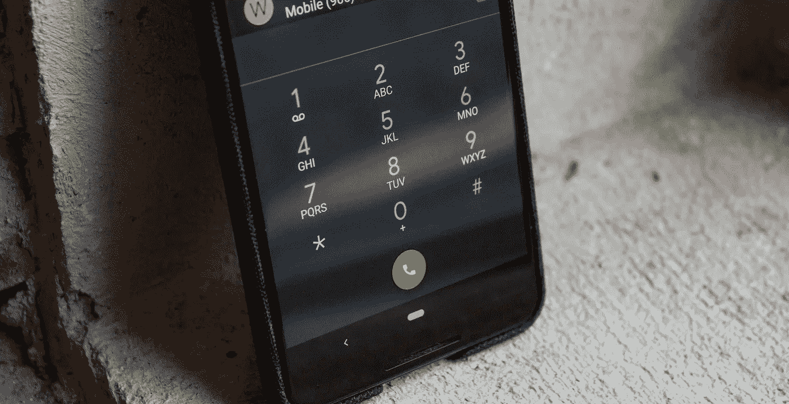
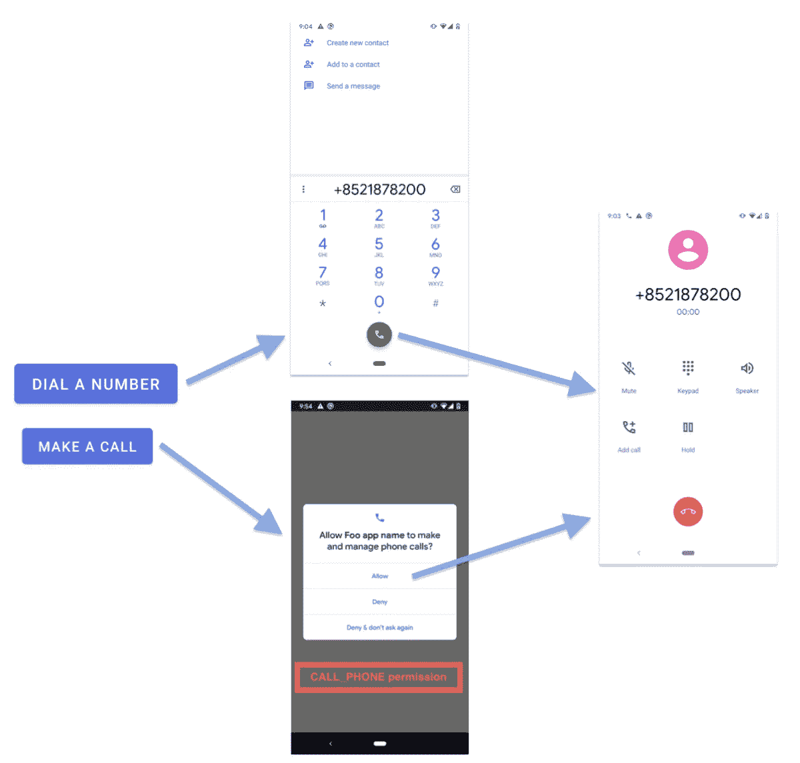
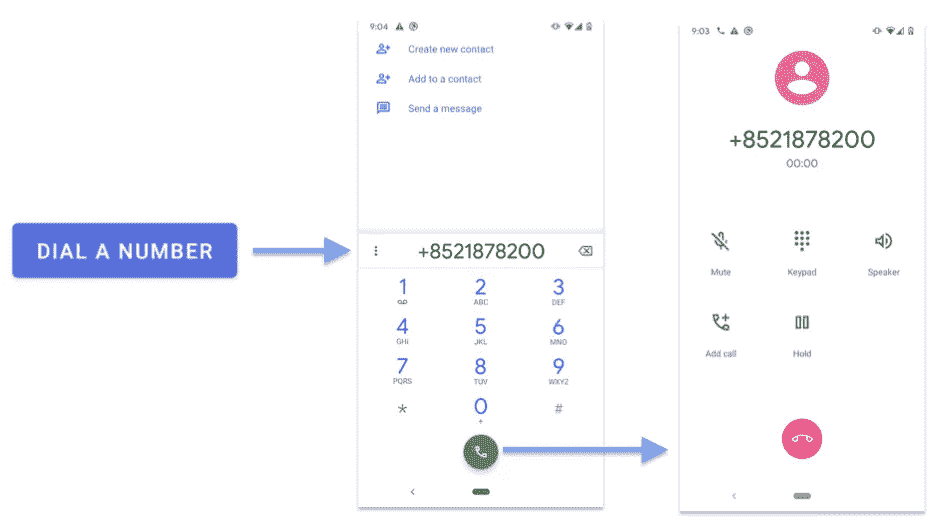
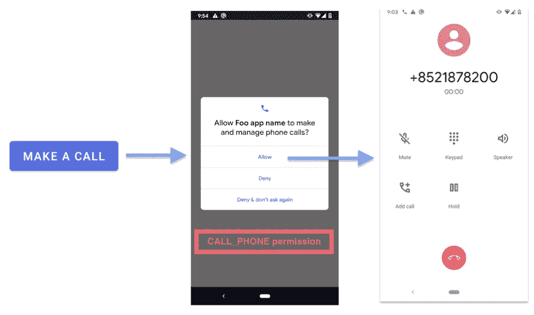

# Android 电话拨号程序

> 原文：<https://itnext.io/android-dial-phone-programmatically-5ea3714d801d?source=collection_archive---------1----------------------->

你想象过你的应用程序可以直接给你打电话吗？是的，Android 手机只需几个步骤就可以轻松地为您做到这一点！

直接打电话和拨号的思维导图

Android 提供了两种从应用程序拨打电话号码的方式——一种是将用户引导至系统“电话”应用程序的**键盘页面**,另一种是**直接为用户拨打**电话。为了提供更流畅的用户体验，应该考虑后一种方法，但开发人员应该仔细考虑运行时权限(`CALL_PHONE`)。

在本文中，我将介绍实现这个流程的步骤和细节。

# 电话 URI 标准

在开始编码之前，有一个 [IETF 标准](https://tools.ietf.org/html/rfc3966)为电话呼叫定义了 URI 规范。URI 的一个电话包含四个部分:

1.  **模式** : `tel:`定义这个 URI 代表一个电话呼叫
2.  **保留字符** : "+"定义国家代码的开始
3.  **国家代码**:长度从 1 到 4 个数字，如`852`代表香港
4.  **电话号码**:不言自明

下面是一个电话号码为“1878200”的 URI 打电话到香港(+852)的例子。整体 URI 为`tel:+8521878200`。

# 方法 1)拨打一个号码(免权限)

拨打电话号码的思维导图

**第一步:** 我们要通过`Uri.parse()`函数将可读的电话字符串解析为`Uri`对象。

**第二步:**
将`Intent`的`Intent Action`设置为`Intent.ACTION_DIAL`，这样安卓系统可以过滤并把拨号动作委托给任何可以打电话的 app。

**步骤 3:** 将电话呼叫 URI 设置到意向数据，以便将电话号码传递到目标电话呼叫 app。

**第四步:** 启动一个可以接受打电话的`Activity`。

# 方法 2)直接打电话

直接打电话的思维导图

直接拨打电话的步骤类似于拨打电话，只是它需要运行时权限`CALL_PHONE`和新的`Intent Action` `Intent.ACTION_CALL`(参见上面代码的第 15 行)。

[CALL_PHONE](https://developer.android.com/reference/android/Manifest.permission#CALL_PHONE) 权限是一个危险的运行时权限，因为它可以直接实例化一个电话呼叫，而无需通过拨号用户界面让用户确认呼叫。

要请求`CALL_PHONE`权限，建议使用简单的`RxPermissions`库，它在请求权限期间负责`Activity`的生命周期。有关设置，请参见第 6 行至第 9 行。

# 摘要

1.  应用程序可以帮助用户直接拨打电话或在系统电话应用程序中拨打电话号码。
2.  拨打一个电话号码是免权限的，而且很容易使用。然而，它不太用户友好，因为它要求用户按下拨号按钮来打电话。
3.  直接打电话需要`CALL_PHONE`运行时权限，但可以提供更好的用户体验。
4.  电话 URI 标准由 IETF 定义，由 4 部分组成，即模式、保留加号、国家代码和电话号码。

# 参考

1.  [安卓权限通话 _ 电话](https://developer.android.com/reference/android/Manifest.permission#CALL_PHONE)
2.  [IETF —电话号码的电话 URI](https://www.ietf.org/rfc/rfc3966.txt)

欢迎您关注我的[Twitter @ my rik _ chow](https://twitter.com/myrick_chow)了解更多信息。感谢您阅读这篇文章。祝您愉快！😄