# Android Firebase 身份验证 SDK—电子邮件和密码登录

> 原文：<https://itnext.io/android-firebase-authentication-email-and-password-login-b06980cf864a?source=collection_archive---------3----------------------->

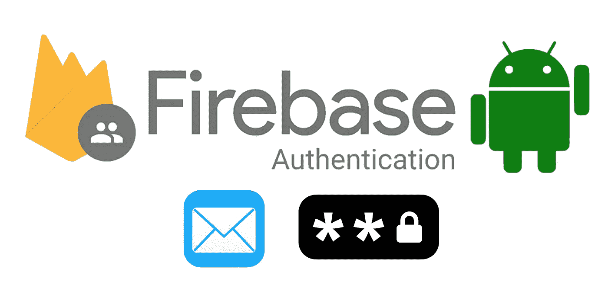

irebase 是一个强大的平台，它提供了许多功能，包括**云消息**、**云功能**和**云 Firestore** 等。其中一个有用的特性是 **Firebase 认证**。它允许开发人员直接创建和管理用户帐户，而不用关心底层的服务器代码！根据 Firestore 安全规则，登录的用户可以拥有令牌来访问 Firestore 中的安全数据。

Firebase 提供了丰富的认证方式，包括**邮箱/密码**、**谷歌登录**、**脸书登录**和**苹果登录**等。在本文中，我们将详细介绍**电子邮件/密码认证**的细节和缺陷。以下是内容列表:

1.  先决条件(4 个步骤)
2.  注册
3.  登录
4.  注销
5.  忘记/重置密码
6.  更新密码
7.  更新电子邮件
8.  删除用户帐户
9.  设置重置密码的电子邮件模板
10.  限制

# 先决条件(4 个步骤):

1.  在 [Firebase 控制台](https://console.firebase.google.com/)用 Android app 创建一个项目，用`google-services.json`将 Firebase 项目链接到您的 Android app，T0 是您注册 app 时生成的文件，包含重要信息，如`project_id`、`package_name`和`api_key`。

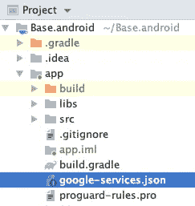

google-services.json 必须放在当前模块(app)文件夹中。

2.项目`build.gradle`文件的设置

3.在模块`app.gradle`文件中设置

请参考 [Firebase Android 发行说明](https://firebase.google.com/support/release-notes/android)获取最新版本的 Firebase 认证 SDK，。写这篇文章的时候是`19.2.0`。

4.在 Firebase 控制台启用电子邮件/密码功能:

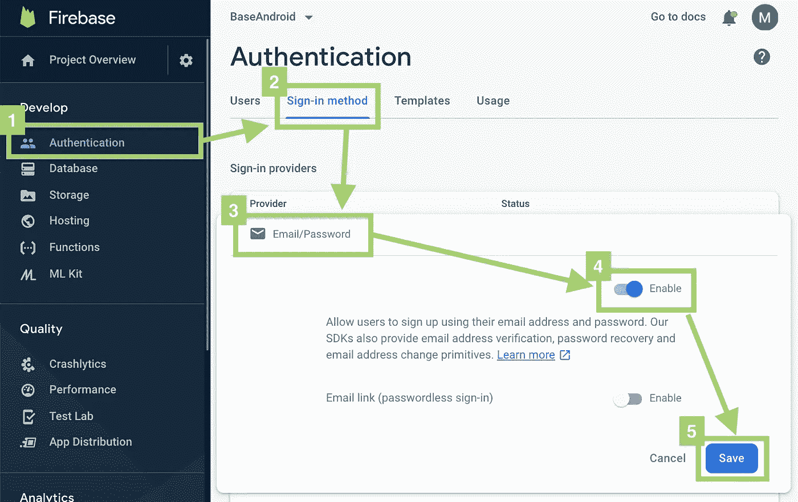

启用电子邮件/密码功能的步骤

# 功能 1)注册

注册一个新账户就像调用一个函数`createUserWithEmailAndPassword(email: String, password: String)`一样简单。`OnCompleteListener`无论账户创建成功与否，当 Firebase 控制台有响应返回时触发。

成功创建帐户时触发`OnSuccessListener`。新用户的信息可以通过代码`FirebaseAuth.getInstance().*currentUser*` *进行检索。*账户创建后，用户自动登录。不需要调用签到功能！

当控制台拒绝创建帐户时，触发`OnFailureListener`。以下是可能的情况:

1.  `FirebaseAuthException` — `Email/Password`登录提供者被禁用；开发人员应该在 Firebase 控制台启用它。参见上述**先决条件**环节的第 4 点。
2.  `FirebaseAuthUserCollisionException` —该电子邮件地址已被另一个帐户使用
3.  `FirebaseAuthInvalidCredentialsException` *—* 电子邮件地址格式不正确，例如`example@!?!?.com`
4.  `FirebaseAuthWeakPasswordException` —给定的密码无效。[密码至少应包含 6 个字符]

因此，在调用`signInWithEmailAndPassword`函数之前进行邮件格式检查是明智的。

# 功能 2)登录

通过调用`signInWithEmailAndPassword(email: String, password: String)`，用户可以轻松登录。签到功能还有 3 个回调(`OnCompleteListener`、`OnSuccessListener`、`OnFailureListener`)，用户信息在`OnSucessListener`准备好。

下面是一些可能引发`OnFailureListener`的异常:

1.  `FirebaseAuthInvalidCredentialsException`:密码无效或用户没有密码。没有匹配的电子邮件帐户或密码。
2.  `FirebaseAuthInvalidUserException` —用户帐户已被管理员禁用。

> *请注意，用户可以在不注销当前帐户的情况下登录另一个帐户。为了防止现有用户信息被意外覆盖，开发人员应该在显示登录页面之前手动检查用户状态。

# 功能 3)注销当前用户

注销不同于可以通过回调添加的登录和注册功能。它只在本地清除当前用户信息和令牌，因此它不是一个异步函数，不需要任何回调。

# 功能 4)忘记/重置密码

Firebase 将向用户发送一封重置密码电子邮件，其中包含一个链接，将用户导向重置密码网页。默认的电子邮件模板是多语言和可定制的。以下是英文和繁体中文版本的示例:

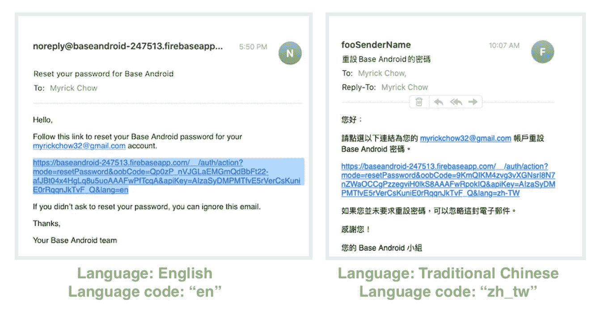

通过使用`setLanguageCode(code: String)`功能，将向用户发送不同语言的电子邮件。这里是[支持的语言列表](https://github.com/firebase/firebaseui-web/blob/master/LANGUAGES.md)和一些例子:

1.  `en` —英语
2.  `en_gb` —英语(英国)
3.  `zh_tw` —繁体中文
4.  `zh_cn` —简体中文

> *请注意，在您自定义模板内容后，您必须[创建自定义电子邮件操作处理程序](https://firebase.google.com/docs/auth/custom-email-handler)以支持多语言电子邮件模板。

## 选项 1(更简单) :通过 Firebase 控制台

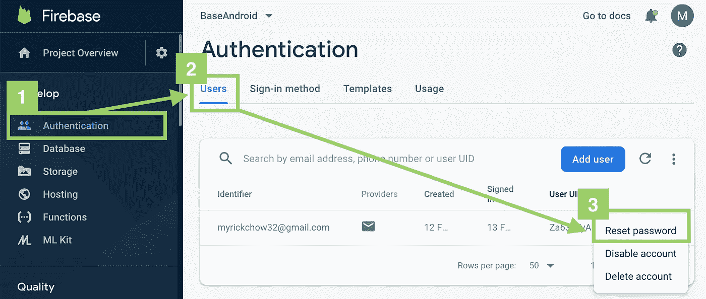

向用户发送重置密码电子邮件的步骤

## 选项 2:以编程方式

通过使用`sendPasswordResetEmail(email: String)`，用户将收到从 Firebase 控制台发送的重置密码电子邮件。通过单击电子邮件中嵌入的链接，用户将被定向到重置密码网页。以下是 Firebase 项目的默认模板。

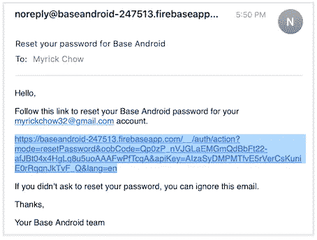

重置密码的默认电子邮件模板

函数中可能会抛出一些异常:

1.  `FirebaseAuthInvalidUserException`—当 Firebase 找不到具有已发送帐户电子邮件地址的帐户时。
2.  `FirebaseAuthInvalidCredentialsException`:电子邮件地址格式不正确，例如`example@!?!?!?.com`

你对管理员禁用用户帐号的情况感到好奇吗？它不会**而不是**抛出异常，重置密码邮件可以成功发送！Firebase 仅在用户试图在重置密码网页重置密码时抛出错误。在我看来，这并不完美，Android SDK 在这种情况下抛出一个异常应该更好。

网页重置密码的总体流程:

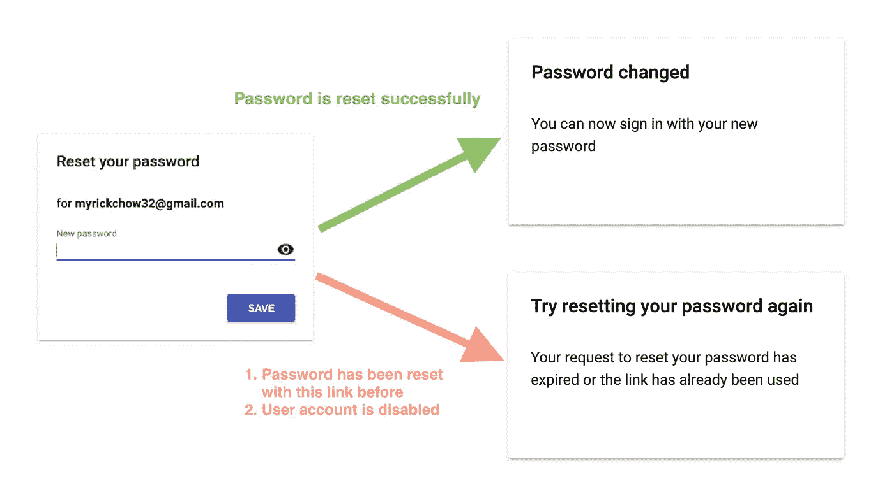

> *请注意，重置电子邮件地址后，原始用户凭证将不再有效，用户必须再次登录以更新其令牌，否则所有其他用于更新个人信息的功能将抛出`FirebaseAuthInvalidUserException`。

# 功能 5)更新密码

通过调用`updatePassword(password: String)`函数直接更新密码。密码必须至少包含 6 个字符。

1.  `FirebaseAuthInvalidUserException`:用户账号已被管理员禁用。
2.  `FirebaseAuthWeakPasswordException` —给定的密码无效。[密码至少应包含 6 个字符]

# 功能 6)更新电子邮件

更新邮件与更新密码有些不同，虽然它也是调用一行代码`updateEmail(newEmail: String)`。

在 Firebase 服务器上成功更改登录电子邮件后，会向用户发送一封确认电子邮件。由于垃圾邮件防护的 Firebase 策略，电子邮件模板不可定制。以下是确认电子邮件的示例:

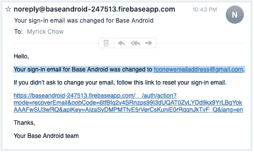

可能的例外情况:

1.  `FirebaseAuthUserCollisionException` :
    案例 1:该电子邮件地址目前正被另一个账户使用。
    案例 2:虽然该电子邮件地址目前没有被其他帐户占用，但它是其他用户注册的初始电子邮件。
2.  `FirebaseAuthInvalidUserException`:用户账号已被管理员禁用。
3.  `FirebaseAuthInvalidCredentialsException`:电子邮件地址格式不正确。

# 功能 7)删除用户帐户

删除一个用户账号就像调用当前登录用户对象的`delete()`函数一样简单。然而，仍然有一种可能的失败情况:

1.  `FirebaseAuthInvalidUserException`:用户账号已被管理员禁用。

> *请注意，删除的帐户是不可恢复的，开发者应该在应用程序端警告用户，以获得更好的用户体验。

# 定制电子邮件模板

上面已经介绍了两种电子邮件——重置密码电子邮件和更新电子邮件地址电子邮件。然而，只有重置密码电子邮件模板可以由管理员自由更改。由于垃圾邮件阻止的 Firebase 策略，禁止更新电子邮件地址模板。您可以在以下页面中自定义密码重置电子邮件模板:

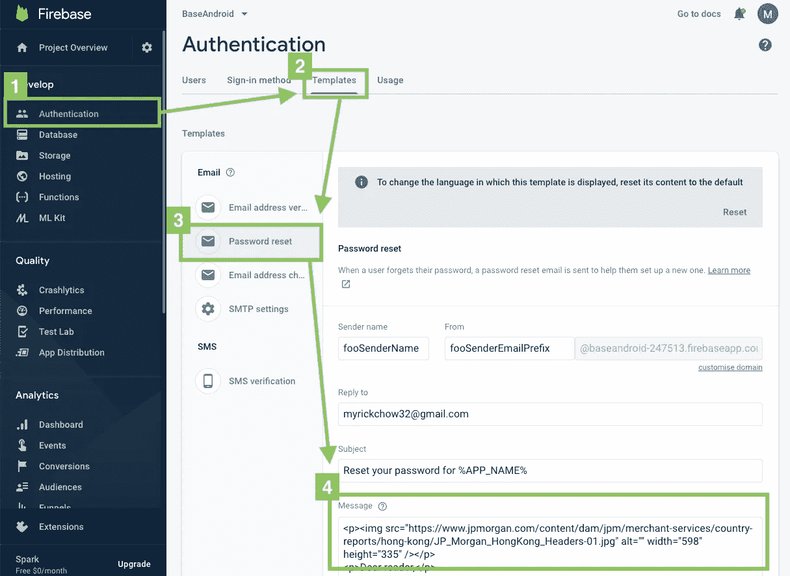

自定义密码重置电子邮件模板的步骤

最初的密码重置电子邮件模板非常简单，包含三个 Firebase 标签:

1.  `%LINK%` **(必需)**:用户可以重置其密码的链接
2.  `%APP_NAME%`:你的应用程序的公共名称
3.  `%EMAIL%`:用户的电子邮件地址

重置密码的电子邮件模板示例

在 HTML 代码和 Firebase 标签的帮助下，我们可以定制布局和内容。请参见下面的示例:

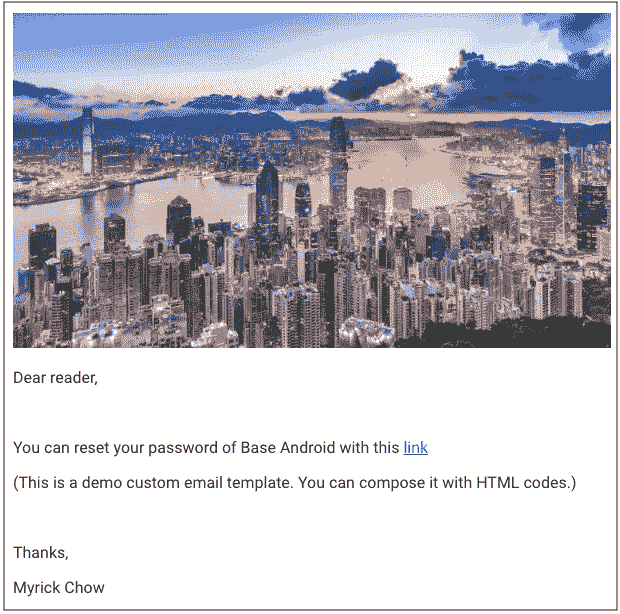

定制电子邮件模板示例

# 限制

为了防止滥用帐户创建，Firebase 限制一个小时内只能从同一个 IP 地址创建 100 个帐户。在开发和 QA 阶段不方便。可以从 [Firebase 控制台](https://console.firebase.google.com/project/_/authentication/providers)临时更改该配额**。
.每个 IP 地址每小时最多注册人数:100
.计划时间:本年度内(365 天)
.最大天数范围:7 天
设置可能需要一个小时**才能生效**。**

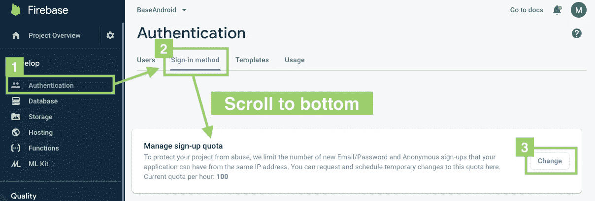

配置注册配额的步骤(每个 IP 一小时)

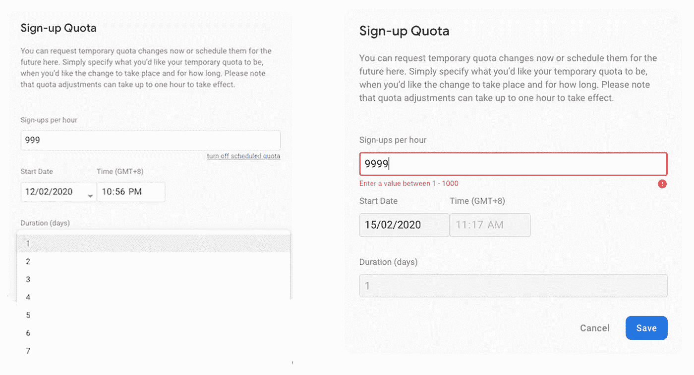

注册配额配置设置对话框

# 摘要

1.  Firebase 认证提供了许多注册选项，其中之一是电子邮件/密码。
2.  Firebase SDK 提供了注册、登录、退出、更新邮箱和密码、重置密码和删除帐户的功能。
3.  几乎所有的函数，除了注销函数，都是异步函数，有 3 个回调函数来监听不同的事件。他们是`OnCompleteListener`、`OnSuccessListener`和`OnFailureListener`。
4.  `OnCompleteListener`无论请求成功与否，当 Firebase 系统有响应时触发。
5.  当请求在 Firebase 系统中被接受并完成时,`OnSuccessListener`被触发。
6.  当请求在 Firebase 系统中被拒绝时`OnFailureListener`被触发。
7.  只有未被占用的电子邮件地址和非初始注册电子邮件地址能够用于更新登录电子邮件地址。
8.  通过调用函数`setLanguageCode(locale: String)`，可以向不同语言的用户发送默认重置密码邮件。
9.  在 Firebase 系统中只能自定义重置密码模板。自定义重置密码电子邮件模板后，必须实施[自定义电子邮件操作处理程序](https://firebase.google.com/docs/auth/custom-email-handler)以支持多语言功能。
10.  只有 100 个新帐户可以在同一 IP 每小时创建。它可以临时配置多达 1000 个新帐户，最长持续时间为 7 天。

# 阅读更多(iOS 版)

 [## iOS Firebase 身份验证 SDK —电子邮件和密码登录

### Firebase 提供了一个简单的 SDK 来验证用户的电子邮件和密码。电子邮件模板也可以定制…

medium.com](https://medium.com/@myrickchow32/ios-firebase-authentication-sdk-email-and-password-login-6a3bb27e0536) 

# 参考:

## 1.使用电子邮件/密码登录的 Firebase 身份验证

 [## 在 Android 上使用基于密码的帐户通过 Firebase 进行认证

### 您可以使用 Firebase 身份验证让您的用户使用他们的电子邮件地址和…

firebase.google.com](https://firebase.google.com/docs/auth/android/password-auth) 

## 2.FirebaseUser 官方文档

 [## Firebase 用户| Firebase

### 分析用户属性允许个性化信号

firebase.google.com](https://firebase.google.com/docs/reference/android/com/google/firebase/auth/FirebaseUser) 

如需了解更多信息，请在[Twitter @ myrik _ chow](https://twitter.com/myrick_chow)关注我。感谢您阅读这篇文章。祝您愉快！😄