# 尽可能深入的 Android 收件箱通知

> 原文：<https://itnext.io/android-inboxstyle-notification-as-deep-as-possible-4d74c0c725f1?source=collection_archive---------4----------------------->

I nboxStyle 通知是 Android 官方提供的通知样式之一。在展开状态下，比折叠状态下多了几行用于向用户显示更多信息。与`BigTextStyle`通知不同，每一行被固定为一行，当内容太长时会在末尾被截断。示例用例是从收到的电子邮件中添加片段。

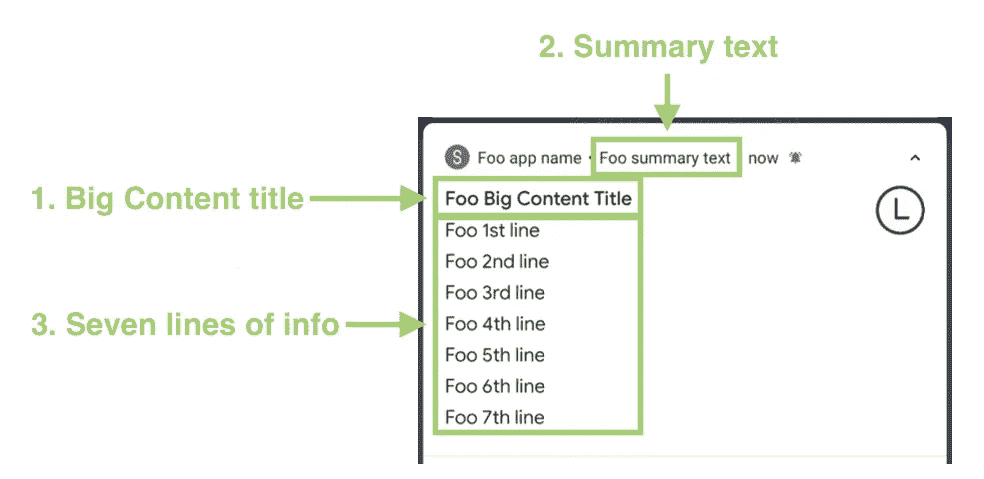

收件箱通知的剖析

在`InboxSytle`通知中，有 3 个属性可以配置。他们是`BigContentTitle`、`SummaryText`和`line`。它们都可以通过有限的`[HTML](https://developer.android.com/guide/topics/resources/string-resource#StylingWithHTML)` [标签](https://developer.android.com/guide/topics/resources/string-resource#StylingWithHTML)或[span ables](https://developer.android.com/guide/topics/resources/string-resource#StylingWithSpannables)来设计。

在我研究`InboxStyle`的过程中，我意外地发现了一个 Android 文档问题，我已经将它提交给了 [Google Issue Tracker](https://issuetracker.google.com/issues/152430539) ，并将它包含在本文的后面部分。开始吧！

# 一体化代码

## 1.BigContentTitle (CharSequence)

BigContentTitle 的位置

此`BigContentTitle`仅在 BigText 通知为**展开**时显示。它替代了在通知构建器中设置的`contentTitle`(参见上面示例代码的第 27 行)。

## 2.SummaryText(字符序列)

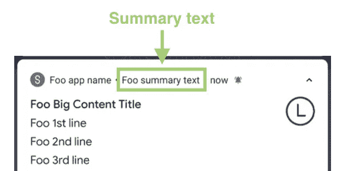

摘要文本的位置

这是显示在应用程序名称和通知的时间(时间)属性之间的补充文本。

> *记住这个* `*summaryText*` *被* `*NotificationBuilder*` *的* `*subText*` *覆盖。参见上面显示的示例代码的第 31 行。*

## 3.线条

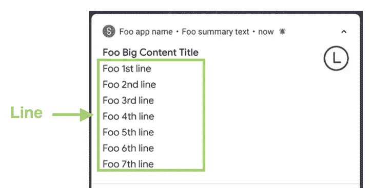

线的位置

每一行由一个单独的`TextView`代表，并固定成单行。当文本太长时，会在末尾被截断。

在不同的官方文档页面上，对线的限制存在差异。这个[官方页面](https://developer.android.com/training/notify-user/expanded#inbox-style)说明限制为 6，而[另一个](https://developer.android.com/reference/android/app/Notification.InboxStyle)说明限制为 5。那么哪个是正确的呢？

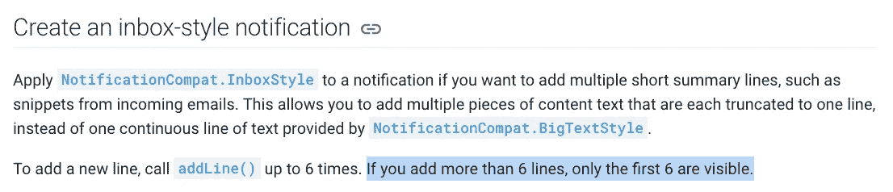

通知创建[正式文档](https://developer.android.com/training/notify-user/expanded#inbox-style)

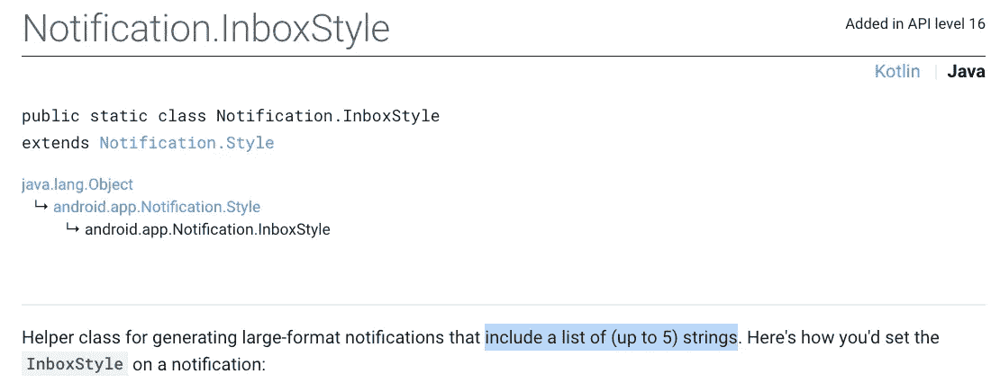

通知。收件箱样式[正式文档](https://developer.android.com/reference/android/app/Notification.InboxStyle)

我在研究`InboxStyle`的时候被这些文献搞糊涂了。于是，我决定通读`InboxStyle` [开源代码](https://android.googlesource.com/platform/frameworks/base/+/master/core/java/android/app/Notification.java)，最终找出一个神秘的答案——最大行数居然是 7！

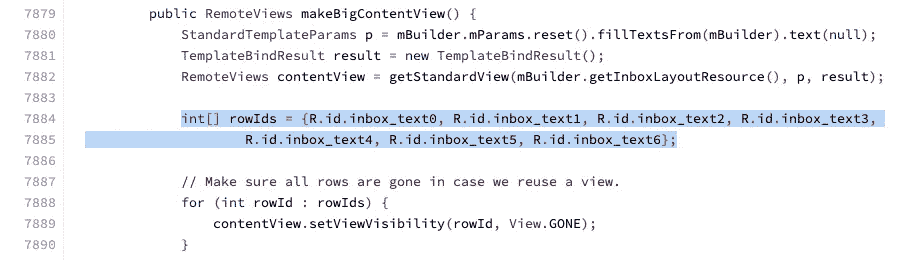

从第 7879 行开始，调用了`makeBigContentView`函数来构建通知展开状态的视图。在第 7884 行，`rowIds`数组由一组 7 个视图 id 构成，每个 id 指向一个`TextView`。此时此刻，我很好奇最大行数是不是 7。运行以下代码后，第 8 行没有显示出来，这证实了我的怀疑。

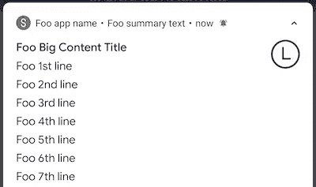

那么，我们可以说最大行数是"**总是** " 7 吗？不要！我们来看看 7898 线。最大行数必须减少 1，以便释放空间来显示一行操作按钮。

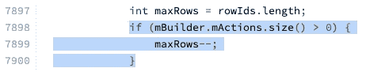

参见以下代码:

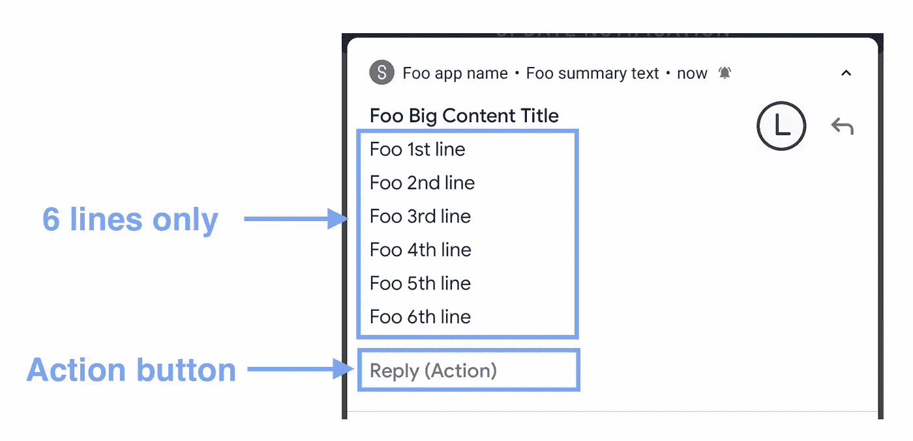

带有操作按钮的屏幕截图

有没有更没有记录的情况，最大行数不是 6 也不是 7？是的，它是添加的远程输入历史的数量。参见第 7901 行到第 7922 行的代码。：

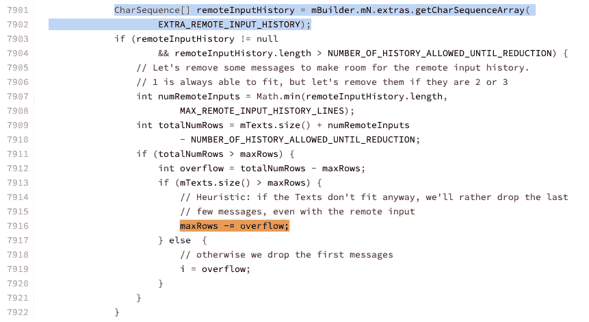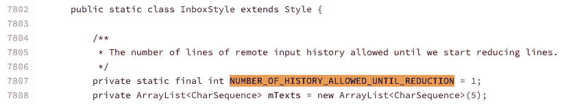

显示 NUMBER _ OR _ HISTORY _ ALLOWED _ UNTIL _ REDUCTION 值的源代码

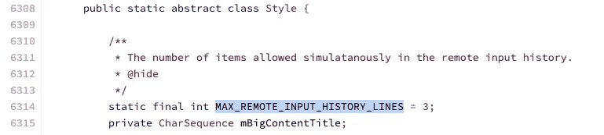

显示 MAX _ REMOTE _ INPUT _ HISTOYR _ LINES 值的源代码

这些代码意味着当有 2 个以上的远程输入历史时，最大行数将减少。此外，最多只能同时显示 3 个远程输入历史。

以下是验证代码和结果截图:

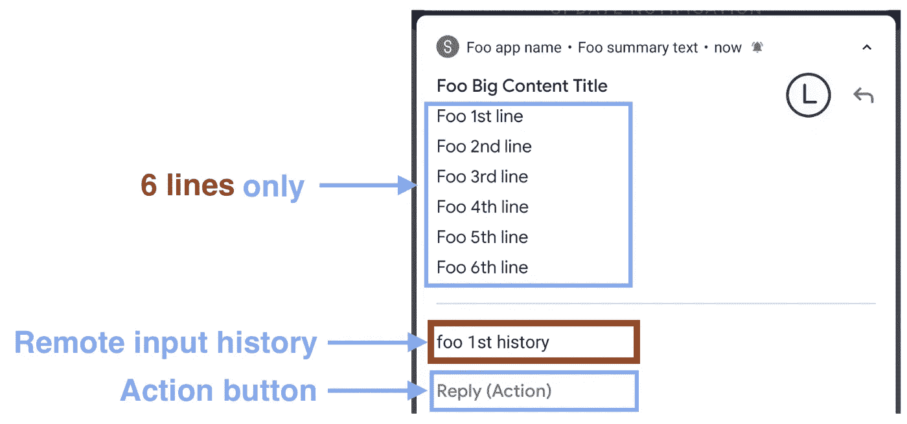

只有 1 个远程输入历史时的屏幕截图

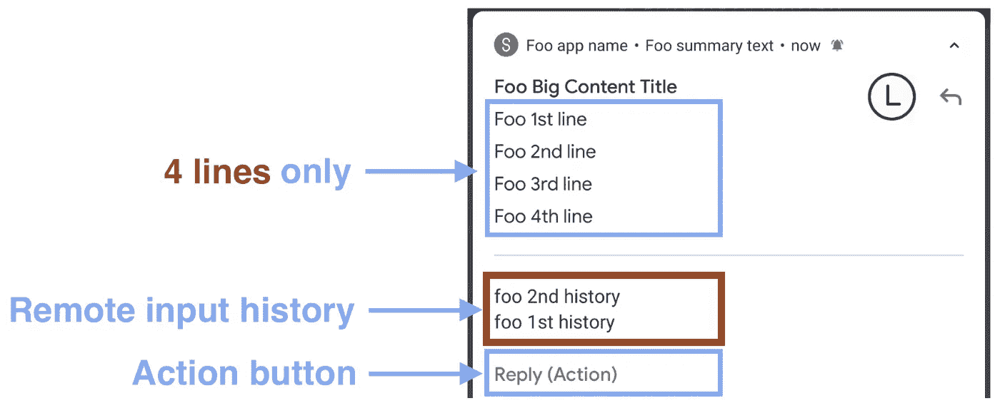

只有 2 个远程输入历史时的屏幕截图

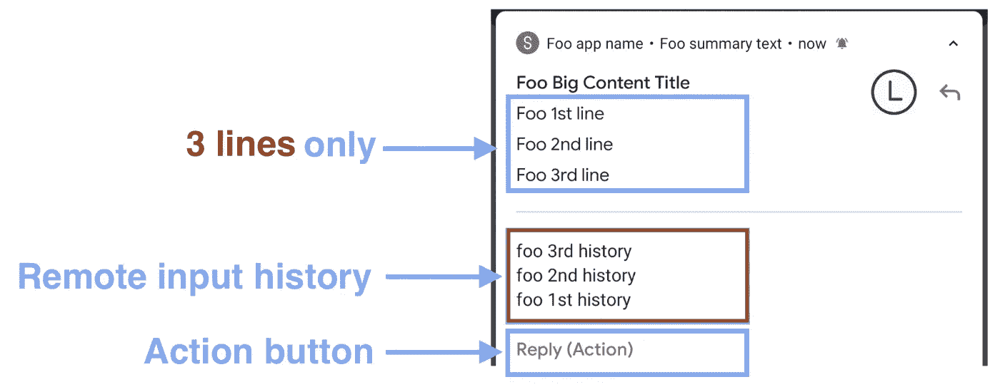

只有 3 个远程输入历史时的屏幕截图

总之，要显示的最大行数取决于操作按钮的存在和显示的远程历史记录的数量。自从我在 2020 年写这篇文章以来，这个文档问题已经提交给 [Google 问题跟踪者](https://issuetracker.google.com/issues/152430539)。请参见下表中的简短摘要:

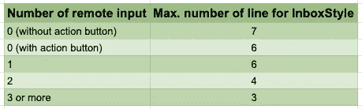

# 文本样式

通知中的所有文本都可以通过 HTML 标签手动设置样式，这在[官方文档](https://developer.android.com/training/notify-user/expanded#large-style)中有正式建议。这里有一个例子:

然而，除了建议的方法之外，文本也可以用`Spanned`进行样式化，因为所有设置文本的函数都接受`CharSequence`作为参数。这里有一个例子:

要了解有关样式通知的更多信息，请参考以下文章:

 [## Android 通知样式

### 通知是通知用户新信息的常用工具。你有没有想过设计它的内容…

medium.com](https://medium.com/@myrickchow32/android-notification-styling-cc6b0bb86021) 

# 想了解更多关于 Android 通知的信息:

## 1.自定义通知

 [## Android 自定义通知在 6 分钟内完成

### 定制通知可以包含比默认通知样式提供的更多奇特的小部件。让我们点击…

itnext.io](/android-custom-notification-in-6-mins-c2e7e2ddadab) 

**2。安卓通知一体机**

 [## 安卓通知一体机

### 在 21 世纪，通知已经成为每个人日常生活的一部分。作为一个 Android 开发者，最好多了解一些…

itnext.io](/android-notification-all-in-one-8df3e1218e0e) 

**3。大文本系统通知**

 [## Android 通知 BigTextStyle 尽可能深

### 通知是普通 app 常见的。当内容太长时，总是使用 BigTextStyle。让我们看看技巧和…

itnext.io](/android-notification-bigtextstyle-bd35f7530eae) 

## 4.BigPictureStyle 通知

 [## Android 通知 BigPictureStyle 尽可能深

### 当您希望在通知行显示图像时，可以使用 BigPictureStyle 通知。这里有一些提示和…

itnext.io](/android-notification-bigpicturestyle-1f293e6cabaf) 

# 摘要

1.  `InboxStyle`通知用于添加多个简短的汇总行。示例用例是电子邮件通知。
2.  `BigContentTitle`、`summaryText`和`line`是`InboxStyle`通知中的可定制属性。都是简单的`TextView`显示单行信息。
3.  在`InboxStyle`通知中显示的`line`的最大数量在官方网站中被错误地记录，实际上取决于操作按钮的存在和显示的远程历史的数量。范围从 3 到 7。
4.  通知中的所有文本都可以通过 HTML 标签和`Spanned`来设置样式。

# 参考

1.  **安卓通知开源代码**

 [## Google 上的 core/Java/Android/app/notification . Java-platform/frameworks/base-Git

### android /平台/框架/基础/主/。/core/Java/Android/app/Notification.java

android.googlesource.com](https://android.googlesource.com/platform/frameworks/base/+/master/core/java/android/app/Notification.java) 

**2。如何创建可扩展通知的官方文档**

 [## 创建可扩展通知| Android 开发者

### 基本通知通常包括一个标题、一行文本以及用户可以在…中执行的一个或多个操作

developer.android.com](https://developer.android.com/training/notify-user/expanded#inbox-style) 

**3。收件箱风格的官方文档**

 [## 通知。收件箱风格| Android 开发人员

### AccessibilityServiceMagnificationController . OnMagnificationChangedListener

developer.android.com](https://developer.android.com/reference/android/app/Notification.InboxStyle) 

欢迎您关注我，在[Twitter @ my rik _ chow](https://twitter.com/myrick_chow)获取更多信息和文章。感谢您阅读这篇文章。祝您愉快！😄