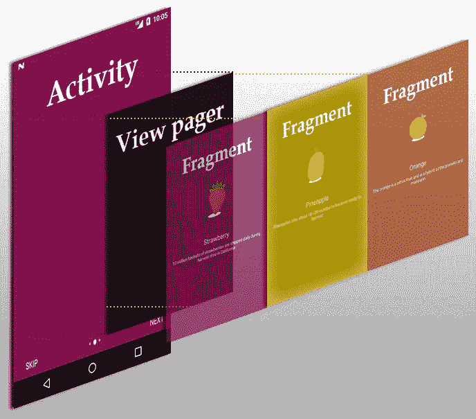
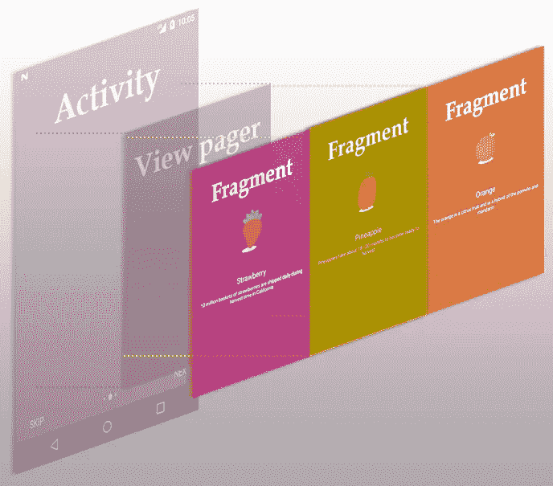

# Android:使用 Arch 组件进行状态管理的介绍滑块。(第一部分)

> 原文：<https://itnext.io/android-intro-slider-with-state-management-using-androidx-architecture-components-part-1-caeba1db7a32?source=collection_archive---------1----------------------->

在这些系列中，我们将看看如何使用 Android 架构组件来管理视图状态，如`ViewModel`、`LiveData`和`Transformations`。我们还将在此过程中创建一个漂亮且可扩展的介绍滑块。

简介滑块演示

为了使事情更简单，您可以:

*   签出 GitHub 的[***part-1-base****分支，该分支已经为您设置了`MainActivity`和所有资源*](https://github.com/xzhorikx/slider-intro/tree/part-1-base)
*   *或者自己建立一个空项目[在 GitHub 上抓取 colors.xml、strings.xml、dimens.xml、styles . XML](https://github.com/xzhorikx/slider-intro/tree/master/app/src/main/res/values)*

*在我们开始所有酷的状态管理之前，我们需要实现 intro slider 本身。我们先来看看背后的想法。如果你是一个有经验的开发者，你可能已经知道我们的介绍滑块只不过是一个嵌套在 activity 中的[视图分页器](https://developer.android.com/training/animation/screen-slide)。但是为了更好地理解，这里有一个小图，展示了所有视图元素在活动中是如何呈现的。*

**

*需要考虑的关键事项*

*   *我们需要 1 个活动，1 个查看页面和 3 个片段*
*   *导航状态(*跳过*和*下一步*按钮，*圆点*)是活动视图的一部分，依赖于`ViewPager`状态*
*   *片段的内容只有颜色、图标和文本不同，所以我们可以使用一些通用的构造函数来创建它们*

*记住这一点，是时候为主要活动创建一个基本视图了。在布局文件夹中创建`activity_main.xml`文件，用`onCreate()`方法将其设置为内容视图。*

*主要活动基础结构*

*查看主活动的 XML*

*到目前为止，我们的活动将是空白的，但让我们仔细看看我们刚刚创建的内容。*

*   *`ViewPager` ( *vpIntro* )将负责显示我们即将创建的片段列表*
*   *`TextView`元素( *tvIntroSkip* 、 *tvIntroNext* 、 *tvIntoFinish* )负责用户的手动导航。我们已经将 *tvIntroNext* 和 *tvIntoFinish* 分开，以便在不使用太多代码的情况下，在最后一个片段上创建它们之间良好的淡入/淡出动画。*
*   *`LinearLayout`对于导航点( *containerIntroDots* )，当知道应该显示多少片段时，将动态地用视图填充。*

*现在，当创建活动时，是时候包含我们的第一个架构组件了— `[ViewModel](https://developer.android.com/topic/libraries/architecture/viewmodel)`。`ViewModel`允许以生命周期意识的方式存储和管理 UI 相关数据，并允许数据在屏幕旋转等配置更改后仍然存在。简而言之，`ViewModel`为活动或片段创建一次，仅在视图的`onDestroy()`方法被调用后销毁。*

*有两个主要的公共类供 ViewModels 扩展:`ViewModel`和`AndroidViewModel`。两者之间的唯一区别是后者接受*应用程序上下文*作为其唯一的构造函数参数，这意味着在 ViewModel 的生命周期中，应用程序上下文将对子类可用。当您需要在`ViewModel`中访问字符串、维度或任何其他资源时，这很方便。*

> *非常重要的注意事项:ViewModel 决不能引用视图、生命周期或任何可能包含对活动上下文的引用的类。总是将**应用上下文**传递给 AndroidViewModel。*

*让我们创造`MainActivityViewModel`*

*查看模型库*

*如你所知，Android 中的许多组件必须有空的构造器(活动、片段等)。)并且 ViewModel 也不例外—默认情况下，它是使用空构造函数创建的。然而，我们刚刚创建的 ViewModel 接受*应用程序*作为它的参数，那么我们如何实例化它呢？*

*答:一定要用`[AndroidViewModelFactory](https://developer.android.com/reference/androidx/lifecycle/ViewModelProvider.AndroidViewModelFactory)`。工厂是创建类的一种常见架构方法，所以难怪 Android 利用这种机制来创建带有非空构造函数的视图模型。让我们创建我们的`MainAppActivityViewModelFactory`。*

*主活动视图模型工厂*

*现在，为了在我们的活动中获得我们的`MainActivityViewModel`的实例，有必要再使用一个 Android 实用程序类:`[ViewModelProvider](https://developer.android.com/reference/androidx/lifecycle/ViewModelProvider)` **。这个类接受`[ViewModelStoreOwner](https://developer.android.com/reference/androidx/lifecycle/ViewModelStoreOwner)`和`[ViewModelProvider.Factory](https://developer.android.com/reference/androidx/lifecycle/ViewModelProvider.Factory)`作为它的参数，并允许我们通过它的类获得必要的`ViewModel`实例。不要害怕这些复杂的名字，只要看一看代码，一切都变得简单多了:***

*让我们来分解一下:*

*   *我们创建对`MainAppActivityViewModel`及其工厂的类级引用。*
*   *工厂有`lateinit` 修饰符，因为它只有在`onCreate()`被调用时才会被初始化。我们会尽快初始化这个字段。*
*   *`MainActivityViewModel`由 kotlin 的`lazy` 属性初始化，意味着该字段在第一次调用之前不会被初始化。我们需要这样做，因为创建`MainActivity`时工厂尚未初始化。*

***检查站。**运行应用程序，看看在这一点上是否有任何问题。*

# *是时候创建将显示给用户的片段了！*

**

*在简介滑块中使用片段*

*如前所述，我们的应用程序中的片段仅在颜色、图标和文本上有所不同，所以我们可以使用一些通用的构造函数来创建它们。我更喜欢为此创建枚举，并将其传递给静态片段构造函数。在这里抓一个`fragment_slider.xml`布局: [GitHub](https://github.com/xzhorikx/slider-intro/blob/master/app/src/main/res/layout/fragment_sldier.xml) 。*

*片段创建*

*让我们仔细看看:*

*   *所有片段都具有相似的结构，因此不需要为此创建多个片段类。我们可以简单地通过向其构造函数传递一个参数来定义片段的状态。*
*   *`ScreenType` 是定义应该创建哪种片段的枚举。它还有引用用于背景色的资源颜色的`backroundColor`字段。*
*   *`SliderFragment.newInstance(screenType: ScreenType)`允许我们创建所需类型的片段。这个工厂方法只是使用`arguments`包将`ScreenType`传递给片段。*
*   *`private var screenType`是对传递的屏幕类型的可空引用。我们使它可空，因为不使用`newInstance()`方法仍然可以创建片段，因此不会传递`ScreenType`。后来保存它的`onSaveInstanceState()` 方法。*

*现在让我们给屏幕添加一些内容。如果还没有做，g [rab 资产图片从这里](https://github.com/xzhorikx/slider-intro/tree/master/app/src/main/assets)，[字符串从这里](https://github.com/xzhorikx/slider-intro/blob/master/app/src/main/res/values/strings.xml)并把它们全部带到屏幕上！*

*根据屏幕类型值填充片段的内容*

*现在，如果`screenType`不为空，那么我们可以在用户的屏幕上呈现标题、正文和图标。*

*就是这样！我们的碎片已经可以使用了。*

# *在 ViewPager 中显示片段*

*现在我们需要在一个`ViewPager`中显示我们全新的片段。在`ViewModel`中拥有活动所需的所有字段是个好主意，但不幸的是，我们不能在这里初始化片段:*

> *ViewModel 决不能引用视图、生命周期或任何可能包含对活动上下文的引用的类。*

*由于这个限制，我们将不得不保持对片段类型列表的引用。导航到`MainAppActivityViewModel` *，*我们将在这里进行一些更改:*

*   *添加包含对所显示片段类型列表的引用的成员属性。*
*   *片段类型应保存在`[LiveData](https://developer.android.com/topic/libraries/architecture/livedata)`中，以便活动可以观察它们。*

*正在初始化视图模型中的片段类型列表*

*稍后将在`ViewPager`适配器中使用片段类型列表来初始化片段(*感谢*[*Canivek*](https://old.reddit.com/user/Canivek)*对于此建议*)*

*只需通过调用`SliderFragment.newInstance()` *将`ScreenType`中的每个枚举值映射到`SliderFragment` 中即可。*通过这种方式，我们为片段创建创建了可扩展的解决方案。*

*现在是观察`fragmentTypeListLiveData`主活动的时候了。*

*主活动中的第一个实时数据观察者*

*每次`fragmentTypeListLiveData`接收到新的值或者活动的配置改变时，`Observer { … }` 对象都会被调用一次。这是我们的用例初始化`ViewPager`的完美地方，因为我们知道片段的数量是静态的，在运行时不会改变。*

> *注意:将可变的 LiveData 类暴露给活动/片段被认为是一种不好的做法，所以要确保所有的公共 getters 总是返回不可变的 LiveData 实例。*

## ***最后一步:**为 ViewPager 创建`*SliderAdapter*` 。*

*这里我们将保持简短——每个`ViewPager`都需要一个适配器来显示多个片段。在上面的代码中`SliderAdapter`被调用，下面是它的样子:*

*正在为视图页导航创建适配器*

*每次调用`getItem()`时，都会用给定的`ScreenType`通过工厂方法创建新的`SliderFragment`。这样，片段总是在`ViewModel`范围之外初始化。*

*检查点:我们应该都准备好了，可以出发了！运行您的应用程序，查看`ViewPager`和`Fragments`的运行情况。*

*我们的最终结果。*

*第一部分到此为止！让我们回顾一下我们所做的事情:*

*   *使用我们的第一个架构组件:`ViewModel`、`ViewModelProvider.Factory`和`LiveData`*
*   *为片段创建创建了一个易于扩展的解决方案*
*   *结合上述一切，创建一个介绍滑块的基础*

*加入我们的第 2 部分，我们将实现动态背景色、导航点动画以及更多！*

*如果你对代码有任何问题，你可以看看 GitHub 上的 [***part-2-base*** 分支。](https://github.com/xzhorikx/slider-intro/tree/part-2-base)*