# Android 消息样式通知尽可能清晰

> 原文：<https://itnext.io/android-messagingstyle-notification-as-clear-as-possible-1847f809ad59?source=collection_archive---------3----------------------->

## 如果我有错误，欢迎你指出来。谢谢你😉

我相信你每天都在使用消息应用与你的朋友、爱人和家人交流。Android 为我们提供了一种用户友好的通知风格，以一种更加优雅和有用的方式来显示消息通知。

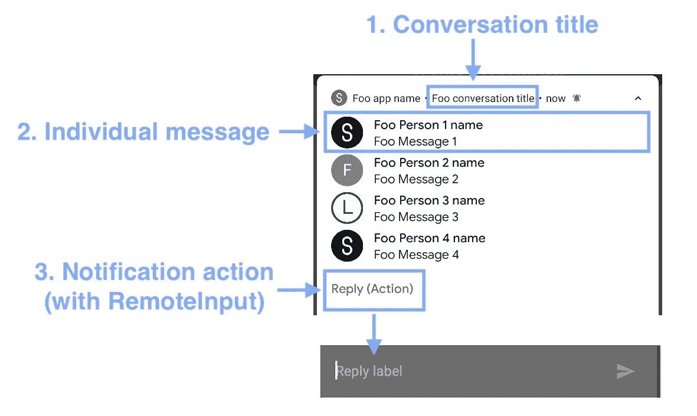

MessagingStyle 的解剖；通知操作在通知时设置。改为构建器

开发人员可以设置对话标题，并将相关消息分组到单个通知中。甚至还有一个`RemoteInput`供用户输入消息，直接回复消息发送者，无需启动 app。

在本文中，我将介绍实现消息样式通知的所有步骤，并逐一讨论属性。希望你会觉得这有趣和有用。开始吧！

# 概观

1.  [人](https://developer.android.com/reference/android/app/Person)物
    它代表消息的发送者或接收者(用户本人)。
2.  [消息](https://developer.android.com/reference/android/app/Notification.MessagingStyle.Message)对象
    它可以包含文本消息，也可以包含图像消息，并且必须绑定一个`Person`。来自同一发送者的连续消息被组合成一个主块。
3.  [MessagingStyle](https://developer.android.com/reference/android/app/Notification.MessagingStyle) 对象
    设置对话标题和消息列表。消息列表可以包含正常消息和历史消息。
4.  [RemoteInput](https://developer.android.com/reference/android/app/RemoteInput) object
    它是一个用户友好的小部件，包含一个列表`Choice`和一个`EditText`，用户可以在不启动应用程序的情况下快速回复发件人。

# 第 1 部分)人对象

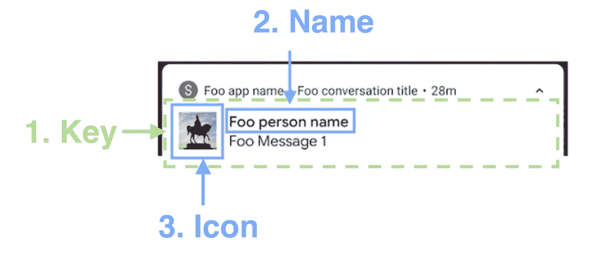

人员属性

`Person`是一个表示消息发送者详细信息的类，包括他/她的 id，显示名称&图标(缩略图)。每个`Message`对象(将在下一节介绍)必须绑定一个`Person`对象。具有相同`Person`(由`id`字段标识)的连续`Message`对象被组合成一个显示文本块。

## 属性 1)键

密钥生成代码

`key`是用于区分每个消息发送者的`String`标识符。来自同一邮件发件人的具有相同`key`的连续邮件被合并。

我们可以使用`Math.random()`为每个发送者生成一个密钥。这个代码输出一个 16 位十进制数。碰撞的可能性是 0.0000000000001，这在正常使用情况下是可以接受的。

> **重要提示** :
> 由于 Android 会默认使用`name`字段作为`key`，因此未设置`key`时会导致严重问题。`name`难道**不**就一定唯一！
> 参考:[人。建造商官方文件](https://developer.android.com/reference/android/app/Person.Builder#setKey(java.lang.String))

## 物业 2)名称

在发件人姓名上使用 SpannableString 的图示

`name`是显示的发送者姓名的字符串。第 5 行的`setName()`接受`CharSequence`作为参数。换句话说，发件人的显示名称可以通过`SpannableString`使用`Spans`进行样式化。

为了更容易地使用`SpannableString`，欢迎您使用`[MCSpannableStringExtension](https://github.com/myrickchow32/MCSpannableStringExtension)`，它可以通过使用 Kotlin 扩展功能来简化沸腾板代码。有关示例实现，请参见第 8–10 行。

## 属性 3) `Icon`

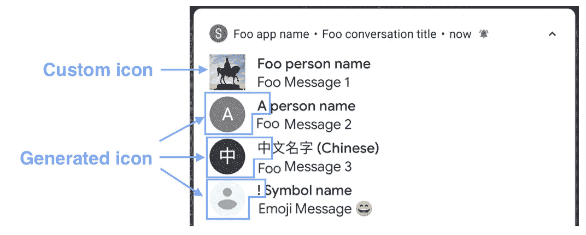

自定义图标和生成的图标取决于显示名称的第一个字符

`Icon`代表消息发送者的缩略图。它是一个刻度类型为`center`的正方形`ImageView`。开发者可以通过`setIcon(icon: Icon)`给每个人设置一个自定义的`Icon`，具体实现见第 13 行。

系统默认的用户名图标以英文、中文和符号字符开头

`Icon`是一个可选字段。系统根据用户名的第一个字符生成一组默认图标。根据上面的截图，它支持多种语言。

然而，默认图标的背景颜色是**而不是**在代码级别可定制的，范围从浅灰色到黑色。为了给用户提供良好的 UX，建议**使用自定义图标**。

# 第 2 部分)消息

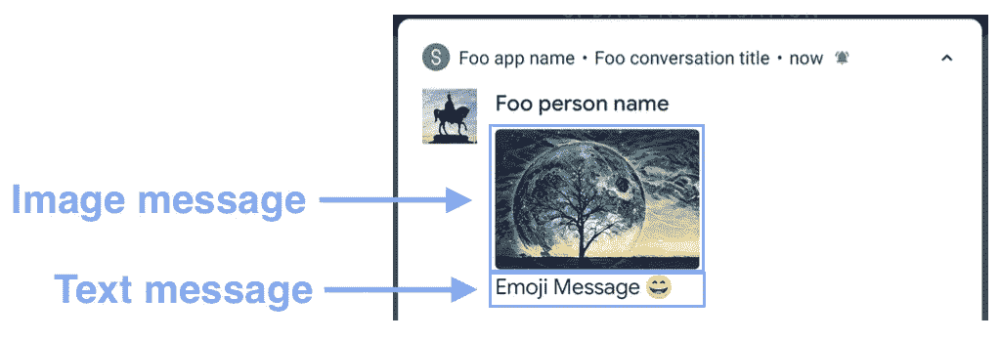

像素 3 处的图像和文本消息的屏幕截图(API 29)

构造一个文本`Message`对象非常简单，见第 10 行。它需要以下三个参数:

1.  短信内容— `CharSequence`支持`SpannableString`
2.  消息到达时间— `Long`
3.  发送者详细信息— `Person`，这在上一节中已经介绍过了

从 [Android 9](https://developer.android.com/about/versions/pie/android-9.0#enhanced_messaging_experience) (API 28)开始，通过`setData()`函数设置数据，通知支持同时显示**文本**和**图片**消息，详见第 11–18 行。然而，文本和图像数据不能同时显示在一个`Message`对象中。换句话说，当设置图像数据时，**文本内容被忽略。**

因此，要实现上述文本和图像的演示消息通知，必须独立创建两个`Message`实例，如下所示:

# 第 3 部分)设置消息样式

第三步是给通知样式分配一个`MessagingStyle`对象。共有 4 个功能用于设置属性:

1.  **添加消息(消息:消息)**

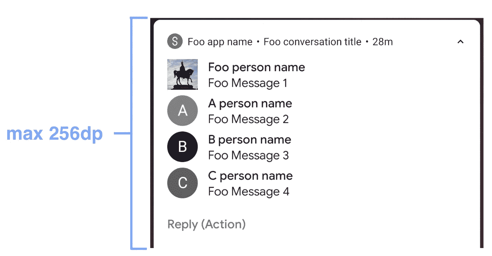

在运行 API 29 的 Pixel 3 中，只能同时显示 4 条消息

可以通过`addMessage()`直接添加消息，但是显示消息的顺序基于在`Message`对象中定义的消息到达时间，详见最后一节“第 2 部分)消息”。

此外，由于每个系统通知的空间有限(最大高度:256dp ),旧消息可能会被隐藏，以便为新消息释放空间。

2.**添加历史消息(消息:消息)**

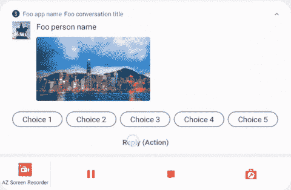

历史消息仅在选择远程输入时显示

通知中通常不会显示历史消息。这是一条特殊的消息，仅在用户通过`RemoteInput`回复时显示，(由于步骤复杂，将在下一节“高级主题—远程输入的 4 个步骤”中讨论)) .仅当消息不是通知的主要主题，但可能为对话提供上下文时，才应使用此选项。

3. **setConversationTitle(标题:字符序列)**

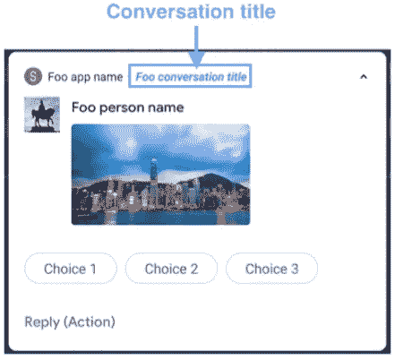

对话标题

Conversation 只是一个简单的对话通知显示字符串。可以通过`SpannableString`和`[MCSpannableStringExtension](https://github.com/myrickchow32/MCSpannableStringExtension)`用`Spans`进行样式化。

4.**setgroup conversation(isGroupConversation:Boolean)**

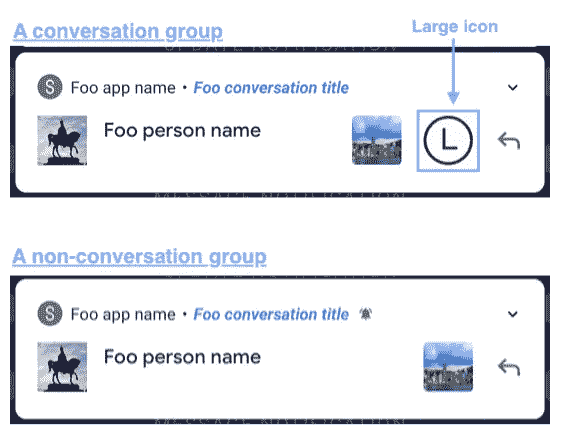

大图标仅在通话组通知中显示

设置此对话通知是否代表一个组。如果应用程序的目标是 Android P (API 29)，如果应用程序想要显示大图标，这是必需的。

# 第 4 部分)5 步远程输入

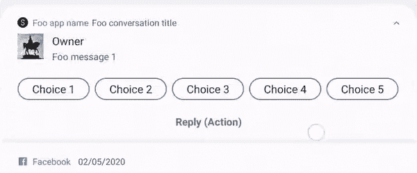

运行于 Android 28 的三星 Galaxy Tab S6 截图

`[RemoteInput](https://developer.android.com/reference/android/app/RemoteInput)`是定义用户输入方法的对象。有两个选项:

1.  `Choice`列表—选择任何预定义的消息，例如是&否
2.  `EditText` —输入任意`String`

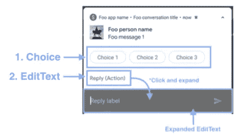

2 个回复选项输入回复—选择和编辑文本

**步骤 1)定义一个** `**RemoteInput**`

`RemoteInput`以构建器模式构建。`RemoteInput.Builder`构造函数的`Key`参数(第 2 行)是检索用户输入的文本或返回的`Intent`中的选择的关键。有关更多详细信息，请参见步骤 5)。

在展开状态下重放标签

在第 3 行，`setLabel(label: CharSequence)`用于设置点击回复动作按钮时`EditText`的占位符。

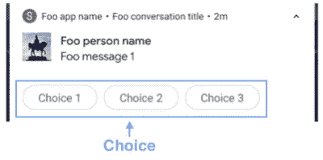

选择列表

在第 4 行，`setChoices(choices: Array<CharSequence>)`用来定义列表的选择标题。选项仅显示在一行中。由于空间有限，有些选项在没有空间显示时会被隐藏，例如“选项 4”和“选项 5”在纵向模式下隐藏，但在横向模式下显示。

因此，我们应该限制每个选项的数量和标题长度，以防止被系统裁剪。

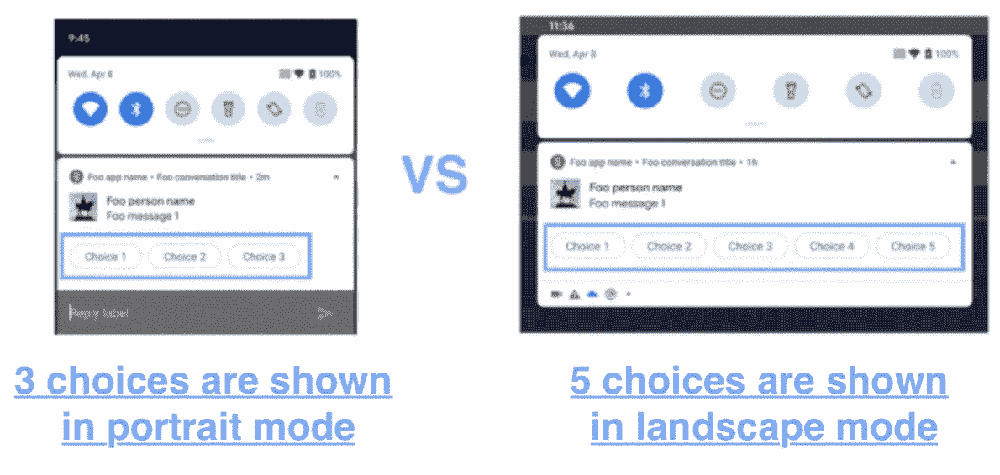

## 步骤 2)定义一个`PendingIntent`用于发回用户选择的选项

当用户在`RemoteInput`选择一个选项或提交一条文本消息时，这个`PendingIntent`被触发。在第 3 行，我们声明了一个`Receiver`来处理用户动作，因此在第 6 行使用`PendingIntent.getBroadcast()`构造函数来构造一个`PendingIntent`对象。

> 这里有几个`PendingIntent`中的构造函数，我们不应该混淆它们:
> `PendingIntent.getBroadcast()`在`Receiver`被触发时使用。
> `PendingIntent.getActivity()`在`Activity`被触发时使用。
> `PendingIntent.getService()`在`Service`被触发时使用。
> 
> 参考:[待定正式文档](https://developer.android.com/reference/android/app/PendingIntent)

**步骤 3)定义一个** `**BroadcastReceiver**`

`BroadcastReceiver`可以接收系统`Intent`即使 app 被杀，对消息类 app 也有好处。最好在`AndroidManifest`声明，而不是在运行时注册。

在`BroadcastReceiver`的`onReceived`回调中，主要功能是检索用户输入并通过`recoveredNotificationBuilder`更新通知。

在第 9–10 行，用户输入的文本(选项标题或提交的文本)用步骤 1 中在`RemoteInput`构造函数中设置的关键字检索，通知 id 用步骤 2 中在 PendingIntent 中设置的一个检索。

第 13–19 行显示了通过通知 id 过滤通知和通过`Notification`对象检索原始`Notification.Builder`的步骤。

第 21–23 行显示了根据检索到的用户输入添加新的`Message`的步骤。可以从`MessagingStyle`对象中检索用户`Person`对象。不需要从原始数据中重建它。

最后，可以通过在第 27 行用原始通知 id 和更新的`Notification`对象通知`NotificationManager`来更新通知。

## 步骤 4)定义通知操作

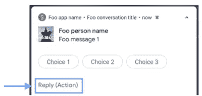

通知操作按钮

`Notification.Action`定义上面高亮显示的动作按钮的细节。第 3 行需要一个图标、一个标题和一个`PendingIntent`来构造一个`Notification.Action.Builder`，我们在第 1 步定义的`RemoteInput`被添加到第 4 行的`Notification.Action`中。

但是，您是否注意到操作按钮附近没有显示图标？根据谷歌的 [*Ian Lake(开发者倡导者)*的博客，图标将不会显示，以便给更多的空间来显示更多的动作。](https://android-developers.googleblog.com/2016/06/notifications-in-android-n.html)

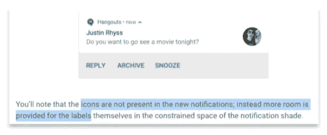

## 步骤 5)将通知活动附加至通知生成器

最后一步只是简单地将`Notification.Action`加到`Notification.Builder`上。运行代码后，您会得到以下行为:

运行于 Android 28 的三星 Galaxy Tab S6 截图

# 摘要

1.  应该实现 MessagingStyle 来为用户提供更好的 UI 和 UX。
2.  请记住，必须在`Person`对象中设置唯一的`key`，以防止与其他发送者混淆。
3.  每个`Message`可以显示文本信息或图像信息。来自同一发件人的连续消息被合并成一个大块。
4.  默认通知高度为 256dp，一些旧消息无法显示。
5.  `RemoteInput`是`MessagingStyle`通知中最有用的工具。它提供了一个可选的`Choice`列表和一个`EditText`供用户在不打开应用程序的情况下回复。
6.  必须正确选择`PendingIntent`的构造器。`PendingIntent`构造函数与目标`Intent`不匹配将不会产生任何结果。

# 通知相关的媒体发布

## **1。安卓通知一体机**

 [## 安卓通知一体机

### 在 21 世纪，通知已经成为每个人日常生活的一部分。作为一个 Android 开发者，最好多了解一些…

itnext.io](/android-notification-all-in-one-8df3e1218e0e) 

## **2。自定义通知**

 [## Android 自定义通知在 6 分钟内完成

### 定制通知可以包含比默认通知样式提供的更多奇特的小部件。让我们点击…

itnext.io](/android-custom-notification-in-6-mins-c2e7e2ddadab) 

## 3. **NotificationChannel 完整解释**

 [## 尽可能深入的 Android 通知通道

### 自从……以来，通知通道已经成为向通知抽屉发送通知对象的必要部分

itnext.io](/android-notification-channel-as-deep-as-possible-1a5b08538c87) 

## **4。**[T3【BigTextSytle】通知 ](/android-notification-bigtextstyle-bd35f7530eae)

## 5.[**BigPictureStyleNotification**](/android-notification-bigpicturestyle-1f293e6cabaf)

## 6.[**inbox style notification**](/android-inboxstyle-notification-as-deep-as-possible-4d74c0c725f1)

## 7. [**安卓通知样式**](/android-notification-styling-cc6b0bb86021)

# 阅读和参考资料:

1.  [安卓个人官方文档](https://developer.android.com/reference/android/app/Person.Builder#setKey(java.lang.String))
2.  [Android MessagingStyle 官方文档](https://developer.android.com/reference/android/app/Notification.MessagingStyle)
3.  [Android RemoteInput 官方文档](https://developer.android.com/reference/android/app/RemoteInput)
4.  [Ian Lake(开发者倡导者)关于通知的博客文章](https://android-developers.googleblog.com/2016/06/notifications-in-android-n.html)
5.  [Android 9 消息传递增强](https://developer.android.com/about/versions/pie/android-9.0#enhanced_messaging_experience)

欢迎您在[Twitter @ my rik _ chow](https://twitter.com/myrick_chow)关注我，了解更多信息和文章。感谢您阅读这篇文章。祝您愉快！😄