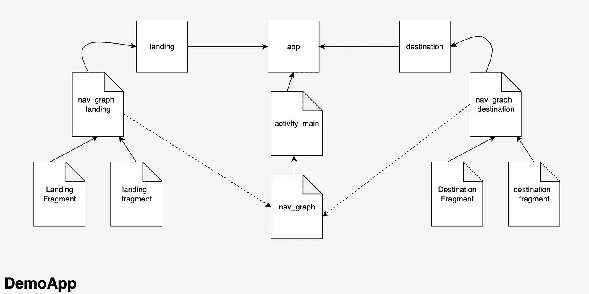

# Android 模块化导航

> 原文：<https://itnext.io/android-modular-navigation-b96c9819256e?source=collection_archive---------2----------------------->

*使用 NavigationController 和深层链接的 Android 导航*


[来源](https://2.bp.blogspot.com/-qa1fLrJF-5U/XIl-jZAJMbI/AAAAAAAAHVM/TKCA47Imle4DD6yRa7WqfIvEJRwpmWvrgCLcBGAs/s1600/Jetpack-nav-icon.png)

# 设置

在多模块应用中导航会导致一系列问题，即循环依赖和一系列不可维护的链接。

解决这个问题的一个方法是使用 NavigationController。

对于上下文，该演示将使用 3 个模块:一个**应用**模块、一个**着陆**模块和一个**目的地**模块。为了清楚起见，我们将整个应用程序(包含所有上述 3 个模块)命名为 **DemoApp** 。

如果你是从零开始，这个应用程序模块就像你开始一个新项目时创建的一样好。另外两个需要添加到与应用程序模块相同的级别，当你创建它们时，确保它们是 Android 库。

首先，我们希望将以下依赖项添加到 build.gradle 文件中的应用程序模块中:

```
implementation 'androidx.navigation:navigation-fragment-ktx:*.*.*'
implementation 'androidx.navigation:navigation-ui-ktx:*.*.*'
```

这些是我们保持演示导航所需的内容。

App 模块将作为我们的基础模块，它将是 DemoApp 的起点(即 app 模块的 MainActivity 将是入口点)，它还将负责 DemoApp 范围内的导航。因此，我们还需要将其他模块作为依赖项添加到我们的应用程序模块的 build.gradle 文件中:

```
implementation(project(':landing'))
implementation(project(':destination'))
```

在着陆模块和目的模块的 gradle 文件中，您需要将这一行添加到:

```
implementation 'androidx.navigation:navigation-ui-ktx:*.*.*'
```

# 履行

在你的应用模块中，你需要开始定义你的导航。在 resources 文件夹中，添加另一个导航类型的 Android 资源目录。

在其中，创建一个名为 nav_graph.xml 的新导航资源文件。

将以下内容粘贴到文件中:

```
<?xml version="1.0" encoding="utf-8"?>
<navigation
    xmlns:android="http://schemas.android.com/apk/res/android"
    xmlns:app="http://schemas.android.com/apk/res-auto"
    android:id="@+id/nav_graph">

</navigation>
```

这实际上是导航树中的起始节点，可以导航到演示应用程序的任何部分。

现在在视图端，打开应用程序模块中的 activity_main.xml，将内容替换为以下内容:

```
<?xml version="1.0" encoding="utf-8"?>
<androidx.constraintlayout.widget.ConstraintLayout xmlns:android="http://schemas.android.com/apk/res/android"
    xmlns:app="http://schemas.android.com/apk/res-auto"
    xmlns:tools="http://schemas.android.com/tools"
    android:layout_width="match_parent"
    android:layout_height="match_parent">

    <androidx.fragment.app.FragmentContainerView
        android:id="@+id/nav_host_fragment"
        android:name="androidx.navigation.fragment.NavHostFragment"
        android:layout_width="0dp"
        android:layout_height="0dp"
        app:layout_constraintLeft_toLeftOf="parent"
        app:layout_constraintRight_toRightOf="parent"
        app:layout_constraintTop_toTopOf="parent"
        app:layout_constraintBottom_toBottomOf="parent"

        app:defaultNavHost="true"
        app:navGraph="@navigation/nav_graph" />

</androidx.constraintlayout.widget.ConstraintLayout>
```

这是为您的 DemoApp 设置主导航片段。每当您通过 NavigationController 导航到一个新的片段时，它将在这里交换视图。

现在，我们需要登录模块是我们打开应用程序时看到的模块。

在登录模块中，转到您的 resources 文件夹并创建一个导航文件夹，与之前一样。在该文件夹中，创建一个新的导航资源文件，并将其命名为 nav_graph_landing.xml。

如果模块中没有 resources 文件夹，请在主文件夹下添加一个新目录。它会给你一些选项，选择 res 文件夹。现在您有了一个资源文件夹，可以执行上一步。

在里面粘贴以下内容:

```
<?xml version="1.0" encoding="utf-8"?>
<navigation 
    xmlns:android="http://schemas.android.com/apk/res/android"
    xmlns:app="http://schemas.android.com/apk/res-auto"
    xmlns:tools="http://schemas.android.com/tools"
    android:id="@+id/nav_graph_landing"
    app:startDestination="@id/landingFragment">

    <fragment
        android:id="@+id/landingFragment"
        android:name="com.example.landing.LandingFragment"
        tools:layout="@layout/landing_fragment"
        android:label="LandingFragment">
        <deepLink
            android:id="@+id/deepLink"
            app:uri="demoapp://landing" />
    </fragment>

</navigation>
```

您可能需要更改片段声明中的 name 元素，以匹配您的包结构。这应该会显示一些错误，因为我们还没有那个着陆区。

下一步是创建着陆区。在您的着陆模块中，创建一个名为 LandingFragment 的新类，并添加以下内容:

```
class LandingFragment: Fragment() {

    override fun onCreateView(
        inflater: LayoutInflater,
        container: ViewGroup?,
        savedInstanceState: Bundle?
    ): View? {
        return inflater.inflate(R.layout.*landing_fragment*, container, false)
    }

}
```

这也会报怨你没有 landing_fragment.xml，所以继续在你的 resources 文件夹中的 layout 文件夹中创建它。如果该文件夹不存在，添加一个新的 layout 类型的 Android 资源目录。然后在那里添加您的 landing_fragment.xml 文件。

在 landing_fragment.xml 中添加以下内容:

```
<?xml version="1.0" encoding="utf-8"?>
<androidx.constraintlayout.widget.ConstraintLayout xmlns:android="http://schemas.android.com/apk/res/android"
    android:layout_width="match_parent"
    android:layout_height="match_parent"
    android:background="@color/design_default_color_primary_dark"
    xmlns:app="http://schemas.android.com/apk/res-auto">

    <Button
        android:layout_width="wrap_content"
        android:layout_height="wrap_content"
        android:id="@+id/goto_destination_btn"
        app:layout_constraintStart_toStartOf="parent"
        app:layout_constraintEnd_toEndOf="parent"
        app:layout_constraintTop_toTopOf="parent"
        app:layout_constraintBottom_toBottomOf="parent"
        android:text="DESTINATION"
        />

</androidx.constraintlayout.widget.ConstraintLayout>
```

这应该看起来像一个紫色的背景，按钮在中心，上面写着“目的地”。如果这种颜色不存在，你可以用你有的任何颜色来代替，这只是用来让屏幕变得明显。

现在，我们将对目标模块执行类似的过程。

在目标模块中，转到您的 resources 文件夹并创建一个导航文件夹，与前面一样。在该文件夹中，创建一个新的导航资源文件，并将其命名为 nav_graph_destination.xml。

```
<?xml version="1.0" encoding="utf-8"?>
<navigation 
    xmlns:android="http://schemas.android.com/apk/res/android"
    xmlns:app="http://schemas.android.com/apk/res-auto"
    xmlns:tools="http://schemas.android.com/tools"
    app:startDestination="@id/destinationFragment"
    android:id="@+id/nav_graph_destination">

    <fragment
        android:id="@+id/destinationFragment"
        android:name="com.example.destination.DestinationFragment"
        tools:layout="@layout/destination_fragment"
        android:label="DestinationFragment">
        <deepLink
            android:id="@+id/deepLink"
            app:uri="demoapp://destination" />
    </fragment>

</navigation>
```

这应该和着陆的那个抱怨的原因一样。您需要在目标模块中创建一个 DestinationFragment，并粘贴以下内容:

```
class DestinationFragment: Fragment() {

    override fun onCreateView(
        inflater: LayoutInflater,
        container: ViewGroup?,
        savedInstanceState: Bundle?
    ): View? {
        return inflater.inflate(R.layout.*destination_fragment*, container, false)
    }

}
```

和前面一样，在 resources 文件夹中创建一个布局文件夹(如果还没有)，并添加一个名为 destination_fragment.xml 的新布局资源。

```
<?xml version="1.0" encoding="utf-8"?>
<androidx.constraintlayout.widget.ConstraintLayout xmlns:android="http://schemas.android.com/apk/res/android"
    android:layout_width="match_parent"
    android:layout_height="match_parent"
    android:background="@color/design_default_color_on_secondary"
    xmlns:app="http://schemas.android.com/apk/res-auto">

    <Button
        android:layout_width="wrap_content"
        android:layout_height="wrap_content"
        android:id="@+id/goto_landing_btn"
        app:layout_constraintStart_toStartOf="parent"
        app:layout_constraintEnd_toEndOf="parent"
        app:layout_constraintTop_toTopOf="parent"
        app:layout_constraintBottom_toBottomOf="parent"
        android:text="LANDING"
        />

</androidx.constraintlayout.widget.ConstraintLayout>
```

这应该看起来类似于我们做的最后一个片段，但背景颜色应该不同，按钮应该说“着陆”。

# 链接模块

现在我们有两个片段:着陆片段和目的地片段。我们希望每个片段上的按钮能够导航到另一个片段。这通常要求您在目的模块中依赖着陆模块，反之亦然，这并不理想。

为了避免这种情况，我们需要做的就是将导航图添加到我们之前制作的主导航图中。

在应用程序模块中，打开 nav_graph.xml 并在 <navigation></navigation> 标记之间粘贴以下内容:

```
<include app:graph="@navigation/nav_graph_landing" />

<include app:graph="@navigation/nav_graph_destination" />
```

如果您的 IDE 将这些 id 中的任何一个显示为红色，请尝试再次构建项目。

另外，在开始的<navigation>标签中添加下面一行:</navigation>

```
app:startDestination="@id/nav_graph_landing"
```

这告诉我们的导航树从哪里开始。

因此，现在应用程序模块知道着陆和目的地模块将如何导航。我们现在需要能够将 landing_fragment.xml 文件中的 DESTINATION 按钮链接到 DestinationFragment。

打开 LandingFragment 并在类中添加以下代码:

```
override fun onViewCreated(view: View, savedInstanceState: Bundle?) {
    super.onViewCreated(view, savedInstanceState)
    val button = view.findViewById<Button>(R.id.*goto_destination_btn*)
    button.setOnClickListener **{** view.*findNavController*().navigate(Uri.parse("demoapp://destination"))
    **}** }
```

然后在 DestinationFragment 的类中添加以下代码:

```
override fun onViewCreated(view: View, savedInstanceState: Bundle?) {
    super.onViewCreated(view, savedInstanceState)
    val button = view.findViewById<Button>(R.id.*goto_landing_btn*)
    button.setOnClickListener **{** view.*findNavController*().navigate(Uri.parse("demoapp://landing"))
    **}** }
```

现在你应该能够运行应用程序，按下目的地按钮，并被带到目的地片段。然后如果你按着陆按钮，它应该把你带到着陆区。

这是您应该实现的架构:



添加其他模块应该像复制和粘贴您在着陆或目的地模块中所做的一样简单，然后将新的导航图添加到应用程序模块中的主导航图。


[来源](https://64.media.tumblr.com/1931fcf1de4f0a1d3536ba0e6f2779f1/tumblr_oq5ktciuyV1wp6osho1_500.gif)