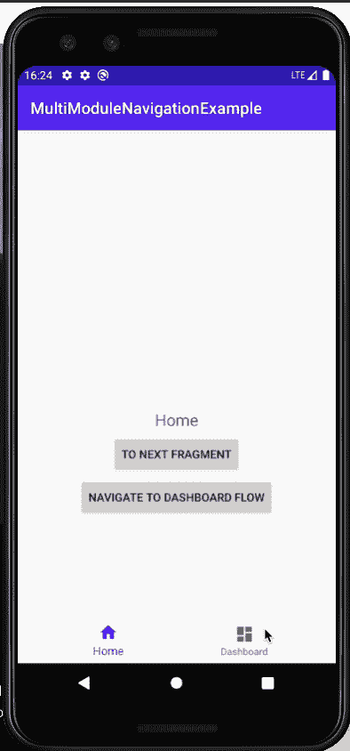
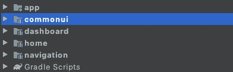
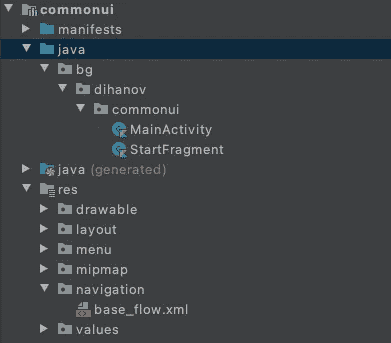
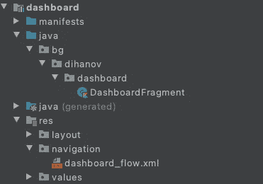
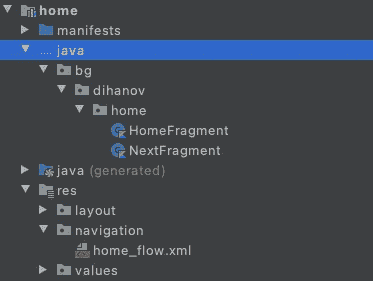
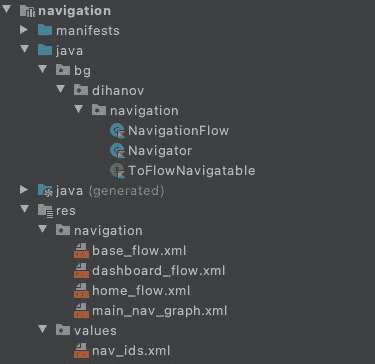
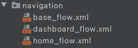
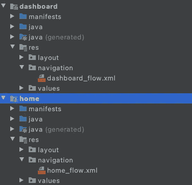

# 带有导航组件的 Android 多模块导航

> 原文：<https://itnext.io/android-multimodule-navigation-with-the-navigation-component-99f265de24?source=collection_archive---------0----------------------->

将导航组件用于简单的单模块应用程序很容易。只需创建您的导航图，设置您的起始目的地，并将导航图交给 NavHostFragment，瞧，这一切都准备好了！

然而，当你的功能模块彼此分离时，实现起来就不那么容易了。

本文不适合刚刚开始使用导航组件的人。我假设您对它有一些基本的了解，并且/或者已经尝试过为多模块应用程序实现它。如果没有，那么你可能很难理解这里所说的一些东西。如果您刚刚开始使用 NavComponent，本指南可能不适合您！

我已经创建了一个小型 POC 项目来说明这种方法。以下是回购的链接:[https://github . com/DDihanov/Android-multimodule-navigation-example](https://github.com/DDihanov/android-multimodule-navigation-example)

更新 20.04.2021:由于一些人要求访问嵌套目的地的示例，我用一个简单的 deeplink 示例更新了 repo，该示例从一个嵌套目的地导航到另一个模块中的目的地，反之亦然。

在花了几个小时对多模块导航问题的不同方法进行提炼和思考之后——这是我采用的解决方案，因为它感觉很直观，而且你可以使用导航编辑器和 SafeArgs！它将导航逻辑封装在一个单独的导航模块中，并允许轻松扩展。该项目只有它需要工作的基本东西，但可以作为一个例子，并根据您的需要进一步扩展。

# 对于不同的模块，应用程序的导航图如下所示:

**commonui** : StartFragment

**home**:home fragment->next fragment

**仪表板**:仪表板碎片

该示例演示了不同流之间的导航以及主页模块中的导航:



在本例中,“主页”和“仪表板”是两个独立的模块。这个演示展示了如何使用 BottomNavBar(在 MainActivity 中)和模块内部的按钮从一个模块导航到另一个模块。还有一个“到下一个片段”的例子，它显示了 home 模块本身内部的导航。

# 但是首先简要概述一下我们的用例，这样您可以更好地理解这种困境:

该应用程序的结构如下:



我们有一个主 **app** 模块，它只是将依赖项连接在一起，并将托管我们的应用程序类(在这种情况下没有应用程序类)。在我的项目中，我喜欢让我的主应用程序模块尽可能简单，不包含 UI 或任何其他类型的逻辑。

现在简要描述每个**模块**:

**app** 模块将所有其他模块作为依赖关系，以便能够创建 DI 图(在这种情况下没有 DI 图，但原则上，功能模块提供它们的依赖关系，app 模块只是将它们连接在一起。我已经将 **home** 、 **commonui** 和 **dashboard** 作为 app.gradle 中的依赖项进行了良好的实践。

**commonui** 是一个模块，理想情况下应该包含应用程序的所有公共 ui 逻辑，如字符串、drawables、BaseFragment 和 BaseActivity 类、公共复合视图等。在这种情况下，它包含单个活动(MainActivity)

**dashboard** 和 **home** (它们拥有 **commonui** 作为依赖项，如果您使用 CLEAN，理想情况下是一个域模块)都是功能模块，它们只包含所需的片段，并将导航流封装在导航子图中。它们自己处理在特定功能模块中完成的所有导航。当他们需要切换到另一个导航流时，他们将使用**导航**模块中的 Navigator 类。

**导航**模块，顾名思义，包含了我们应用程序中的导航方式，这也是神奇的地方。**导航**
模块不依赖任何其他模块。它包含应用程序的主导航图。

应用程序的导航将由一个主导航图 xml 文件和位于每个功能模块中的子图组成。导航流程之间的切换应在**导航**模块中完成。

# 现在我们来看看困境:

由于**导航**模块是处理跨模块导航的模块，它需要知道其他模块的所有子图以便导航。那么，我们如何向主导航图提供子模块导航图，以便使用导航组件，并且不在代码中创建任何循环依赖呢？

对此有几种解决方案:

1.  在运行时通过依赖注入提供来自特征模块的子图，膨胀它们并通过编程将它们添加到主导航图中。
2.  仅使用一个导航图，并在其中添加所有片段，([像这个例子](https://github.com/hamedsilver/ArchApp)e-注意导航模块如何硬编码到其图中片段的路径)。这种方法是可行的，但是它会在 navgraph 编译时显示一个错误，因为到片段的路径不能被解析，但是因为资源在运行时被压缩——它是可行的。缺点是这种方法不能使用 safeargs，而且看起来有点代码味(至少对我来说)
3.  这种方法——在导航模块中定义裸子模块导航图，然后使用导航模块中预定义的 id 在每个子模块中实现它们(有点像定义一个接口，然后用一个类实现它)。这似乎令人困惑，但很快就会变得清晰。使用这种方法，安全参数起作用，您可以使用导航编辑器，并且流切换逻辑包含在导航类中。

…或者，您可以使用深度链接进行多模块导航(但是，我发现这种方法并不成功)

# 让我们看看代码！

以下是模块内部的一些截图:



正如您所看到的，主要活动在 commonui 模块中，其余的只是包含每个封装模块导航流的子图片段。导航模块包含更多的东西，我马上会解释。

让我们看看主导航图是什么样子的:

它有一个起始目的地，即 base_flow，它包含来自其他功能模块的所有其他流，以及两个允许我们从一个流导航到另一个流的操作。

但是等等……**导航**模块不依赖于任何其他模块，导航图是如何解析的？很高兴你问了！

首先我们需要在**导航**模块中创建空的导航文件，这样编译器就不会抱怨了:



空导航图文件

这些文件看起来像这样:

都是空的，只有 id。id 预定义在:


位于导航模块中的 nav_ids.xml 文件

所以现在我们给出了主导航图和一组空的导航文件。太好了！我们构建了一个没有任何具体实现的导航的空壳。接下来，我们需要将我们创建的空导航文件与真正的导航文件链接起来！

因为我们的功能模块依赖于**导航**模块，所以我们可以访问我们在 nav_ids.xml 文件中创建的 id。因此，为了链接它们，我们需要创建一个导航 res 文件**，与导航模块中的空导航图形文件同名**:



请注意这些名称与导航模块中的空名称是如何相同的。

这里有两个文件:

您可能已经注意到我们在 **commonui** 中也有一个 base_flow.xml。你问的这个文件是什么？

这是应用程序将首先使用的流程。在这种情况下，我们首先加载 StartFragment，然后决定从那里导航到哪里。在这种情况下，我们可能有一个登录屏幕，用户已经重新打开了应用程序，但他们的登录令牌仍然有效，或者我们需要先加载一些其他资源，这个屏幕将是有用的。这两个文件都位于 **commonui** 模块中:

我再重复一遍——我们在现在展开的图上使用的 android:id 与我们在**导航**模块的 nav_ids.xml 文件中定义的 id 相同。

一旦我们将所有的 id 和导航图链接在一起。我们可以看看导航文件。

导航器使用 NavigationFlow 密封类来表示每个导航流:

MainActivity 还实现了一个接口:

这里的逻辑非常简单。

我们只需要将 navController 设置为 Navigator 类，并实现接口:

这里需要注意的是——实际上，您可能希望将导航器与您的 DI 框架一起注入，而不是直接实例化它。

设置之后，我们需要再次检查我们是否已经在 main_activity.xml 布局文件中设置了 app:navGraph 属性:

太好了！现在我们可以导航了！

下面是 **home** 模块中 HomeFragment 的代码片段:

正如您所看到的，我们可以使用 navController 来处理模块内导航，一旦我们需要切换到另一个模块，我们就可以从接口中使用 navigateToFlow 方法。

注意:将 activity 强制转换为 ToFlowNavigatable 可能不是最健壮的方法，可以考虑使用 EventBus 将任何事件分派给 MainActivity，以进一步分离片段。如果您使用的是阿迪框架，您还可以在片段中注入导航器实例(只要确保它是单例的)，或者甚至直接使用导航控制器和

```
findNavController().navigate(MainNavGraphDirections.actionGlobalDashboardFlow())
```

然而，如果您使用 Navigator 类或 MainActivity 来实现这一点，那会很好。

# 一些奖励积分:

我还在我们的应用程序中加入了一个 BottomNavBar，并将它链接到不同的导航流。您可能已经猜到，BottomNavBar 的菜单项与我们的导航流 id(在 nav_ids.xml 中定义的 id)具有相同的 Android:id。而且很管用！

太好了，我们已经到达终点了！我希望这个指南能帮助你和/或给你一些想法，如果你正在为多模块导航而奋斗的话。这是一个到带有示例项目的存储库的链接:

[](https://github.com/DDihanov/android-multimodule-navigation-example) [## DDihanov/Android-多模块-导航-示例

### 此时您不能执行该操作。您已使用另一个标签页或窗口登录。您已在另一个选项卡中注销，或者…

github.com](https://github.com/DDihanov/android-multimodule-navigation-example) 

感谢您的宝贵时间！