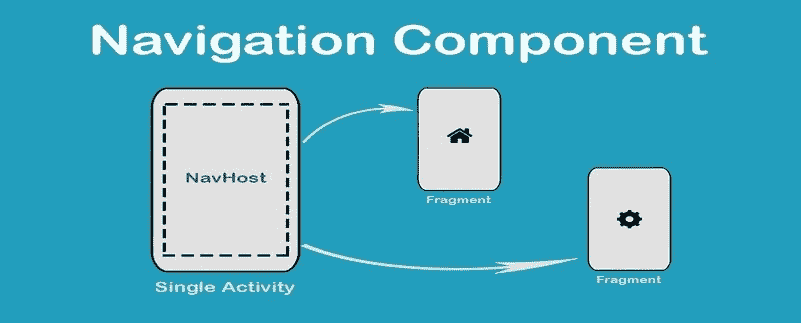
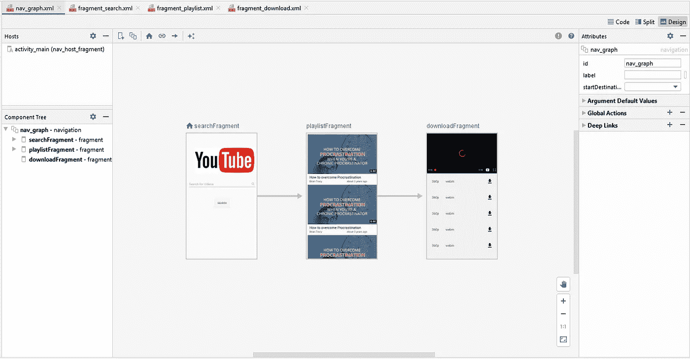
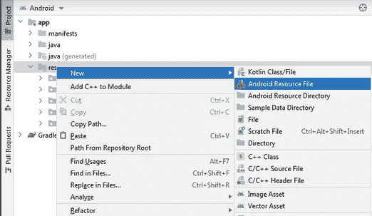
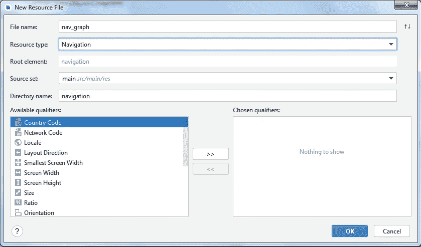
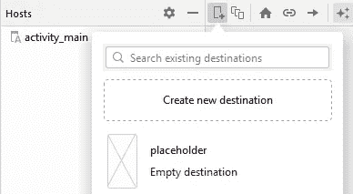

# Java 中的 Android 导航组件

> 原文：<https://itnext.io/android-navigation-component-in-java-621d7f8561b?source=collection_archive---------0----------------------->



导航组件

本文介绍了一个关于导航的有趣话题。Android Jetpack 的导航组件可以帮助您实现导航，从简单的按钮点击到更复杂的模式，如应用程序栏和导航抽屉。我们将通过 Java 中的[**YouTube downloader**](https://github.com/Marwa-Eltayeb/YoutubeDownloader)app 来介绍使用它的基础知识。

导航组件是一个库，它管理复杂的片段导航、深度链接、动画以及在应用程序中的片段之间传递的编译时检查的参数。

导航组件由三个关键部分组成:

*   **导航图:**导航图是一个 XML 资源文件，在一个位置包含所有导航相关的信息。它包含应用程序中所有名为目的地的单独内容区域，以及用户在应用程序中可能采取的路径或步骤。
*   导航主机:导航主机是一个空容器，显示导航图中的所有目的地。导航组件有一个默认的 navhost 实现，它显示片段目的地。
*   **Nav controller:**Nav controller 是一个管理导航主机内应用导航的对象。当用户在你的应用程序中移动时，它还协调导航主机中目的内容的交换。

# 导航组件入门

1.  **设置您的环境**

首先，将以下依赖项添加到应用程序的`build.gradle`文件中，以便在项目中包含导航支持。

```
def nav_version = "2.3.5"

// Java language implementation
implementation "androidx.navigation:navigation-fragment:$nav_version"
implementation "androidx.navigation:navigation-ui:$nav_version"
```

**2。创建导航图**

导航发生在应用程序的*目的地、*之间，这些目的地通过*动作*连接。

一个 ***导航图*** 是一个包含你所有目的地和动作的资源文件。图表显示了应用程序的所有导航路径。



导航图

在导航图中，我们有两个非常重要的单元。

1.  **Destinations** :这是应用程序中的一个片段或活动。它是一个包含数据和用户可以与之交互的界面的组件。
2.  **动作**:这是一条特定的导航路线，用户可以沿着这条路线到达某个目的地。它们的主要目的是连接两个或多个目的地。

要将导航图添加到项目中，请执行以下操作:

1.  在项目窗口中，右键点击`res`目录，选择**新建> Android 资源文件**。出现**新资源文件**对话框。



2.在**文件名**字段中输入一个名称，如“nav_graph”。

3.从**资源类型**下拉列表中选择**导航**，然后点击**确定**。



将导航图添加到项目中

**3。向活动添加 nav host**

当用户与我们的 UI 交互时，一个 ***NavHost*** 将作为一个占位符来替换目标。我们需要将 NavHost 添加到活动的主布局中。

**4。向导航图添加目的地**

要使用导航编辑器添加新目的地，请执行以下操作:



创建新目的地

*   在导航编辑器中，点击**新目的地**图标，然后点击**创建新目的地**。
*   在出现的**新 Android 组件**对话框中，创建您的片段。

属性:

*   `id`:目的地的特殊标识。
*   `name`:表示目的地的名称，在我们的例子中是片段类。
*   `label`:显示在顶部应用程序栏上的目的地布局名称(如果有)。
*   `layout`:用于在目的地显示内容的实际布局文件。

导航图的起点是 searchFragment，但我们需要连接目的地。

`app:startDestination=”@id/searchFragment”`

**5。连接目的地**

使用`[NavController](https://developer.android.com/reference/androidx/navigation/NavController)`导航到目的地，T5 是一个管理`NavHost`内应用导航的对象。每个`NavHost`都有自己对应的`NavController`。您应该直接从`NavHostFragment.`中检索`NavController`

```
*// Get the navigation host fragment from this Activity* NavHostFragment navHostFragment = (NavHostFragment) getSupportFragmentManager().findFragmentById(R.id.***nav_host_fragment***);*// Instantiate the navController using the NavHostFragment* NavController **navController** = navHostFragment.getNavController();*// Make sure actions in the ActionBar get propagated to the NavController
setupActionBarWithNavController*(**this**, **navController**);
```

为了连接目的地，我们使用*动作* s。动作在导航图中用箭头表示。动作通常将一个目的地连接到另一个目的地。我们用箭头将它们连接起来，或者手动添加以下代码。

*   首先，我们将使用一个动作从`search_fragment`移动到`playlist_fragment`

```
<**action
    android:id="@+id/action_searchFragment_to_playlistFragment"
    app:destination="@id/playlistFragment"** />
```

为了实际导航到目的地，您仍然需要编写代码来执行导航。使用`NavController.navigate()`，传递动作的 ID，如下所示:

```
**navController**.navigate(R.id.***action_searchFragment_to_playlistFragment***, bundle);
```

*   其次，我们将使用一个动作从`playlist_fragment`移动到`download_fragment`

```
<**action
    android:id="@+id/action_playlistFragment_to_downloadFragment"
    app:destination="@id/downloadFragment"** />
```

同样，使用`NavController.navigate()`，传递动作的 ID，如下所示:

```
**navController**.navigate(R.id.***action_playlistFragment_to_downloadFragment***, bundle);
```

**6。在目的地之间传递数据**

在`PlaylistFragment`中，我们希望从前面的片段中接收我们要搜索的关键字。我们需要将这个关键字从`SearchFragment`传递到`PlaylistFragment`。导航库帮助我们在目的地之间传递数据。

它有一个名为`safeArgs`的插件，帮助传递数据并确保类型安全。这意味着我们不需要检查数据中的可空性。已经为`safeArgs`设置了项目。

您可以浏览文档的本节以了解如何设置。

为了将数据传递到目的地，我们使用了`<argument>`标签。

```
<**argument
    android:name="keyword"
    android:defaultValue="None"
    app:argType="string"** />
```

属性:

*   `name`:这是您希望传递到此目的地的数据值的名称。
*   `defaultValue`:无数据传递时使用的默认值。
*   `argType`:这是传入参数的数据类型。我使用字符串作为关键字。

创建要传递的包，可以放字符串、整数或可序列化的对象

```
**btn_search**.setOnClickListener(v -> {
    String keyword = **searchEditText**.getText().toString().trim();

    **if**(!TextUtils.*isEmpty*(keyword)){

        Fragment fragment = **new** Fragment();
        Bundle bundle = **new** Bundle();
        bundle.putString(***KEYWORD***, keyword);
        fragment.setArguments(bundle);

        **navController**.navigate(R.id.***action_searchFragment_to_playlistFragment***, bundle);
    }
});
```

在下一个片段中，在 onViewCreated 中，调用 Bundle

```
Bundle bundle = **this**.getArguments();
**if** (bundle != **null**) {
    *keyWord* = bundle.getString(***KEYWORD***);
}
```

**7。操作向上按钮**

为了给默认动作栏添加导航支持，从主活动的`onCreate()`方法中调用`setupActionBarWithNavController()`。

然后，我们覆盖`onSupportNavigateUp()`来处理导航

```
@Override
**public boolean** onSupportNavigateUp() {
    **return navController**.navigateUp() || **super**.onSupportNavigateUp();
}
```

这个神奇的库是在我的 app[**YouTube downloader**](https://github.com/Marwa-Eltayeb/YoutubeDownloader)中实现的。看看这个。😃

**参考** : [安卓导航文档](https://developer.android.com/guide/navigation)

更多文章:点击 [**这里**](https://marwa-eltayeb.medium.com/)

**找到我这里:**[GitHub](https://github.com/Marwa-Eltayeb)|[LinkedIn](https://www.linkedin.com/in/marwa-eltayeb/)|[Twitter](https://twitter.com/Marwa_Eltayeb1)