# 安卓通知一体机

> 原文：<https://itnext.io/android-notification-all-in-one-8df3e1218e0e?source=collection_archive---------0----------------------->

## 在 21 世纪，通知已经成为每个人日常生活的一部分。

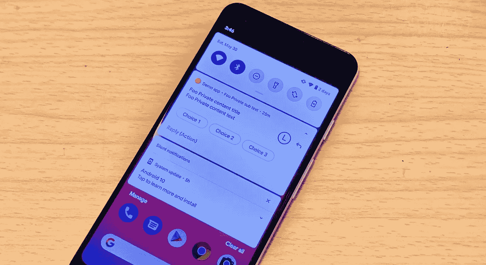

通知是当今智能手机最有用的功能之一，用户每天都会收到来自消息应用、新闻应用和游戏等的数百条通知。一个好的通知可以增加用户使用你的应用的动力。

Android 为开发者提供了大量的选项和功能来为用户提供良好的 UI/ UX，并检测用户与每个通知的交互。作为一名 Android 开发者，我们应该了解更多关于通知布局及其功能的可能性。

我已经开发了几年的 Android 应用程序，我将把我过去的一些经验和技巧包括在内。希望这篇文章对你有用。开始吧！

# 通知中的小部件

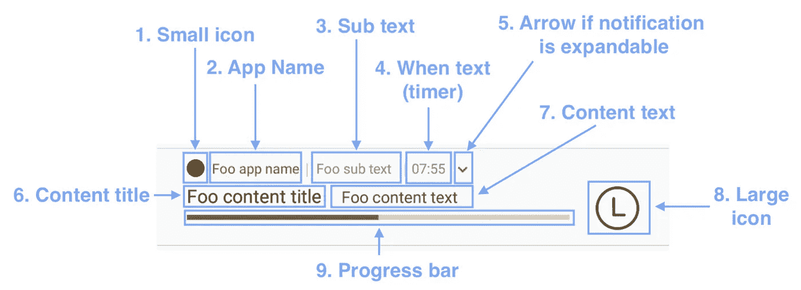

每个通知中共有 9 个不同的小部件([而不是官方文档中的 6 个](https://developer.android.com/guide/topics/ui/notifiers/notifications#Templates)):

1.  小图标(通常是应用程序图标)—记住色调颜色，并参见**“通知图标技巧”**部分了解更多详情
2.  应用程序名称—设置在`AndroidManifest.xml`
3.  子文本—用`setSubText(subText: String)`设置
4.  文本时—用`setWhen()`、`setShowWhen()`和`setUsesChronometer()`设定
5.  箭头按钮
6.  内容标题—用`setContentTitle(title: String)`设置
7.  内容文本—用`setContentText(content: String)`设置
8.  大图标—用`setLargeIcon(bitmap: Bitmap)`设置
9.  进度条—用`*setProgress(max: Int, progress: Int, isDeterminate: Bool)*`设置

# 5 种内置通知样式

Android 总共提供了 5 种现有的通知样式。它们可以向用户提供不同的 UI / UX，用于显示**对话**、一段**文本**、一张**图像**、**收件箱记录**和一个**媒体控制器**:

1.消息样式通知

**2。** [**BigTextSytle 通知**](/android-notification-bigtextstyle-bd35f7530eae)

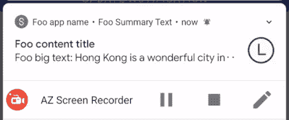

3.[**BigPictureStyleNotification**](/android-notification-bigpicturestyle-1f293e6cabaf)

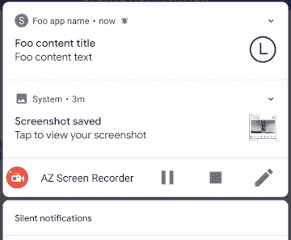

4.[**inbox style notification**](/android-inboxstyle-notification-as-deep-as-possible-4d74c0c725f1)

5.[媒体样式通知](https://developer.android.com/reference/android/app/Notification.MediaStyle)

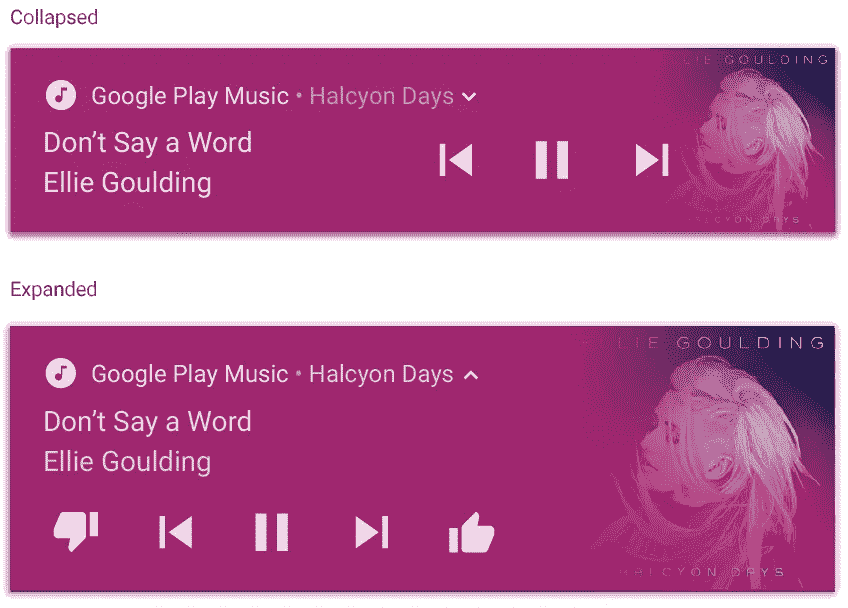

# 2017 年 Android O (API 26)的重要更新

 [## 尽可能深入的 Android 通知通道

### 自从……以来，通知通道已经成为向通知抽屉发送通知对象的必要部分

itnext.io](/android-notification-channel-as-deep-as-possible-1a5b08538c87) 

`NotificationChannel`2017 年 Android O (API 26)新推出。每个通知都必须附加到一个`NotificationChannel`上，否则通知将无法发送到通知抽屉，错误日志如下所示:

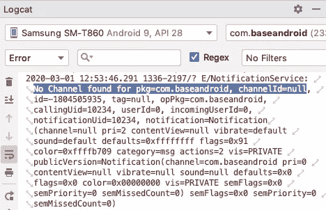

在操作系统 API 26 之前，没有通知通道设置为通知时的错误消息

# 基本通知

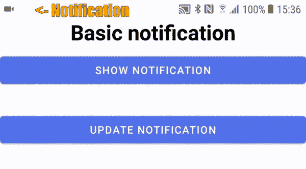

基本通知图解

`NotificationManager`是 Android 系统服务之一，可以管理发送到通知抽屉的通知。它可以对所有发送的通知进行 CRUD(创建、读取、更新和删除)。开发者可以通过`notify(uniqueNotificationId: Int, notification: Notification)`方法向通知抽屉发送通知。

最基本的通知包括:

1.  **强制**通知图标(小图标)
2.  (可选)标题字符串
3.  (可选)内容字符串

**记住**，必须为每个`Notification`对象声明通知图标，否则应用程序将崩溃，并出现以下运行时错误:

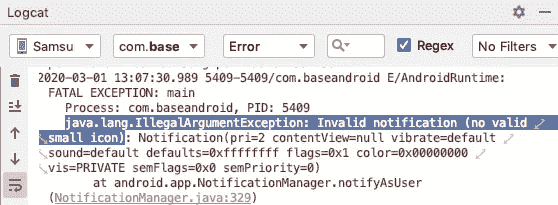

# 通知图标上的技巧

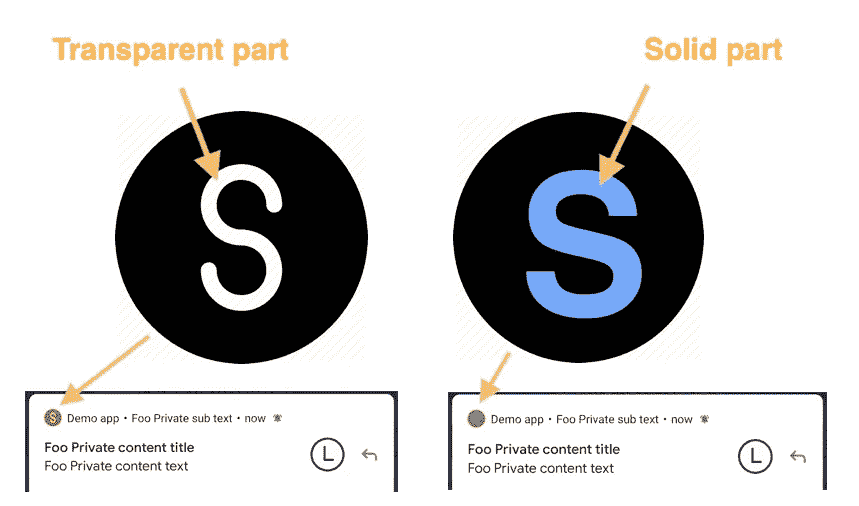

像素 3 的屏幕截图(API 29)

不同的制造商对小通知图标会有不同的实现。有些制造商会在通知图标上添加一层淡色，即所有不透明区域都将涂上由`setColor(colorRes: Int)`设置的颜色。上面的截图是在运行 API 29 的 Pixel 3 设备(由谷歌设计)上拍摄的。因此，设计师应该用透明线条勾勒出应用程序的标志，而不是使用不同的颜色。

# 颜色(浅色)

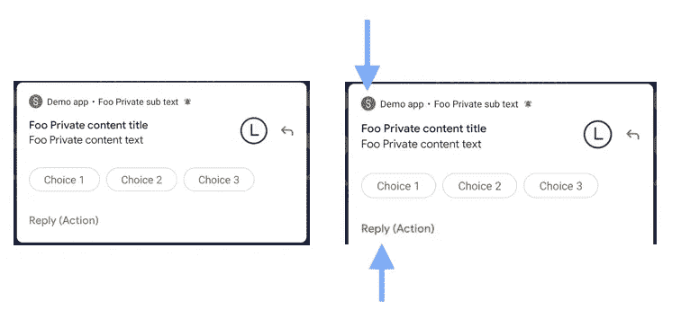

`Notification.Builder`的颜色属性影响小图标和`RemoteInput`动作按钮的颜色。

# 隐私—设置可见性

left—VISIBILITY _ PUBLIC；右-可见性 _ 私有

用户隐私是通知中最重要的部分。每个人都可以在不解锁用户手机的情况下看到用户的锁屏。当屏幕锁定时，开发人员应该隐藏敏感信息或整个通知，例如银行对账单和个人信息。

以下是 3 个可能的`Visibility`选项:

1.  **可见性 _ 秘密**
    安全等级最高。通知全部隐藏在锁屏。
2.  **VISIBILITY _ PRIVATE** 通知中的敏感信息被替换为另一组公共信息，可通过`setPublicVersion(publicNotification: Notification)`设置，参见第 4–9 行。
3.  **VISIBILITY_PUBLIC**
    所有信息自由显示。锁定屏幕的外观与平视横幅通知完全相同。见上图左侧。

# 用户交互—单击并消除通知

Android 在通知上捕捉两种用户交互，一种是**点击**通知，另一种是**取消**通知。除了一个由`setContentIntent(pendingIntent: PendingIntent)`(第 8 行)设置，另一个由`setDeleteIntent(pendingIntent: PendingIntent)`(第 9 行)设置外，它们的处理是相同的。

`PendingIntent`是一个指向 Android 系统维护的令牌的引用。因此，如果应用程序被用户终止，它仍然有效，并且可以在将来的某个时刻广播。初始化`PendingIntent`共有 4 个功能:

1.  `PendingIntent.getBroadcast()` —何时应该通知广播接收者
2.  `PendingIntent.getActivity()` —何时应该启动活动
3.  `PendingIntent.getActivities()`
4.  `PendingIntent.getService()` —服务应该何时启动

默认情况下，`Notification`在用户点击通知抽屉时不会被关闭。因此，开发人员必须调用`setAutoCancel(true)`(见第 10 行)，以便在用户被重定向到您的应用程序进行进一步操作后，隐藏通知抽屉中的通知。

# 添加附加内容(信息)

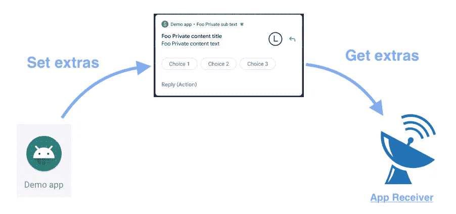

可以将额外的信息传递给通知，然后在稍后检索回来，例如在`BroadcastReceiver`。

我们可以先通过第 2 -3 行的`Bundle`封装值，然后将其传递给`setExtras`方法。

在后期，例如`BroadcastReceiver`，我们可以通过第 7 行的`getExtras()`方法取回数据。

# 添加远程输入和操作

2 个回复选项输入回复—选择和编辑文本

`RemoteInput`和`Action`是可以让用户快速响应通知的 UI 套件。`RemoteInput`是一个带有预定义动作的`Button`列表，`Action`是一个可以显示`EditText`的列表，供用户在不打开应用程序的情况下输入`String`。

由于空间有限，有些选项在没有空间显示时会被隐藏，例如“选项 4”和“选项 5”在纵向模式下隐藏，但在横向模式下显示。因此，我们应该限制每个选项的数量和标题长度，以防止被系统裁剪。

关于`RemoteInput`的更多细节，请参考下一篇文章中的“第 4 部分 5 步远程输入”。

 [## Android 消息样式通知尽可能清晰

### 如今，信息应用是我们生活中至关重要的一部分。一个好的消息通知可以极大地改善用户界面和 UX…

itnext.io](/android-messagingstyle-notification-as-clear-as-possible-1847f809ad59) 

# 添加进度条

进度条通常用于显示长时间运行任务的进度，例如从 Play Store 下载应用程序或将文件上传到服务器。它的用法简单明了。

# 设置通知时间

通知项显示的时间必须是它被发送到通知抽屉的时间，这通常是一种误解。可以用`setWhen(timestampInMillis: Long)`功能手动改变。通知项的`when`属性用于对通知通道中的通知进行排序。

用例可以是在消息应用中处理比赛情况。假设 WebSocket 正在侦听来自服务器的事件，但是由于文本和图像消息之间的处理时间，发送消息的顺序和接收消息的顺序可能不同。换句话说，文本消息在图像消息之前到达，甚至图像消息在文本消息之前被发送。

此外，开发者可以通过调用`setShowWhen(isShow: Boolean)`来显示或隐藏时间。

# 显示计时器

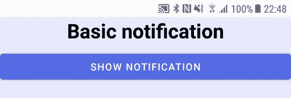

`when`属性也可以设置为与特定时间相关的计时器或计时器。`setUsesChronometer(true)`会根据`setWhen(timestamp: Long)`设定的时间将显示的时间视为计时器。

同时，`when`属性可以设置为未来的某个时刻。这种情况会将时间从递增计数计时器改变为递减计数计时器。

向上计数计时器可用于显示正在进行的电话呼叫的经过时间，向下计数时间可用于显示预定任务的剩余时间。

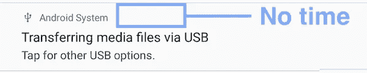

在一些特殊情况下，比如 Android 系统通知，长时间运行的进程不需要显示时间。通过调用`setShownWhen(false)`可以隐藏时间字符串。

对`when`属性有限制。时间格式不可定制，默认为`HH:mm:ss`。

# 解除通知

如果您的应用程序支持身份验证，当用户注销应用程序时，通常需要取消所有现有的通知。开发者可以调用`NotificationManager`的`cancelAll()`函数轻松解除所有通知。

# 摘要

1.  通知共有 9 个可定制的部件
2.  MessagingStyle、BigTextStyle、BigPictureStyle、InboxStyle 和 MediaStyle 是 Android 提供的通知样式，用于向用户展示更好的布局。
3.  `NotificationChannel`是从 API 26 开始添加的，开发者现在必须设置它以防止运行时崩溃
4.  通知图标应设计为透明图案，以显示细节部分，即使被一层浅色覆盖
5.  用户隐私肯定是一个大问题，应该尽可能小心处理。Android 可以隐藏整个通知或隐藏敏感消息，这取决于用户的需要。
6.  Android 可以捕获点击和删除通知动作
7.  数据可以通过`Bundle`发送给通知接收者
8.  RemoteInput 和 choices 是用户在不打开应用程序的情况下响应通知的好工具
9.  当有一个耗时的任务在你的应用程序中运行时，进度条应该被添加
10.  通知时间可以定制为任何时间，并显示一个计时器。
11.  当用户从你的应用注销时取消所有通知

# 参考

1.  [安卓定制通知](/android-custom-notification-in-6-mins-c2e7e2ddadab)
2.  [尽可能深入的 Android 通知通道— ITNEXT](/android-notification-channel-as-deep-as-possible-1a5b08538c87)
3.  [安卓通知概述](https://developer.android.com/guide/topics/ui/notifiers/notifications)
4.  [Android NotificationBuilder 文档](https://developer.android.com/reference/android/app/Notification.Builder)

欢迎您通过[Twitter @ my rik _ chow](https://twitter.com/myrick_chow)关注我，了解更多信息和文章。感谢您阅读这篇文章。祝您愉快！😄