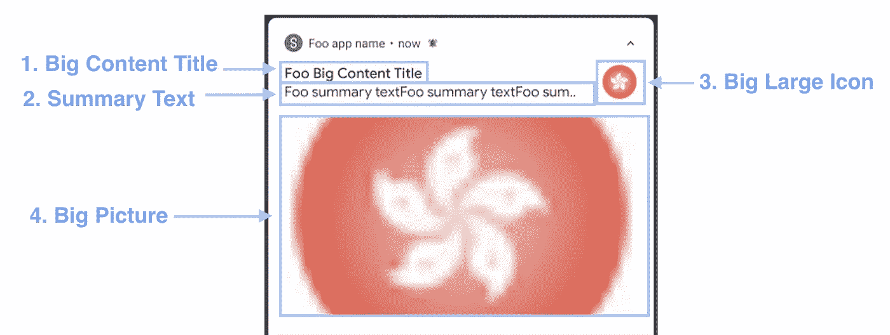
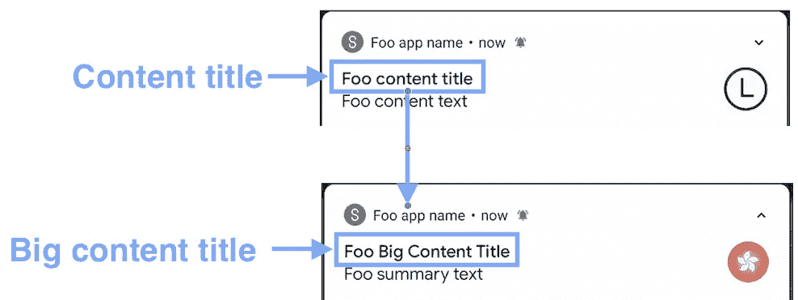
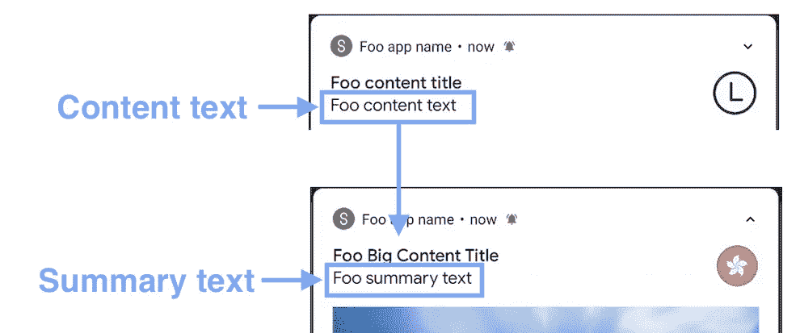
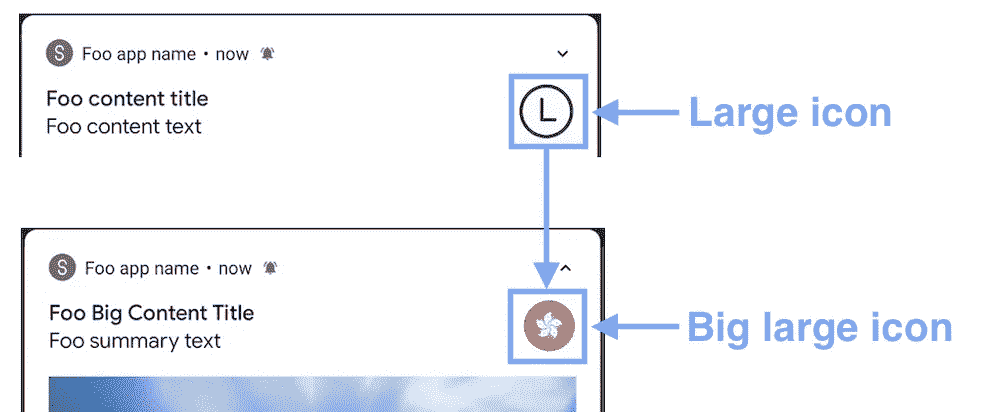
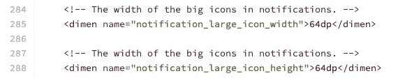
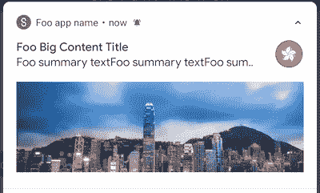
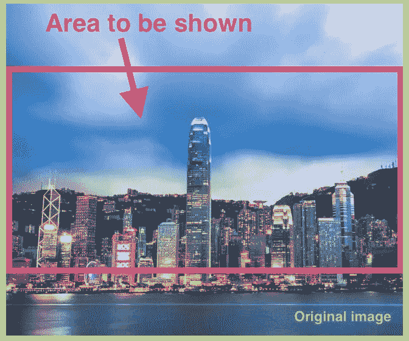
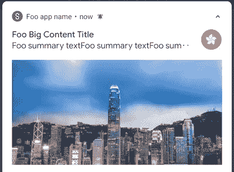

# Android 通知 BigPictureStyle 尽可能深

> 原文：<https://itnext.io/android-notification-bigpicturestyle-1f293e6cabaf?source=collection_archive---------4----------------------->

ndroid 为开发人员提供了方便的工具，可以在通知中显示不同的信息。造型通知共有 5 种通知样式，即`BigTextStyle`、`BigPictureStyle`、`MessagingStyle`、`InboxStyle`、`MediaStyle`。

`BigPictureStyle`用于显示通知项中的大图。它有两种状态——**折叠状态**和**展开状态**。在折叠状态下，它显示的内容与普通通知完全相同。展开后，它会显示一组新的内容标题、摘要文本、大图标和图片。看上面的动画可以得到更好的说明。

BigPictureStyle 通知的展开状态剖析

BigPictureStyle 通知有 4 个项目。他们是`bigContentTitle`、`summaryText`、`bigLargeIcon`和`bigPicture`。有一些有趣的属性在官方文档中没有提到。此外，我在以前的应用程序开发过程中发现了一些技巧。我将在本文中逐一介绍这些属性和技巧。开始吧！

# 一体化代码

## **1。BigContentTitle**

处于展开状态的`BigContentTitle`(见上述代码的第 5 行)是处于折叠状态的`contentTitle`(见上述代码的第 24 行)的替换。它可以通过有限的 HTML 标签或`Spanned`进行定制。它们将在下一节中介绍。

## **2。摘要文本**

BigPictureStyle 的摘要文本

`SummaryText`(见上述代码第 6 行)是在通知展开时`contentText`(见上述代码第 25 行)的替代。也可以通过有限的 HTML 标签或`Spanned`进行定制。

顺便说一下，我们不应该混淆`BigPictureStyle`中的`summaryText`和`BigTextStyle`中的`summaryText`。在 BigTextStyle 中，`summaryText`被放置在应用程序名称和时间之间(参见下面的截图以获得更好的说明)。但是，它被放置在`BigPictureStyle`中的`contentTitle`下方。

## **3。bigglargeicon**

当通知被扩展时，`bigLargeIcon`(见上述代码的第 7 行)代替了`largeIcon`(见上述代码的第 26 行)。尺寸为 64 dp x 64 dp，这个正方形的`scaleType`为`centerCrop`。

Android [dimens.xml](https://android.googlesource.com/platform/frameworks/base/+/master/core/res/res/values/dimens.xml) 源代码

## **4。大图**

图像源(1000 像素 x 317px 像素)

通知行的缩放图像

这是展开通知时显示的图像。`scaleType`为`fitCenter`，即图像将被放大/缩小，直到宽度与`ImageView`相匹配，同时保持原来的纵横比。大高宽比的图像可以很好的显示，例如上图的高宽比为`3.15 : 1`。

但是，由于通知行的最大高度被限制在 [256 dp](https://developer.android.com/training/notify-user/custom-notification) ，因此具有小纵横比的图像(例如`1:1`)可能会被裁剪。

大图像(672 像素 x 561px 像素)

带有大图像源的通知的图示

# 文本样式

通知中的所有文本都可以通过 HTML 标签手动设置样式，这在[官方文档](https://developer.android.com/training/notify-user/expanded#large-style)中有正式建议。这里有一个例子:

然而，除了建议的方法之外，文本也可以用`Spanned`进行样式化，因为所有设置文本的功能都接受`CharSequence`作为参数。这里有一个例子:

要了解有关样式通知的更多信息，请参考以下文章:

 [## Android 通知样式

### 通知是通知用户新信息的常用工具。你有没有想过设计它的内容…

itnext.io](/android-notification-styling-cc6b0bb86021) 

# 摘要

1.  `BigPicture`通知由 4 个要素组成。它们是`bigContentTitle`、`summaryText`、`bigLargeIcon`和`bigPicture`。
2.  仅显示`bigContentTitle`并替换展开状态下的原始`contentTitle` 。
3.  `summaryText`是扩展通知时原`contentTitle` 的替换。
4.  `bigLargeIcon`取代了原来处于崩溃状态的`largeIcon`。
5.  `bigPicture`为`BigTextStyle`通知的主体，展示图像来源。`scaleType`为`fitCenter`。图像可能由于其自身的纵横比而被裁剪。
6.  `BigPictureStyle`中的文本可以用 HTML 标签和`Spanned`来设置样式。

# 想了解更多关于安卓通知的信息:

## 1.自定义通知

 [## 安卓定制通知将在 6 分钟内完成

### 定制通知可以包括比默认通知样式更多的花哨小部件。让我们点击…

itnext.io](/android-custom-notification-in-6-mins-c2e7e2ddadab) 

**2 .安卓通知一体机**

 [## 安卓通知一体机

### 在 21 世纪，通知已经成为每个人日常生活的一部分。作为一个安卓开发者，最好了解更多…

itnext.io](/android-notification-all-in-one-8df3e1218e0e) 

**3 .大文本系统通知**

 [## 安卓通知大文本风格尽可能深入

### 通知在普通应用程序中很常见。当内容太长时，总是使用 BigTextStyle。让我们看看小窍门…

itnext.io](/android-notification-bigtextstyle-bd35f7530eae) 

## 4.InboxStyleNotification

 [## Android InboxStyle 通知尽可能深入

### InboxStyle 通知用于显示来自传入电子邮件的片段。我发现了一个文档问题。让我们看一看…

itnext.io](/android-inboxstyle-notification-as-deep-as-possible-4d74c0c725f1) 

## 5.通知样式

 [## 安卓通知样式

### 通知是通知用户新信息的常用工具。你有没有想过设计它的内容…

medium.com](https://medium.com/@myrickchow32/android-notification-styling-cc6b0bb86021) 

# 参考

## 1.BigPictureStyle 正式文件

 [## 通知。BigPictureStyle | Android 开发人员

### AccessibilityService。放大控制器. OnMagnificationChangedListener

developer.android.com](https://developer.android.com/reference/android/app/Notification.BigPictureStyle)  [## 创建可扩展通知|安卓开发人员

### 基本通知通常包括标题、一行文本以及用户可以在其中执行的一个或多个操作…

developer.android.com](https://developer.android.com/training/notify-user/expanded#image-style) 

## 2.跨越的官方文件

 [## 跨区|安卓开发人员

### AccessibilityService。放大控制器. OnMagnificationChangedListener

developer.android.com](https://developer.android.com/reference/android/text/Spanned) 

## 3.使用超文本标记语言标签的样式官方文档

 [## 字符串资源|安卓开发人员

### 字符串资源通过可选的文本样式和格式为应用程序提供文本字符串。有三个…

developer.android.com](https://developer.android.com/guide/topics/resources/string-resource#StylingWithHTML) 

欢迎您在[推特@杨梅周](https://twitter.com/myrick_chow)上关注我，获取更多信息和文章。谢谢你阅读这篇文章。祝你有愉快的一天！😄