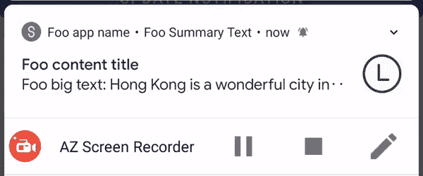
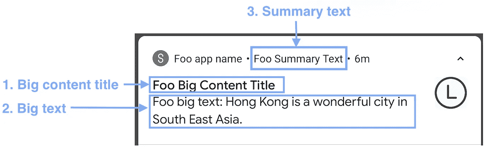
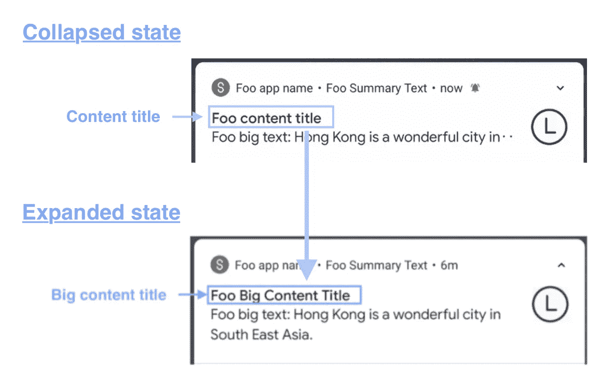
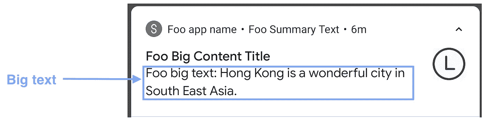
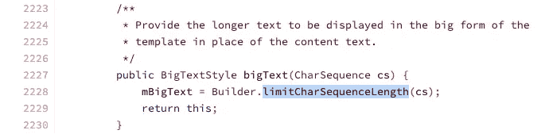
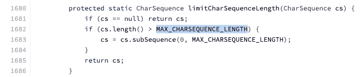
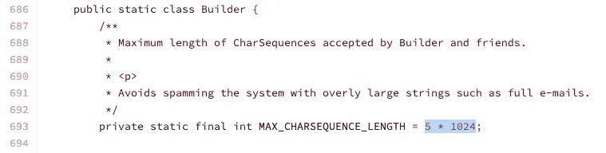
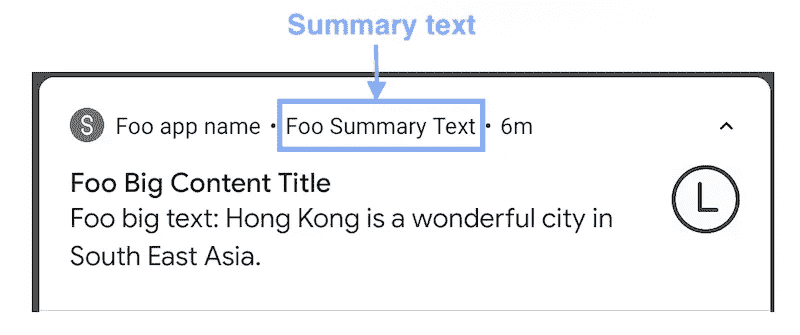

# Android 通知 BigTextStyle 尽可能深

> 原文：<https://itnext.io/android-notification-bigtextstyle-bd35f7530eae?source=collection_archive---------4----------------------->

BigTextStyle 通知的图示

n droid 通知是通知用户信息的常用工具。在通常的通知中，只有一行显示内容。当没有足够的空间时，内容会在行尾被截断。

因此，Android 增加了一种特殊的通知方式来解决这个问题。是`BigTextStyle`。它有两种状态——**折叠状态**和**展开状态**。折叠状态与通常的带有一行标题和一行内容的通知样式相同。扩展状态由一个带有多行内容的新标题组成。更好的图解见上面的 gif。

BigTextStyle 的属性

`BigTextStyle`通知由 3 个要素组成。他们是`bigContentTitle`、`bigText`和`summaryText`。它们都可以通过有限的`[HTML](https://developer.android.com/guide/topics/resources/string-resource#StylingWithHTML)` [标签](https://developer.android.com/guide/topics/resources/string-resource#StylingWithHTML)或 [Spannables](https://developer.android.com/guide/topics/resources/string-resource#StylingWithSpannables) 来设计。在这篇文章中，我将逐一介绍我以前遇到的属性和技巧。

# 一体化示例代码

`BigTextStyle`通知共有 3 个属性

1.  **BigContentTitle(char sequence)**

此`BigContentTitle`仅在大文本通知**展开**时显示。它替代了在通知构建器中设置的`contentTitle`(参见上面示例代码的第 21 行)。

**2。BigText (CharSequence)**

这是通知的主要和冗长的内容。当通知折叠时，它被截断为一行，而当通知展开时，它显示为多行。

*请记住，当设置 bigText 时，正常通知中设置的`contentText`会被**忽略。参见上面示例代码的第 23 行。**

> 请注意，`*bigText*`处显示的字符数量有限制，以防止向系统发送过长的内容。限制是 **5120 个**字符。
> 参见下面的代码，这些代码复制自[谷歌开源项目](https://android.googlesource.com/platform/frameworks/support/+/refs/heads/androidx-master-dev/core/core/src/main/java/androidx/core/app/NotificationCompat.java?source=post_page---------------------------%2F%2F%2F%2F%2F%2F%2F&autodive=0%2F%2F%2F%2F%2F%2F%2F%2F%2F%2F)以了解更多细节。

设置 BigTextStyle 的 bigText 属性的功能； [BigTextStyle 源代码](https://android.googlesource.com/platform/frameworks/support/+/refs/heads/androidx-master-dev/core/core/src/main/java/androidx/core/app/NotificationCompat.java?source=post_page---------------------------%2F%2F%2F%2F%2F%2F%2F&autodive=0%2F%2F%2F%2F%2F%2F%2F%2F%2F%2F)的参考行 2223–2230

限制大文本长度的功能； [BigTextStyle 源代码](https://android.googlesource.com/platform/frameworks/support/+/refs/heads/androidx-master-dev/core/core/src/main/java/androidx/core/app/NotificationCompat.java?source=post_page---------------------------%2F%2F%2F%2F%2F%2F%2F&autodive=0%2F%2F%2F%2F%2F%2F%2F%2F%2F%2F)的参考行 1680–1686

显示的最大字符数的定义； [BigTextStyle 源代码](https://android.googlesource.com/platform/frameworks/support/+/refs/heads/androidx-master-dev/core/core/src/main/java/androidx/core/app/NotificationCompat.java?source=post_page---------------------------%2F%2F%2F%2F%2F%2F%2F&autodive=0%2F%2F%2F%2F%2F%2F%2F%2F%2F%2F)的参考行 686–694

**3。SummaryText (CharSequence)**

这是显示在应用程序名称和通知的时间(时间)属性之间的补充文本。

> 记住这个`summaryText`被`NotificationBuilder`的`subText` 覆盖。请参见上面示例代码的第 26 行。

# 文本样式

通知中的所有文本都可以通过 HTML 标签手动设置样式，这在[官方文档](https://developer.android.com/training/notify-user/expanded#large-style)中有正式建议。这里有一个例子:

然而，除了建议的方法之外，文本也可以用`Spanned`进行样式化，因为所有设置文本的函数都接受`CharSequence`作为参数。这里有一个例子:

要了解有关样式通知的更多信息，请参考以下文章:

 [## Android 通知样式

### 通知是通知用户新信息的常用工具。你有没有想过设计它的内容…

itnext.io](/android-notification-styling-cc6b0bb86021) 

# 摘要

1.  `BigTextStyle`通知由 3 个要素组成。他们是`bigContentTitle`、`bigText`和`summaryText`
2.  `bigContentTitle`是一个单独显示的图标，代替了展开状态下的原始`contentTitle` 。
3.  `bigText`是一个不超过 5120 个字符的多行文本，覆盖普通通知中的`contentText`。
4.  `summaryText`是显示应用程序名称旁边的补充文本，在正常通知中被`subText`覆盖。
5.  `BigTextSytle`中的文本可以用 HTML 标签和`Spanned`来设计样式。

# 想了解更多关于 Android 通知的信息:

## 1.自定义通知

 [## Android 自定义通知在 6 分钟内完成

### 定制通知可以包含比默认通知样式提供的更多奇特的小部件。让我们点击…

itnext.io](/android-custom-notification-in-6-mins-c2e7e2ddadab) 

**2。安卓通知一体机**

 [## 安卓通知一体机

### 在 21 世纪，通知已经成为每个人日常生活的一部分。作为一个 Android 开发者，最好多了解一些…

itnext.io](/android-notification-all-in-one-8df3e1218e0e) 

**3。BigPictureStyle 通知**

 [## Android 通知 BigPictureStyle 尽可能深

### 当您希望在通知行显示图像时，可以使用 BigPictureStyle 通知。这里有一些提示和…

itnext.io](/android-notification-bigpicturestyle-1f293e6cabaf) 

## 4.收件箱样式通知

 [## 尽可能深入的 Android 收件箱通知

### InboxStyle 通知用于显示收到的电子邮件的片段。我发现一个文档问题。让我们看一看…

itnext.io](/android-inboxstyle-notification-as-deep-as-possible-4d74c0c725f1) 

## 5.通知样式

 [## Android 通知样式

### 通知是通知用户新信息的常用工具。你有没有想过设计它的内容…

medium.com](https://medium.com/@myrickchow32/android-notification-styling-cc6b0bb86021) 

# 参考

## 1.Android BigTextStyle 官方文档

 [## 创建可扩展通知| Android 开发者

### 基本通知通常包括一个标题、一行文本以及用户可以在…中执行的一个或多个操作

developer.android.com](https://developer.android.com/training/notify-user/expanded#large-style) 

## 2.跨越官方文件

 [## 跨越| Android 开发者

### AccessibilityServiceMagnificationController . OnMagnificationChangedListener

developer.android.com](https://developer.android.com/reference/android/text/Spanned) 

## 3.使用 HTML 标签的样式官方文档

 [## 字符串资源| Android 开发者

### 字符串资源通过可选的文本样式和格式为应用程序提供文本字符串。有三个…

developer.android.com](https://developer.android.com/guide/topics/resources/string-resource#StylingWithHTML) 

欢迎您通过[Twitter @ my rik _ chow](https://twitter.com/myrick_chow)关注我，了解更多信息和文章。感谢您阅读这篇文章。祝您愉快！😄