# 尽可能深入的 Android 通知通道

> 原文：<https://itnext.io/android-notification-channel-as-deep-as-possible-1a5b08538c87?source=collection_archive---------1----------------------->

N 用户可以为每个`NotificationChannel`下的所有通知设置不同的设置(如振动、LED 通知&铃声)。这是对管理通知的一个很好的改进。

此外，可以将几个`NotificationChannel`分组为一个`NotificationChannelGroup`，以允许用户启用/禁用从该组接收通知。`NotificationChannel`设置提交到`NotificationManager`后不能更改。

在这篇文章中，我将介绍`NotificationChannel`和`NotificationChannelGroup`的所有属性，并强调我之前开发应用程序时的一些重要注意事项。以下是内容列表:

1.  频道 id
2.  频道名称
3.  描述文本
4.  组
5.  重要
6.  LED 通知
7.  自定义声音(铃声)
8.  震动
9.  锁屏可视性
10.  标记
11.  绕过“请勿打扰”模式

# 启动前)Android 通知设置

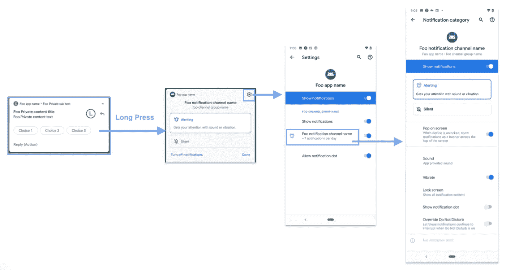

运行于 Android 10 (API 29)的 Pixel 3 的通知设置页面截图

在详细了解`NotificationChannel`之前，我们应该了解用户可以通过进入系统设置应用程序的通知设置页面来覆盖所有`NotificationChannel`设置。步骤见上文。

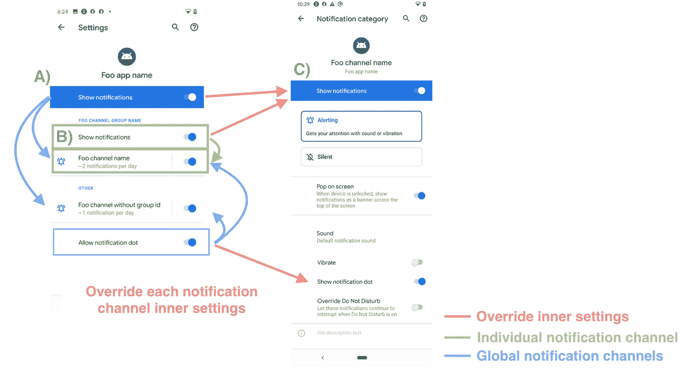

通知设置页面(左)和通知通道设置页面(右)

在应用程序设置页面有 3 个“显示通知”按钮(A，B & C ),它们很容易混淆。

`A`“显示通知”按钮控制应用程序级别的通知设置，并启用/禁用应用程序显示任何通知。

`B`“显示通知”按钮在`NotificationChannelGroup`层下，控制整个组`NotificationChannel`成员是否可以显示通知。

`C`“显示通知”按钮控制特定的`NotificationChannel`。

# NotificationChannelGroups

`NotificationChannelGroups`是将`NotificationChannel`列表组合在一起的对象。用户只需点击一下，即可阻止/解除阻止整组`NotificationChannel` s。如果您错过了，请参见之前的“Android 通知设置”部分。

`NotificationChannelGroups`的描述只是向用户显示信息的简单文本。可以在通知类别页面找到它。

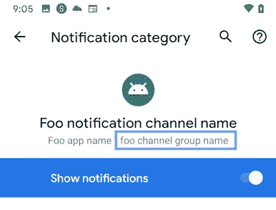

设置应用程序中通知类别页面上的 NotificationChannelGroup 名称的位置

# 属性 1) ChannelId

`ChannelId`是标识每个`NotificationChannel`的唯一的`String`，在构造`Notification`对象时用于`Notification.Builder`(第 7 行)。

`NotificationChannel`除了**频道名称**和**描述文本**之外的设置，在提交到第 5 行`NotificationManager`后不可更改。`NotificationManager`使用该字段检查其记录中是否已经有一个`NotificationChannel`。

# 属性 2 + 3)频道名称和描述文本

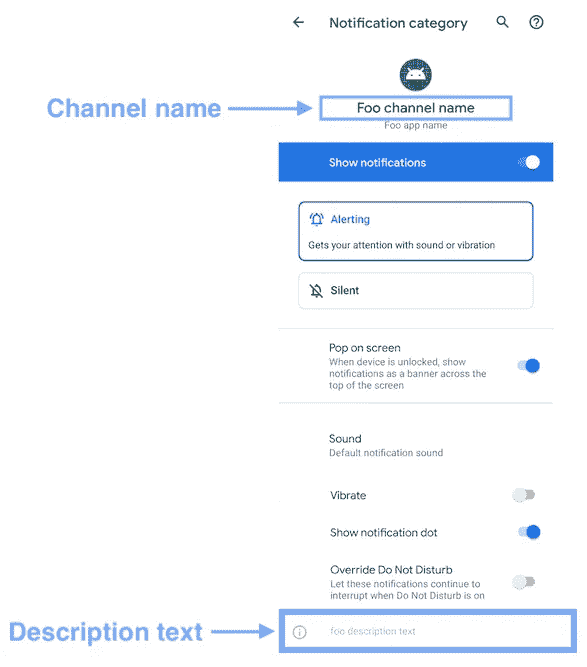

通知通道设置页面

通道名称和描述文本都是简单的显示字符串，便于用户了解`NotificationChannel`的详细信息。频道名称的最大长度为 40 个字符，描述文本的最大长度为 300 个字符。

> 与`*NotificationChannel*`的其他属性不同，这两个属性可以更新，即使频道被提交给`*NotificationManager*`。当应用程序是多语言的时，它是有用的。

# 属性 4)组

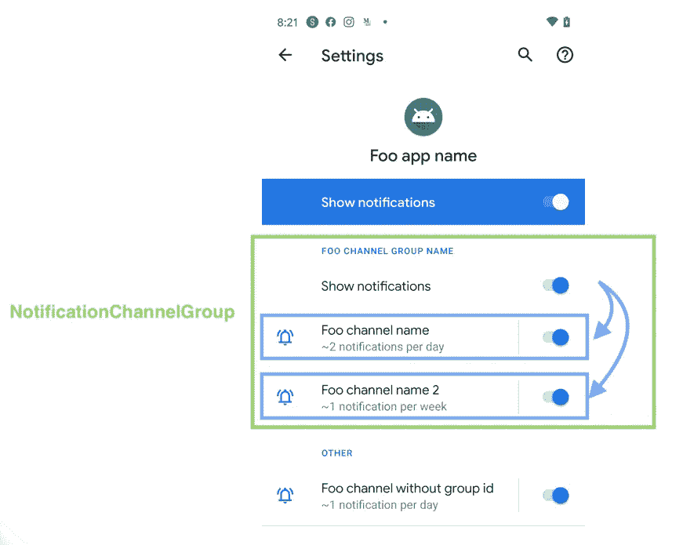

显示 NotificationChannelGroup 列表的应用程序通知设置页面的屏幕截图

正如在上面的会话中提到的，有一个`NotificationChannelGroup`对象用于将一些`NotificationChannel`组合在一起。`group`属性是通过唯一 id 将`NotificationChannel`与`NotificationChannelGroup`链接起来的属性。

# 属性 5)重要性

每个`NotificationChannel`有 5 个可用的通知重要性。

1.  **IMPORTANCE_NONE = 0**
    用户已禁用该`NotificationChannel`的通知。

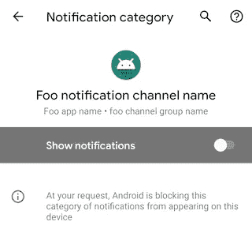

用户已禁用整个通知通道的通知

2. **IMPORTANCE_MIN = 1**

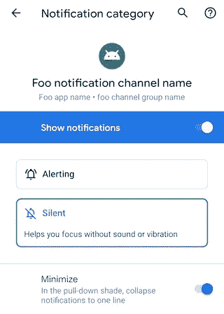

启用“静音”和“最小化”

3. **IMPORTANCE_LOW = 2**

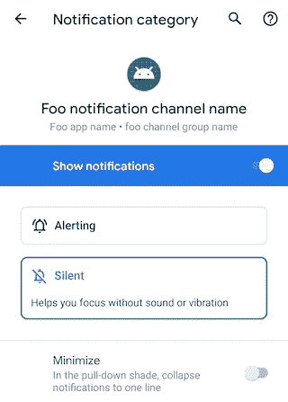

“静音”已启用，但“最小化”已禁用

4. **IMPORTANCE_DEFAULT = 3**

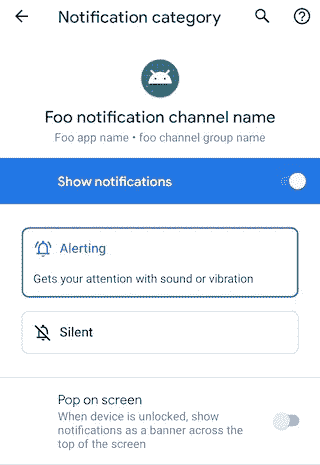

“报警”已启用，但“屏幕弹出”已禁用

5. **IMPORTANCE_HIGH = 4**

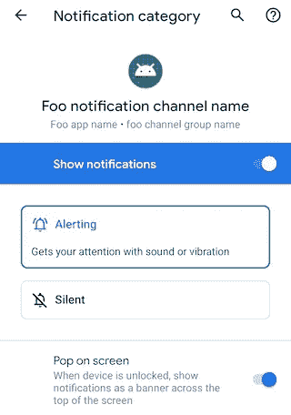

启用“报警”和“屏幕弹出”

# 属性 6) LED 通知

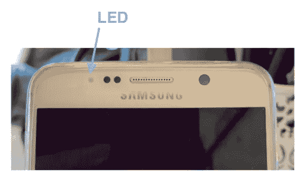

三星 Galaxy J5 中的通知 LED

一些 Android 设备(如三星 Galaxy J5)有一个 LED，用于通知用户新的通知。开发者可以定制每个`NotificationChannel`的颜色。默认情况下，LED 功能处于禁用状态。因此，`enableLights(true)`必须在`lightColor`置位后调用。

然而，**并不是**现在每部安卓手机(比如 2018 年的 Pixel 3&2019 年的 Pixel 4)都有嵌入式 LED。因此，单纯依靠 LED 颜色来区分不同类型的通知并不是一个好办法。UX 设计师在开发时应该记住这一点！

# 属性 7)自定义声音(铃声)

不同的安卓手机都有自己默认的通知铃声。要统一或定制特定通知通道的铃声，开发者可以通过上述代码加载和设置铃声。音频(`mp3`)文件可以放在`res`文件夹下的`raw`文件夹中。

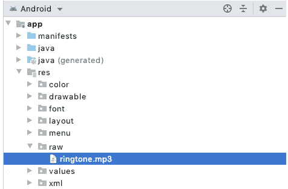

Android 项目结构中 mp3 文件的位置

> 互联网上有一些免费的铃声。你可以从这个[网站](https://www.prokerala.com/downloads/ringtones/)找到一些测试铃声。

# 属性 8)振动

默认情况下，显示通知不会导致手机振动。它必须由上面的代码显式启用。

`vibrationPattern`是`Long`的数组。它的奇数索引元素代表沉默的持续时间，偶数索引元素代表振动的持续时间。上述示例代码(第 6–8 行)将导致手机以下列模式振动(静音 2s &振动 1s):

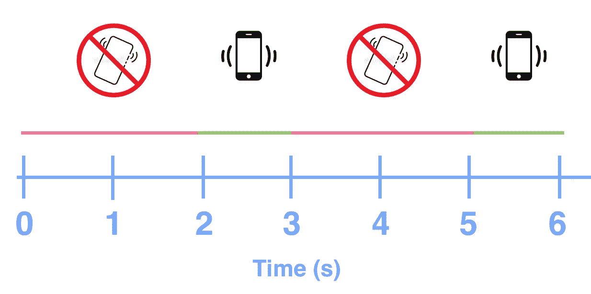

# 属性 9)锁屏可见性

以下是 3 个可能的`lockscreenVisibility`选项:

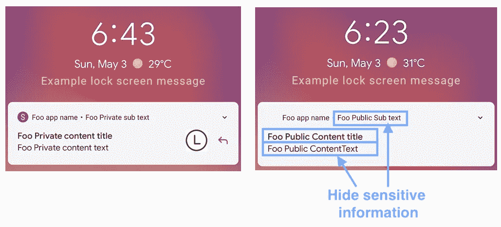

left—VISIBILITY _ PUBLIC；右-可见性 _ 私有

1.  **可见性 _ 秘密**
    安全等级最高。属于这个`NotificationChannel`的通知全部隐藏在锁屏。
2.  **VISIBILITY _ PRIVATE** 通知中的敏感信息被另一组公开信息替代(上图右侧)。参见示例代码:

3. **VISIBILITY_PUBLIC**
所有信息自由显示。锁定屏幕的外观与平视横幅通知完全相同。见上图左侧。

# 酒店 10)徽章

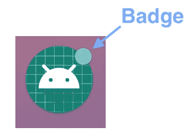

徽章是应用程序图标右上角的一个小圆点。它通知用户在通知抽屉里有一些通知。默认情况下，所有`NotificationChannel`都会显示徽章。但是，在某些情况下，徽章应该隐藏，例如，正在进行的电话不应该显示徽章。

# 酒店 11)绕过“请勿打扰”

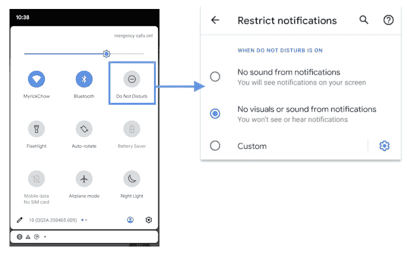

下拉菜单中的“请勿打扰”切换按钮

“请勿打扰”(DND)模式主要通过禁止所有通知提供任何视觉和声音效果来为用户提供安静的环境。然而，可以有一些紧急通知，即在任何情况下都应该通知用户，例如地震疏散通知。因此，Android 提供此选项来覆盖用户设置的免打扰模式。

# 摘要

1.  `NotificationChannel`将通知分组在一起，`NotificationChannelGroup`将`NotificationChannel`分组在一起。用户可以更容易地将设置应用于一组通知。
2.  `NotificationChannel`提交到`NotificationManager`后，设置不可更改。
3.  开发者可以通过设置`NotificationChannel`的重要性、锁屏可见性、群组、振动模式、铃声、LED 通知、徽章显示和“请勿打扰”模式来定制。
4.  重要性级别取决于用户是否限制通知显示，例如声音、振动、抬头方式。
5.  Android 手机中的嵌入式 LED 很可能在未来被淘汰。请慎重考虑，以确保良好的 UX。

# 推荐读物

1.  [安卓官方文档—通知渠道](https://developer.android.com/reference/android/app/NotificationChannel)
2.  [Android 官方文档— NotificationChannelGroup](https://developer.android.com/reference/android/app/NotificationChannelGroup)
3.  [安卓官方文档—通知管理器](https://developer.android.com/reference/android/app/NotificationManager)
4.  [StackOverflow —从媒体资源中获取 Uri](https://stackoverflow.com/questions/4896223/how-to-get-an-uri-of-an-image-resource-in-android)

# 通知相关的媒体发布

## **1。自定义通知**

 [## Android 自定义通知在 6 分钟内完成

### 定制通知可以包含比默认通知样式提供的更多奇特的小部件。让我们点击…

itnext.io](/android-custom-notification-in-6-mins-c2e7e2ddadab) 

## **2。安卓通知一体机**

 [## 安卓通知一体机

### 在 21 世纪，通知已经成为每个人日常生活的一部分。作为一个 Android 开发者，最好多了解一些…

itnext.io](/android-notification-all-in-one-8df3e1218e0e) 

## 3.消息样式通知

## **4。** [**BigTextSytle 通知**](/android-notification-bigtextstyle-bd35f7530eae)

## 5.[**BigPictureStyleNotification**](/android-notification-bigpicturestyle-1f293e6cabaf)

## 6.[**inbox style notification**](/android-inboxstyle-notification-as-deep-as-possible-4d74c0c725f1)

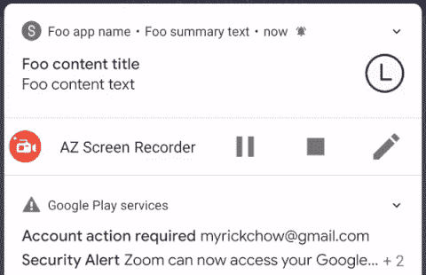

## 7. [**安卓通知样式**](/android-notification-styling-cc6b0bb86021)

欢迎您在[Twitter @ my rik _ chow](https://twitter.com/myrick_chow)关注我，了解更多信息和文章。感谢您阅读这篇文章。祝您愉快！😄