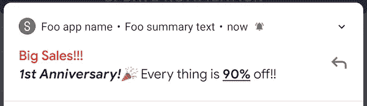
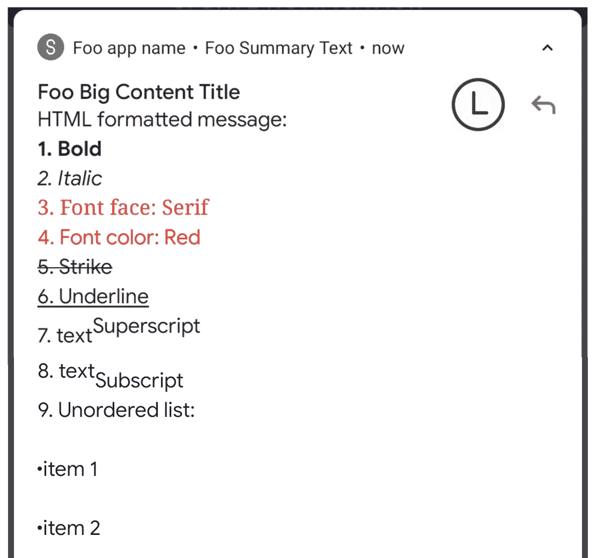
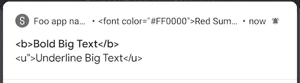
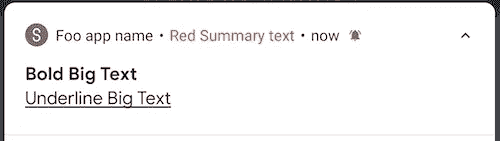

# Android 通知样式

> 原文：<https://itnext.io/android-notification-styling-cc6b0bb86021?source=collection_archive---------2----------------------->

N 通知是通知用户新信息的常用工具。例如，WhatsApp 消息通知、未接来电通知和 Google Play 应用程序更新/下载通知，应有尽有。

开发者希望使用不同通知风格来提供更加用户友好的 UI / UX。例如，新闻应用程序希望使用`[BigTextStyle](/android-notification-bigtextstyle-bd35f7530eae)`来显示新闻的简短摘要，消息应用程序希望使用`MessagingStyle`来显示对话，照片共享应用程序希望使用`[BigPictureStyle](/android-notification-bigpicturestyle-1f293e6cabaf)`来显示上传的图像，等等。

然而，市场上的大多数应用程序并不显示通知行中的文本。在我看来，属性化的文本比简单的纯文本更能吸引用户！🎉

根据[官方文档](https://developer.android.com/training/notify-user/expanded#large-style)，通知文本可以通过 HTML 标签进行样式化。除了记录的方法之外，文本也可以用`Spanned`进行样式化，因为所有设置文本的功能都接受`CharSequence`作为参数。在这篇文章中，我将向你介绍所有的细节和技巧。

# 样式通知文本

下面是可以应用于通知文本的样式的示例。

示例截图

## 方法 1) HTML 标签

HTML 标签主要用于网页布局，由开始标签和结束标签组成。就像 Android 布局文件中使用的 XML 一样。但是，通知样式并不支持所有的 HTML 标记。在所有支持的 HTML 标签中，我选择了 9 个常用标签进行演示:

如果将上述代码直接输入到类似`setContentText(text: CharSequence)`的功能中，Android **无法将上述代码识别为 HTML 样式的文本。将显示纯文本。见上面截图。**

为了让 Android 知道它是一个 HTML 样式的文本，必须使用一个`Html`解析器函数`fromHtml(source: String, flag: Int)`将字符串资源转换成一个`Spanned`对象，该对象表示一个带有标记的文本。

# 方法 2:跨区

`Spanned`是具有指定范围的标记文本的接口。如果你想了解更多关于 Android 官方`Spans`的信息，请阅读下面这篇文章。

 [## 安卓官方横跨一体机

### 跨度定义每个字符或整个段落的文本样式。大约有 30 个官方跨度。让我想想…

medium.com](https://medium.com/@myrickchow32/android-official-spans-all-in-one-6d23167b1bb9) 

相对来说，这比使用 HTML 标签更复杂，因为`Spanned`范围必须在运行时定义。下面是实现上述 HTML 代码相同结果的示例代码:

首先，`String`不能被直接样式化，因此我们需要构造一个`SpannableString`对象来设置样式，它实现了`Spanned`。不同的风格由不同的`Span`类来代表，如`StyleSpan`、`TypefaceSpan`、`ForegroundSpan`等。

第二和第三个参数定义了`Span`范围的开始和结束索引。开始索引是包含性的，结束索引是排他性的。

最后一个参数是一个标志，显示在设置`Spanned`后如何处理新插入的文本。一般我们可以放一个`0`来忽略这个标志。

有关可用`Spanned`的完整列表，请参考以下官方文档:

 [## android.text.style | Android 开发者

### AccessibilityServiceMagnificationController . OnMagnificationChangedListener

developer.android.com](https://developer.android.com/reference/android/text/style/package-summary) 

# 摘要

1.  通知中的所有文本都可以通过 HTML 标签或`Spanned`来设置样式。
2.  Android 支持有限的 HTML 标签。
3.  `Spanned`比 HTML 标签相对更复杂，因为文本范围必须在运行时定义。

# 想了解更多关于 Android 通知的信息:

## 1.自定义通知

 [## Android 自定义通知在 6 分钟内完成

### 定制通知可以包含比默认通知样式提供的更多奇特的小部件。让我们点击…

itnext.io](/android-custom-notification-in-6-mins-c2e7e2ddadab) 

**2。安卓通知一体机**

 [## 安卓通知一体机

### 在 21 世纪，通知已经成为每个人日常生活的一部分。作为一个 Android 开发者，最好多了解一些…

itnext.io](/android-notification-all-in-one-8df3e1218e0e) 

3.BigTextSytle 通知

 [## Android 通知 BigTextStyle 尽可能深

### 通知是普通 app 常见的。当内容太长时，总是使用 BigTextStyle。让我们看看技巧和…

itnext.io](/android-notification-bigtextstyle-bd35f7530eae) 

## 4.BigPictureStyleNotification

 [## Android 通知 BigPictureStyle 尽可能深

### 当您希望在通知行显示图像时，可以使用 BigPictureStyle 通知。这里有一些提示和…

itnext.io](/android-notification-bigpicturestyle-1f293e6cabaf) 

## 5.InboxStyleNotification

 [## 尽可能深入的 Android 收件箱通知

### InboxStyle 通知用于显示收到的电子邮件的片段。我发现一个文档问题。让我们看一看…

itnext.io](/android-inboxstyle-notification-as-deep-as-possible-4d74c0c725f1) 

# 参考

## 1.正式通知文件

 [## 创建通知| Android 开发者

### 当您的应用程序未被使用时，通知会提供有关该应用程序中事件的简短、及时的信息。本页教你…

developer.android.com](https://developer.android.com/training/notify-user/build-notification) 

## 2.用 HTML 设计样式

 [## 字符串资源| Android 开发者

### 字符串资源通过可选的文本样式和格式为应用程序提供文本字符串。有三个…

developer.android.com](https://developer.android.com/guide/topics/resources/string-resource#StylingWithHTML) 

## 3.跨区列表

 [## android.text.style | Android 开发者

### AccessibilityServiceMagnificationController . OnMagnificationChangedListener

developer.android.com](https://developer.android.com/reference/android/text/style/package-summary) 

欢迎您通过[Twitter @ my rik _ chow](https://twitter.com/myrick_chow)关注我，了解更多信息和文章。感谢您阅读这篇文章。祝您愉快！😄