# 安卓官方横跨一体机

> 原文：<https://itnext.io/android-official-spans-all-in-one-6d23167b1bb9?source=collection_archive---------2----------------------->

## 文本可以用跨度来定义应用于特定字符或整个段落的样式。

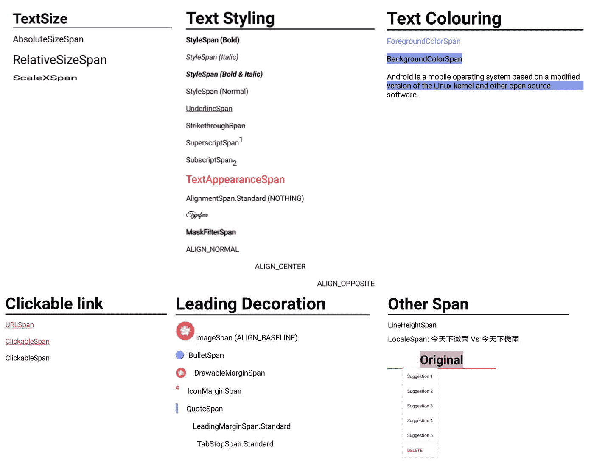

在向用户传递信息的应用程序中，ext 扮演着重要的角色。一个有吸引力的文本可以抓住用户的眼球，为用户提供更好的用户体验。

然而，Android 中的文本默认为纯文本，这意味着没有标记嵌入其中。那么，如何定制每个文本或每个段落的外观呢？Android 提供了特殊的类`Spans`来定义标记，并提供了`SpannableString`来链接标记和文本。

`Spans`有两种基本类型，它们是`CharacterStyle`和`ParagraphStyle`。顾名思义，`CharacterStyle`是定义单个字符标记的类，`ParagraphStyle`是用于单个段落的类。

有很多官方的`Spans`，每一个都很有用也很有趣。在这篇文章中，我将列出所有的`Spans`，并指出它们的特点和棘手之处。希望你对`Spans`有更好的理解。我将所有的`Spans`按照它们的特点分成 6 大类:

1.  文本大小
2.  文本着色
3.  文本样式
4.  可点击的链接
5.  领先装饰
6.  其他跨度

我在 GitHub 上创建了一个库`[MCSpannableStringExtension](https://github.com/myrickchow32/MCSpannableStringExtension)`,以更方便的方式使用`Spans`。欢迎大家使用和评论。谢谢你😄。

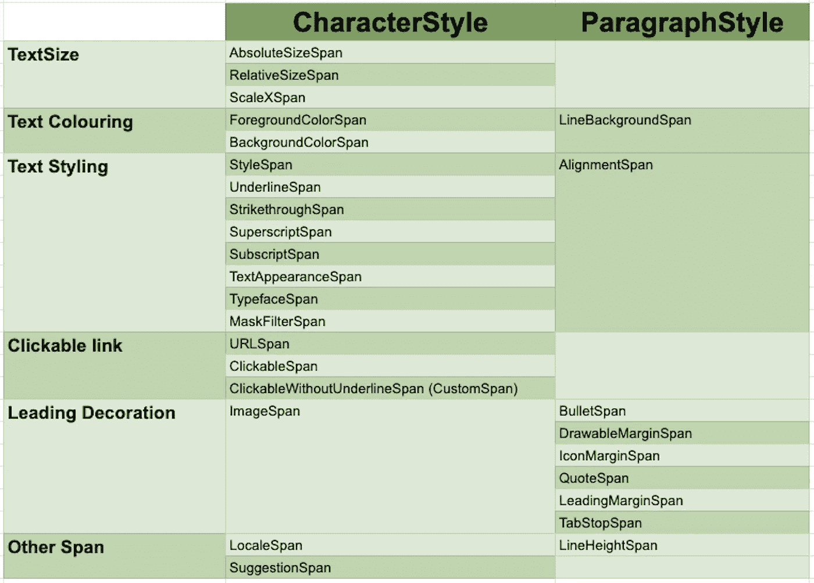

根据我自己的观点跨越分组

# 基本的理解力

`SpannableString`可以很容易地用一个纯文本(见上面代码的第 8 行)构建，并用`setSpan()`设置`Spans`。

应用的索引包括起始索引和结束索引。

每个`Spans`有 4 个可用标志，它们定义了当新文本插入到原来的`SpannableString`中时，如何应用`Spans`:

1.  SPAN _ 独占 _ 独占
2.  SPAN_EXCLUSIVE_INCLUSIVE
3.  SPAN_INCLUSIVE_EXCLUSIVE
4.  SPAN_INCLUSIVE_INCLUSIVE
5.  `0`如果`SpannableString`的内容不可更改

# 1.文本大小

## 1.[绝对尺寸跨度](https://developer.android.com/reference/android/text/style/AbsoluteSizeSpan)

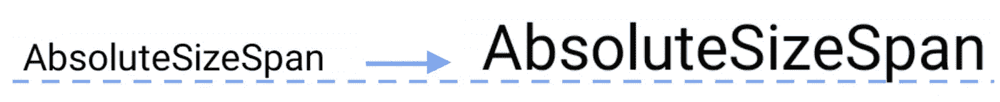

绝对尺寸跨度的图示

`AbsoluteSizeSpan`改变`px`或`dp`单位的文本尺寸，但不改变`sp`单位的文本尺寸。`AbsoluteSizeSpan`的第二个参数是表示机组是否应该在`dp`的标志。默认值是使用`px`。

## 2.相对大小跨度

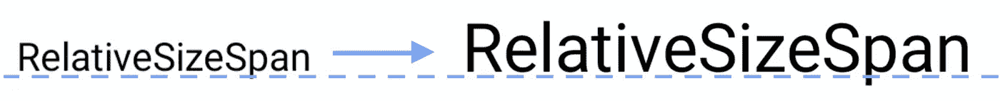

相对尺寸跨度的图示

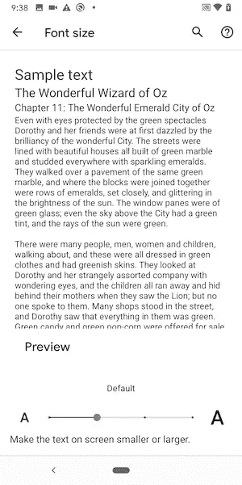

系统设置中的字体大小设置

`RelativeSizeSpan`以倍数增加 textSize，而不是特定的`px`或`dp`。在这种情况下，在`sp`中绘制`Spanned`文本，并可根据系统设置中的用户字体大小偏好进行更改。可以维护一个好的 UI。

## 3. [ScaleXSpan](https://developer.android.com/reference/android/text/style/ScaleXSpan)

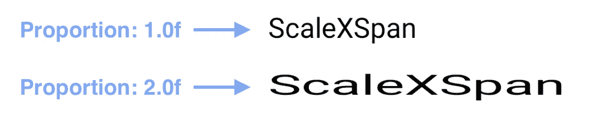

ScaleXSpan 的图示

`ScaleXSpan`在水平方向缩放跨区文本。

# 2.文本着色

## 1.[前景颜色跨度](https://developer.android.com/reference/android/text/style/ForegroundColorSpan)

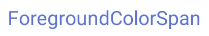

前景色彩跨度插图

它改变文本颜色。

## 2.[背景色跨度](https://developer.android.com/reference/android/text/style/BackgroundColorSpan)

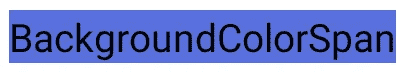

背景插图 ColorSpan

`BackgroundColorSpan`用背景色突出显示所选文本，这适用于字符级。

## 3.LineBackgroundSpan(API 29+)

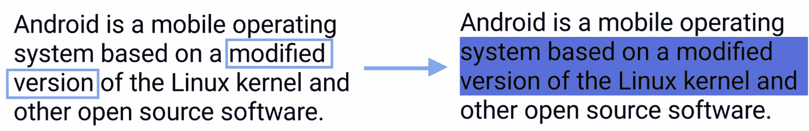

LineBackgroundSpan 插图

`LineBackgroundSpan`仅在 Android `Q` (API 29)或更新版本中可用。高亮显示位于`startIndex`和`endIndex`内的整条线。上面的例子显示了发现“修改版本”的情况。

# 3.文本样式

## 1. [StyleSpan](https://developer.android.com/reference/android/text/style/StyleSpan) —粗体、斜体、粗斜体和普通

StyleSpan 插图

标记可以累积应用，即如果连续设置粗体和斜体`StyleSpan`，则绘制粗体斜体文本。

## 2. [UnderlineSpan](https://developer.android.com/reference/android/text/style/UnderlineSpan)

下划线插图

## 3. [**删除线**](https://developer.android.com/reference/android/text/style/StrikethroughSpan)

删除线跨度的图示

## 4. [**上标 Span**](https://developer.android.com/reference/android/text/style/SuperscriptSpan)

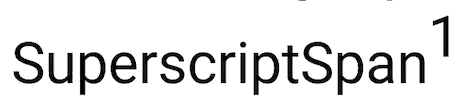

上标 Span 的插图

## 5. [**下标 Span**](http://developer.android.com/reference/android/text/style/SuperscriptSpan)

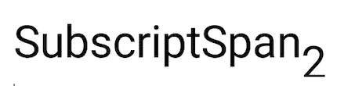

下标 Span 的插图

## 6.[校准跨度](https://developer.android.com/reference/android/text/style/AlignmentSpan.Standard) —正常、居中、相反

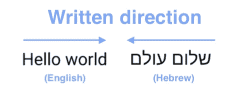

英语和希伯来语句子书写方向相反

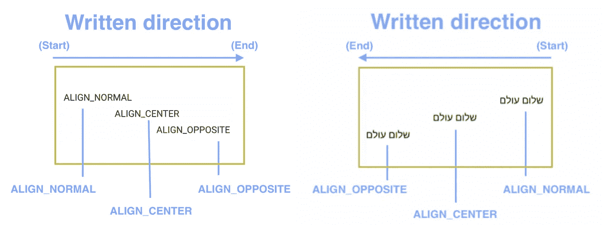

英语和希伯来语单词对齐示例

不同的语言有不同的书写方向。例如，英语是从左向右写的，而希伯来语是从右向左写的。因此，`ALIGN_NORMAL`、`ALIGN_CENTER`和`ALIGN_OPPOSITE`这三个对齐选项将导致不同语言的不同布局。

> 确保 TextView 的宽度大于其内容，以显示对齐功能，即不要在`layout_width`属性中使用`wrap_content`。

## 7. [TextAppearanceSpan](https://developer.android.com/reference/android/text/style/TextAppearanceSpan)

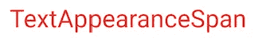

文本外观插图 Span

`TextAppearanceSpan`是比别人更厉害的`Span`。它可以直接将在`style.xml`定义的属性应用到`SpannableString`。这可以保持整个应用程序中代码的可重用性。

## 8. [TypefaceSpan](https://developer.android.com/reference/android/text/style/TypefaceSpan)

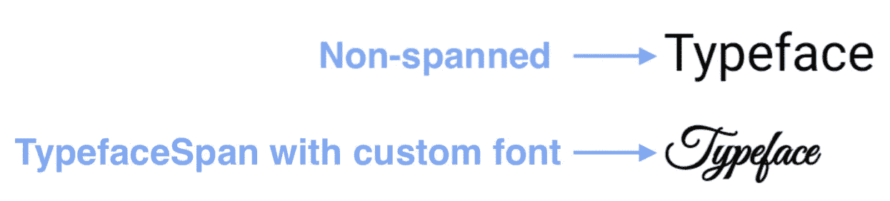

TypefaceSpan 插图

`TypefaceSpan`可以定制跨页文本的字体系列和文本样式(粗体、斜体、粗斜体和普通)。有免费的字体文件可以从网上下载。你可以在[得到一些很棒的共鸣](https://www.fontsquirrel.com/fonts/great-vibes)。

## 9.[口罩过滤片](https://developer.android.com/reference/android/text/style/MaskFilterSpan)

MaskFilterSpan 插图

`MaskFilterSpan`对跨区文本应用`MaskFilter`。`BlurMaskFilter`是`MaskFilter`的子类，可以在绘制 alpha 通道蒙版之前对其执行变换。每个字符的边缘被`blurRadius`参数模糊化。

# 4.可点击的链接

下面显示的所有可点击的`Span`都展开`ClickableSpan`。根据[官方文档](https://developer.android.com/reference/android/text/style/ClickableSpan)，必须将`TextView`的移动方式设置为`[LinkMovementMethod](https://developer.android.com/reference/android/text/method/LinkMovementMethod)`才能点击。

此外，可点击链接的默认文本颜色是`R.color.colorAccent`，开发者可以通过为每个文本视图设置`android:textColorLink`来定制它。

## 1. [URLSpan](http://URLSpan)

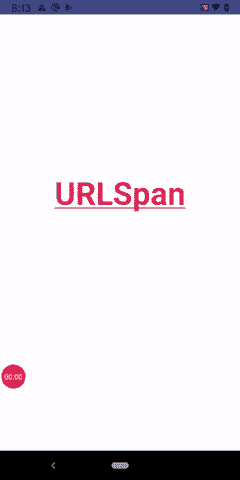

URLSpan 插图

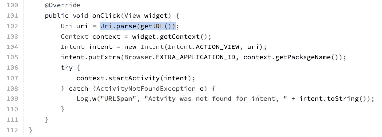

URLSpan 的源代码

根据 [urlSpan 源代码](https://android.googlesource.com/platform/frameworks/base/+/master/core/java/android/text/style/URLSpan.java)的`onClick`函数，将申请的 URL 解析为`Uri`，稍后发送给浏览器。因此，`URLSpan`构造函数处的`url`应该以`http`或`https`开始，而不是纯域部分，如`www.google.com`。

## 2.[可点击面板](https://developer.android.com/reference/android/text/style/ClickableSpan)

可点击范围的图示

`ClickableSpan`比`URLSpan`更灵活，开发者可以定义点击跨区字符时调用的`onClick`回调，例如显示一条`Toast`消息。

## 3.ClickableWithoutUnderlineSpan(自定义 Span)

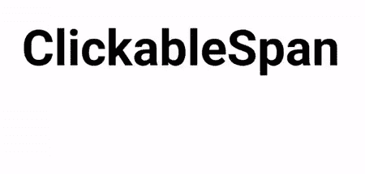

无下跨可点击的图示

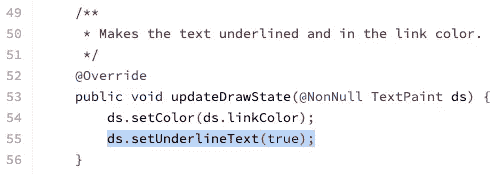

根据`ClickableSpan`开源代码的第 55 行，给跨区文本加了下划线。为了让`ClickableSpan`没有下划线，必须定制`ClickableSpan`。见下文:

# 5.领先装饰

## 1. [BulletSpan](https://developer.android.com/reference/android/text/style/BulletSpan)

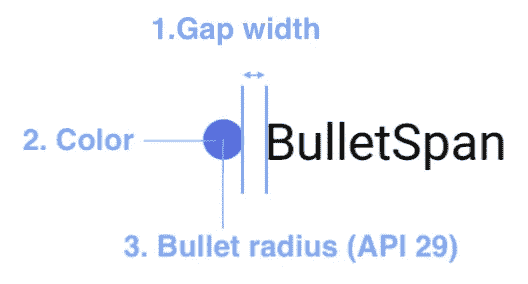

BulletSpan 插图

`BulletSpan`常见于无序列表。间隙宽度和颜色可以在所有 API 等级中定制，但子弹半径只能在 API 29 或更新版本中定制。

## 2.图像跨度

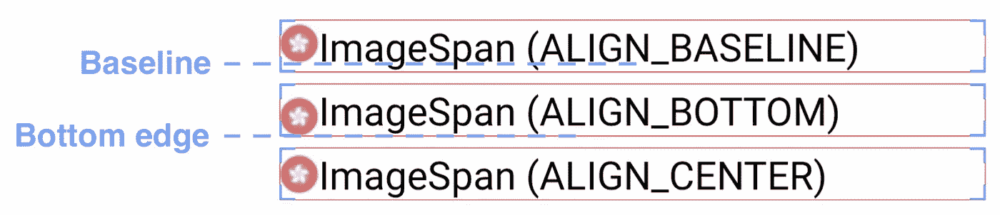

ImageSpan 插图

一个`ImageSpan`有三个选项，它们是`ALIGN_BASELINE`、`ALIGN_BOTTOM`和`ALIGN_CENTER`。它用一个`Drawable`替换跨区文本，因此必须在原始文本中添加一个标签`CharSequence`进行替换。例如:

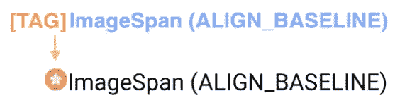

用可抽取标签替换特定标签

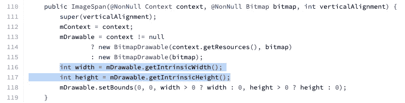

但是，根据`ImageSpan`源代码的第 116 和 117 行，图像是根据其内在界限绘制的。因此，在传递给 ImageSpan 构造函数之前，必须设置 drawable **的宽度和高度**！这是开发人员常见的错误。

> ALIGN_CENTER 仅适用于 Android Q (API 29 )
> 参考:[DynamicDrawableSpan | Android 开发者](https://developer.android.com/reference/android/text/style/DynamicDrawableSpan)

## 3. [DrawableMarginSpan](https://developer.android.com/reference/android/text/style/DrawableMarginSpan)

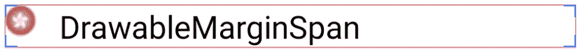

DrawableMarginSpan 的插图

`DrawableMarginSpan`看起来与`ImageSpan`相似，但它是`ParagraphStyle`的子类。它们有以下不同之处:

1.  在`DrawableMarginSpan`中不能设置垂直对齐，默认情况下，它会将可拖动对象对齐顶部。
2.  在`ImageSpan`中不能设置`Drawable`和文本之间的边距

## 4. [IconMarginSpan](https://developer.android.com/reference/android/text/style/IconMarginSpan)

IconMarginSpan 的插图

`IconMarginSpan`与`DrawableMarginSpan`相似，除了`IconMarginSpan`是为配合`Bitmap`而设计的，而`DrawableMarginSpan`是为`Drawable`而设计的。

## 5. [**报价盘**](https://developer.android.com/reference/android/text/style/QuoteSpan)

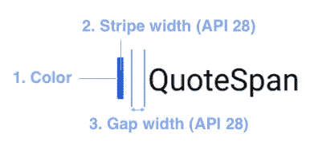

QuoteSpan 插图

> 条带宽度和间隙宽度仅在 API 28 或更新版本中可用
> 
> 参考: [QuoteSpan | Android 开发者](https://developer.android.com/reference/android/text/style/QuoteSpan#QuoteSpan(int,%20int,%20int))

## 6. [LeadingMarginSpan](https://developer.android.com/reference/android/text/style/LeadingMarginSpan)

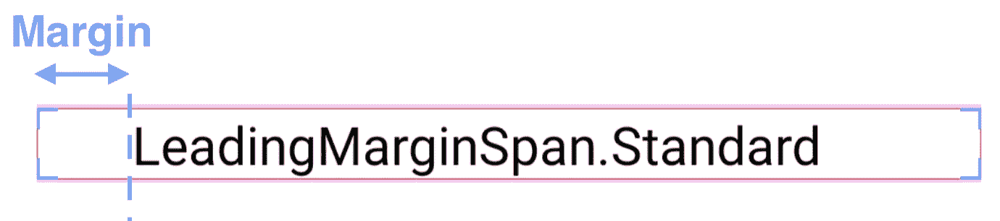

LeadingMarginSpan 插图

## 7. [TabStopSpan](https://developer.android.com/reference/android/text/style/TabStopSpan)

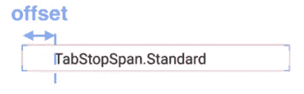

TabStopSpan 的图示

`TabStopSpan`设置跨区文本的制表符长度。因此，`\t` (tab)必须加在`SpannableString`的开头，否则，**没有**效果加到字符串上。

# 6.其他跨度

## 1.管线高度跨度(API 29)

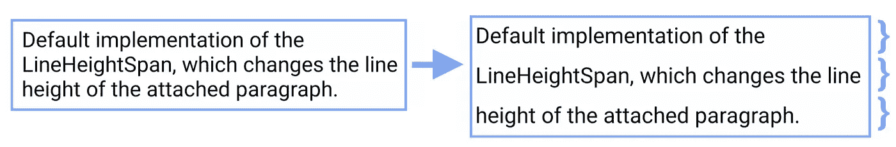

线条高度跨度的图示

`LineHeightSpan`仅在 Android `Q` (API 29)或更新版本中可用。它设置整个段落的行高。

## 2. [LocaleSpan](https://developer.android.com/reference/android/text/style/LocaleSpan)

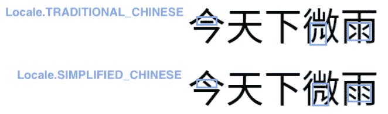

LocaleSpan 插图

`LocalSpan` changes the spanned text according to the inputted locale. Let’s take “今天下微雨 — Today is a rainy day” as an example. It is a sequence of Chinese characters and there are two variants of Chinese words— Traditional Chinese and Simplified Chinese. The characters would be presented in different layouts (highlighted as blue rectangles at the above screenshot) although they belong to the same unicode.

For example, the [unicode website of “雨” (U+96E8)](https://www.compart.com/en/unicode/U+96E8) would show different versions of “雨” when different language is set in your device. See below for the screenshots:

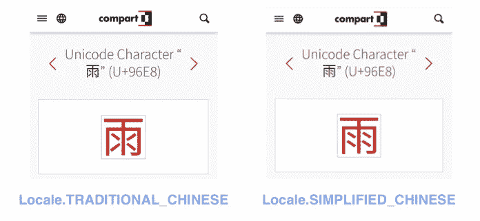

Website showing different version of “雨" when different locales are set at the device.

## 3.[建议范围](https://developer.android.com/reference/android/text/style/SuggestionSpan)

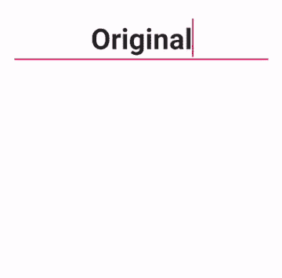

建议说明 Span

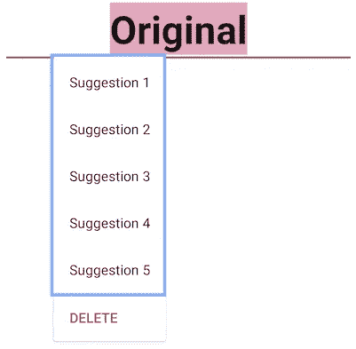

建议弹出对话框

当`EditText`中的跨区文本为双击或单击时，会弹出一个建议对话框，这取决于`FLAG_MISSPELLED`或`FLAG_EASY_CORRECT` 标志是否在`SuggestionSpan`处被置位。弹出对话框中显示的建议数量有限制。仅显示前 5 条建议。

`SuggestionSpan`支持 3 种行为，它们由标志控制(参见上面示例代码的第 8 行):

**1。FLAG_AUTO_CORRECTION(默认)**

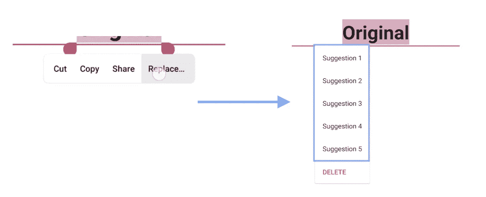

当是 FLAG_AUTO_CORRECTION 时显示建议弹出对话框的步骤

用户必须双击跨区文本并点击“替换…”按钮，以显示建议列表。这是默认标志。

**2。FLAG_EASY_CORRECT**

FLAG_EASY_CORRECT 时显示建议弹出对话框的图示

不需要双击跨区文本。建议弹出对话框显示在用户点击跨区单词之后。换句话说，“编辑选项”弹出对话框根本不显示。

**3。FLAG _ 拼错**

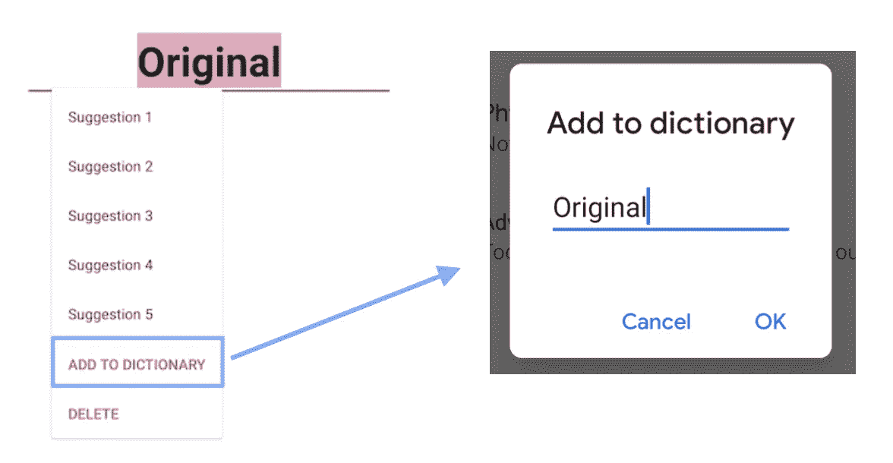

当出现 FLAG _ 拼写错误时，显示建议弹出对话框的图示

在建议弹出对话框中增加了一个新选项“**添加到字典**”。用户可以将单词添加到系统词典中以备将来使用。

# 摘要

1.  Android 文本外观可以通过用`SpannableString`设置文本来定制，它可以嵌入一个定义文本标记的`Spans`列表。
2.  `CharacterSytle`定义单个字符的标记,`ParagraphStyle`定义整个段落的标记。
3.  Android 官方提供了大约 30 种不同的`Spans`，主要可以分为 6 组，包括`Text Size`、`Text Colouring`、`Text Styling`、`Clickable Link`、`Leading Decorations`和`Other Spans`。
4.  带有自定义子弹半径的`BulletSpan`和带有自定义`Typeface`的`TypefaceSpan`仅在 Android P (API 28)或更新版本中可用
5.  `LineBackgroundSpan`和`LineHeightSpan`只有 Android Q (API 29)或更新版本才有。

# 参考和更多阅读

1.  **跨度详情**

 [## 下跨跨度

### 跨度是强大的概念，通过提供对组件的访问，允许在字符或段落级别对文本进行样式化…

medium.com](https://medium.com/androiddevelopers/underspanding-spans-1b91008b97e4) 

**2。****`[**Spanned**](https://developer.android.com/reference/android/text/Spanned)`官方文件**

****3。** [**安卓文字造型官方文档**](https://developer.android.com/reference/android/text/style/package-summary)**

**欢迎您关注我的[Twitter @ my rik _ chow](https://twitter.com/myrick_chow)了解更多信息。感谢您阅读这篇文章。祝您愉快！😄**