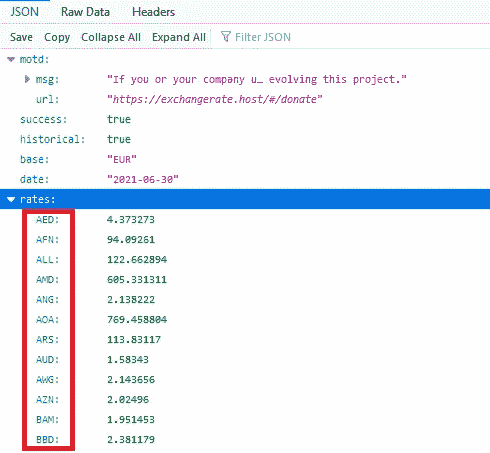
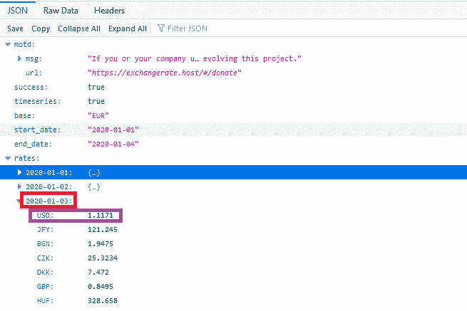

# Android 动态解析 JSON 密钥

> 原文：<https://itnext.io/android-parse-json-key-dynamically-2504e46b39f7?source=collection_archive---------4----------------------->


JavaScript 对象符号

JSON 代表 JavaScript 对象符号。它是一种独立的数据交换格式，是 XML 的最佳替代品。回顾一下，JSON 文件有四个主要组成部分:JSON 数组、JSON 对象、键和值。通常，我们需要获取指定键的值。但是密钥有时候是至关重要的，你需要像一些货币兑换 API 一样获取它。在本文中，我们将通过两个例子来了解如何动态解析一个键。

**首先，用值:**解析 JSON 键

在第一个例子中，我们需要得到货币代码，这是关键。



用值解析 JSON 键

在上图中，货币代码在红框内，旁边的双精度值是它们的汇率。因此，要为它创建我们的模型类，您将定义一个 String 映射作为键，double 作为表示货币代码及其汇率的值。

```
@SerializedName(“rates”) 
val rates: Map<String, Double>,
```

货币代码= >关键字(字符串)

货币汇率= >值(双精度)

要在适配器中访问它们，必须定义变量对

```
val currentRate: Pair<String, Double> = getItem(position)
val currencyCode = currentRate.first    // code
val currencyRate = currentRate.second   // rate
```

这个映射的每一项都是一对字符串键和双精度值。因此，您可以将所有项目作为一个列表或集合，并将它们发送到适配器并显示它们。

**其次，解析 JSON 嵌套键及其值**

如果你的值是另一个对象，并且你想要它的键和值，
你应该创建一个字符串映射作为键，另一个映射作为值。这意味着您需要获得嵌套的键，并且您应该创建一个字符串映射作为键，另一个映射作为值。



用值解析 JSON 嵌套键

在上图中，您的关键字是红框中的日期，您的值是货币代码和汇率，它们将由另一个地图表示。

因此，为了创建我们的模型类，我们将定义一个字符串映射作为键，另一个映射作为值。

```
@SerializedName(“rates”) 
val rates: Map<String, Map<String, Double>>,
```

key (String)= >日期

价值(ِAnother 地图)

货币代码= >关键字(字符串)

货币汇率= >值(双精度)

要在您的活动中访问它们，您需要观察数据并获取它。

```
val response = data.ratesval dates = response.keys
val codes = response.values.keys 
val rates= response.values.values
```

这是这一概念的两个例子，可以帮助您在高级和复杂的 API 中解析 JSON。分别在我的 app [**货币兑换**](https://github.com/Marwa-Eltayeb/CurrencyExchange) **中实现。因此，请在您的应用程序中享受使用它们的乐趣。**

编码快乐！

更多文章:点击 [**此处**](https://marwa-eltayeb.medium.com/)

**在**[GitHub](https://github.com/Marwa-Eltayeb)|[LinkedIn](https://www.linkedin.com/in/marwa-eltayeb/)|[Twitter](https://twitter.com/Marwa_Eltayeb1)上找我