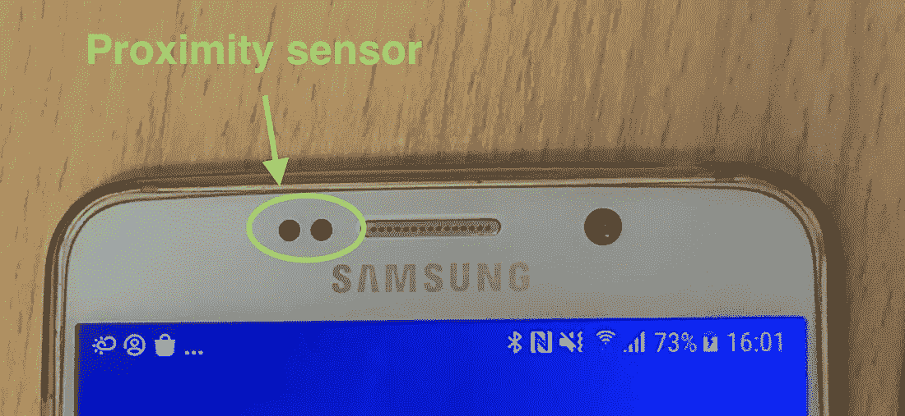
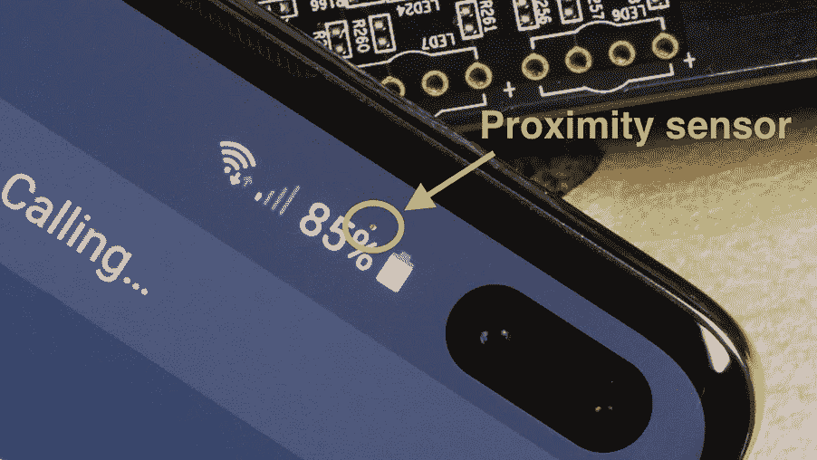
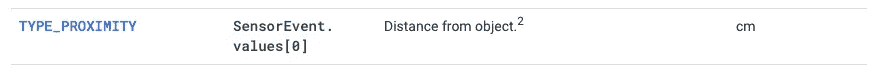
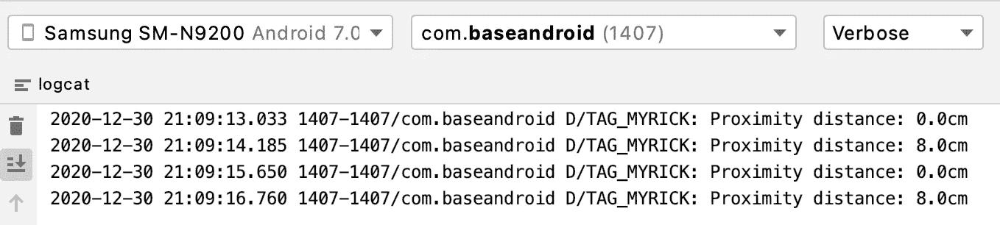

# Android 接近传感器尽可能清晰

> 原文：<https://itnext.io/android-proximity-sensor-as-clear-as-possible-593774d90dd2?source=collection_archive---------1----------------------->

## 近程传感器可以检测短距离(约 5 厘米)

P 近距离传感器是一种近距离检测元件。最大距离约为 5 厘米。Google 提供`[SensorManager](https://developer.android.com/reference/android/hardware/SensorManager)`来处理 app 和硬件传感器之间的操作。开发人员可以使用距离信息来提供更好的 UX，例如，当用户接听电话时将屏幕变暗。

不同类型的接近传感器；左:三星 Galaxy Note 5 (2015) Vs 右:三星 Galaxy S10+ (2019)

此外，市场上主要有两种类型的接近传感器。它们既可以嵌入边框，也可以放在屏幕下面。

Android 中近程传感器的实现很简单，只需要 3 个步骤！让我们深入研究一下。

# 一体化代码

# 逐步说明

## 步骤 1:获取 SensorManager 系统服务

`[SensorManager](https://developer.android.com/reference/android/hardware/SensorManager)`是安卓系统服务。我们可以使用`[getSystemService](https://developer.android.com/reference/android/content/Context#getSystemService(java.lang.String))()`很容易地取回它。

## 步骤 2:通过 SensorManager 访问近程传感器

然而，接近传感器在现代 Android 设备中只是一个可选组件，尤其是对于平板电脑。我们必须添加一个空检查来防止任何运行时错误！

## 第三步:注册`SensorEventListener`

`[SensorEventListener](https://developer.android.com/reference/android/hardware/SensorEventListener)`是所有硬件传感器的通用监听器。不同的传感器会传回不同种类的数据。根据官方文档，接近传感器检测到的距离存储在返回的`[SensorEvent](https://developer.android.com/reference/android/hardware/SensorEvent)`对象中`values`字段的第一个元素。

构建并运行您的应用程序。如果您的手不断地在接近传感器上来回移动，就会显示上面的日志。

> 顺便说一下，不是所有的接近传感器都会返回准确的检测距离。有些传感器会返回一个二进制值，以显示它是“近”值还是“远”值。

# 准确(性)

在不同的情况下，例如温度，传感器可以具有不同的灵敏度和精度。我们必须从原始数据中过滤出那些不准确的数据。

从`[SensorEventListener](https://developer.android.com/reference/android/hardware/SensorEventListener)`返回的总共有五个可能的精度等级:

1.  `[**SENSOR_STATUS_ACCURACY_HIGH**](https://developer.android.com/reference/android/hardware/SensorManager#SENSOR_STATUS_ACCURACY_HIGH)`
    传感器以其**最大精度**运行，数据最可靠。
2.  `[**SENSOR_STATUS_ACCURACY_MEDIUM**](https://developer.android.com/reference/android/hardware/SensorManager#SENSOR_STATUS_ACCURACY_MEDIUM)`
    精度尚可接受，但建议校准以提高精度。
3.  `[**SENSOR_STATUS_ACCURACY_LOW**](https://developer.android.com/reference/android/hardware/SensorManager#SENSOR_STATUS_ACCURACY_LOW)`
    误差较大，强烈建议校准。
4.  `[**SENSOR_STATUS_UNRELIABLE**](https://developer.android.com/reference/android/hardware/SensorManager#SENSOR_STATUS_UNRELIABLE)`
    数据不可信，因为传感器没有正常工作。
5.  `[**SENSOR_STATUS_NO_CONTACT**](https://developer.android.com/reference/android/hardware/SensorManager#SENSOR_STATUS_NO_CONTACT)`
    (不适用于近程传感器)传感器没有与其测量对象接触。

因此，`[onSensorChanged](https://developer.android.com/reference/android/hardware/SensorEventListener#onSensorChanged(android.hardware.SensorEvent))`回调应该更新到上面的代码以获得更可靠的数据。

# 最大距离

如上所述，接近传感器可以检测大约 5 厘米的距离。然而，不同的传感器会有不同的范围。您可以通过以下方式获得最大距离:

我在以下设备上运行了一个示例应用程序，结果如下:

1.  **三星 Galaxy Nexus (2012)** : 5cm
2.  **三星 Galaxy Note 5 (2015)** : 8cm
3.  **像素 3a (2019)** : 5cm

# 您可能会喜欢下面的文章:

 [## iOS 接近传感器尽可能简单

### 接近传感器是一个小部件，可以检测大约 10 厘米的短距离。我们如何观察信号…

myrickchow.medium.com](https://myrickchow.medium.com/ios-proximity-sensor-as-simple-as-possible-a473df883dc9) 

# 摘要

1.  接近传感器用于检测大约 5 厘米的短距离。一些设备甚至可以探测到 8 厘米远的距离。
2.  我们可以使用`[SensorManager](https://developer.android.com/reference/android/hardware/SensorManager)`访问接近传感器，并在`[SensorEventListener](https://developer.android.com/reference/android/hardware/SensorEventListener)`的`[onSensorChanged](https://developer.android.com/reference/android/hardware/SensorEventListener#onSensorChanged(android.hardware.SensorEvent))`回调处检索检测到的距离。
3.  不同接近传感器在不同情况下具有不同的精度。一个好的开发人员应该过滤掉那些准确性不可接受的数据。

# 你可能会感兴趣

 [## Android 计步传感器一体化

### 计步传感器在健身应用中用于监控用户的运动。如何实现到安卓 App？怎么…

itnext.io](/android-step-counter-sensor-all-in-one-77564e5b6c2a) 

# 参考

1.  [位置传感器官方文件](https://developer.android.com/guide/topics/sensors/sensors_position)
2.  [SensorManager 官方文档](https://developer.android.com/reference/android/hardware/SensorManager)

欢迎您关注我，在[Twitter @ my rik _ chow](https://twitter.com/myrick_chow)获取更多信息和文章。感谢您阅读这篇文章。祝您愉快！😄