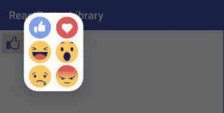
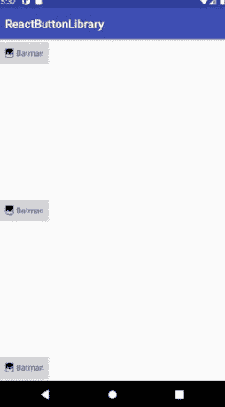
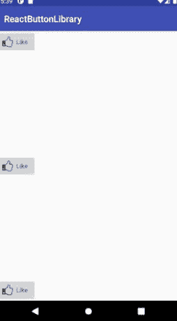

# 介绍 Android ReactButton 库 2.0.0

> 原文：<https://itnext.io/android-reactbutton-88529a2e93cd?source=collection_archive---------6----------------------->


大家好，我是 Amr Hesham，在这篇文章中，我将介绍 [**ReactButton**](https://github.com/amrdeveloper/reactbutton) 库，这是一个 Android 库，可以帮助你创建一个带有反应对话框的按钮，比如脸书或 LinkedIn 平台上的按钮。

当我创建这个库的时候，我的目标是让它动态地添加任何你想要的反应图标，就像脸书一样，并且让它更容易听到像点击，长时间点击，打开和关闭对话框这样的事件，并且让它更容易使用。

今天，我发布了一个新版本 2.0.0，包含了新的特性和错误修复，例如:

现在，您可以添加任意数量的反应，而不仅仅是 6 个，并且可以将它们分成几列



要做到这一点，您只需要设置列数，代码如下所示

```
reactButton.setDialogColumnsNumber(n);
```

在过去的版本中，反应对话框会在应用程序的中央，但是现在它会在按钮的上方



此外，现在该库包含 2 个监听器来监听对话状态和反应变化，例如，要监听反应变化，您需要这样做

```
reactButton.setOnReactionChangeListener(new ReactButton.OnReactionChangeListener() {
    @Override
    public void onReactionChange(Reaction reaction) {
        // Code that will execute when the reaction changed
    }
});
```

要监听对话状态，您需要使用 OnReactionDialogStateListener

```
reactButton.setOnReactionDialogStateListener(new ReactButton.OnReactionDialogStateListener() {
    @Override
    public void onDialogOpened() {
        // Code that will execute when the reaction dialog is opened
    }

    @Override
    public void onDialogDismiss() {
        // Code that will execute after the reaction dialog is dismissed
    }
});
```

在上一个版本中，该库提供了默认反应，如脸书反应，您可以更改或自定义它们，但问题是，如果您想使用自定义反应，您可以从应用程序中删除它们，因此在这个版本中，该库提供了 0 个额外的资源，如果您想要旧的反应，您可以在示例应用程序中找到它们。

这个版本还附带了一些代码重构和提高代码质量，我希望你会喜欢使用它，如果你有任何建议，功能请求或问题报告，欢迎你提交问题或拉请求

您可以在自述文件中找到完整的文档以及如何在您的项目中使用它

你可以在 GitHub 库上找到这个库: [**ReactButton**](https://github.com/amrdeveloper/reactbutton)

你可以在: [**Github**](https://github.com/amrdeveloper) ， [**Linkedin**](https://www.linkedin.com/in/amrdeveloper/) ， [**Twitter**](https://twitter.com/amrdeveloper) 上找到我。

享受编程😋。