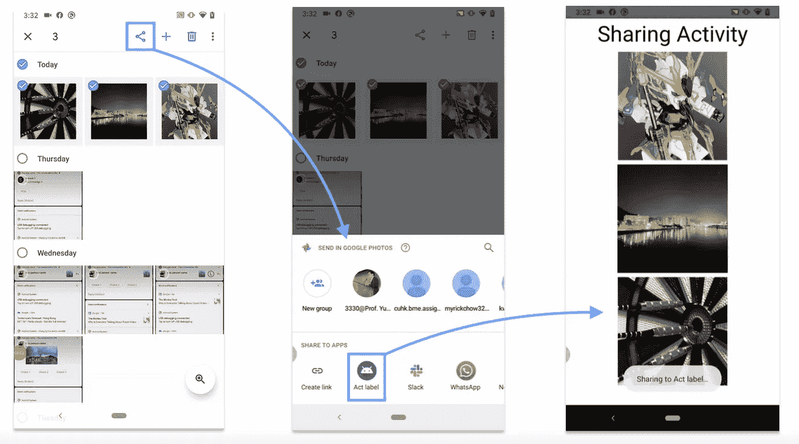
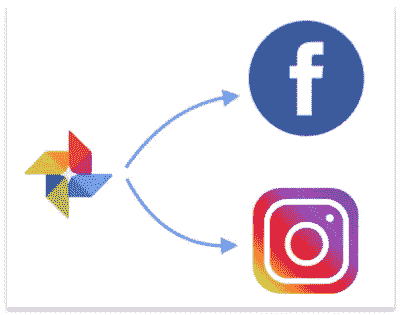
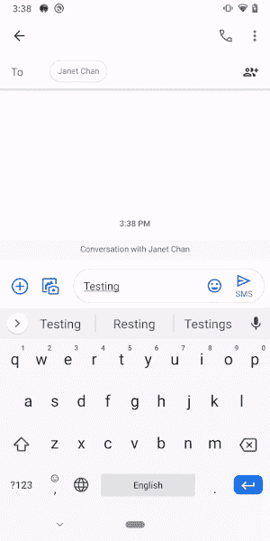
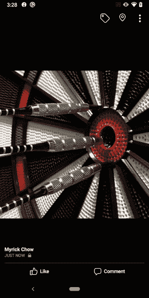
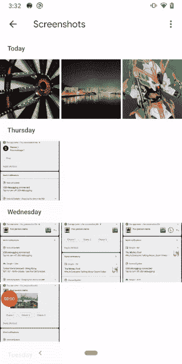

# Android 分两步从另一个应用程序接收数据

> 原文：<https://itnext.io/android-receiving-data-in-2-steps-21c49920172d?source=collection_archive---------0----------------------->

共享流程图

n droid 应用程序可以轻松地在应用程序之间共享数据。它们包括**文本**、**图像**、**视频**和**音频**文件等。例如，你可以将谷歌照片应用程序中的图片分享到脸书应用程序或 Instagram 应用程序，以创建帖子或故事。如今，这是安卓社交应用的一个常见功能。

不同社交应用之间的分享

要从另一个应用程序接收数据，需要在 AndroidManifest.xml 上正确配置您的`Activity`，并处理包含系统发送的`action`和`data`的`Intent`。

实现这个共享功能只需要 2 个步骤，花费大约 10 分钟。我相信你会发现这很有趣而且有用！开始吧！

# 循序渐进的程序

## 步骤 1)在 AndroidManifest 中添加

我们必须向处理 AndroidManifest.xml 中的传入数据的`Activity`添加 4 个标记。

1.  **<intent-filter>**声明此`Activity`适用于分别在`<action>`和`<data>`标签定义了`action`和`data`的处理系统`Intent`。
2.  **<动作>** 定义了这个`Activity`可以处理的`IntentAction`，即`android.intent.action.SEND`接收一个**单个数据**，`android.intent.action.SEND_MULTIPLE`接收**一个数据列表**。系统使用动作字段过滤出可用于处理所请求的`Intent`的应用。
3.  **<类别>** `[android.intent.category.DEFAULT](https://developer.android.com/guide/topics/manifest/category-element)`必须在`<category>`处定义，否则`Activity`不能接收任何隐式`Intent`，因此不能显示在共享底层表单对话框中！
4.  **<数据>** 声明该`Activity`可以处理的 [MIME(多用途互联网邮件扩展)](https://developer.mozilla.org/en-US/docs/Web/HTTP/Basics_of_HTTP/MIME_types)的类型。有[几种常见的类型](https://developer.android.com/training/sharing/receive#supporting-mime-types) :
    1。`text/*`其中包括`text/plain`、`text/rtf`、`text/html`、`text/json` 2 个。`image/*`其中包括`image/jpg`、`image/png`、`image/gif` 三种。`video/*`其中包括`video/mp4`、`video/3gp` 4 个。`audio/*`其中包括`audio/wav` 5。`application/pdf`其中包括 pdf 文件

此时，您应该能够看到您的应用程序图标出现在共享对话框中。粗体标题是应用程序名称，常规副标题是在 AndroidManifest.xml 中声明的`Activity`名称。见下文:

## 步骤 2)在活动中处理数据

用户点击共享底部表单对话框中的您的应用图标后，您指定的`Activity`将被启动并创建。发送的数据(如文本、图像、视频和音频 URI 等)可以在`onCreate()`回调时从传入的`Intent`中用不同的`key`值检索。

在所有启动之前，有必要(第 7-8 行)确认意图来自`ACTION_SEND`或`ACTION_SEND_MULTIPLE`而不是其他`Intent`，如`startActivity(intent: Intent)`功能中使用的隐式`Intent`。

还应该检查数据 mime 类型，以确保稍后使用正确的`key`和`function`来检索发送的数据。

在 14–15，可以从键`Intent.EXTRA_TEXT`检索发送的文本。

在 20–21，可以从键`Intent.EXTRA_STREAM`中检索发送的图像`URI`。

在 20–21，发送的多幅图像的`URI`可从键`Intent.EXTRA_STREAM`中检索，但使用另一个函数`getParcelableArrayListExtra(key: String)`。

# 摘要

1.  `Activity`必须用`<intent-filter>`声明，告诉系统这个`Activity`可以处理在`<action>`和`<data>`标签声明的特定`action`和`data`的某个系统`Intent`。
2.  `android.intent.action.SEND`或`android.intent.action.SEND_MULTIPLE`应在`<action>`标签处声明，以从另一个应用程序接收数据。
3.  `[android.intent.category.DEFAULT](https://developer.android.com/guide/topics/manifest/category-element)`必须在`<category>`标签中定义，以便在共享底部表单对话框中显示应用程序。
4.  MIME 类型在`<data>`标签中声明，告诉系统这个`Activity`可以处理哪种数据。例如`text/*`、`image/*`、`audio/*`、`video/*`和`application/pdf`。
5.  应用程序图标显示有应用程序标签和在 AndroidManifest.xml 中定义的`Activity`标签。
6.  必须在指定的`Activity`的`onCreate()`回调时检查`IntentAction`和数据类型。`Intent.EXTRA_TEXT`用于检索发送的文本，`Intent.EXTRA_STREAM`用于检索发送的图像。

# 参考资料和进一步阅读:

1.  什么是 IntentFilter？
2.  [Android . intent . category . default 的定义](https://developer.android.com/reference/android/content/Intent#CATEGORY_DEFAULT)
3.  [意向处理措施 _ 发送](https://developer.android.com/reference/android/content/Intent#ACTION_SEND)
4.  [意向行动 _ 发送 _ 多重](https://developer.android.com/reference/android/content/Intent#ACTION_SEND_MULTIPLE)
5.  [<类别>标签中<意图-过滤器>](https://developer.android.com/guide/topics/manifest/category-element)

# 你可能会喜欢我的另一篇相关文章:

 [## Android 电话拨号程序

### 你想象过你的应用程序可以直接为你打电话吗？是的，Android 手机可以很容易地帮你做到这一点…

itnext.io](/android-dial-phone-programmatically-5ea3714d801d) 

欢迎您关注我的[Twitter @ my rik _ chow](https://twitter.com/myrick_chow)了解更多信息。感谢您阅读这篇文章。祝您愉快！😄